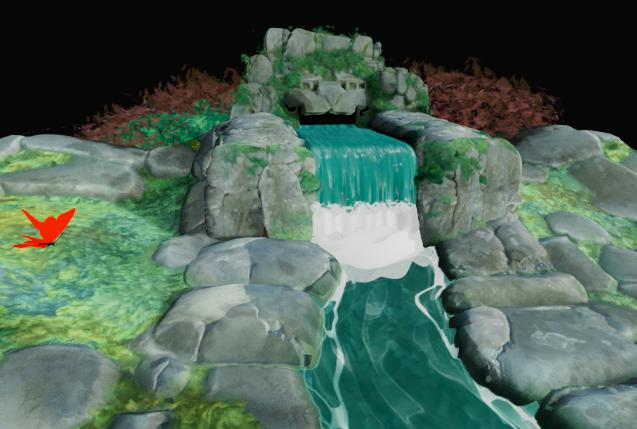

# 후처리 효과

{zoomable="yes"}

카메라 속성에서 포스트 효과를 활성화하여 렌더링을 개선하거나 특정 재질 속성을 확인할 수 있습니다.

이러한 효과는 자체 개발되었으며 래스터라이저와 GPU 패스트레이서 [렌더러](../../../../interface/3d-view/3d-renderers/3d-renderers.md)에서만 사용할 수 있습니다.

[3D 장면 리소스](../../../../resources/3d-scene-resource/3d-scene-resource.md) 또는 [장면 상태 파일](../../../../working-with-3d-scenes/working-with-3d-scenes.md)을 저장할 때 활성화된 모든 게시물 효과는 장면 상태의 일부로 저장됩니다.

<table>
<tr style="border: 0;">
<td style="border: 0;" valign="top">

## 톤 매핑

</td>
<td style="border: 0;" valign="top">

### 빛　번짐효과

</td>
<td style="border: 0;" valign="top">

### 필드 심도

</td>
<td style="border: 0;" valign="top">

</td>
</tr>
</table>

## 톤 매핑

특정 알고리즘 및/또는 조회 테이블(LUT)에 따라 렌더링 색상을 다시 매핑합니다.

이렇게 하면 애플리케이션 간의 색상 일관성을 향상시킬 수 있습니다. 예를 들어 AgX 톤 매퍼도 Blender에서 사용할 수 있습니다.

+++라인하르트

<table>
  <tr>
    <td>
      
       <i>이전</i>
    </td>
    <td>
      
       <i>이후</i>
    </td>
  </tr>
</table>

+++

+++Atan

<table>
  <tr>
    <td>
      
       <i>이전</i>
    </td>
    <td>
      
       <i>이후</i>
    </td>
  </tr>
</table>

+++

+++Exp

<table>
  <tr>
    <td>
      
       <i>이전</i>
    </td>
    <td>
      
       <i>이후</i>
    </td>
  </tr>
</table>

+++

+++로그

<table>
  <tr>
    <td>
      
       <i>이전</i>
    </td>
    <td>
      
       <i>이후</i>
    </td>
  </tr>
</table>

+++

+++에이스

<table>
  <tr>
    <td>
      
       <i>이전</i>
    </td>
    <td>
      
       <i>이후</i>
    </td>
  </tr>
</table>

+++

+++헤일

<table>
  <tr>
    <td>
      
       <i>이전</i>
    </td>
    <td>
      
       <i>이후</i>
    </td>
  </tr>
</table>

+++

+++중립

<table>
  <tr>
    <td>
      
       <i>이전</i>
    </td>
    <td>
      
       <i>이후</i>
    </td>
  </tr>
</table>

+++

+++Agx

<table>
  <tr>
    <td>
      
       <i>이전</i>
    </td>
    <td>
      
       <i>이후</i>
    </td>
  </tr>
</table>

+++

+++Pbr 중립

<table>
  <tr>
    <td>
      
       <i>이전</i>
    </td>
    <td>
      
       <i>이후</i>
    </td>
  </tr>
</table>

+++

## 빛　번짐효과

매우 밝은 영역에서 빛이 적게 들어오는 영역으로 빛이 밖으로 번지는 언저리의 카메라 내 효과를 시뮬레이션합니다.

그 효과는 장면의 조명, 카메라 노출 및 방출 재료들에 의해 영향을 받는다.

+++임계값
이 값을 초과하는 꽃이 피는 경우 표시되는 광도 값입니다.

*왼쪽: 1.0 / 오른쪽: 4.0*

<table>
  <tr>
    <td>
      
       <i>이전</i>
    </td>
    <td>
      
       <i>이후</i>
    </td>
  </tr>
</table>

+++

+++밝기 감소
값이 낮을수록 개화 반경이 짧아지는 개화 감쇠 램프.

*왼쪽: 1.0 / 오른쪽: 0.6*

<table>
  <tr>
    <td>
      
       <i>이전</i>
    </td>
    <td>
      
       <i>이후</i>
    </td>
  </tr>
</table>

+++

+++레벨
꽃의 강렬함입니다. 값이 높을수록 더 밝고 뚜렷한 빛 무늬가 생깁니다.

*왼쪽: 8.0 / 오른쪽: 2.0*

<table>
  <tr>
    <td>
      
       <i>이전</i>
    </td>
    <td>
      
       <i>이후</i>
    </td>
  </tr>
</table>

+++

+++색상 이동
개화의 영향을 받는 영역의 색조를 더 따뜻한 색상으로 상쇄합니다.

*왼쪽: 0.0 / 오른쪽: 0.8*

<table>
  <tr>
    <td>
      
       <i>이전</i>
    </td>
    <td>
      
       <i>이후</i>
    </td>
  </tr>
</table>

+++

## 필드 심도

초점 거리보다 먼 거리가 먼 물체가 뿌옇게 보이는 카메라 렌즈에 의한 광학 현상을 시뮬레이션합니다.

이 효과는 카메라의 &#39;F-스톱&#39; 및 &#39;초점 거리&#39; 매개 변수에 따라 모두 영향을 받습니다.

>[!TIP]
>
> 카메라 초점을 빠르게 조정하려면 초점을 맞출 장면의 위치에 커서를 놓고 Ctrl+LMB(Windows) 또는 Cmd+LMB(macOS)를 눌러 해당 위치에 대한 초점 거리를 자동으로 설정합니다.

+++최대 반경
흐림 효과의 최대 반경

*왼쪽: 32.0 / 오른쪽: 4.0*

<table>
  <tr>
    <td>
      
       <i>이전</i>
    </td>
    <td>
      
       <i>이후</i>
    </td>
  </tr>
</table>

+++

+++합성 강도
바깥쪽의 포커스 거리로부터의 흐림 효과의 크기입니다.

*왼쪽: 0.2 / 오른쪽: 0.05*

<table>
  <tr>
    <td>
      
       <i>이전</i>
    </td>
    <td>
      
       <i>이후</i>
    </td>
  </tr>
</table>

+++

+++종방향 수차
초점 거리에서 떨어진 위치에서 발생하는 수차의 강도입니다.

수차는 빛의 파장이 약간 다른 초점 거리를 갖는 방법을 시뮬레이션하여, 색상이 상쇄된 것처럼 보이고 초점이 약간 다르게 나타납니다.

*왼쪽: 0.0/오른쪽: 1.0*

<table>
  <tr>
    <td>
      
       <i>이전</i>
    </td>
    <td>
      
       <i>이후</i>
    </td>
  </tr>
</table>

+++

+++무색 수차
색수차가 무색이어야 하는지 여부를 지정합니다. 즉, 일부 색상이나 모든 색상의 초점 거리가 같아야 합니다.

이로 인해 흐림 효과가 보다 균등하게 분포하는 것으로 보인다.

*왼쪽: 참/오른쪽: 거짓*

<table>
  <tr>
    <td>
      
       <i>이전</i>
    </td>
    <td>
      
       <i>이후</i>
    </td>
  </tr>
</table>

+++

+++고양이 눈
비스듬한 각도로 들어오는 빛이 디스크에 들어가지 않고 고르지 않은 타원형을 이루어 왜곡을 일으키는 방법을 시뮬레이션하는 장면에서 고양이의 눈 효과를 사용할 수 있습니다.

이 효과는 더 높은 개구, 즉 더 낮은 F-스톱 값에서 더 두드러지게 나타난다.

*왼쪽: 참/오른쪽: 거짓*

<table>
  <tr>
    <td>
      
       <i>이전</i>
    </td>
    <td>
      
       <i>이후</i>
    </td>
  </tr>
</table>

+++
