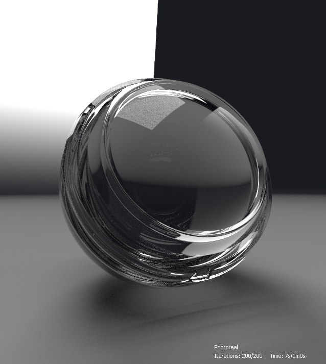
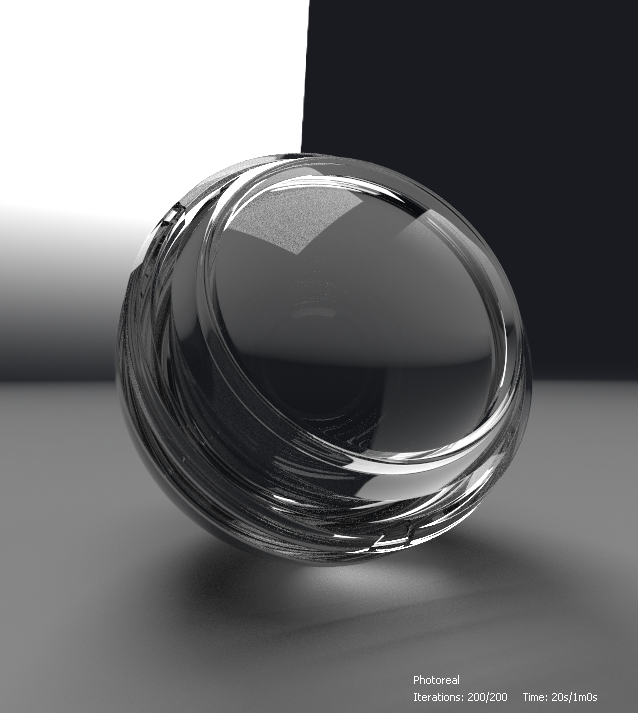

# Iray

이 페이지에서는 CPU 및/또는 GPU 가속(Nvidia GPU만 해당)을 사용하는 사실적인 렌더링을 위한 대화형 경로 추적을 제공하는 [Substance 3D Designer](https://www.adobe.com/kr/products/substance3d-designer.html)의 3D 보기 패널에서 사용할 수 있는 Ray 렌더러를 제공합니다.

>[!WARNING]
> 
> Iray 렌더러 및 모든 관련 기능은 버전 16.0.0의 Designer에서 제거되었습니다.
> 
> 자세한 내용은 여기를 참조하세요. [MDL 그래프 및 수명 종료](../../../technical-issues/mdl-graph-iray-eol/mdl-graph-iray-eol.md)

<table>
<tr style="border: 0;">
<td style="border: 0;" valign="top">

## 개요

<b>Iray</b>는 빛과 재질의 물리적 동작을 시뮬레이션하여 *사실적인 이미지*&#x200B;를 생성하는 매우 *대화형* 및 직관적인 물리적 기반 렌더링 기술입니다. [Nvidia Array](https://www.nvidia.com/en-us/design-visualization/iray/) 웹 페이지에 대해 자세히 알아보십시오.

</td>
<td style="border: 0;" valign="top">

</td>
</tr>

<tr style="border: 0;">
<td style="border: 0;" valign="top">

3D 보기가 Iray의 *프로그레시브 렌더러*&#x200B;를 사용하므로 각 픽셀에 적어도 하나의 샘플이 수행되면 즉시 이미지가 생성됩니다. 샘플링 반복이 수행되면 이미지가 *자동으로 업데이트*&#x200B;되므로 초기 러프 이미지가 각 반복에서 *정리됨*&#x200B;이 됩니다.

렌더러는 [3D 보기](../../../interface/3d-view/3d-view.md) 패널에서 사용할 수 있습니다. <b>렌더러</b> 메뉴를 열고 <b>Array</b> 옵션을 선택하여 해당 3D 보기 패널에서 사용되는 렌더러를 Array로 전환하십시오.\
Ray 렌더러 *로 전환하면 일부 3D 보기 메뉴에서 사용 가능한 옵션이 변경*&#x200B;됩니다. 이러한 변경 사항은 아래의 <b>3D 보기</b> 섹션에 설명되어 있습니다.

기본적으로 프로그레시브 렌더링은 Ray 렌더러를 선택한 즉시 시작됩니다. 렌더링 프로세스는 다음 조건 중 *하나*&#x200B;가 충족될 때까지 실행됩니다.

* *최대 샘플 수*&#x200B;가 수행됩니다.
* *렌더링 시간 제한*&#x200B;이 충족되었습니다.

이러한 조건 조정에 대한 자세한 내용은 이 페이지의 <b>렌더러</b> 섹션을 참조하십시오.

</td>
<td style="border: 0;" valign="top">

*재질: [중세 성벽](https://helpx.adobe.com/substance-3d/unlisted/assets/allassets/2b3f6eca9a6b6ab19d263d8b77819df431c3c973.html)* *제공 [Mark Foreman](https://www.artstation.com/oggyart)* *[Substance 3D 에셋](https://helpx.adobe.com/substance-3d/unlisted/assets.html)* *라이브러리*&#x200B;에서 사용 가능

</td>
</tr>
</table>

>[!WARNING]
>
> 언제든지 *one* Ray 렌더링 인스턴스만 실행할 수 있습니다.\
> 즉, 3D 보기 패널에서 이 렌더러를 사용하는 경우 다른 3D 보기 패널에서 **렌더러** 메뉴가 *비활성화*&#x200B;되며 이 메뉴는 기본적으로 **OpenGL** 렌더러로 설정됩니다.

## 3D 보기 옵션

### 장면

<b>장면</b> 메뉴에서 <b>편집</b> 옵션을 선택하여 <b>속성</b> 패널에서 Iray와 관련된 장면 속성을 찾습니다.

* <b>사용:</b> *False*(으)로 설정하면 개체가 숨겨지고 *장면에 더 이상 기여하지 않습니다*.

구성 요소 표시

* <b>표시</b>: *False*&#x200B;로 설정하면 개체가 숨겨지지만 *여전히 장면에 기여합니다*. 즉, 빛을 반사하고 빛을 흡수하고 그림자를 투영합니다

메쉬 표시 컴포넌트

* 하위 부문
  * <b>방법</b>: 메시를 더 미세한 모양으로 절차적으로 세분하는 데 사용되는 방법입니다
    * *없음*: 하위 분할이 적용되지 않았습니다.
    * *파라메트릭*: 메시를 `4^x`개의 삼각형으로 나눕니다. 여기서 `x`은(는) 이 매개 변수에 지정된 값입니다
    * *길이*: 모든 가장자리의 길이가 최소 길이 매개 변수에 지정된 값보다 작을 때까지 메시를 세분화합니다
  * <b>최소 길이</b>: 개체 공간에서 모든 가장자리의 길이가 이 지정된 값보다 작을 때까지 메쉬를 세분화합니다(*Length* 메서드에만 적용).
  * <b>숫자</b>: 메시에 적용해야 하는 하위 분할 반복 수입니다(*파라메트릭* 메서드에만 적용).

>[!WARNING]
>
> 메시 *을(를) 세분화하면 렌더링 전과 렌더링 중 처리 시간이 기하급수적으로 증가*&#x200B;됩니다. 값을 입력하여 *보수적인*&#x200B;을(를) 사용하는 것이 좋습니다.\
> 파라메트릭 메서드에는 *높음* **숫자** 값을 사용하고 길이 메서드에는 *낮음* **최소 길이** 값을 사용하는 것에 주의하십시오.

### 재질

Iray는 NVIDIA에서 개발한 [MDL 음영 모델](https://www.nvidia.com/en-us/design-visualization/technologies/material-definition-language/)에 의존하므로 장면 재질에 사용할 수 있는 재질은 Designer에서 로드한 MDL 라이브러리로 대체됩니다. 이 라이브러리는 다음 소스를 사용하여 빌드됩니다.

* Designer 설치에 포함된 MDL 파일
* 로드된 [프로젝트 파일](../../../pipeline-and-project-con/project-configuration-fil/project-configuration-files-sbsprj.md)의 [사용자가 나열한 디렉터리](../../../interface/preferences-window/project-settings/project-settings.md)에서 MDL 파일을 찾았습니다.
* [NVIDIA vMaterials](https://developer.nvidia.com/vmaterials) 라이브러리(설치된 경우)

>[!NOTE]
>
> MDL 음영 모델을 자세히 살펴보려면 NVIDIA에서 작성 및 관리하는 [MDL 핸드북](http://mdlhandbook.com/)을 확인하십시오.

<table>
<tr style="border: 0;">
<td style="border: 0;" valign="top">

로드된 MDL 재료의 누적 목록은 오른쪽 이미지에 표시된 것처럼 나열된 재료의 하위 메뉴 중 하나에서 <b>재료</b> 메뉴에서 사용할 수 있습니다.

또한 [MDL 그래프](../../../mdl-graphs/creating-an-mdl-graph/creating-an-mdl-graph.md)가 Designer에 로드되면 장면의 모든 재질에 적용할 수 있습니다. 해당 시점에서 사용 가능한 MDL 재질 목록에 추가됩니다.

이 메뉴의 다른 주요 옵션은 다음과 같습니다.

* <b>편집</b> 옵션을 선택하여 <b>속성</b> 패널에서 MDL의 *노출된 입력*&#x200B;에 액세스하고 필요에 따라 재질을 조정합니다
* <b>로드..</b> 옵션을 사용하면 누적 목록에 추가되고 장면에 적용될 모든 MDL 파일을 *수동으로 로드*&#x200B;할 수 있습니다.
* <b>사전 설정 내보내기...</b> 옵션을 사용하면 <b>MDL 재질 사전 설정 내보내기</b> 대화 상자가 열립니다. 이 대화 상자에서 3D 보기에 적용된 현재 설정을 사용하여 사전 설정 MDL 파일을 내보낼 수 있습니다

</td>
<td style="border: 0;" valign="top">

</td>
</tr>
</table>

>[!NOTE]
>
> **MDL 그래프**&#x200B;를 로드할 때 3D 보기 렌더러는 *자동으로&#x200B;**Ray***(으)로 전환되어 로드하고 적용합니다.

### 카메라

카메라 설정과 관련된 OpenGL과 Iray의 주요 차이점은 *필드 깊이*&#x200B;을 관리하는 방법입니다. 실제로 Iray는 물리적으로 정확한 렌더러로서 카메라의 *조리개*&#x200B;에 따라 &quot;자연스럽게&quot; 필드 깊이가 발생합니다.

Ray 렌더러를 선택한 경우 카메라 속성에서 다음과 같은 몇 가지 매개 변수를 사용할 수 있습니다.

* <b>초점 거리</b>: 초점의 카메라와의 거리(예: 이미지가 가장 선명한 위치)입니다.
* <b>조리개 지름</b>: 카메라의 조리개를 제어하는 값입니다. 값이 낮을수록 초점 전후에 이미지 요소가 더 선명해집니다. 즉, 간단히 말해 이 값은 필드 효과 깊이의 강도를 제어합니다

### 환경

<b>환경</b> 메뉴를 열고 <b>편집</b> 옵션을 선택하여 <b>속성</b> 패널에 환경 속성을 표시합니다.

다음과 같은 속성을 사용할 수 있습니다.

돔

* <b>돔 유형</b>: 환경 텍스처가 투영되는 장면을 둘러싸는 개체를 설정합니다.
  * *무한 구*: 무한 구 환경
  * *지표*: 무한 구형 환경이지만 질감이 있는 지표 평면이 있습니다.
  * *구*: 사용자 지정 반경의 유한 크기 구 모양 돔
  * *지면이 있는 구*: 환경의 아래쪽 부분이 구의 위쪽과 아래쪽을 나누는 평면에 투영되는 사용자 정의 반경이 있는 유한 크기의 구 모양 돔
  * *바닥이 있는 상자*: 사용자 지정 너비, Height 및 길이의 유한 크기 상자 모양의 돔으로, 환경의 아래쪽 부분이 상자의 위쪽과 아래쪽을 나누는 평면에 투영됩니다
* <b>회전 각도</b>: *Y축*&#x200B;을 중심으로 돔의 회전 각도를 제어합니다
* <b>반경</b>: 구의 반경(*구* 및 *지면이 있는 구* 돔 유형에만 적용)
* <b>너비</b>: 상자의 너비(접지가 있는 *상자* 돔 형식에만 적용됨)
* <b>Height</b>: 상자의 Height(접지가 있는 *상자* 돔 형식에만 적용)
* <b>길이</b>: 상자의 길이(접지가 있는 *상자* 돔 형식에만 적용)
* <b>시각화</b>: 유한 크기 환경 형상의 거짓 색상 오버레이를 활성화합니다. 이 명령을 사용하여 캡처한 환경 맵의 투영에 모양을 정렬할 수 있습니다(*구*, *지면이 있는 구* 및 *지면이 있는 상자* 돔 유형에만 적용).

>[!NOTE]
>
> 유한 크기의 돔의 경우 모든 장면 기하 도형은 돔의 *내부*&#x200B;에 둘러싸여 있어야 합니다.

돔 그라운드\
다음 매개 변수는 *Ground*, *Sphere with ground* 및 *Box with ground* 돔 유형에 적용됩니다.

* **지표**: 지표 평면을 활성화합니다.
* **위치**: 유한 돔의 원점 위치(*구* 돔 유형에도 적용됨)
* **반사율**: 지면 반사의 불투명도 및 색조입니다. 여기서 검은색은 반사가 보이지 않음을 의미합니다.
* **광택**: 바닥 반사의 광택
* **그림자 강도**: 지면에 드리워진 그림자의 불투명도
* **텍스처 크기**: 지면에 투영된 환경 텍스처 크기를 제어합니다(*구* 돔 유형에도 적용)

이러한 설정의 영향은 아래에서 확인할 수 있습니다.

+++환경 표시

<table>
  <tr>
    <td>
      
       <i>이전</i>
    </td>
    <td>
      
       <i>이후</i>
    </td>
  </tr>
</table>

+++

+++지표 평면 활성화

<table>
  <tr>
    <td>
      
       <i>이전</i>
    </td>
    <td>
      
       <i>이후</i>
    </td>
  </tr>
</table>

+++

+++환경 회전

+++

+++지표 평면 조정

+++

+++무한 구 조정
")

+++

+++포함 상자 조정
")

+++

### 보기

이러한 옵션은 렌더링과 관련하여 유용한 정보와 함께 렌더링된 이미지 위에 *텍스트 오버레이*&#x200B;를 표시합니다.

* <b>경과 시간</b>: 렌더링 기간(초)입니다. 이 타이머와 렌더링 프로세스는 종료 조건 중 하나가 충족되면 모두 중지됩니다
* <b>반복</b>: 수행된 샘플링 반복 수입니다. 이 카운터와 렌더링 프로세스는 모두 종료 조건 중 하나가 충족되면 중지됩니다
* <b>렌더링 방법</b>: 사용된 렌더링 경로입니다. 로컬 시스템에서 대부분의 목적을 위해 Photoreal이 사용됩니다
* <b>해상도</b>: 효과적인 렌더링 해상도입니다. 카메라 속성의 창 해상도 사용 옵션을 False로 설정하면 이미지 비율이 해상도 비율에 맞게 자동으로 조정됩니다
* <b>장면 통계</b>: 렌더링된 장면과 관련된 통계 목록입니다. 여기에는 삼각형 수 및 기타 데이터 간의 재질 수가 포함됩니다.

{width="512px"}

### 렌더러

<b>렌더러</b> 메뉴를 열고 <b>편집</b> 옵션을 선택하여 <b>속성</b> 패널에 렌더러 속성을 표시합니다.

프로그레시브 렌더링

* <b>최소 샘플</b>: 점진적 렌더링을 중지하는 조건을 고려하기 전에 계산할 픽셀 당 최소 샘플 수입니다
* <b>최대 샘플</b>: 픽셀당 이 샘플 수가 렌더링되면 프로그레시브 렌더링을 자동으로 중지합니다
* <b>최대 시간(초)</b>: 점진적 렌더링이 자동으로 종료되는 시간(초)
* <b>가성 샘플러 사용</b>: 기본 샘플러를 전용 가성 샘플러로 확대합니다. 빛 무늬(caustics)는 빛이 불투명 오브젝트를 통과하는 결과로, 장면에 있는 오브젝트에 반투명도를 지원하는 [MDL](../../../mdl-graphs/creating-an-mdl-graph/creating-an-mdl-graph.md) 재질이 적용된 경우에만 필요합니다
* <b>Firefly 필터 사용</b>: 미리 정의된 알고리즘을 사용하여 렌더링이 진행되면 계산된 이미지에서 반딧불이를 제거하는 반딧불 필터를 사용하도록 설정합니다. Firefly은 이웃보다 *현저하게 더 밝은* 이미지의 *분리된 픽셀*&#x200B;에서 나타나는 시각적 아티팩트이며 빛의 분포를 정확하게 결정하기 위해 충분한 광선 샘플이 없는 결과입니다
* 탈장후\
  Iray 렌더러는 이미지를 렌더링할 때 반복적인 고품질 노이즈 제거를 위해 [NVIDIA Optix AI 가속 노이즈 제거](https://developer.nvidia.com/optix-denoiser) 알고리즘을 사용합니다.

  * <b>사용</b>: 미리 정의된 *노이즈 제거 알고리즘*&#x200B;이 설정된 렌더링 반복에서 트리거되고 렌더링의 *종료*&#x200B;까지 활성화됩니다.
  * <b>반복 시작</b>: 노이즈 제거 기능이 활성화되면 이 옵션은 노이즈 제거 프로세스가 시작되는 반복을 설정합니다. 이는 예를 들어 카메라를 이동할 때 노이즈 제거 장치의 성능 오버헤드가 상호 작용에 영향을 미치는 것을 방지할 수 있습니다. 추가로, 처음 몇 번의 반복은 불충분한 수렴으로 인해 노이즈 제거기에 대한 입력으로서 적합하지 않은 경우가 많아 불만족스러운 결과를 초래한다.

이러한 설정 중 일부의 영향은 아래의 이미지 비교에서 확인할 수 있습니다.

+++가성 샘플러

<table>
  <tr>
    <td>
      
       <i>이전</i>
    </td>
    <td>
      
       <i>이후</i>
    </td>
  </tr>
</table>

+++

+++Firefly 필터

<table>
  <tr>
    <td>
      
       <i>이전</i>
    </td>
    <td>
      
       <i>이후</i>
    </td>
  </tr>
</table>

+++

+++탈 노이즈 제거

<table>
  <tr>
    <td>
      
       <i>이전</i>
    </td>
    <td>
      
       <i>이후</i>
    </td>
  </tr>
</table>

+++

*재질: 두꺼운 유리 MDL* *MDL 핵심 정의에서 사용 가능* *NVIDIA로*

## 하드웨어 가속

Iray 렌더러는 NVIDIA GPU에서만 하드웨어 가속을 제공하며 다음과 같은 이점을 제공합니다.

* 렌더링 속도의 현저한 증가
* [Optix AI 가속 노이즈 제거](https://developer.nvidia.com/optix-denoiser)&#x200B;(이 페이지의 <b>렌더러</b> 섹션에서 &quot;사후 노이즈 제거&quot; 참조)

오른쪽 이미지에 표시된 것처럼 [환경 설정](../../../interface/preferences-window/preferences-window.md) 창의 <b>3D 보기</b> 섹션에서 렌더링에 Iray에서 사용해야 하는 하드웨어를 선택할 수 있습니다.

지원되는 GPU가 감지되면 이 섹션에 나열되고 기본적으로 *자동으로 선택*&#x200B;되며 CPU는 선택 해제됩니다. 수동 변경은 이 자동 동작을 무시하므로 사용자 정의 변경 사항은 이후 세션에 저장됩니다.

>[!NOTE]
>
> 지원되는 GPU가 검색되고 나열되면 Iray 렌더링에 CPU를 사용하는 것이 애플리케이션의 전체 성능과 응답성에 *상당한 영향*&#x200B;을 미치므로 *CPU를 선택 해제하지 않는 것*&#x200B;이 좋습니다.

>[!WARNING]
>
> GPU 하드웨어 가속은 [NVIDIA CUDA](https://developer.nvidia.com/cuda-zone) 기술을 사용합니다. 최상의 호환성과 안정성을 위해 *그래픽 드라이버가 최신*&#x200B;인지 확인하십시오. NVIDIA GPU용 최신 드라이버를 [여기](https://www.nvidia.com/Download/index.aspx?lang=en-us)에서 찾습니다.\
> 다중 GPU 구성의 경우 최고의 안정성을 위해 *SLI를 비활성화*&#x200B;하고 GPU를 하나만 선택하는 것이 좋습니다.

