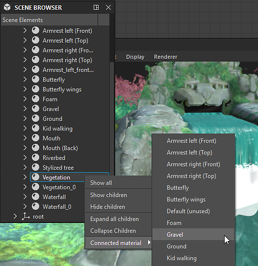

# 장면 브라우저

3D 뷰의 장면 브라우저에는 장면의 모든 요소와 해당 계층 구조가 나열됩니다.

개체를 선택하고 가시성을 전환하며 [장면 재정의](../../../working-with-3d-scenes/overriding-scene-mat/overriding-scene-materials.md)할 재질을 선택할 수 있는 컨트롤을 제공합니다.

Designer에서는 장면을 설명하고 관리하기 위해 [USD](https://openusd.org/release/index.html)을(를) 사용하므로 해당 용어와 개념은 장면 트리에서 찾을 수 있습니다.

[3D 보기 장면 도구 모음](../../../interface/3d-view/3d-view.md)에서 전용 토글 버튼 을(를) 클릭하여 표시합니다.

{zoomable="yes"}

<table>
<tr style="border: 0;">
<td style="border: 0;" valign="top">

## 장면 트리

</td>
<td style="border: 0;" valign="top">

### 장면의 개체 전환

</td>
<td style="border: 0;" valign="top">

### 연결된 재질

</td>
</tr>
</table>

## 장면 트리

<table>
<tr style="border: 0;">
<td width="100.00%" style="border: 0;" valign="top">

장면 브라우저는 계층 구조 트리에 배열된 객체들의 목록을 표시한다.

개체는 장면의 루트까지 다른 개체의 부모로 지정됩니다. 부모 개체에는 자식 목록을 확장하거나 축소하는 데 사용되는 화살표 단추가 있습니다.

</td>
<td width="33.33%" style="border: 0;" valign="top">

{zoomable="yes"}

</td>
</tr>
</table>

다음 정보가 포함된 도구 설명을 표시하려면 트리의 임의 항목에 커서를 몇 초 정도 둡니다.

* <b>경로:</b> 장면에 있는 개체의 전체 경로입니다.
* <b>TypeName:</b> 개체의 USD 형식입니다.
* <b>설명서:</b> USD 장면 요소로 개체에 대한 자세한 정보입니다.

메시에는 꼭지점 수, 얼굴 수 및 UV 수와 같은 추가 정보가 있습니다.

### Designer에서 추가한 개체

<table>
<tr style="border: 0;">
<td width="100.00%" style="border: 0;" valign="top">

Designer이 로드된 장면에 일부 개체를 추가합니다. Designer에서 추가한 개체는 <b>bold</b>로 레이블이 지정됩니다.

조명, 카메라 및 환경 메뉴에서 &#39;편집 ...&#39; 작업을 사용하는 경우 장면에 다른 조명, 카메라 또는 환경이 있는지에 관계없이 편집 중인 개체입니다.

이러한 개체는 [내보낼](../../../working-with-3d-scenes/exporting-scenes/exporting-scenes.md) 때 장면에 포함됩니다.

</td>
<td width="33.33%" style="border: 0;" valign="top">

{zoomable="yes"}

</td>
</tr>
</table>

* <b>카메라:</b> 장면의 기본 카메라입니다. Designer에서 상호 작용할 수 있는 유일한 카메라입니다. 로드된 장면에 포함된 모든 카메라는 기본 카메라의 사전 설정으로 추가됩니다.
* <b>환경:</b> 장면의 기본 환경입니다. 장면의 환경에 적용된 모든 텍스처는 해당 환경에만 적용됩니다. 마찬가지로 환경을 회전하면 해당 환경에만 영향을 줍니다.\
  로드된 장면에 하나 이상의 환경 조명([DomeLight](https://openusd.org/release/user_guides/schemas/usdLux/DomeLight.html) USD)이 포함되어 있으면 기본 환경이 자동으로 비활성화되어 장면의 환경 조명을 방해하지 않습니다.
* <b>점 조명 #:</b> [조명] > [속성 편집]에서 Designer의 점 조명이 활성화된 경우 각 점 조명이 장면에 추가됩니다.

## 장면의 개체 전환

### 모든 유형

모든 개체는 장면에서 활성화 및 비활성화할 수 있습니다. 비활성화되면 개체는 더 이상 장면에 기여하지 않습니다. 즉, 그림자를 드리우거나 빛을 내거나 반사하지 않습니다.

상위 개체의 상태는 하위 개체의 상태로 이어지므로 상위 개체를 비활성화하면 하위 개체도 비활성화됩니다.

개체의 눈 단추 을(를) 클릭하거나 개체의 컨텍스트 메뉴에서 개체의 가시성을 전환할 수 있습니다. 이 메뉴에서는 장면 개체의 가시성을 관리하기 위한 몇 가지 추가 작업을 제공합니다.

* <b>숨기기:</b> 선택한 개체를 비활성화합니다.
* <b>표시:</b> 선택한 개체를 활성화합니다.

일부 작업은 메쉬의 가시성에 특히 영향을 줍니다.

* <b>표시 전용:</b> 선택한 메시와 그 자식을 제외한 모든 메시를 비활성화합니다.
* <b>모두 표시:</b> 모든 메시를 활성화합니다.

상위 개체에는 다음과 같은 추가 작업이 있습니다.

* <b>자식 숨기기:</b> 선택한 개체의 모든 자식을 재귀적으로 비활성화합니다.
* <b>자식 표시:</b> 선택한 개체의 모든 자식을 재귀적으로 사용하도록 설정합니다.
* <b>모든 자식 확장:</b> 선택한 개체에서 모든 자식 목록을 재귀적으로 확장합니다.
* <b>모든 자식 축소:</b> 선택한 개체 아래의 모든 자식 목록을 재귀적으로 축소합니다.

{zoomable="yes"}

### 환경

환경 조명(DomeLight)의 가시성은 다른 개체와 동일한 방식으로 활성화 및 비활성화할 수 있습니다.

환경 조명이 비활성화된 경우 장면에 대한 조명 기여도도 비활성화됩니다.

둘 이상의 환경 조명을 사용하는 경우 조명 기여도는 *누적*&#x200B;됩니다.

{zoomable="yes"}

### 조명

장면의 모든 조명도 마찬가지입니다. 각 조명은 개별적으로 전환할 수 있습니다.

{zoomable="yes"}

## 연결된 재질

또한 장면 브라우저에서는 재정의한 재질을 3D 보기의 [재질 메뉴](../../../interface/3d-view/3d-view.md)에서 Designer이 나열한 다른 재질에 연결할 수 있습니다.

<table>
<tr style="border: 0;">
<td style="border: 0;" valign="top">

Designer에서 나열하는 재질은 장면 트리에서 하나 이상의 메시에 사용되는 재질 개체입니다.

이러한 재질을 [재정의](../../../working-with-3d-scenes/overriding-scene-mat/overriding-scene-materials.md)하면 Designer에서 숫자로 접미사를 붙여 사본이 만들어집니다.

재정의된 재질은 상황별 메뉴에서 추가 항목을 제공합니다. &#39;[연결된 재질](../../../working-with-3d-scenes/overriding-scene-mat/overriding-scene-materials.md)&#39; 하위 메뉴에는 이 재질을 재정의하는 데 사용할 수 있는 다른 모든 사용 가능한 재질이 나열됩니다.

</td>
<td style="border: 0;" valign="top">

{zoomable="yes"}

</td>
</tr>
</table>
