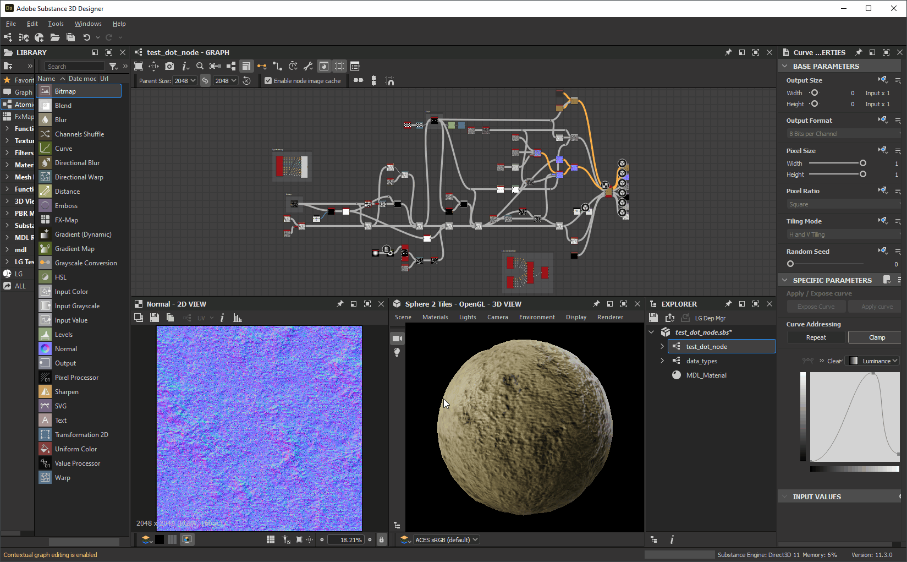
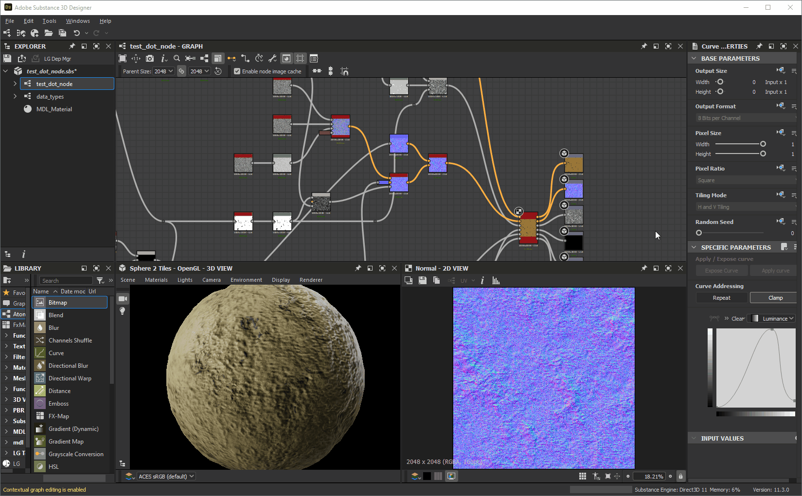

# 작업 영역 사용자 정의

이 페이지에서는 [Adobe Substance 3D Designer](https://www.adobe.com/kr/products/substance3d-designer.html) 사용자 인터페이스에서 패널을 정렬하고 해당 기능을 활용하여 작업 과정을 개선하는 방법을 소개합니다.

<table>
<tr style="border: 0;">
<td width="100.00%" style="border: 0;" valign="top">

## Windows 메뉴

이 메뉴를 통해 Designer의 주요 사용자 인터페이스 요소를 관리할 수 있습니다. 각 옵션은 기본 도구 모음에 대한 [이 페이지](../the-main-toolbar/the-main-toolbar.md)의 <b>Windows</b> 섹션에 설명되어 있습니다. 여기서는 이 메뉴와 관련된 추가 개념을 제공합니다.

### 보기 표시/숨기기

특정 인터페이스 항목을 표시하거나 숨기려면 *Windows* 메뉴에서 해당 이름을 클릭하십시오. 표시된 항목에  확인 표시가 있습니다.

### 도킹을 뷰로 채우기

Designer에서 도크는 해당 콘텐츠와 분리된 *컨테이너입니다*. 즉, <b>라이브러리</b> 도크가 있고 라이브러리 *보기*&#x200B;가 없으므로 비어 있을 수 있습니다.

<b>새 탐색기</b>, <b>새 3D 보기</b> 및 <b>새 라이브러리 보기</b> 옵션은 사용자 인터페이스의 현재 상태에 따라 배치되는 보기를 만듭니다.

* 빈 도크를 사용할 수 있는 경우 새 보기가 *해당 보기*&#x200B;에 만들어집니다.
* 빈 도크를 *사용할 수 없는*&#x200B;경우 새 보기를 보관할 *새 도크*&#x200B;가 만들어집니다

</td>
<td width="33.33%" style="border: 0;" valign="top">

</td>
</tr>
</table>

## 도킹 크기 조정

도크의 가장자리는 이동하여 크기를 조정할 수 있습니다. 다른 도크는 크기에 맞게 동적으로 크기가 조정됩니다.

## 도킹 이동

도킹은 *제목 표시줄*&#x200B;을 사용하여 주 창 주위로 이동할 수 있습니다. 도킹이 이동하는 위치에 따라 도킹의 크기가 알맞게 조정됩니다.

## 탭 이동 도킹

도크는 탭으로 쌓일 수 있습니다. 이렇게 하면 서로 관련된 화면 영역 또는 집계 보기를 어떤 방식으로든 저장하는 데 유용합니다.

도킹과 같이 제목 표시줄 *기존 도크 위로*&#x200B;도킹을 이동하여 도킹의 크기를 조정하거나 이동할 수 없지만 *프레임*&#x200B;이 대상 도크 주변에 나타납니다.

## 고정 해제

도킹이 *부동 창*&#x200B;에 고정 해제될 수 있습니다. 이 창에는 크기를 조정하고 기본 창 밖으로 이동하여 다른 디스플레이로 이동할 수 있습니다.

이 작업은 다음 두 가지 방법으로 수행할 수 있습니다.

* *제목 표시줄*&#x200B;을(를) 사용하여 도크를 이동하고 *주 창 밖으로* 또는 주 창의 *도크가 아닌* 영역에 배치합니다. *기본 창*&#x200B;의 다른 도킹으로 이동하거나 <b> 다시 도킹</b> 단추를 클릭하여 이 도킹을 다시 도킹할 수 있습니다.
* <b> Undock</b> 단추를 클릭합니다. 이 메서드로 도킹되지 않은 도킹은 <b> 다시 도킹</b> 단추를 클릭하여 *전용*&#x200B;을(를) 다시 도킹할 수 있습니다.

## 부두 최대화

모든 도킹은 해당 영역이나 *부모 창*&#x200B;에 맞게 최대화할 수 있습니다.

* 도킹된 도킹은 제목 표시줄, 기본 도구 모음 및 상태 표시줄을 제외한 *기본 창*&#x200B;의 전체 영역으로 분산됩니다
* 도킹되지 않은 도킹이 *전체 디스플레이*&#x200B;에 퍼집니다.

도크는 다음 두 가지 방법으로 최대화할 수 있습니다.

* *커서를 도킹 위에 놓고* <b>Shift+Space</b> 키 입력 누르기
* <b> 최대화</b> 단추를 클릭합니다.

최대화 도크는 *최대화 이전*&#x200B;에 보관된 크기 및 위치로 최소화할 수 있습니다. 이 작업은 다음 세 가지 방법으로 수행할 수 있습니다.

* *커서를 도킹 위에 놓고* <b>Shift+Space</b> 키 입력 누르기
* <b> 최소화</b> 단추를 클릭합니다.
* <b>창</b> 메뉴를 열고 <b>창 최대화 해제</b> 옵션 선택

>[!NOTE]
>
> 도크는 한 번에 *하나* 도크만 최대화할 수 있습니다.

>[!IMPORTANT]
>
> 도크가 최대화되면 다음과 같은 몇 가지 인터페이스 동작이 다를 수 있습니다.
> 
> * 자동으로 표시/업데이트되는 도크는 백그라운드에서 작동합니다(예: 속성, 2D 보기).
> * **Windows** 메뉴의 메뉴 항목이 *사용 안 함*&#x200B;입니다.
> * 도킹 제목 표시줄에 *사용 안 함* 단추가 있습니다.
> * 주 창 *에서 최대화된 도크는 제목 표시줄을 사용하여 이동할 수 없습니다*

## 고정 도킹

도크 *을(를) 고정하면 다른 콘텐츠 또는 다른 보기로 채워지지 않습니다*.

도킹이 고정되면 해당 도킹에 표시되어야 할 향후 콘텐츠가 대신 *새 도킹을 만듭니다*. 이 새 도크는 고정되지 않으므로 새 콘텐츠를 업데이트하고 호스팅할 수 있습니다.

도크를 고정하려면 해당  <b>고정</b> 단추를 클릭합니다. 그런 다음  <b>고정 해제</b> 단추를 사용하여 *고정 해제*&#x200B;를 통해 새 콘텐츠를 호스트하는 데 *사용 가능*&#x200B;을 한 번 더 만들 수 있습니다.

*동일한 유형*&#x200B;의 여러 도크를 포함하여 한 번에 둘 이상의&#x200B;*도크를 고정할 수 있습니다.*

도크를 고정하면 다음과 같은 기능을 사용할 수 있습니다.

* 여러 노드의 속성을 동시에 표시하고 수정하기
* 두 개 이상의 비트맵을 동시에 표시
* 여러 그래프에서 동시에 작업하기

## 도킹 닫기

 <b>닫기</b> 단추를 클릭하여 도크를 닫을 수 있습니다.

## 인터페이스 레이아웃 재설정

<b>Windows</b> 메뉴를 열고 <b>레이아웃 재설정</b> 옵션을 선택하여 전체 사용자 인터페이스를 기본 레이아웃으로 재설정할 수 있습니다.

표시 상태도 재설정됩니다. 즉, 닫힌 도크는 *다시 열림*(예: 3D 보기)될 수 있고 표시된 도크는 *닫힘*&#x200B;될 수 있습니다(예: 콘솔, 종속성 관리자, 플러그인이 만든 도크).

