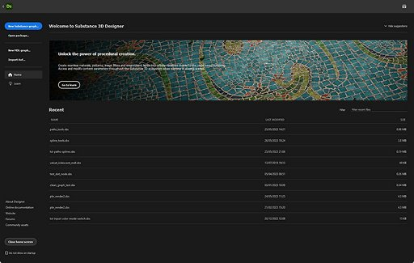

# 홈 화면

<b>홈 화면<b> </b></b>Substance 3D Designer을 실행하면 환영합니다. 프로젝트를 시작하고 유용한 링크에 액세스하는 데 도움이 됩니다.

<table>
<tr style="border: 0;">
<td width="100.00%" style="border: 0;" valign="top">

홈 화면을 닫으려면 왼쪽 위에 있는 <b>뒤로</b> 단추 또는 왼쪽 아래에 있는 <b>홈 화면 닫기</b> 단추를 사용하십시오. 바로 아래에 있는 확인란을 사용하면 Designer 시작 후 홈 화면의 자동 표시를 전환할 수 있습니다.

</td>
<td width="16.67%" style="border: 0;" valign="top">

</td>
</tr>
</table>

{width="512px"}

## 홈

 <b>홈</b> 섹션에는 Designer 사용을 위해 강조 표시된 제안이 포함된 배너가 제공됩니다.\
오른쪽의  <b>제안 숨기기</b> 단추를 사용하여 이 배너를 축소할 수 있습니다.

아래에서는 <b>최근</b> 헤더 아래의 최근 파일 목록을 통해 가장 최근 것부터 가장 오래된 것까지 마지막으로 로드된 프로젝트에 빠르게 액세스할 수 있습니다.

목록의 오른쪽 위에 있는 <b>필터</b> 입력 필드를 사용하여 최근 파일을 필터링할 수 있습니다. 필터링은 프로젝트의 파일 이름에 있는 모든 문자 문자열과 일치합니다.

>[!TIP]
>
> 파일의 전체 경로를 표시하려면 항목에 커서를 몇 초 동안 그대로 둡니다.

{width="512px"}

## 학습

 <b>학습</b> 섹션은 Substance 3D Designer에 대한 이해를 높이는 데 유용한 학습 리소스를 제공합니다.

이러한 리소스는 카드 링크로 나열되며 다음과 같이 그룹화됩니다.

* <b>실습 자습서</b>에서는 최신 기능을 다룹니다.
* <b>추가 리소스</b>는 정기적으로 다시 돌아가는 데 유용할 수 있는 리소스를 수집합니다.
  * [Designer의 첫 단계](https://substance3d.adobe.com/tutorials/courses/First-Steps-with-Substance-3D-Designer/youtube-VyFgpitTsYg)는 초보자를 위한 참조 자습서입니다.
  * [빠른 팁](https://substance3d.adobe.com/tutorials/courses/Designer-Quicktips/youtube-Q9mEcCWsOQc)은 재질, 패턴, 필터 등을 만드는 기술에 대해 선별된 재생 목록입니다.
  * [온라인 설명서](../../home/home.md)는 이 설명서를 제공합니다.

{width="512px"}

## 새로운 기능

화면 오른쪽 상단의  <b>새로운 기능</b> 버튼에는 Designer 버전에 추가된 주요 기능을 나열하는 화면과 해당 버전에 대한 전체 [릴리스 정보](../../release-notes/release-notes.md)에 대한 링크가 표시됩니다.

## 프로젝트 시작

화면 왼쪽에는 새 패키지에서 새 그래프를 만들기 위한 단축키 목록이 있습니다.

* <b>새 Substance 그래프:</b> [새 Substance 그래프](../../compositing-graphs/creating-compositing-gra/creating-a-substance-compositing-graph.md) 창을 엽니다.
* <b>패키지 열기:</b> 기존 패키지를 로드할 수 있습니다.
* <b>AxF 가져오기:</b> [AxF 가져오기 워크플로](../../resources/axf-appearance-exchange/axf-appearance-exchange-format.md)를 시작합니다.

{width="256px"}

## 링크

화면 왼쪽 하단에는 유용한 링크가 다음과 같이 나열되어 있습니다.

* <b>Designer 정보:</b> Designer 정보 화면을 표시합니다(위 참조).
* <b>온라인 설명서:</b> [이 설명서](../../home/home.md)에 대한 웹 페이지를 엽니다.
* <b>웹 사이트:</b> Substance 3D Designer [제품 페이지](https://www.adobe.com/kr/products/substance3d-designer.html)에 대한 웹 페이지를 엽니다.
* <b>포럼:</b> Substance 3D Designer [지원 커뮤니티](https://community.adobe.com/t5/substance-3d-designer/ct-p/ct-substance-3d-designer?page=1&sort=latest_replies&filter=all&lang=all&tabid=discussions)에 대한 웹 페이지를 엽니다.
* <b>커뮤니티 에셋:</b> Substance 3D [커뮤니티 에셋](https://substance3d.adobe.com/community-assets/)에 대한 웹 페이지를 엽니다.
