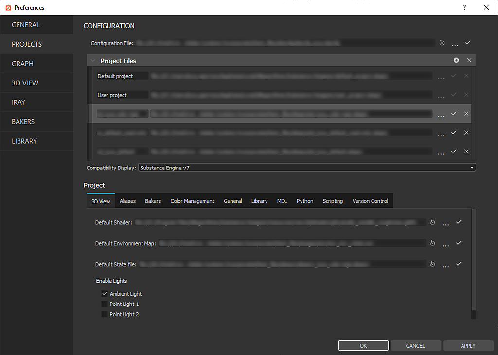

# 프로젝트 설정

이 페이지에는 [Substance 3D Designer](https://www.adobe.com/kr/products/substance3d-designer.html)의 <b>프로젝트 설정</b>과 여기에 포함된 설정이 표시됩니다.

Substance 3D Designer을 사용하면 *프로젝트당* 환경 설정을 만들고 워크스테이션 간에 공유할 수 있습니다. 이러한 환경 설정은 [환경 설정](../../../interface/preferences-window/preferences-window.md) 창의 <b>프로젝트</b> 탭에서 찾을 수 있습니다.

이 기능은 *모두* 시스템에서 *동일한* 프로젝트 파일을 사용하여 동일한 프로젝트에서 작업하는 팀에 대한 공통 작업 환경을 설정하려는 경우 매우 유용합니다.

>[!NOTE]
>
> **프로덕션 파이프라인**&#x200B;에서 Substance 3D Designer을 설정하고 통합하는 방법에 대한 자세한 내용은 설명서의 [파이프라인 및 프로젝트 구성](../../../pipeline-and-project-con/pipeline-and-project-configuration.md) 섹션을 참조하여 *적극 권장되는*&#x200B;입니다.

{zoomable="yes"}

## 구성

### 구성 파일

이렇게 하면 Substance 3D Designer에 대한 <b>구성 파일</b>의 경로를 설정할 수 있습니다. 구성 파일은 <b>\*.sbscfg</b> 확장명을 사용하며 설정된 [호환성 표시] 설정과 함께 프로젝트 파일 목록을 포함합니다.

*기본값: default\_configuration.sbscfg*

>[!NOTE]
>
> **—config-file** 명령줄 옵션을 사용하여 특정 구성 파일로 Designer을 시작할 수 있습니다.\
> 구성 파일에 대한 자세한 내용은 설명서의 [구성 목록 - SBSCFG](../../../pipeline-and-project-con/configuration-list-sbscfg/configuration-list-sbscfg.md) 페이지를 참조하십시오.

### 프로젝트 파일

프로젝트 파일에는 Designer에서 작업 환경의 주요 측면을 정의하는 여러 가지 설정이 탭으로 정렬되어 있습니다. 이러한 설정은 이 페이지의 프로젝트 장에 나열되어 있습니다. 프로젝트 파일은 <b>\*.sbsprj</b> 확장명을 사용합니다.

Designer에서 작업 환경에 사용할 여러 프로젝트 파일을 가져올 수 있습니다. 프로젝트 파일이 여러 개 있는 경우 목록인 설정(예: 라이브러리 감시 경로, 별칭 등) 은(는) *결합*&#x200B;이며, 고유한 설정 값인 설정은 *목록의 마지막 프로젝트 파일*&#x200B;에 의해 정의됩니다.

*기본값: default\_project.sbsprj(읽기 전용), user\_project.sbsprj*

>[!NOTE]
>
> 프로덕션 파이프라인에서 프로젝트 파일을 사용하는 방법에 대한 자세한 내용은 설명서의 [프로젝트 구성 파일 - SBSPRJ](../../../pipeline-and-project-con/project-configuration-fil/project-configuration-files-sbsprj.md) 페이지를 참조하십시오.

### 호환성 표시

최신 버전의 Designer에서 만든 일부 노드가 이전 버전의 Substance 엔진과 호환되지 않습니다.

<b>호환성 모드</b>는 노란색 윤곽선으로 선택한 Substance 엔진과 호환되지 *않는* 노드를 강조 표시합니다.

*기본값: Substance 엔진 v7*

### 3D 보기

|                                |                                                                                                                                                                                                                                                                                                                                                                                                                                                                                                                                                                                                                                                                                                                                                                                            |
|--------------------------------|--------------------------------------------------------------------------------------------------------------------------------------------------------------------------------------------------------------------------------------------------------------------------------------------------------------------------------------------------------------------------------------------------------------------------------------------------------------------------------------------------------------------------------------------------------------------------------------------------------------------------------------------------------------------------------------------------------------------------------------------------------------------------------------------|
| <b>기본 렌더러</b> | 이 설정을 사용하면 *새* [3D 보기](../../../interface/3d-view/3d-view.md)를 시작할 때 기본적으로 사용해야 하는 [3D 렌더러](../../../interface/3d-view/3d-renderers/3d-renderers.md)를 선택할 수 있습니다.  *기본값: 기본값(미리 정의된 렌더러)* |
| <b>기본 셰이더</b> | 이 설정을 사용하면 *새로 만들기* [3D 보기&#x200B;](../../../interface/3d-view/3d-view.md)  *를 시작할 때 기본적으로 사용해야 하는 셰이더를 선택할 수 있습니다. 기본값: open_pbr.glslfx* |
| <b>기본 환경 맵</b> | 이 설정을 사용하면 *새로운* [3D 보기&#x200B;](../../../interface/3d-view/3d-view.md)  *를 시작할 때 환경에 기본적으로 적용되어야 하는 텍스처를 선택할 수 있습니다. 기본값: panorama\_map.hdr* |
| <b>기본 상태 파일</b> | [3D 보기](../../../interface/3d-view/3d-view.md) **장면 상태 파일**&#x200B;에는 카메라 위치, 환경 노출, 메시 등 3D 보기에 대한 다양한 설정이 포함됩니다. 3D 보기의 상태를 저장하는 데 사용되므로 요구 사항에 맞게 장면을 빠르게 로드할 수 있습니다. 장면 상태 파일은 **\*.sbsscn** 확장명을 사용합니다.이 설정을 사용하면 새 3D 보기를 시작할 때 사용해야 하는 3D 보기 장면 상태 파일을 선택할 수 있습니다.  **경고:** 일부 소프트웨어 업데이트는 장면 상태를 저장/로드하는 방법을 변경할 수 있습니다. 장면이 *올바르게 복원되지 않은 경우*, 장면의 원하는 상태를 수동으로 설정하고 기본값으로 사용하는 장면 상태 파일을 *다시 내보내기*&#x200B;하는 것이 좋습니다.   *기본값: 비어 있음(이 경우 사전 설정된 장면 상태가 사용됨)* |
| <b>기본 조명 상태</b> | 이 설정을 사용하면 새 [3D 보기를 시작할 때](../../../interface/3d-view/3d-view.md), **기본 상태 파일** 필드에 *파일이 설정되어 있지 않은 경우*,  *기본값: 주변광만* 미리 정의된 사용 가능한 조명을 선택할 수 있습니다. |

### 앨리어스

별칭은 시스템 경로를 *단축*&#x200B;하는 데 사용되며 팀이 에셋을 더 효율적으로 *공유*&#x200B;할 수 있도록 해 줍니다. 별칭은 *SBS 파일*&#x200B;뿐만 아니라 *소프트웨어 전체*&#x200B;에서 사용됩니다.

이러한 설정을 사용하여 *추가* 및 *편집* 별칭을 만들 수 있습니다. 별칭이 적용되면 다음 구문을 사용하여 매핑된 경로를 *대체*&#x200B;합니다. <b>://</b>.

예: *myFolder* 폴더의 *myResource* 리소스가 *C:/Users/user/Documents* 위치에 있으면 이 위치를 *myalias*&#x200B;에 매핑하면 해당 리소스가 속한 SBS 패키지와 *응용 프로그램에서* myalias://myFolder/myResource *경로가 사용됩니다.*

*기본값: sbs; sd-3dview-shapes; sd-3dview-maps; sd-3dview-shaders(기본 프로젝트)*

>[!WARNING]
>
> 별칭은 *응용 프로그램에 대한 전역*&#x200B;입니다. 즉, 응용 프로그램에 사용된 *모든 경로*&#x200B;와 *로드된 SBSPRJ 프로젝트 설정 파일*&#x200B;의 모든 경로에 적용됩니다. 프로젝트 환경을 설정할 때는 이 점에 유의하십시오.\
> 또한 별칭을 *중첩하지 않는 것*&#x200B;이 좋습니다. 즉, 다른 별칭에도 포함된 경로를 앨리어싱하는 것이 좋습니다.

### 베이커

|                               |                                                                                                                                                                                                                                                                                                                                                                                                                                                                                                                                                                                                                                                                                                                                                                                                                                                                                                                                                                                                                                                                                                                            |
|-------------------------------|----------------------------------------------------------------------------------------------------------------------------------------------------------------------------------------------------------------------------------------------------------------------------------------------------------------------------------------------------------------------------------------------------------------------------------------------------------------------------------------------------------------------------------------------------------------------------------------------------------------------------------------------------------------------------------------------------------------------------------------------------------------------------------------------------------------------------------------------------------------------------------------------------------------------------------------------------------------------------------------------------------------------------------------------------------------------------------------------------------------------------|
| <b>기본 리소스 이름</b> | 이 설정을 사용하면 출력 이미지 파일에 사용할 기본 **명명 템플릿**&#x200B;을 설정할 수 있습니다. [베이킹 창](../../../bakers/bakers.md)에서 사용할 수 있는 별칭은 여기에서 사용할 수도 있습니다(예: *$(mesh)*, *$(bakername)*, *$(udim)*, *$(custom)*)  *기본값: $(mesh)\_$(bakername)* |
| <b>기본 사전 설정</b> | [베이킹 창](../../../bakers/bakers.md)을 열 때 이 옵션을 사용하여 사전 설정 *JSON* 파일을 가리키면 특정 베이커 및 설정으로 **이미 구성**&#x200B;할 수 있습니다. 이 파일은 필요에 따라 설정한 후 베이킹 창에서 내보낼 수 있습니다&#x200B;  *기본값: 없음* |
| <b>이름 필터링 모드</b> | 낮은 폴리 및 높은 폴리 장면 개체를 일치시키는 데 사용해야 하는 장면 개체:<ul data-preserve-html="true"> <li data-preserve-html="true">형상 이름: 메쉬 형상 개체의 이름을 사용합니다.</li> <li data-preserve-html="true">마스터 이름(레거시): 메시 지오메트리 개체의 마스터 이름을 사용합니다(Designer 버전 14.1 이하에서와 동일함)</li> </ul>*기본값: 도형 이름* |
| <b>리소스 이름 매크로</b> | *$(bakername)* 별칭 대신 [각 제빵사](https://experienceleague.adobe.com/en/docs/substance-3d/bakers/bakers-settings/bakers-settings)에 고유한 문자열을 사용할 수 있습니다.  모든 제빵사의 출력 이미지 이름에 ***$(사용자 지정)*** 별칭이 사용되면 목록의 해당 제빵사와 일치하는 문자열로 대체됩니다. 제빵사에 해당하는 목록의 셀이 비어 있으면 *$(사용자 지정)* 별칭이 이 이 제빵사에 대해 *교체되지 않습니다*. 예: &#39;Curvature Map From Mesh&#39; 제빵사에 할당된 &#39;c-mesh&#39; 값이 자동으로 *t\_mymesh\_**$(사용자 지정)***의 이름을 *t\_mymesh\_**c-mesh***(Mesh Baker에서 Curvature의 출력 *만&#x200B;*  *기본값: 없음*(으)로 바꿉니다. |
| <b>하위 메시 이름 필터</b> | [베이커](../../../bakers/bakers.md)에서 **이름별 일치** 옵션을 사용할 때 정의된 **접미사** 이전의 해당 부분 이름이 *동일*&#x200B;한 경우 메시 저해상도 및 고해상도 버전의 부분이 *일치*&#x200B;됩니다. 이 설정을 사용하여 특정 워크플로우에 맞게 고유 접미사를 설정할 수 있습니다. 메시 일부를 일치시키면 레이가 베이킹 작업에서 원치 않는 형상을 무시하게 할 수 있습니다.예: *body.fbx* 메시의 *body-torso**\_low*** 개체는 *body\_high.fbx의* body-torso **\_high*****개체와 일치합니다.* *이러한 개체가 이 메시*에 있는 경우&#x200B;*. 기본값: \_low(낮은 폴리 메시) / \_high(높은 폴리 메시)*마찬가지로**&#x200B;이면&#x200B;**은 이름이 정의된**&#x200B;접미사&#x200B;**를 포함하는 메시 부분, [특정 베이커](https://experienceleague.adobe.com/en/docs/substance-3d/bakers/bakers-settings/bakers-settings)에 대해 *선택적으로 무시*할 수 있습니다 **뒷면 무시** 옵션  *&#x200B;기본값: \_ignorebf *  *&#x200B;참고:* 뒷면 무시 및 낮은/높은 다중 메시 접미사는 *임의의 순서로 조합할 수 있습니다*(예: *body-torso\_low\_ignorebf*) |

### 색상 관리

[색상 관리](../../../color-management/color-management.md) 페이지를 참조하세요.

>[!WARNING]
>
> 이러한 설정의 변경 사항은 Designer을 다시 시작한 후에 적용됩니다.

### 일반

|                            |                                                                                                                                                                                                                                                                                                                                                                                                                                                                                                                                                                                                                                                                                                                                                                                                                                                                                                                                                                                                                                                                                                                                                                                                                                                                                                                                                                                                                                                                                                                                                                                                                                                                                                                                                                                                                                                                                                                                                                                                                                                                                                                                                                                                                                                                                                                                                                                 |
|----------------------------|---------------------------------------------------------------------------------------------------------------------------------------------------------------------------------------------------------------------------------------------------------------------------------------------------------------------------------------------------------------------------------------------------------------------------------------------------------------------------------------------------------------------------------------------------------------------------------------------------------------------------------------------------------------------------------------------------------------------------------------------------------------------------------------------------------------------------------------------------------------------------------------------------------------------------------------------------------------------------------------------------------------------------------------------------------------------------------------------------------------------------------------------------------------------------------------------------------------------------------------------------------------------------------------------------------------------------------------------------------------------------------------------------------------------------------------------------------------------------------------------------------------------------------------------------------------------------------------------------------------------------------------------------------------------------------------------------------------------------------------------------------------------------------------------------------------------------------------------------------------------------------------------------------------------------------------------------------------------------------------------------------------------------------------------------------------------------------------------------------------------------------------------------------------------------------------------------------------------------------------------------------------------------------------------------------------------------------------------------------------------------------|
| <b>Substance 템플릿</b> | 새 그래프를 만들 때 출력(예: *PBR(금속/거칠기)*)과 같이 *미리 구성된* 설정 및 콘텐츠를 포함할 수 있는 **템플릿**&#x200B;의 작업을 시작하라는 메시지가 표시됩니다. 이 설정을 사용하면 Designer에서 템플릿으로 사용할 SBS 파일을 저장할 수 있는 디렉터리를 가리킬 수 있습니다. 그러면 새 그래프를 만들 때 사용자 지정 서식 파일이 *목록에 추가됩니다*  *기본값: 없음&#x200B;*  *참고:* 서식 파일 SBS 파일을 구성하고 서식을 지정하기 위한 참조로 현재 서식 파일을 사용하는 것이 좋습니다.  템플릿은 Substance 3D Designer 설치 디렉터리의 **리소스 > 템플릿** 폴더에서 찾을 수 있습니다. |
| <b>3D 장면</b> | 기본적으로 Designer은 3D 보기에서 **MikkT 접선 공간**&#x200B;을 사용합니다. MikkT는 널리 사용되며 Unity, Unreal Engine 4, Blender 및 xNormal 등의 프로그램에서 기본값으로 사용됩니다.3D 보기에 **자신의 접선 공간**&#x200B;을 사용할 수 있습니다. 이 설정에서는 *DLL 파일* 입력 형식으로 Designer에 제공합니다. 레이블이 DLL 파일에서 자동으로 감지되며 플러그 인에 대한 설명을 편집할 수 있습니다&#x200B;  *기본값: mikktspace.dll*&#x200B;항상 탄젠트 프레임 다시 계산&#x200B;  *기본값: 선택 취소됨*&#x200B;표준 및 탄젠트 매끄러움 각도&#x200B;  *기본값: 180.0°* |
| <b>기타</b> | 일반 맵은 <b>DirectX</b> 또는 <b>OpenGL</b> 형식을 사용하여 생성하거나 처리할 수 있습니다. 이 설정은 [3D 보기](../../../interface/3d-view/3d-view.md)의 [재질 속성](../../../interface/3d-view/material-properties/material-properties.md) 및 [표준](../../../compositing-graphs/nodes-reference-for-com/atomic-nodes/normal/normal.md) 필터 노드 매개 변수와 같은 여러 위치에서 이 형식의 값을 설정합니다.  *기본값: DirectX*  [표준](../../../compositing-graphs/nodes-reference-for-com/atomic-nodes/normal/normal.md) 필터 노드에 대해서는 <b>Alpha 채널 내용</b> 매개 변수의 기본값을 설정할 수 있습니다. 모든 경우에 알파를 1로 강제 설정하거나 해당 입력의 정보로 채울 수 있습니다.  *기본값: Alpha을 1*&#x200B;로 강제 설정 |
| <b>이미지 형식</b> | *내보낸* 이미지&#x200B;  *기본값: 기본값(BMP)/Piz 기반 웨이블릿, 선택 취소, 선택 취소(EXR)/선택 취소, 선택 취소, 75(JPG)/최고 속도, 선택 취소(PNG)/기본값(TGA)/LZW(TIF)/선택 취소, 75(WEBP)에 대한 기본 형식 설정을 지정할 수 있습니다.* |
| <b>종속성 경로</b> | 
SBS 패키지에는 일반적으로 <b>종속성</b>이 있습니다. 즉, 다른 SBS 패키지, 비트맵 또는 벡터 파일과 같은 <i>외부 리소스</i>에 의존합니다.[종속성 관리자](../../../interface/dependency-manager/dependency-manager.md)에 나열된  이러한 종속성은 저장되며 이러한 리소스를 가리키는 <b>경로</b>를 사용하여 SBS 패키지</i>에서 <i>참조됩니다.

SBS 패키지와 <i>동일한 경로</i>를 포함하는 종속성(즉, 해당 위치에서 동일한 위치 또는 하위 폴더에 위치)의 경우 참조 경로는 SBS 패키지 위치를 기준으로 <b>쓰여집니다</b>.

예: SBS 패키지 <code>myproject/mypackage.sbs</code>, 이미지 <code>myproject/myfolder/myimage.png</code> <code>myfolder/myimage.png에 참조됩니다.</code> <code>mypackage.sbs의 경로</code>).

SBS 패키지와 같은 경로를 포함하지 <i>않는</i> 종속성에 포함하려면(즉, SBS 패키지와 다른 위치에 모두 위치) 경로 작성 방법을 선택할 수 있습니다.

<b>상대 경로</b>(으)로 설정된 경우 리소스는 위에서 설명한 것과 동일한 방식으로 참조됩니다.

예: SBS 패키지 <code>myparentfolder/myproject/mypackage.sbs</code>, 이미지 <code>myparentfolder/myotherfolder/myimage.png</code> <code>../myotherfolder/myimage.png에 참조됩니다.</code> <code>mypackage.sbs의 경로</code>.

<b>절대 경로</b>(으)로 설정된 경우 리소스는 전체 시스템 경로에서 참조됩니다.

예: SBS 패키지 <code>myparentfolder/myproject/mypackage.sbs</code>, 이미지 <code>myparentfolder/myotherfolder/myimage.png</code> <code>mypackage.sbs에서 이 동일한 전체 경로를 참조합니다.</code>

<i>기본: ...상대 경로</i>

<i>참고:</i> 모든 경우 리소스를 이동하면 <i>종속성 끊기</i> 가 되고, 이로 인해 그래프에 <b>고스트 인스턴스</b> 노드가 표시됩니다.  SBS 패키지와 함께 단일 프로젝트 폴더에 있는 모든 종속성을 <i>통합</i>하려면 [탐색기](https://helpx.adobe.com/substance-3d/unlisted/documentation/sddoc/the-explorer-129368147.html) 패널에서 <b>종속성을 사용하여 내보내기...</b> 기능을 사용할 수 있습니다. 이렇게 하면 자유롭게 이동할 수 있는 <i>자체 포함</i> 프로젝트 폴더가 효과적으로 만들어집니다. |

### 라이브러리

이 섹션에서는 [라이브러리](../../../interface/the-library/the-library.md)의 <b>사용자 지정 콘텐츠를 관리</b>할 수 있습니다.

<b>추가된 경로</b> 목록에 나열된 모든 폴더의 콘텐츠는 라이브러리에 포함됩니다. 콘텐츠에 대한 모든 변경 내용은 [환경 설정](../../../interface/preferences-window/preferences-window.md) 창의 [라이브러리](../../../interface/preferences-window/preferences-window.md) [탭](../../../interface/preferences-window/preferences-window.md)에서 설정할 수 있는 새로 고침 이후에 라이브러리에 반영됩니다.

목록의 열에서 이러한 폴더의 내용이 라이브러리에 추가되는 방식을 보다 세부적으로 제어할 수 있는 옵션을 찾을 수 있습니다.

* **사용:** 폴더의 콘텐츠는 라이브러리에 표시됩니다(*기본값: 선택됨*).
* **재귀:** 모든 자식 폴더의 내용은 라이브러리(*기본값: 선택됨*)에도 표시됩니다.
* **패턴 제외:** *이름*&#x200B;이(가) 입력 Regex(정규식)와 일치하는 파일은 라이브러리에 *표시되지 않음*(예: `wip-*`) 입니다. 정규식 구문 [여기](https://doc.qt.io/qt-5/qregularexpression.html#wildcardToRegularExpression)에 대해 자세히 알아보기
* **확장 제외:** *확장*&#x200B;에 입력 텍스트 문자열이 포함된 파일은 라이브러리에 *표시되지 않음*&#x200B;입니다. 여러 문자열은 `;` 세미콜론으로 구분해야 합니다. (E.g. `jpg;png;tif;fbx`)

SBS 패키지가 라이브러리에 추가되는 경우 해당 **라이브러리에 표시** 매개 변수가 &#39;예&#39;로 설정된 경우 포함된 **그래프** 및 **리소스**&#x200B;는 *라이브러리에 별도의 항목으로 표시*&#x200B;될 수 있습니다.\
패키지에서 새 그래프 또는 리소스를 만들거나 추가할 때 이 매개 변수를 기본적으로 *예*(으)로 설정할지 여부를 정의하는 데 사용할 수 있습니다.

*기본값: 선택됨*

라이브러리에 포함된 [Photoshop](https://www.adobe.com/products/photoshop.html) 문서(\*.PSD 파일)에 <b>여러 레이어</b>가 있는 경우, 옵션을 사용하면 라이브러리에*&#x200B;각 레이어의 내용을 별도의 이미지 항목*으로 표시할 수 있습니다.

*기본값: 선택됨*

>[!NOTE]
>
> 사용자 지정 리소스가 라이브러리에 추가되는 동안 기존 라이브러리 범주에 대해 설정된 필터링 규칙 때문에 *표시되지 않을 수 있습니다*. 프로젝트 작업 중에 콘텐츠를 안정적으로 찾을 수 있도록 폴더에 구성된 *나만의 필터*&#x200B;를 만드는 것이 좋습니다.\
> 자세한 내용은 설명서의 [사용자 지정 콘텐츠 및 필터 관리](https://helpx.adobe.com/substance-3d/unlisted/documentation/sddoc/creating-library-filters-for-projects-170459772.html) 섹션을 참조하십시오.

### Python

Substance 3D Designer은 <b>Url</b> 목록에 추가하는 폴더에 있는 모든 [플러그인](../../../scripting/plugin-basics/plugin-basics.md)을 자동으로 로드합니다.

*기본값: 없음*

>[!WARNING]
>
> 이러한 설정의 변경 사항은 Designer을 다시 시작한 후에 적용됩니다.\
> [플러그인 패키지](../../../scripting/plugins-packages/plugins-packages.md)는 [플러그인 관리자](../../../scripting/plugin-manager/plugin-manager.md)를 사용하여 *수동*&#x200B;으로 설치해야 합니다.

### 스크립팅

>[!WARNING]
>
> 이 기능은 보다 강력한 **Python API**&#x200B;를 위해 향후 릴리스에서 *중단*&#x200B;됩니다. 따라서 가능하면 빨리 스크립트에서 전환하는 것이 좋습니다.\
> 설명서의 [스크립팅](../../../scripting/scripting.md) 섹션에서 [응용 프로그램 콜백](../../../scripting/application-callbacks/application-callbacks.md) 페이지로 이동하여 시작할 수 있습니다.

이 섹션에서는 Designer에서 특정 *이벤트*&#x200B;가 발생할 때 실행되도록 *스크립트*&#x200B;를 설정하고 제어할 수 있습니다. 이 기능은 프로젝트 설정의 버전 제어 탭에서 구성할 수 있는 [Perforce](https://www.perforce.com/) 통합과 함께 사용할 때 특히 유용합니다.

|                    |                                                                                                                                                                                                                                                                                                                                                                                                                                                                                                                                                                                                                                                                                                                                                                                                                                                                                                                                                                                                                                                                                                                                                                                                                                                                                                                                                                                                                                                                                                                                                                                                                       |
|--------------------|-----------------------------------------------------------------------------------------------------------------------------------------------------------------------------------------------------------------------------------------------------------------------------------------------------------------------------------------------------------------------------------------------------------------------------------------------------------------------------------------------------------------------------------------------------------------------------------------------------------------------------------------------------------------------------------------------------------------------------------------------------------------------------------------------------------------------------------------------------------------------------------------------------------------------------------------------------------------------------------------------------------------------------------------------------------------------------------------------------------------------------------------------------------------------------------------------------------------------------------------------------------------------------------------------------------------------------------------------------------------------------------------------------------------------------------------------------------------------------------------------------------------------------------------------------------------------------------------------------------------------|
| <b>작업</b> | Designer은 **콜백 트리거**&#x200B;를 사전 구성했습니다. 이 트리거는 아래 설명된 **해석기** 목록에 설정된 해석기를 사용하여 제공하는 *스크립트를 실행*&#x200B;합니다.포함된 콜백은 다음과 같습니다.<ul data-preserve-html="true"><li data-preserve-html="true"><strong>onBeforeFileLoaded</strong> - SBS 패키지가 로드되기 <em>전에</em> 스크립트를 실행합니다.</li><li data-preserve-html="true"><strong>onAfterFileLoaded</strong> - SBS 패키지가 로드된 <em>후</em> 스크립트를 실행합니다.</li><li data-preserve-html="true"><strong>onBeforeFileSaved</strong> - SBS 패키지가 저장되기 <em>전에</em> 스크립트를 실행합니다.</li><li data-preserve-html="true"><strong>onAfterFileSaved</strong> - SBS 패키지가 저장된 <em>후</em> 스크립트를 실행합니다.</li><li data-preserve-html="true"><strong>getGraphExportOptions</strong> - [출력 내보내기](../../../compositing-graphs/exporting-bitmaps/exporting-bitmaps.md) 옵션이 호출되면 스크립트를 실행합니다.</li></ul>[Python](https://www.python.org/) 스크립트가 설치 파일에 포함되어 있으며, 각 콜백에서 트리거된 함수가 *이미 설정*&#x200B;되어 사용할 준비가 되었습니다. 이 기능을 시작점으로 사용하여 필요에 따라 기능을 추가할 수 있습니다. 이 스크립트는 **functions.py**&#x200B;이며, 설치 파일의 **도구 > 스크립팅** 폴더에 있습니다.  *기본값: 없음&#x200B;*  *참고:* 처음에 콜백에 대한 스크립트를 선택하면 편의상 *모두* 콜백에 해당 스크립트가 입력됩니다. 해당 시점 이후 특정 콜백에 대해 서로 다른 스크립트를 자유롭게 설정할 수 있습니다. |
| **해석기** | 이 목록에서 위에서 설명한 **동작** 목록에 설정된 스크립트를 실행하는 데 Designer에서 사용해야 하는 특정 *해석기*&#x200B;를 제공할 수 있습니다. 목록의 각 항목 텍스트 필드에서 편집할 수 있는 *사용자 지정 별칭*&#x200B;을 사용하여 해석기를 식별합니다. [Python](https://www.python.org/) 3.6 해석기는 Designer의 설치 파일과 함께 번들로 제공됩니다. 설치 파일의 **플러그인 > pythonsdk** 폴더에서 찾을 수 있습니다.  *기본값: 없음* |

### 버전 제어

>[!WARNING]
>
> [Perforce](https://www.perforce.com/)은(는) 현재 버전 제어에 지원되는 *전용* 도구입니다.

[버전 제어](../../../interface/preferences-window/version-control/version-control.md) 페이지를 참조하십시오.

**이것을 어떻게 사용하시겠습니까?**

Designer의 프로젝트 파일(\*.sbsprj)에서*&#x200B;프로젝트별*인 모든 환경 설정을 지정해야 합니다. 이러한 환경 설정에는 다음이 포함됩니다.

* 탄젠트 공간 플러그 인
* 라이브러리
* 앨리어스
* 3D 보기 설정
* 베이킹 설정
* [버전 제어 설정](../../../interface/preferences-window/version-control/version-control.md)

모든 경로는 프로젝트 파일(.spspsprj)을 기준으로 *상대*&#x200B;에 저장됩니다. 따라서 Perforce의 프로젝트 파일과 같은 위치에 다음과 같은 하위 폴더 트리를 사용하여 **라이브러리** 폴더를 가질 수 있습니다.

* maps/
* 망/
* sbs/
* sbsar/
* psd/
* 3Dview/
* ...

프로젝트 파일과 같은 레벨에 탄젠트 공간 플러그인이나 기본 셰이더를 저장할 수도 있습니다.

구성 파일(\*.sbscfg)은 프로젝트 파일과 함께 Perforce 작업 영역에 배치해야 합니다.

>[!NOTE]
>
> **프로덕션 파이프라인**&#x200B;에서 Substance 3D Designer 설정 및 통합에 대한 자세한 내용은 설명서의 [파이프라인 및 프로젝트 구성](../../../pipeline-and-project-con/pipeline-and-project-configuration.md) 섹션을 참조하여 *적극 권장됩니다*.
