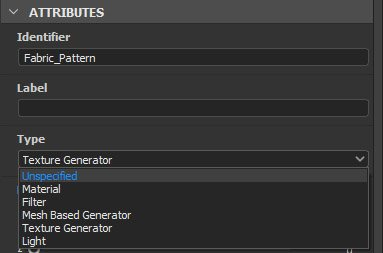

# 다음으로 보내기...  상호운용성

{width="512px"}

Adobe Substance 3D Designer은 [Substance 3D Sampler](https://www.adobe.com/kr/products/substance3d-sampler.html), [Substance 3D Painter](https://www.adobe.com/kr/products/substance3d-painter.html) 및 [Substance 3D Stager](https://www.adobe.com/kr/products/substance3d-stager.html)와 상호 운용성을 갖습니다. 이를 통해 신속하게 작업하여 Substance 3D 에코시스템에 대한 반복을 용이하게 하고 *보내기* 및 *재전송*&#x200B;할 수 있습니다.

일반적으로 워크플로우는 다음과 같습니다.

1. [Substance 그래프의 속성](../../../compositing-graphs/graph-parameters/graph-parameters.md)에서 <b>Type</b> 특성 설정
1. [탐색기](../the-explorer-window.md) 패널에서 보낼 패키지를 선택합니다
1. 탐색기의 <b>Publish/보내기</b> 드롭다운에서 대상 응용 프로그램을 선택합니다
1. 그래프를 변경합니다.
1. 3단계를 반복하여 패키지를 다시 전송하고 변경 사항으로 기존 전송 에셋을 업데이트합니다

>[!WARNING]
>
> 상호 운용성 기능은 <b>Steam</b> 버전에서 사용할 수 *없습니다*.

<table>
<tr style="border: 0;">
<td style="border: 0;" valign="top">

## 그래프 유형 설정

Substance 그래프에는 다양한 기능이 있을 수 있습니다. 그래프의 정확한 기능을 미리 정의하여 제대로 전송할 수 있도록 해야 합니다.

[Substance 그래프 속성](../../../compositing-graphs/graph-parameters/graph-parameters.md)의 <b>특성 </b>섹션에 다음 옵션이 있는 드롭다운과 함께 <b>유형</b> 옵션이 있습니다.

</td>
<td style="border: 0;" valign="top">



</td>
</tr>
</table>

* 설정하지 않은 경우 **지정되지 않음**&#x200B;이 기본 형식입니다. 전송하는 응용 프로그램에 따라 다르게 해석될 수 있습니다. [Substance 3D Painter](https://www.adobe.com/kr/products/substance3d-painter.html)은(는) 기본적으로 재질로 설정됩니다.
* **표준 재질**&#x200B;은 다중 채널 PBR 재질에 대한 것으로 [출력](../../../compositing-graphs/nodes-reference-for-com/atomic-nodes/output/output.md) 레이블이 올바르게 지정되어 있습니다.
* **데칼 재질**&#x200B;은 알파 채널이 있는 다중 채널 PBR 재질을 위한 것으로, [Substance 3D Painter](https://www.adobe.com/kr/products/substance3d-painter.html) 또는 [Substance 3D Sampler](https://www.adobe.com/kr/products/substance3d-sampler.html)에서 데칼로 적용됩니다.
* **Atlas 재질**&#x200B;은 Designer 또는 [Substance 3D Sampler](https://www.adobe.com/kr/products/substance3d-sampler.html)에서 [Atlas Scatter 노드](../../../compositing-graphs/nodes-reference-for-com/node-library/material-filters/scan-processing/atlas-scatter/atlas-scatter.md)와 함께 사용할 수 있도록 여러 개의 아틀라스 이미지로 구성된 다중 채널 PBR 재질입니다.
* **필터**&#x200B;는 [Substance 3D Painter](https://www.adobe.com/kr/products/substance3d-painter.html) 또는 [Substance 3D Sampler](https://www.adobe.com/kr/products/substance3d-sampler.html)에서 사용되는 범용 필터입니다.
* **메시 기반 생성기**&#x200B;는 다중 입력 마스크 생성기용입니다. [Substance 3D Painter](https://www.adobe.com/kr/products/substance3d-painter.html)에서만 사용됩니다.
* **텍스처 생성기**&#x200B;는 2D 절차 및 노이즈와 같은 단일 채널 맵용입니다.
* **환경 조명**&#x200B;은 장면 및 개체를 조명하는 데 사용되는 단일 채널 조명 환경용입니다.
* **조명 텍스처**&#x200B;는 실제 조명에 적용된 단일 채널 텍스처에 대한 것입니다.

<table>
<tr style="border: 0;">
<td style="border: 0;" valign="top">

## &#39;보내기&#39; 메뉴

보내기 프로세스에는 하나 이상의 패키지를 SBSAR(Substance 3D 에셋 파일)에 [게시](../../../compositing-graphs/publishing-asset-files/publishing-substance-3d-asset-files-sbsar.md)가 포함되어 있습니다.

콘텐츠를 보내는 것은 다음과 같은 방법으로 수행할 수 있습니다.

* 패키지를 마우스 오른쪽 단추로 클릭하고 상황별 메뉴에서 <b>보내기...</b> 하위 메뉴를 연 다음 대상 응용 프로그램에 대해 <b>보내기..</b> 옵션을 선택합니다.
* [탐색기] 패널 위쪽의  <b>Publish/보내기</b> 단추를 클릭한 다음 대상 응용 프로그램에 대해 <b>보내기...</b> 옵션을 선택합니다.

</td>
<td style="border: 0;" valign="top">


</td>
</tr>
</table>

### 재전송

*동일한 대상* 응용 프로그램에 *이미 한 번 보낸* 패키지를 다시 보낼 때 대상 응용 프로그램에서 에셋이 새 버전으로 *업데이트*&#x200B;됩니다.

## 플레이어로 전송

[Substance Player](https://helpx.adobe.com/substance-3d-player/home.html)은(는) *모두* <b>Substance 3D 파일</b>(SBS) 및 <b>Substance 3D 에셋</b>(SBSAR)을 지원합니다.

플레이어로 보내려면 Substance Player 실행 파일이 사용자가 *수동으로 위치*&#x200B;해야 합니다. 이 작업은 다음과 같이 수행할 수 있습니다.

* Designer이 설치된 이후 플레이어가 *없음*&#x200B;인지 묻는 메시지가 표시되면
* <b>도구</b> 메뉴에서 언제든지 <b>Substance Player > 찾기...</b> 옵션을 사용합니다.

Player에서 Designer을(를) 받으려면 사용자가 Substance 3D Designer *설치 디렉터리*&#x200B;를 수동으로 찾아야 합니다. 다음 작업을 수행할 수 있습니다.

* 플레이어가 설치된 이후 Designer이 *찾지 못함*&#x200B;인지 묻는 메시지가 표시되면
* <b>옵션</b> 메뉴에서 언제든지 <b>Adobe Substance 3D Designer 찾기</b> 옵션을 사용합니다.

>[!NOTE]
>
> Substance 3D 파일(SBS)을 Player로 보낼 때 Substance 3D 에셋(SBSAR)이 *임시 파일*(으)로 게시됩니다.

## 문제

다음과 같은 패키지 전송 오류가 발생할 수 있습니다.

```
Error sending package to Substance 3D Painter. Check the console for details. SBSAR export failed.
```


이는 일반적으로 표준 오류 및 경고 때문입니다. 문제를 해결하려면 다음과 같이 수정하십시오.

* 그래프에 정의된 [출력](../../../compositing-graphs/nodes-reference-for-com/atomic-nodes/output/output.md)노드가 없습니다. 출력 노드를 추가하고 무엇인가를 연결합니다.
* [함수 그래프](../../../function-graphs/function-graphs.md)의 [노드 가져오기](../../../function-graphs/nodes-reference-for-fun/atomic-function-nodes/get-nodes/get-nodes.md)에 변수가 없거나 끊겼습니다. 영향을 받는 노드에서 *노란색 경고 배지*&#x200B;를 통해 추적합니다.
