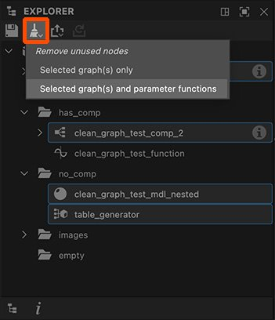

# 탐색기

이 페이지에서는 [Substance 3D Designer](https://www.adobe.com/kr/products/substance3d-designer.html)의 탐색기 도크에 대해 설명합니다. 이 도크를 사용하여 패키지 및 리소스를 관리할 수 있습니다.

<table>
<tr style="border: 0;">
<td style="border: 0;" valign="top">

## 개요

탐색기 도크는 현재 Substance 3D Designer에서 열려 있는 파일 및 리소스를 관리하는 곳입니다. 현재 열려 있는 모든 패키지의 목록이 표시되며 각 패키지는 [리소스](../../resources/resources.md)를 표시하도록 계층 구조로 확장됩니다.

Explorer를 사용하면 모든 종류의 리소스를 작성, 저장 및 내보낼 수 있으므로 프로젝트를 시작하고 종료할 수 있습니다.

</td>
<td style="border: 0;" valign="top">

</td>
</tr>
</table>

Explorer 도크를 통해 몇 가지 중요한 작업을 수행할 수 있습니다.

* 새 패키지 및 그래프 만들기
* 기존 패키지 로드
* 로드된 패키지 저장 및 닫기
* [리소스 가져오기 및 연결](../../resources/importing-linking-and-new/importing-linking-and-new-resources.md)
* [텍스처로 그래프 결과 내보내기](../../compositing-graphs/exporting-bitmaps/exporting-bitmaps.md)
* [Substance 3D 에셋(SBSAR)에 패키지 Publish](../../compositing-graphs/publishing-asset-files/publishing-substance-3d-asset-files-sbsar.md)
* [다른 Substance 3D 애플리케이션으로 패키지 보내기](send-to-interoperability/send-to-interoperability.md)
* [메시에서 지도 굽기](../../bakers/bakers.md)

## 상단 도구 모음

이 도구 모음을 사용하면 전체 워크플로우와 관련된 기능을 빠르게 수행할 수 있습니다. 모든 단추는 *컨텍스트 인식*&#x200B;입니다. 즉, 이 단추는 탐색기에서 현재 선택한 항목에 따라 동작을 활성화하고 변경합니다.

선택한 패키지를  <b>저장</b>합니다.

선택한  <b>Publish 또는 [보내기](../../interface/the-explorer-window/send-to-interoperability/send-to-interoperability.md)</b>:

* [Substance 3D 에셋(SBSAR)으로 선택한 모든 패키지 Publish](../../compositing-graphs/publishing-asset-files/publishing-substance-3d-asset-files-sbsar.md);
* 선택한 패키지를 [Substance 3D Sampler](https://www.adobe.com/kr/products/substance3d-sampler.html), [Substance 3D Painter](https://www.adobe.com/kr/products/substance3d-painter.html) 또는 [Substance 3D Stager](https://www.adobe.com/kr/products/substance3d-stager.html)로 보냅니다.

 <b>Publish 또는 이전으로 보내기:</b> Publish 또는 이전과 동일한 설정으로 선택한 요소를 보냅니다. 이 옵션은 *현재* 세션에서 *적어도 한 번* 게시된 패키지에서만 사용할 수 있습니다.

선택한 그래프에서  <b>사용하지 않는 노드 제거</b>. 도구는 다음 규칙을 따릅니다.

* 선택한 항목이 *같은 유형*&#x200B;인 경우에만 도구를 사용할 수 있습니다. 그래프, 폴더 또는 패키지만 사용할 수 있습니다.
* 선택 항목에 폴더 또는 패키지가 포함되어 있으면 도구에서 그 안의 모든 그래프를 *재귀적으로* 정리합니다.
* 대상 그래프 중 하나가 [Substance 그래프](../../compositing-graphs/substance-compositing-graphs.md)인 경우, 해당 그래프의 노드에서 모든 매개 변수 함수를 정리하는 두 번째 옵션을 사용할 수 있습니다.

[그래프 보기](../../interface/the-graph-view/the-graph-view.md) 페이지의 &#39;사용하지 않는 노드 제거&#39; 섹션에서 도구에 대해 자세히 알아보십시오.

<table>
<tr style="border: 0;">
<td style="border: 0;" valign="top">

*Publish/보내기*

</td>
<td style="border: 0;" valign="top">

*사용하지 않는 노드 제거*

</td>
</tr>
</table>

## 컨텍스트 메뉴

대부분의 탐색기와의 상호 작용은 컨텍스트 메뉴를 통해 이루어지며, 이 메뉴는 탐색기의 트리 보기에서 항목에 RMB를 클릭하여 표시됩니다.

사용 가능한 옵션은 선택한 항목과 클릭한 항목에 따라 다릅니다.

+++빈 공간

빈 공간은 현재 열려 있는 모든 패키지 아래에서만 사용할 수 있습니다. 기존 항목 옆의 클릭은 빈 공간으로 간주되지 않습니다.

<b>새 패키지</b>: 새 빈 패키지를 만듭니다.

<b>패키지 열기</b>: SBS 파일을 열 수 있는 파일 대화 상자를 엽니다.

+++

+++패키지

<b>새로운 </b>에서는 콘텐츠를 정렬하기 위한 *폴더*&#x200B;뿐만 아니라 새 그래프([Substance 그래프](../../compositing-graphs/substance-compositing-graphs.md), [비트맵](../../resources/bitmap-resource/bitmap-resource.md) 및 [벡터 그래픽](../../resources/vector-graphics-svg-res/vector-graphics-svg-resource.md) 리소스)를 만들 수 있습니다

<b>가져오기</b> 및 <b>링크 </b>에서는 [리소스](../../resources/importing-linking-and-new/importing-linking-and-new-resources.md)를 가져올 수 있습니다.

<b>다시 불러오기</b>, <b>저장, 다른 이름으로 저장</b> 및<b> 다른 이름으로 사본 저장</b>을 사용하면 디스크에 저장하거나 이전에 저장한 버전의 패키지를 디스크에서 다시 불러올 수 있습니다.

<b>Publish .sbsar 파일</b> 및<b> .sbsar 파일을 다시 게시</b>하면 최적화되지 않은 컴파일되지 않은 Substance 그래프를 다른 Substance 응용 프로그램 및 통합에서 효율적이고 휴대성이 좋은 SBSAR 파일로 [게시](../../compositing-graphs/publishing-asset-files/publishing-substance-3d-asset-files-sbsar.md)할 수 있습니다. 이전 버전으로서의 Publish은 동일한 옵션으로 이전 Publish 작업을 반복하므로 더 빠르게 반복할 수 있도록 옵션 대화 상자를 건너뜁니다. 도구 모음에는 동일한 기능을 가진 단추가 포함되어 있습니다.

<b>종속성이 있는 내보내기</b>는 저장 및 게시와 다릅니다. SBS 파일을 가져와 참조된 모든 리소스와 종속성을 수집하고 독립형 패키지를 만듭니다. 대화 상자에서 수집할 라이브러리 및 파일이 압축 아카이브(7-zip)여야 하는지 여부를 선택할 수 있습니다. 종속성 누락에 대한 걱정 없이 다른 사용자와 SBS 파일을 공유할 때 적합한 선택입니다.

<b>보내기..</b>에서 하위 메뉴를 열어 패키지를 [Substance 3D Sampler](https://www.adobe.com/kr/products/substance3d-sampler.html), [Substance 3D Painter](https://www.adobe.com/kr/products/substance3d-painter.html), [Substance 3D Stager](https://www.adobe.com/kr/products/substance3d-stager.html) 또는 [Substance Player](https://helpx.adobe.com/substance-3d-player/home.html)에게 직접 [보내기](send-to-interoperability/send-to-interoperability.md)할 수 있습니다.

<b>복사</b>는 선택한 패키지를 복사합니다.

<b>붙여넣기</b>를 사용하면 복사된 그래프 및/또는 리소스를 *선택한 패키지에 붙여넣습니다*.

<b>패키지 닫기</b>는 선택한 모든 패키지를 닫습니다.

<b>출력 계산</b>을 사용하면 Designer에서 패키지에 있는 모든 그래프의 모든 출력을 계산합니다.

<b>탐색기에 표시...</b> OS의 파일 탐색기 창에서 패키지 위치를 엽니다.

<b>종속성 관리자</b>에서 선택한 패키지에 대한 종속성 관리자 창을 엽니다.

<b>종속성 열기</b>는 탐색기에서 모든 종속성을 엽니다(*[Substance 그래프](../../compositing-graphs/substance-compositing-graphs.md)만*).

+++

+++Substance 그래프

<b>열기:</b>(반환) [그래프 보기](../../interface/the-graph-view/the-graph-view.md)에서 이 그래프를 엽니다.

<b>복사:</b> *(Ctrl-C)* 현재 그래프를 클립보드에 복사합니다.

<b>제거:</b>(삭제) 이 패키지에서 그래프를 삭제합니다.

<b>이름 바꾸기:</b>(F2) 이 그래프의 이름을 바꿉니다.

<b>3D 보기에서 출력 보기:</b> 이 그래프의 출력을 자료로 표시하기 위해 [3D 보기](../../interface/3d-view/3d-view.md)로 보냅니다.

<b>출력 계산:</b> 이 그래프의 출력을 계산하고 메모리에 유지합니다.

<b>출력 내보내기...:</b> [비트맵으로 내보내기](../../compositing-graphs/exporting-bitmaps/exporting-bitmaps.md)를 위한 대화 상자를 엽니다.

+++

+++3D 장면 리소스

<b>열기:</b>(반환) [3D 보기](../../interface/3d-view/3d-view.md)에서 이 3D 메시를 사용하여 표준 육면체 또는 평면을 대체합니다.

<b>복사:</b>(Ctrl-C) 이 리소스를 클립보드에 복사합니다.

<b>붙여넣기:</b>(Ctrl-V) 클립보드에서 리소스를 붙여넣습니다.

<b>제거:</b>(Del) 이 패키지에서 리소스를 삭제합니다.

<b>이름 바꾸기:</b> (F2) 이 리소스의 이름을 바꿉니다.

<b>다시 로드:</b> 디스크에서 이 메시를 강제로 다시 로드합니다.

<b>탐색기에 표시:</b> 디스크의 리소스 위치에서 시스템 파일 브라우저 창을 엽니다.

<b>재배치:</b> 다른 파일에 연결되도록 이 리소스를 변경합니다.

<b>베이킹 모델 정보...:</b> [베이킹 대화 상자를 엽니다.](../../bakers/bakers.md)

+++

+++폴더

<b>새로 만들기:</b> 폴더에서 콘텐츠를 정렬하기 위한 *폴더*&#x200B;뿐만 아니라 새 그래프([Substance 그래프](../../compositing-graphs/substance-compositing-graphs.md), [Substance 함수 그래프](../../function-graphs/function-graphs.md), [비트맵](../../resources/bitmap-resource/bitmap-resource.md) 및 [벡터 그래픽](../../resources/vector-graphics-svg-res/vector-graphics-svg-resource.md))를 만들 수 있습니다.

<b>가져오기</b> 및 <b>링크: </b>[리소스](../../resources/importing-linking-and-new/importing-linking-and-new-resources.md)를 가져와 폴더에 배치할 수 있습니다.

<b>복사:</b>(Ctrl-C) 폴더와 해당 폴더 내용을 클립보드에 복사합니다.

<b>붙여넣기:</b>(Ctrl-V) 폴더와 클립보드의 모든 내용을 붙여넣습니다.

<b>이름 바꾸기:</b>(F2) 이 폴더의 이름을 바꿉니다.

<b>제거:</b> *(Del)* 패키지에서 폴더와 해당 폴더의 모든 콘텐츠를 삭제합니다.

<b>출력 계산:</b> 폴더에 포함된 모든 그래프의 출력을 계산하고 메모리에 유지합니다.

+++

## 아래쪽 도구 모음

Explorer 도크 하단에 있는 도구 모음에서는 패키지 또는 패키지 리소스에 대한 정보를 제공합니다.

<b> 종속성:</b> 패키지를 선택하면 해당 패키지 종속성이 전용 패널에 나열됩니다.

<b> 정보:</b> 현재 선택한 패키지 또는 리소스와 관련된 메타데이터를 제공합니다.

* 패키지: 패키지의 전체 파일 경로
* [비트맵 리소스](../../resources/bitmap-resource/bitmap-resource.md): 리소스의 전체 파일 경로, 해당 [ICC 프로필](../../color-management/color-management.md), 이미지 크기 및 [가져오기 방법](../../resources/importing-linking-and-new/importing-linking-and-new-resources.md)(예: *연결* 또는 *가져오기*)

<table>
<tr style="border: 0;">
<td style="border: 0;" valign="top">

*종속성*

</td>
<td style="border: 0;" valign="top">

*정보*

</td>
</tr>
</table>
