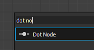
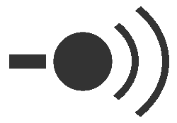

# 점 노드(포털도 포함)

<table>
<tr style="border: 0;">
<td width="25.00%" style="border: 0;" valign="top">

</td>
<td width="100.00%" style="border: 0;" valign="top">

<b>점</b> 노드는 연결을 다시 라우팅하고 그룹화하여 그래프를 단순화하고 정리할 수 있는 도우미입니다. 이 옵션은 특히 다른 연결이나 노드에서 실행되는 긴 연결이 많은 그래프에 유용합니다.

점 노드 쌍을 <b>포털</b>(으)로 사용하여 장거리 또는 연결을 라우팅하기 어려운 위치에서 연결을 숨길 수 있습니다.

</td>
</tr>
</table>

## 점 노드 만들기

점 노드는 다음 방법 중 하나를 사용하여 그래프 유형에 추가할 수 있습니다.

+++링크에 삽입
<b>Alt</b> 키를 누른 상태에서 연결을 마우스로 가리키면 점 노드 미리 보기가 표시됩니다. 그런 다음 LMB를 클릭하여 해당 위치의 연결에 점 노드를 추가합니다.

{width="512px"}

+++

+++노드 커넥터
노드 커넥터에서 새 연결을 드래그하는 동안 <b>Alt</b> 키를 눌러 해당 위치에 점 노드를 삽입합니다.

계속해서 새 연결을 드래그하고 작업을 반복하여 원하는 방식으로 해당 연결을 라우팅할 수 있습니다.

+++

+++노드 메뉴
<b>스페이스바</b>를 눌러 <b>노드 메뉴</b>를 표시한 다음 &#39;점&#39; 항목을 선택하거나 검색 필드에 &#39;점&#39;을 입력하여 항목을 표시하고 더 빠르게 찾습니다.

+++

>[!TIP]
>
> 점 노드가 만들어지면 &#39;Name&#39; 속성에 자동으로 포커스가 할당되므로 노드 이름을 즉시 편집할 수 있습니다.

<table>
<tr style="border: 0;">
<td style="border: 0;" valign="top">

## 링크 병합

Alt 키를 누르고 여러 노드 연결을 병합하려면 점 노드를 링크 위로 이동합니다.

</td>
<td style="border: 0;" valign="top">

{width="512px"}

</td>
</tr>
</table>

## 포털

<table>
<tr style="border: 0;">
<td width="16.67%" style="border: 0;" valign="top">

</td>
<td width="100.00%" style="border: 0;" valign="top">

가독성을 떨어뜨리는 번거로운 긴 링크가 없어도 그래프에서 장거리에 걸쳐 데이터를 전송하기 위해 점 노드를 <b>포털</b>(으)로 사용할 수 있습니다. 이렇게 하면 점 노드 사이의 연결이 효과적으로 숨겨집니다.

</td>
</tr>
</table>

### 포털 생성 중

송신기 점 노드의 이름이 지정되면 송신기와 수신기인 두 점 노드 사이에 포털이 자동으로 생성됩니다. 점 노드 이름은 해당 <b>이름</b> 속성에서 고유 식별자를 설정하여 지정합니다.

그래프에 이름이 지정된 점 노드가 하나 이상 있으면 다음을 통해 점 노드를 수신기로 연결할 수 있습니다.

* 수신기의 입력과 송신기의 출력 사이에 링크를 생성하는 행위
* 수신기의 <b>입력 포털</b> 속성에서 전송기의 이름을 선택합니다.

수신기를 복제하거나 복사하면 송신기에 대한 연결이 포털로 유지됩니다.

### 포털 식별 중

포털로 사용되는 점 노드에는 포털로 사용되는 커넥터 옆에 무선 신호 아이콘이 배치됩니다.

포털로 사용된 점 노드를 선택하면 다른 포털에 대한 숨겨진 연결이 점선으로 표시됩니다.

### 포털 삭제 중

전송자의 <b>이름</b>이 지워지거나 숨겨진 연결이 다음에 의해 삭제되면 포털이 삭제됩니다.

* 포털을 선택한 다음 숨겨진 연결을 선택하고 삭제합니다.
* 수신기를 선택하고 [속성]의 <b>입력 포털</b> 드롭다운 옆에 있는 <b>X</b> 단추를 누릅니다.

>[!IMPORTANT]
>
> [FX-맵 그래프](../../../../function-graphs/fxmaps/fxmaps.md)에서는 점 노드를 포털로 사용할 수 없습니다.

점 노드를 포털로 사용하는 방법에 대한 이 튜토리얼을 살펴보십시오.
