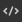
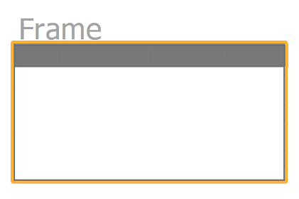

# 프레임

<table>
<tr style="border: 0;">
<td width="25.00%" style="border: 0;" valign="top">


</td>
<td width="100.00%" style="border: 0;" valign="top">

프레임을 사용하면 해당 그래프에서 개체를 시각적으로 그룹화하고 모든 개체를 함께 쉽게 이동할 수 있으므로 그래프의 가독성과 레이아웃이 쉬워집니다.

예를 들어 프레임을 명명하고 채색해 그래프 구조를 간략하게 살펴볼 때 그래프 구조가 선명하게 드러나도록 할 수 있어 그래프의 복잡도가 높아질수록 큰 도움이 된다.

또한 주석을 달 수 있으므로 일부 노드가 특정 방식으로 설정된 이유를 설명하는 문서 툴의 역할을 합니다.

</td>
</tr>
</table>

## 모양

마우스 커서의 위치나 선택 영역의 일부인지 여부에 따라 프레임은 상호 작용할 수 있는지 여부와 방법을 알 수 있도록 다양한 시각적 스타일로 표시됩니다.

+++기본값
기본적으로 프레임은 <b>프레임 색상</b> 속성에서 선택한 색상으로 채워진 둥근 모서리가 있는 사각형입니다. 해당 색상의 어두운 음영이 프레임 윤곽선에 적용됩니다.

<b>제목</b> 속성에 설정된 제목은 프레임의 왼쪽 위 모서리에 회색으로 표시됩니다.

")


+++

+++헤더 호버
프레임 위쪽으로 마우스 커서를 가져가면 머리글 표시줄이 표시됩니다.

헤더 바 또는 제목을 드래그하여 프레임 이동

")


+++

+++선택됨
이 옵션을 선택하면 프레임의 제목과 윤곽선이 흰색으로 강조 표시됩니다. 윤곽선이 더 두꺼워집니다.

")


+++

## 프레임 만들기

프레임은 다음과 같은 방법으로 모든 그래프 유형으로 추가할 수 있습니다.

+++노드 메뉴
그래프 보기에서 <b>스페이스바</b>를 눌러 <b>노드 메뉴</b>를 열고 목록에서 &#39;프레임&#39; 항목을 선택합니다.

검색 필드에 &#39;프레임&#39;를 입력하여 항목을 표시하고 항목을 더 빠르게 찾습니다.

+++

+++단축키
키보드 단축키가 [환경 설정](../../../../interface/preferences-window/preferences-window.md)의 &#39;프레임&#39; 항목에 매핑되어 있으면 그래프 보기에 포커스가 있을 때 해당 단축키를 누릅니다.

+++

+++상황별 메뉴
그래프 보기에서 개체 또는 빈 공간에 있는 <b>RMB</b>을 누르고 <b>프레임 추가</b> 옵션을 선택합니다.

+++

+++그래프 도구 모음
[그래프 보기] 도구 모음의 <b>노드 팔레트</b>에서 &#39;프레임&#39; 단추를 클릭합니다.

+++

+++라이브러리
라이브러리에서 <b>그래프 항목</b> 범주를 선택한 다음 &#39;프레임&#39; 항목을 그래프 보기로 끌어 놓습니다.

+++

### 선택 영역 프레임 지정

프레임을 만들 때 그래프에서 선택 영역이 활성화되면 선택한 개체를 완전히 포함하도록 해당 프레임이 자동으로 조정됩니다.

이러한 점을 고려하면 키보드 단축키를 사용하여 프레임을 만들면 그래프 프레임이 더욱 빨라집니다.

{width="480px"}

>[!TIP]
>
> 프레임이 만들어지면 &#39;제목&#39; 속성에 자동으로 포커스가 추가되므로 프레임의 제목을 즉시 편집할 수 있습니다.

## 프레임 조작

<table>
<tr style="border: 0;">
<td style="border: 0;" valign="top">

프레임의 제목 또는 상단 표시줄을 드래그하여 <b>패닝</b>하고 테두리 또는 모퉁이를 드래그하여 <b>크기 조정</b>할 수 있습니다.

이 그림은 패닝(파랑) 및 크기 조정(노랑)을 위한 인터랙션 영역을 강조합니다.

</td>
<td style="border: 0;" valign="top">


</td>
</tr>
</table>

<table>
<tr style="border: 0;">
<td style="border: 0;" valign="top">

### 격자 물리기

기본적으로 프레임은 이동하거나 크기를 조정할 때 중간 격자에 물립니다.

<b>Ctrl</b>(Windows)/<b>Cmd</b>(macOS) 키를 누른 상태로 스냅을 작은 격자로 이동하여 더 세밀하게 조정합니다.

</td>
<td style="border: 0;" valign="top">


</td>
</tr>
</table>

## 속성

프레임을 선택하면 [속성](../../../../interface/properties/properties.md) 도크에서 다음 속성을 사용할 수 있습니다.

+++제목
프레임 왼쪽 위에 있는 <b>제목</b>입니다. <b>제목 표시</b> 속성을 사용하여 제목의 표시 여부를 설정하거나 해제할 수 있습니다.

제목의 크기는 최소 화면 크기로 잠글 수 있으므로 그래프를 축소해도 읽을 수 있습니다. 이 작업은 [그래프 보기](../../../../interface/the-graph-view/the-graph-view.md) 도구 모음의 <b>정보</b> 드롭다운에서 &#39;프레임 제목&#39; 옵션을 선택하여 수행할 수 있습니다.

{width="640px"}


+++

+++설명
<b>설명</b>은(는) 프레임 콘텐츠에 주석을 달 수 있는 선택적 추가 텍스트입니다.

HTML 태그를 사용하여 텍스트 서식을 지정할 수 있습니다. 이 서식은  <b>HTML 태그</b> 단추를 클릭하여 전환할 수 있습니다.

아래의 설명 섹션에서 자세히 알아보십시오.

{width="640px"}


+++

+++색상
그래프 보기의 프레임을 채우는 데 <b>프레임 색상</b>이 사용됩니다. 색상 피커를 사용하여 색상을 선택합니다.

색상의 알파 채널은 프레임의 *불투명도*&#x200B;를 제어합니다. 값이 0이면 프레임이 완전히 투명해집니다.

{width="640px"}


+++

## 설명

프레임 안쪽에 텍스트를 추가하여 프레임에 주석을 달 수 있습니다. 텍스트가 왼쪽에 정렬되고 프레임의 왼쪽 위 모퉁이에서 시작됩니다. 프레임의 [설명](#properties) 속성을 사용하여 해당 텍스트를 편집합니다.

<table>
<tr style="border: 0;">
<td style="border: 0;" valign="top">

### 표준

<b>제목</b>은 프레임의 왼쪽 위에 굵은 글꼴로 표시됩니다. 제목의 가시성을 켜거나 끌 수 있습니다.

최소 화면 크기에서 크기를 잠글 수 있으므로 그래프를 축소해도 읽을 수 있습니다. 이 작업은 [그래프 보기](../../../../interface/the-graph-view/the-graph-view.md) 도구 모음의 <b>정보</b> 드롭다운에서 &#39;프레임 제목&#39; 옵션을 선택하여 수행할 수 있습니다.

</td>
<td style="border: 0;" valign="top">

"){zoomable="yes"}

</td>
</tr>
</table>

<table>
<tr style="border: 0;">
<td style="border: 0;" valign="top">

### HTML 서식

프레임의 <b>설명</b> 속성에서 HTML 태그를 사용하여 텍스트 서식을 지정할 수 있습니다. 동일한 속성에서  <b>HTML 태그</b> 단추를 사용하여 서식을 사용하도록 설정해야 합니다.

</td>
<td style="border: 0;" valign="top">

"){zoomable="yes"}

</td>
</tr>
</table>

이 샘플을 복사하여 프레임의 설명 속성에 붙여넣어 이 기능을 직접 테스트할 수 있습니다.

```
<h2>HTML formatting</h2>

<p>This is a description formatted using <b>HTML markup</b>.</p>

<p>Formattig text makes it more <i>pleasant</i>, <font color="#CC8822">impactful</font> and <code>clearly structured</code> for users.</p>

<p>  Images are also supported! <sup>How nice!</sup></p>
```


텍스트 서식을 지정하는 데 유용한 태그 목록은 다음과 같습니다.

+++HTML 서식 태그

|  |  |
| --- | --- |
| 굵게 | &lt;b>...&lt;/b> |
| 이탤릭체 | &lt;i>...&lt;/i> |
| 색상 | &lt;font color=&quot;#4A567C&quot;>...&lt;/font> |
| 단락 | &lt;p>...&lt;/p> |
| 줄바꿈 | &lt;br> |
| 머리글 | &lt;h1>...&lt;/h1>, &lt;h2>...&lt;/h2> 등 |
| 이미지 | &lt;img src=&quot;{path\_to\_image}&quot;> |
| 위 첨자 | &lt;sub>...&lt;/sub> |
| 비순차 목록(글머리 기호) | &lt;ul> &lt;li>...&lt;/li> &lt;li>...&lt;/li> &lt;/ul> |
| 정렬된 목록(숫자) | &lt;ol> &lt;li>...&lt;/li> &lt;li>...&lt;/li> &lt;/ol> |
| 코드 | &lt;code>...&lt;/code> |


+++

## 포함 규칙

포함 규칙을 충족하는 오브젝트는 프레임에 포함된 것으로 간주됩니다. 이러한 규칙은 대상과 특별한 경우에 따라 달라진다. 아래에 나열되어 있습니다.

각 그림의 노란색 기호는 개체가 해당 프레임에 포함될 수 있도록 프레임의 경계 내에 완전히 포함시켜야 하는 점 또는 영역을 나타냅니다.

+++노드
<b>중심점</b>이 사용되었습니다.

노드 아래에 표시된 배지, 커넥터 및 정보는 모두 무시됩니다.

노드는 입력 또는 출력 커넥터의 수에 따라 다른 Height으로 구성될 수 있다.

커넥터가 표시되거나 숨겨지거나 추가되거나 제거되면 노드의 Height이 *center*&#x200B;에서 조정됩니다.

따라서 노드의 중심점 위치는 *의도적으로 이동*&#x200B;될 때까지 변경하면 안 됩니다.


*호스트* 노드의 <b>c</b><b>진입점</b>이(가) 사용되었습니다.

호스트 노드는 노드가 도킹되는 노드입니다.

여러 노드가 체인에 도킹되면 마지막으로 도킹된 노드의 호스트 노드가 전체 체인에 사용됩니다.

노드 아래에 표시된 배지, 커넥터 및 정보는 모두 무시됩니다.


+++

+++점 노드
점의 <b>중심점</b>이(가) 사용됩니다.

커넥터, 포털 아이콘 및 이름이 모두 무시됩니다.


+++

+++주석
주석의 *테두리 상자*(노란색 윤곽선)의 <b>중심점</b>이(가) 사용됩니다.

상위 주석은 주석의 포함 규칙을 따르지 않습니다.

대신 *부모* 노드의 <b>중심점</b>이 사용됩니다.

노드 아래에 표시된 배지, 커넥터 및 정보는 모두 무시됩니다.


+++

+++핀
핀 아이콘의 <b>팁</b>이(가) 사용되었습니다.


+++

+++프레임
중첩 프레임의 <b>테두리 상자</b>이(가) 사용됩니다.

즉, 중첩된 프레임은 다른 프레임의 경계 내에 완전히 있어야 후자에 포함될 수 있습니다.

제목이 무시됩니다.




+++

## 콘텐츠에 크기 맞추기


그래프를 조정할 때 프레임이 더 이상 내용에 맞게 조정되지 않을 수 있습니다. 이 경우 중간 격자 셀 1개의 패딩으로 프레임의 위치와 크기를 그 내용에 맞게 자동 조절하는 것이 가능하다.

이렇게 하려면 프레임의 제목 또는 상단 표시줄에서 <b>RMB</b>을(를) 클릭하고([모양](#appearance) 참조) 컨텍스트 메뉴에서 <b>콘텐츠에 크기 맞추기</b> 옵션 선택).

>[!NOTE]
>
> 이 옵션은 최소 *하나* 그래프 개체가 프레임의 [포함 규칙](../../../../interface/the-graph-view/graph-items/frame/frame.md)을 충족하는 경우 사용할 수 있습니다.

<table>
<tr style="border: 0;">
<td style="border: 0;" valign="top">

### 설명 텍스트에 맞추기

프레임에 설명이 있는 경우 가능한 경우 설명 옆에 있는 빈 공간을 사용하도록 조정됩니다.

해당 공간에 포함할 수 있는 개체가 없으면 프레임 Height이 설명을 수용하도록 더 조정됩니다.

</td>
<td style="border: 0;" valign="top">

")

</td>
</tr>
</table>

+++예
에 크기 맞추기"){width="640px"}


+++

## 자동 확장


그래프가 커지면 프레임의 내용을 다시 정렬해야 할 수 있습니다. 노드들은 추가들을 위한 공간을 만들기 위해 시프트될 수 있거나 콘텐츠는 가독성을 증진하기 위해 더 멀리 이격될 필요가 있을 수 있다.

이러한 조정을 용이하게 하기 위해 [포함된 개체](#inclusion-rules)를 이동할 때 프레임을 자동으로 확장할 수 있습니다. 개체를 이동하는 동안 임의의 지점에서 <b>Shift</b>를 길게 누르면 프레임 테두리가 자동으로 조정되어 해당 개체를 테두리 내에 유지합니다.

이는 여러 객체를 포함할 수 있는 선택 영역에도 적용됩니다. 이 경우 각 객체의 호스트 프레임이 동시에 조정됩니다.

개체가 프레임의 테두리로 완전히 둘러싸여 있지 않지만 [포함 규칙](#inclusion-rules)을 만족하는 경우, <b>Shift</b> 키를 누르자마자 프레임이 중간 격자 셀 한 개의 추가 패딩으로 완전히 둘러싸여 있도록 조정됩니다.

>[!NOTE]
>
> 이동 중 임의의 시점에서 <b>Shift</b> 키를 누르거나 놓아 프레임의 자동 조정을 트리거하거나 취소할 수 있지만, 이동을 완료할 때 *반드시*&#x200B;해야 조정을 효과적으로 적용할 수 있습니다.

+++예
"){width="640px"}


+++
