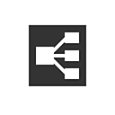

# 그래프 항목

그래프 항목은 그래프를 구성하고, 가독성을 높이고, 그래프 전체를 빠르게 탐색하는 데 도움이 되는 특수 개체입니다.

<table>
<tr style="border: 0;">
<td style="border: 0;" valign="top">

[{width="128px"}](../../../interface/the-graph-view/graph-items/dot-node/dot-node.md)

## 점 노드(포털도 포함)

</td>
<td style="border: 0;" valign="top">

[{width="128px"}](../../../interface/the-graph-view/graph-items/frame/frame.md)

## 프레임

</td>
</tr>
</table>

<table>
<tr style="border: 0;">
<td style="border: 0;" valign="top">

연결을 경로재설정하고 병합하거나 다른 수신기 Dot 노드로 전송합니다.

</td>
<td style="border: 0;" valign="top">

레이블 및 색상 코딩을 사용하여 노드를 그룹화한 다음 쉽게 이동할 수 있습니다.

</td>
</tr>
</table>

<table>
<tr style="border: 0;">
<td style="border: 0;" valign="top">

[{width="128px"}](../../../interface/the-graph-view/graph-items/comment/comment.md)

## 주석

</td>
<td style="border: 0;" valign="top">

[{width="128px"}](../../../interface/the-graph-view/graph-items/navigation-pin/navigation-pin.md)

## 고정

</td>
</tr>
</table>

<table>
<tr style="border: 0;">
<td style="border: 0;" valign="top">

그래프에 주석을 추가합니다.

</td>
<td style="border: 0;" valign="top">

그래프에서 관심 지점을 표시한 다음 빠르게 해당 지점으로 이동합니다.

</td>
</tr>
</table>
