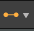

# 링크 생성 모드

[Substance 그래프](../../../compositing-graphs/substance-compositing-graphs.md)에서 다음 3가지 <b>링크 생성 모드</b> 중 하나를 사용하여 노드를 연결할 수 있습니다.

<table>
<tr style="border: 0;">
<td style="border: 0;" valign="top">

{zoomable="yes"}

*확대하려면 클릭*

<b> 표준</b> (1)

조건이 적용되지 않습니다.

</td>
<td style="border: 0;" valign="top">

{zoomable="yes"}

*확대하려면 클릭*

 <b>재질</b> (2)

입력과 출력은 사용량에 따라 일치합니다.

둘 중 하나만 사용이 있는 경우 표준 모드에서와 같이 연결이 수행됩니다.

</td>
<td style="border: 0;" valign="top">

{zoomable="yes"}

*확대하려면 클릭*

 <b>컴팩트 재질</b> (3)

재질과 동일합니다.

동일한 *그룹*&#x200B;에 속한 입력과 출력이 축소되었습니다.

</td>
</tr>
</table>

그래프 도구 모음에서  <b>링크 만들기 모드</b> 버튼을 클릭하거나 위에 나열된 키보드 단축키를 사용하여 언제든지 모드 간에 전환할 수 있습니다.

<b>재질</b> 및 <b>압축 재질</b> 모드에서는 *일치하지 않는 사용*&#x200B;을 사용하는 입력과 출력 간의 연결이 금지됩니다.

## 모드

|  | 

 표준 | 

 압축 | 

 컴팩트 재질 |
| --- | --- | --- | --- |
| <b>입력</b> | 모든 입력이 표시됩니다. | 모든 입력이 표시됩니다. | 그룹당 입력 1개만 |
| <b>출력</b> | 모든 출력이 표시됩니다 | 모든 출력이 표시됩니다 | 그룹당 1개의 출력만 |
| <b>링크</b> | 모든 링크가 표시됩니다. | 모든 링크가 표시됩니다. | 그룹당 링크 1개(녹색) |
| <b>연결</b> | 링크를 하나씩 연결합니다. | 일치하는 사용을 기반으로 여러 링크를 다중 링크 재질 그룹으로 연결합니다.   한쪽 끝에 용도가 있으면 연결은 표준 연결입니다. | 단일 링크 재질 그룹으로 링크를 함께 연결합니다. |

## 그룹 할당

<table>
<tr style="border: 0;">
<td width="100.00%" style="border: 0;" valign="top">

<b>재질</b> 및 <b>압축 재질</b> 모드를 사용하려면 그래프의 <b>입력</b> 및 <b>출력</b> 노드에 그룹을 할당해야 합니다.

<b>그룹</b> 속성에 그룹 이름을 입력하여 노드의 <b>특성</b> 매개 변수에 그룹을 할당합니다. 그룹은 임의의 문자열 값이 될 수 있으며, 대/소문자를 구분하는 *정확히 동일한* 그룹 이름을 공유하는 경우 링크가 그룹화됩니다.

그래프의 그룹화된 입력 및 출력은 해당 그래프를 참조하는 노드 인스턴스에서 *어두운 캡슐에 둘러싸인 형태*&#x200B;로 시각적으로 표시됩니다.

</td>
<td width="25.00%" style="border: 0;" valign="top">

{zoomable="yes"}

</td>
</tr>
</table>

<table>
<tr style="border: 0;">
<td width="25.00%" style="border: 0;" valign="top">

</td>
<td width="100.00%" style="border: 0;" valign="top">

{zoomable="yes"}

*확대하려면 클릭*

</td>
<td width="25.00%" style="border: 0;" valign="top">

</td>
</tr>
</table>

## 사용량과 링크 일치

링크를 그룹화하면 개별 입력을 출력과 일치시켜야 합니다. 이 작업은 <b>입력</b> 및 <b>출력</b> 노드의 <b>사용량</b> 특성을 통해 수행됩니다. 입력 및 출력 *일치* 사이의 사용인 경우 링크가 만들어집니다. 일치하는 사용이 없으면 링크가 만들어지지 않습니다.

<table>
<tr style="border: 0;">
<td width="25.00%" style="border: 0;" valign="top">

</td>
<td width="100.00%" style="border: 0;" valign="top">

{zoomable="yes"}

*확대하려면 클릭*

</td>
<td width="25.00%" style="border: 0;" valign="top">

</td>
</tr>
</table>
