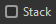
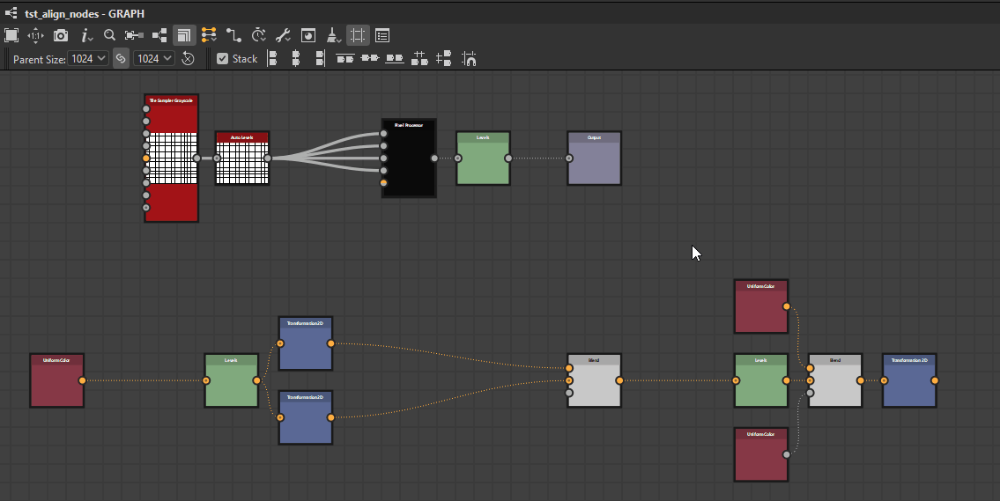
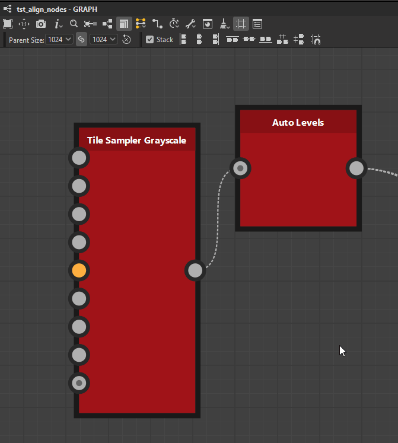

# 노드 정렬 도구

{zoomable="yes"}

노드 정렬 도구 를 사용하면 그래프를 통해 노드를 정렬하여 가독성과 작성 경험을 향상시킬 수 있습니다. 노드를 정렬하고 균일하게 분포하며 그리드에 스냅하는 작업을 제공합니다.

현재 선택된 <b>노드</b>에서만 작동합니다.

>[!NOTE]
>
> 바로 가기 키
> 
> 일부 작업에는 빠른 액세스를 위한 키보드 단축키 H, V 및 S가 있습니다. 아래 작업 목록에서 괄호 사이에 표시됩니다.
> 
> 이러한 항목은 [노드에 할당된 모든 키보드 단축키](../../../interface/preferences-window/preferences-window.md)를 재정의합니다.

## 정렬

노드는 가로와 세로로 정렬되며 각 축에 세 가지 모드가 있습니다.

### 수평 정렬

<b> 왼쪽:</b> 선택한 노드의 왼쪽을 맨 왼쪽 노드의 왼쪽에 맞춥니다.

<b> 가운데(H):</b> 선택한 노드의 가로 중심을 노드를 둘러싸는 테두리 상자의 가로 중심에 맞춥니다.

<b> 오른쪽:</b> 선택한 노드의 오른쪽을 가장 오른쪽 노드의 오른쪽에 맞춥니다.

<table>
<tr style="border: 0;">
<td style="border: 0;" valign="top">

{zoomable="yes"}

*왼쪽*

</td>
<td style="border: 0;" valign="top">

{zoomable="yes"}

*중앙*

</td>
<td style="border: 0;" valign="top">

{zoomable="yes"}

*오른쪽*

</td>
</tr>
</table>

### 세로 정렬

<b> 위쪽:</b> 선택한 노드의 위쪽을 최상위 노드의 위쪽에 맞춥니다.

<b> 가운데(V):</b> 선택한 노드의 세로 중심을 노드를 둘러싸는 테두리 상자의 세로 중심에 맞춥니다.

<b> 아래쪽:</b> 선택한 노드의 아래쪽을 가장 낮은 노드의 아래쪽에 맞춥니다.

<table>
<tr style="border: 0;">
<td style="border: 0;" valign="top">

{zoomable="yes"}

*상위*

</td>
<td style="border: 0;" valign="top">

{zoomable="yes"}

*중간*

</td>
<td style="border: 0;" valign="top">

{zoomable="yes"}

*아래쪽*

</td>
</tr>
</table>

### 스택

<b>스택 </b>옵션 을(를) 사용하면 정렬을 사용할 때 <b>겹치지 않게</b> 할 수 있습니다. 이 옵션은 기본적으로 활성화되어 있습니다.

활성화되면, 노드는 선택 영역의 다른 노드와 충돌할 때까지 가능한 한 참조 위치로 이동합니다. 이렇게 하면 각 노드 사이에 하나의 중간 격자 셀의 여백을 갖는 선택된 축에 이들을 효과적으로 적층한다.

{zoomable="yes"}

## 분포

원하는 축에서 현재 선택의 각 극단에서 노드들 사이에 균일하게 분배될 수 있다.

<b> 가로:</b> 노드는 선택 영역의 맨 왼쪽 노드와 맨 오른쪽 노드 사이에 고르게 분포됩니다.

<b> 세로:</b> 노드는 선택 영역의 최상위 노드와 최하위 노드 사이에 고르게 분포됩니다.

배포는 노드 크기에 관계없이 노드 간에 <b>균등 간격</b>을 목표로 합니다.

여러 노드가 선택한 축에서 중심을 완벽하게 정렬하면 해당 노드는 남아 있으며 분포에서 <b>하나</b>로 취급됩니다. 정렬된 노드 중 *가장 큰*&#x200B;은(는) 짝수 간격을 계산하는 데 사용됩니다.

선택한 노드의 전체 크기가 선택한 축에서 사용 가능한 공간보다 크면 겹침이 발생할 수 있습니다.

<table>
<tr style="border: 0;">
<td width="58.33%" style="border: 0;" valign="top">

{zoomable="yes"}

*가로*

</td>
<td width="100.00%" style="border: 0;" valign="top">

{zoomable="yes"}

*수직*

</td>
</tr>
</table>

<table>
<tr style="border: 0;">
<td width="58.33%" style="border: 0;" valign="top">

## 격자 물리기

<b>스냅(S) </b> 작업은 왼쪽 위 모서리가 중간 격자의 가장 가까운 점에 놓이도록 선택한 각 노드를 이동합니다.

</td>
<td width="100.00%" style="border: 0;" valign="top">

{zoomable="yes"}

</td>
</tr>
</table>
