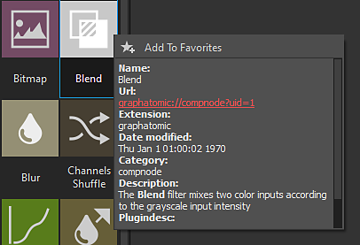
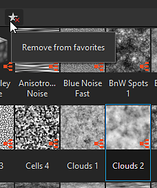

# 라이브러리

이 페이지에는 Substance 3D Designer의 **라이브러리** 패널, 해당 레이아웃 및 콘텐츠 검색 및 필터링을 위해 제공하는 도구가 표시됩니다.

## 개요

<b>라이브러리</b> 패널은 그래프에서 작업해야 하는 모든 *에셋*&#x200B;을 찾아 모을 수 있는 분할 보기 *리소스 관리자*&#x200B;입니다.

[프로젝트 설정](../../interface/preferences-window/project-settings/project-settings.md)에서 [라이브러리 감시 경로](https://docs.substance3d.com/display/SDDOC/Project+Settings#ProjectSettings-proj-libraryLibrary) 목록에 추가된 하드 드라이브 또는 네트워크를 통해 *폴더*&#x200B;를 모니터링합니다. 해당 폴더에서 발생하는 모든 변경 내용(콘텐츠 추가, 제거 및 업데이트)은 <b>라이브러리</b>로 *이월*&#x200B;됩니다.

>[!WARNING]
>
> **사용자 지정 콘텐츠 정보**
> 
> 사용자 지정 리소스가 **라이브러리**&#x200B;에 추가되지만 기존 범주에 대해 설정된 필터링 규칙 때문에 표시되지 않을 수 있습니다. 프로젝트 작업 중에 콘텐츠를 안정적으로 찾을 수 있도록 폴더를 통해 구성한 나만의 필터를 만드는 것이 좋습니다.\
> 자세한 내용은 설명서의 [사용자 지정 콘텐츠 및 필터 관리](./managing-custom-content/managing-custom-content-and-filters.md) 섹션을 참조하십시오.

**라이브러리**&#x200B;는 [리소스](../../resources/resources.md)에서 지원되는 모든 에셋을 모니터링할 수 있습니다.

* [Substance 패키지](../../getting-started/overview/overview.md)(SBS) 및 [Substance 아카이브](../../getting-started/overview/overview.md)(SBSAR)의 그래프
* [비트맵 이미지](../../resources/bitmap-resource/bitmap-resource.md)
* [벡터 이미지](../../resources/vector-graphics-svg-res/vector-graphics-svg-resource.md)
* [함수 그래프](../../function-graphs/function-graphs.md)
* [AxF 파일](../../resources/axf-appearance-exchange/axf-appearance-exchange-format.md)
* [글꼴](../../resources/font-resource/font-resource.md)
* [3D 장면](../../resources/3d-scene-resource/3d-scene-resource.md)

패널은 2개의 주요 부분으로 분할되어 있습니다 :

* 왼쪽의 **범주** 섹션
* 오른쪽의 **콘텐츠** 섹션

## 카테고리

<b>라이브러리 </b>패널 왼쪽에 있는 <b>범주</b> 섹션에는 모든 에셋 *범주*(예: 폴더) 및 *필터*&#x200B;가 트리 보기로 포함됩니다.\
이 트리 보기에서 항목을 클릭하면 *모든 하위 항목*&#x200B;의 내용과 함께 해당 내용이 표시됩니다.

### 범주

기본 범주 및 필터에는 Designer과 함께 제공되는 모든 에셋이 포함됩니다. 편집하거나 제거할 수 없습니다.\
기본 범주는 다음과 같습니다.

* 즐겨찾기: &#39;즐겨찾기&#39;로 플래그가 지정된 모든 에셋을 수집합니다.
* [그래프 항목](../../interface/the-graph-view/graph-items/graph-items.md): 그래프를 구성하기 위한 특수 개체를 나열합니다.
* [원자 노드](../../compositing-graphs/nodes-reference-for-com/atomic-nodes/atomic-nodes.md): [Substance 그래프](../../compositing-graphs/substance-compositing-graphs.md)에 대한 원자 노드를 나열합니다.
* [FX-Map 노드](../../function-graphs/fxmaps/fxmaps.md): [FX-Map](../../compositing-graphs/nodes-reference-for-com/atomic-nodes/fx-map/fx-map.md) 노드에서 계산한 그래프와 관련된 노드를 포함합니다.
* [함수 노드](../../function-graphs/nodes-reference-for-fun/atomic-function-nodes/atomic-function-nodes.md): [함수 그래프](../../function-graphs/function-graphs.md)에 대한 원자 노드를 나열합니다.
* [텍스처 생성기](../../compositing-graphs/nodes-reference-for-com/node-library/texture-generators/texture-generators.md): 콘텐츠를 자체적으로 생성하는 [Substance 그래프](../../compositing-graphs/substance-compositing-graphs.md)를 나타내는 노드를 포함합니다
* [필터](../../compositing-graphs/nodes-reference-for-com/node-library/filters/filters.md): 입력을 수정하는 [Substance 그래프](../../compositing-graphs/substance-compositing-graphs.md)를 나타내는 노드를 포함합니다.
* [스플라인 및 패스 도구](../../compositing-graphs/nodes-reference-for-com/node-library/spline-paths-tools/spline-paths-tools.md): [스플라인](../../compositing-graphs/nodes-reference-for-com/node-library/spline-paths-tools/spline-tools/spline-tools.md) 및 [패스](../../compositing-graphs/nodes-reference-for-com/node-library/spline-paths-tools/path-tools/path-tools.md) 노드의 카탈로그
* [SDF 함수](../../function-graphs/nodes-reference-for-fun/function-node-library/function-node-library.md#sdf-functions): [모양 스플래터 v2](../../compositing-graphs/nodes-reference-for-com/node-library/texture-generators/patterns/shape-splatter-v2/shape-splatter-v2.md) 및 [3D 뷰어](../../compositing-graphs/nodes-reference-for-com/node-library/filters/effects/3d-viewer/3d-viewer.md) 노드와 함께 사용할 3D SDF 함수를 작성하는 노드를 포함합니다.
* [함수](../../function-graphs/nodes-reference-for-fun/function-node-library/function-node-library.md): [함수 그래프](../../function-graphs/the-function-graph/the-function-graph.md)를 나타내는 노드를 포함합니다.
* [3D 보기](../3d-view/3d-view.md): 환경 맵 및 환경 맵 작성을 위한 노드와 같이 [3D 보기](../../interface/3d-view/3d-view.md)와 같이 3D 장면에서 이미지 기반 조명에 사용되는 맵과 관련된 콘텐츠를 제공합니다.
* PBR 재질: 자리 표시자로 사용하여 다른 노드, &#39;레시피&#39; 또는 사용자 정의 작업 영역 설정을 테스트할 수 있는 미리 만들어진 재질입니다. 제작 자료에 대해 알아보려면 전용 [자료 샘플](../../compositing-graphs/creating-compositing-gra/material-samples/material-samples.md)을 살펴보는 것이 좋습니다.
* [값](../../compositing-graphs/nodes-reference-for-com/node-library/values/constant.md): Substance 그래프에서 간단한 값을 생성하기 위한 노드입니다.

## 콘텐츠

<b>라이브러리</b>의 콘텐츠는 *레이블이 지정된 축소판*(으)로 표시됩니다. 이러한 축소판은 다음 요소에 따라 다른 측면이 있습니다.

* [SBS](../../getting-started/overview/overview.md) 및 [SBSAR](../../getting-started/overview/overview.md) 파일의 [Substance 그래프](../../compositing-graphs/substance-compositing-graphs.md)은 *첫 번째 출력*&#x200B;으로 표시되거나 그래프 작성자가 설정한 경우 *사용자 지정 아이콘*&#x200B;으로 표시됩니다
* [비트맵](../../resources/bitmap-resource/bitmap-resource.md) 및 [벡터 그래픽(SVG)](../../resources/vector-graphics-svg-res/vector-graphics-svg-resource.md)은 비트맵 자체의 *미니어처 렌더링*&#x200B;으로 표시됩니다
* [3D 장면](../../resources/3d-scene-resource/3d-scene-resource.md), [함수 그래프](../../function-graphs/the-function-graph/the-function-graph.md), [글꼴](../../resources/font-resource/font-resource.md) 및 [AxF](../../resources/axf-appearance-exchange/axf-appearance-exchange-format.md) 파일은 각 유형에 대해 *일반 아이콘*&#x200B;으로 표시됩니다

>[!WARNING]
>
> **축소판 문제의 경우**
> 
> 라이브러리 축소판(잘못된 이미지, 새로 고침 아이콘에서 렌더링이 중단된 경우 등)과 관련된 문제에 대한 권장 문제 해결 단계 은(는) *축소판 새로 고침*&#x200B;을 수동으로 트리거합니다.\
> 이렇게 하려면 [기본 설정 창](../../interface/preferences-window/preferences-window.md)의 [라이브러리](../../interface/preferences-window/preferences-window.md) 섹션에서 **축소판 다시 작성** 단추를 사용하십시오.

<table>
<tr style="border: 0;">
<td width="100.00%" style="border: 0;" valign="top">

### 라이브러리에서 에셋 사용

라이브러리에서 에셋을 사용하려면 원하는 위치로 *드래그 앤 드롭*&#x200B;하세요.\
항목을 클릭하는 동안 <b>Ctrl</b> 키를 눌러 <b>콘텐츠</b> 섹션에서 *여러* 항목을 선택할 수 있습니다. 이 경우 끌어서 놓기 작업을 수행하면 *전체 선택*&#x200B;에 대한 그래프에 노드가 배치됩니다.

</td>
<td width="41.67%" style="border: 0;" valign="top">

</td>
</tr>
</table>

### 이름으로 에셋 검색

<b>콘텐츠</b> 섹션의 왼쪽 상단에 있는 <b>검색</b> 막대를 사용하면 *이름으로 모든 에셋*&#x200B;을 검색할 수 있습니다. 이러한 방식으로 콘텐츠를 검색할 때 <b>범주</b> 섹션의 현재 선택 항목은 무시되고 <b>라이브러리</b>의 *전체 콘텐츠*&#x200B;가 검색됩니다.\
<b>검색</b> 막대 옆에 있는  <b>필터링 기준...</b> 아이콘을 사용하여 *그래프 유형*&#x200B;별로 검색 결과를 필터링할 수 있습니다.

>[!NOTE]
>
> 검색 표시줄은 찾고 있는 에셋의 이름뿐만 아니라 에셋이 포함할 수 있는 *태그* 또는 에셋이 속한 *범주*&#x200B;도 고려합니다.\
> 예를 들어 &#39;*표준*&#39;을 입력하면 표준 맵을 생성하거나 수정하는 데 사용할 수 있는 모든 에셋이 나열됩니다. 이는 새로운 노드, 따라서 새로운 가능성을 발견하는 좋은 방법입니다!

<table>
<tr style="border: 0;">
<td width="100.00%" style="border: 0;" valign="top">

### 라이브러리 에셋 시각화

 <b>표시 모드</b> 드롭다운 단추를 사용하여 콘텐츠 항목의 표시 크기를 선택할 수 있습니다.

</td>
<td width="25.00%" style="border: 0;" valign="top">

</td>
</tr>
</table>

<table>
<tr style="border: 0;">
<td style="border: 0;" valign="top">

 **레이블 전환** 단추를 사용하면 노드의 레이블을 표시하거나 숨길 수 있습니다.

</td>
<td style="border: 0;" valign="top">

</td>
</tr>
</table>

<table>
<tr style="border: 0;">
<td style="border: 0;" valign="top">

콘텐츠 항목에 커서를 놓으면 작성자가 항목을 제공한 경우 항목의 *설명*&#x200B;을 표시하는 짧은 시간 뒤에 도구 설명이 나타납니다.\
항목에 대한 원본 파일의 경로를 비롯한 추가 정보를 표시하려면 해당 항목을 *마우스 오른쪽 단추로 클릭*&#x200B;합니다.

</td>
<td style="border: 0;" valign="top">

</td>
</tr>
</table>

>[!NOTE]
>
> [인스턴스 노드](../../compositing-graphs/creating-compositing-gra/graph-instances-sub-gra/graph-instances-sub-graphs.md)(예: 비원자 노드)의 경우 이 경로는 시스템의 파일 브라우저에 파일을 표시하는 *하이퍼링크*&#x200B;입니다.\
> 원자 노드는 특수 앨리어스 경로(예: `graphatomic://`, `structure://`, ...)를 사용합니다. 내부 라이브러리를 가리키므로 클릭할 수 없습니다.

<table>
<tr style="border: 0;">
<td style="border: 0;" valign="top">

### 즐겨찾기

 <b>즐겨찾기에 추가</b> 단추를 사용하여 <b>콘텐츠</b> 섹션의 항목을 <b>즐겨찾기</b> 목록에 추가할 수 있습니다. 또한 이 목록에 이미 추가된 경우 이 단추를 사용하여 이 목록에서 콘텐츠를 *제거*&#x200B;할 수 있습니다.\
이 목록에 콘텐츠를 추가하면 <b>라이브러리</b>의 <b>즐겨찾기</b> 범주에서 사용할 수 있으며, 검색어가 일치하는 경우 그래프에서 노드를 검색할 때 <b>노드</b> 메뉴 목록의 *상단*&#x200B;에 표시됩니다.

</td>
<td style="border: 0;" valign="top">

</td>
</tr>
</table>
