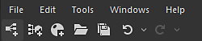

# 기본 도구 모음

<table>
<tr style="border: 0;">
<td width="100.00%" style="border: 0;" valign="top">

이 페이지에서는 기본 창의 왼쪽 상단에 나타나는 [Substance 3D Designer](https://www.adobe.com/kr/products/substance3d-designer.html)의 기본 도구 모음과 메뉴에 대해 설명합니다.드롭다운 메인 메뉴와 빠른 액세스 버튼의 두 부분으로 구성되어 있습니다. 모든 빠른 액세스 단추 기능은 <b>파일</b> 및 <b>편집</b> 메뉴를 통해서도 액세스할 수 있습니다.

</td>
<td width="41.67%" style="border: 0;" valign="top">

</td>
</tr>
</table>

## 빠른 액세스 버튼

 <b>새 Substance 그래프...:</b>(Ctrl+N) [새 그래프](../../compositing-graphs/creating-compositing-gra/creating-a-substance-compositing-graph.md) 창을 표시한 다음 [Substance 그래프](../../compositing-graphs/substance-compositing-graphs.md)를 사용하여 새 패키지를 만듭니다.

 <b>열기...:</b>(Ctrl+O) 기존 [Substance 패키지(.SBS, .SBSAR, .SBSASM)](../../getting-started/overview/overview.md)를 엽니다.

 <b>모두 저장:</b>(Ctrl+⇧+S) [탐색기](../../interface/the-explorer-window/the-explorer-window.md)에 나열된 모든 패키지를 저장합니다.

 <b>실행 취소:</b>(Ctrl+Z) 마지막 작업을 실행 취소합니다.

 <b>다시 실행:</b>(Ctrl+Y) 마지막으로 실행 취소된 작업을 다시 실행합니다.

## 파일

<b>새로 만들기:</b> 그래프 또는 패키지를 만들기 위한 하위 메뉴를 엽니다.

* <b>새 Substance 그래프...:</b>(Ctrl+N) 새 [Substance 그래프](../../compositing-graphs/substance-compositing-graphs.md)를 설정할 수 있는 [새 그래프](../../compositing-graphs/creating-compositing-gra/creating-a-substance-compositing-graph.md) 창을 표시합니다.
* <b>새 Substance 함수 그래프:</b> [Substance 함수 그래프](../../function-graphs/function-graphs.md)를 사용하여 새 패키지를 만듭니다.
* <b>비어 있음:</b> 빈 패키지를 만듭니다.

<b>열기...:</b>(Ctrl+O) 기존 [Substance 패키지(.SBS, .SBSAR, .SBSASM)](../../getting-started/overview/overview.md)를 엽니다.

<b>최근 패키지:</b> 최근에 열었던 패키지 목록을 표시합니다. 항목을 클릭하여 엽니다.

<b>마지막 세션 패키지 열기(#)</b>: 마지막 세션이 닫히거나 종료되었을 때 열려 있던 모든 패키지를 엽니다.

<b>모두 저장:</b>(Ctrl+⇧+S) 백그라운드에서 로드된 패키지를 포함하여 열려 있는 모든 패키지를 저장합니다.

<b>모두 닫기:</b> 열려 있는 모든 패키지를 닫습니다.

<b>리소스 다시 로드:</b> Designer에서 [비트맵 및 SVG 데이터를 포함한 모든 리소스](../../resources/importing-linking-and-new/importing-linking-and-new-resources.md)를 다시 로드하도록 합니다.

<b>종료:</b>(Ctrl+Q) - Substance 3D Designer을 닫습니다.

## 편집

<b>실행 취소:</b>(Ctrl+Z) 마지막 작업을 실행 취소합니다.

<b>다시 실행:</b>(Ctrl+Y) 마지막으로 실행 취소된 작업을 다시 실행합니다.

<b>기본 설정...:</b> 기본 설정 창을 엽니다.

>[!NOTE]
>
> 이 대화 상자는 macOS 작업 표시줄의 Substance 3D Designer 메뉴에서 액세스할 수 있습니다.

## 도구

<b>렌더링 취소:</b>(Esc) Substance 엔진의 현재 작업을 중지합니다. 원치 않는 과도한 작업을 중단하는 데 사용할 수 있습니다.

<b>일시 중지 엔진:</b>(⇧+Esc)은 렌더링 엔진을 일시 중지합니다. 이렇게 하면 복잡한 [Substance 그래프](../../compositing-graphs/substance-compositing-graphs.md)를 편집하는 속도가 빨라질 수 있습니다.

<b>스위치 엔진...: </b>(F9)은(는) GPU 엔진(&#39;Windows의 경우&#39;, macOS의 경우 &#39;OpenGL&#39;)뿐만 아니라 CPU 엔진(&#39;NEON&#39;, Apple Silicon의 경우 &#39;SSE&#39;)을 포함한 렌더링 엔진을 선택할 수 있습니다.

<b>Substance Player:</b> Designer과 Substance Player 통합 관리:

* <b>플레이어 찾기...:</b> Designer에 플레이어가 설치된 위치를 알립니다.
* <b>플레이어 다운로드...:</b> Substance Player 설명서의 [랜딩 페이지](https://helpx.adobe.com/substance-3d-player/home.html)를 엽니다. 여기에서 플레이어를 다운로드할 수 있습니다.

<b>플러그인 관리자...</b>: Substance 3D Designer용 [Python 플러그인을 설치, 로드 및 언로드할 수 있는 플러그인 관리자 창을 엽니다.](../../scripting/scripting.md)

## Windows

<b>새 탐색기:</b> 새 탐색기 도크를 엽니다. 여러 개의 탐색기 도크를 열 수 있습니다.

<b>새 3D 보기:</b> 새 3D 보기 도크를 엽니다. 여러 개의 3D 보기 도크를 열 수 있습니다.

<b>새 라이브러리 보기:</b> 새 라이브러리 도크를 엽니다. 여러 라이브러리 도크를 열 수 있습니다.

<b>Python 편집기:</b>[스크립트를 평가하고 만드는 데 사용되는 Python 편집기를 엽니다](../../scripting/scripting.md).

<b>레이아웃 재설정:</b> 작업 영역을 기본 레이아웃으로 재설정합니다. 모든 창이 다시 정렬되고 일부 창이 다시 숨겨질 수 있습니다. 프로그램 레이아웃에 문제가 있는 경우 사용합니다.

<b>창 최대화 해제:</b> 패널이 *최대화*&#x200B;인 경우 이 옵션은 최대를 해제하고 레이아웃을 *이전* 상태로 복원합니다. 창이 최대가 되었습니다

<b>탐색기:</b> [탐색기](../the-explorer-window/the-explorer-window.md)를 표시하거나 숨깁니다.

<b>그래프:</b> [그래프 창](../../interface/the-graph-view/the-graph-view.md)을 표시하거나 숨깁니다.

<b>매개 변수:</b> [속성](../properties/properties.md)을 표시하거나 숨깁니다.

<b>콘솔:</b> 콘솔 창을 표시하거나 숨깁니다.

<b>3D 보기:</b> [3D 보기](../../interface/3d-view/3d-view.md)를 표시하거나 숨깁니다.

<b>종속성 관리자:</b> [종속성 관리자](../../interface/dependency-manager/dependency-manager.md)를 표시하거나 숨깁니다.

<b>2D 보기:</b> [2D 보기](../2d-view/2d-view.md)를 표시하거나 숨깁니다.

<b>라이브러리:</b> [라이브러리 창을 표시하거나 숨깁니다.](../../interface/the-library/the-library.md)

<b>기본 도구 모음:</b> 기본 도구 모음을 표시하거나 숨깁니다(빠른 액세스 단추만 해당).

>[!NOTE]
>
> Designer의 패널 관리, 사용자 정의 및 작업 과정 개선 기능에 대해 자세히 알아보려면 이 설명서의 [작업 영역 사용자 정의](../../interface/customizing-your-wor/customizing-your-workspace.md)페이지로 이동하십시오.

## 도움말

<b>Tutorials:</b> [Substance 3D 튜토리얼](https://substance3d.adobe.com/tutorials/) 웹 사이트(이전 Substance 아카데미)를 엽니다.<b>\
</b>

<b>릴리스 정보:</b> 최신 버전의 변경 로그가 있는 창을 엽니다.

<b>기술 요구 사항:</b> 응용 프로그램을 실행하기 위한 기술 요구 사항을 보여 줍니다.

<b>설명서:</b> [이 설명서](https://www.adobe.com/go/Substance-3D-doc-Designer_kr)에서 기본 웹 브라우저를 엽니다.

<b>스크립팅 문서:</b> 로컬 Python API 문서에서 웹 브라우저를 엽니다.

<b>포럼...:</b> [지원 커뮤니티](https://forum.substance3d.com/) 포럼에서 웹 브라우저를 열어 커뮤니티에 연락하고 질문을 할 수 있습니다.

<b>버그 보고...:</b> 버그 보고 창을 엽니다.

<b>로그 내보내기...:</b> 현재 로그 파일을 압축된(.zip) 파일로 내보내 기술 지원에 제공합니다.

<b>피드백 제공...:</b> Adobe의 [지원 커뮤니티](https://www.adobe.com/go/Substance-3D-feedback-Designer_kr) 홈 페이지에서 웹 브라우저를 엽니다.

<b>Substance 3D 에셋:</b> 구독자(이전의 Substance Source)를 위해 [프리미엄 3D 콘텐츠](https://substance3d.adobe.com/assets)를 찾아보세요.

<b>Substance 3D 커뮤니티 에셋:</b> [무료 커뮤니티 에셋](https://substance3d.adobe.com/community-assets/)&#x200B;(이전 Substance share)을 검색할 수 있습니다.

<b>내 계정 관리\*:</b> Adobe 계정에 대한 웹 페이지를 엽니다.

<b>로그인/로그아웃...\*:</b> Adobe 계정에 로그인/로그아웃할 수 있습니다.

<b>홈 화면...:</b> [홈 화면](../../interface/home-screen/home-screen.md) 대화 상자를 표시합니다.

<b>새로운 기능...:</b> Designer 최신 릴리스에 추가된 기능을 강조하는 화면을 표시합니다.

<b>시작 화면...\*:</b> [Substance 3D 에코시스템](https://helpx.adobe.com/substance-3d.html)에서 Designer의 목적과 위치를 통해 새로운 사용자를 안내하는 화면을 표시합니다.

<b>파트너:</b> Designer의 파트너가 제공하는 타사 통합 고지 사항 및 고지 사항에 액세스할 수 있습니다.

<b>Substance 3D Designer 정보...:</b> 버전 번호와 같은 응용 프로그램 및 해당 구성 요소에 대한 정보를 표시합니다.

\*: 이러한 옵션은 [Adobe Creative Cloud 데스크탑](https://creativecloud.adobe.com/en/apps/download/creative-cloud)을(를) 통해 설치된 Designer 버전에서만 사용할 수 있으며, 여기에는 [Substance 3D 구독](https://www.adobe.com/creativecloud/plans.html?amp%3Bplan=individual#filter=3dar)이 필요합니다.
