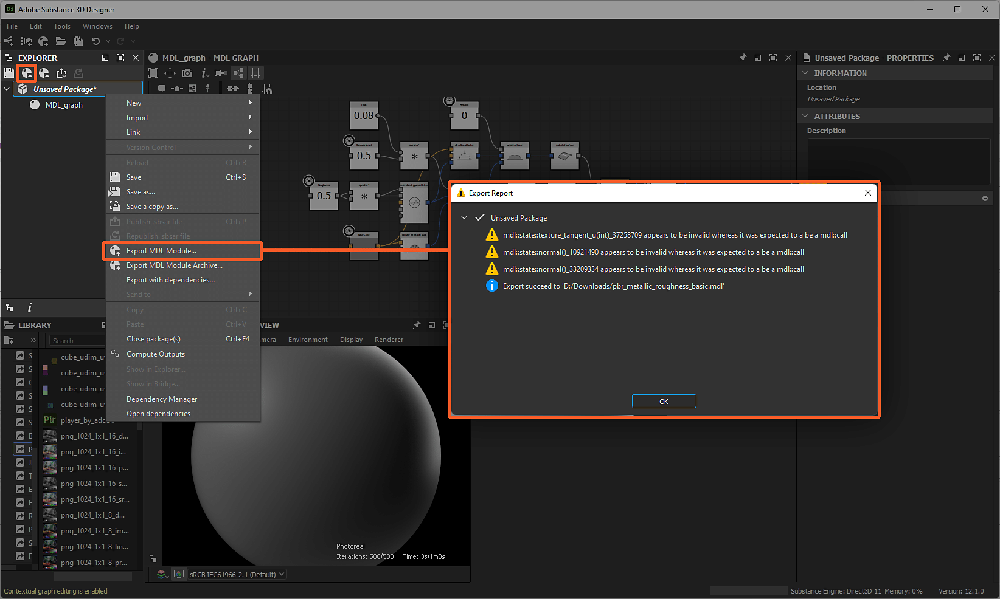

# MDL 컨텐츠 내보내기

이 페이지에서는 Substance 3D Designer의 [MDL 그래프](../../mdl-graphs/mdl-graphs.md) 및 재질과 관련된 내보내기 프로세스에 대해 설명합니다.

## 개요

Designer에서 MDL 재질을 만든 후에는 *재질 정의를 전달*&#x200B;할 수 있는 형식으로 내보내야 하며 MDL을 지원하는 렌더러가 읽을 수 있습니다. MDL은 독점 형식을 사용하여 MDL 모듈이라는 재료 정의를 다른 형식으로 기록 및 패키징하며 모두 Designer 내에서 내보낼 수 있습니다.

>[!NOTE]
>
> 이러한 모든 형식은 *텍스트 편집기*&#x200B;를 사용하여 직접 열 수 있습니다. 경우에 따라 보관 관리자를 사용하여 압축을 푼 후 해당 형식이 보유하고 있는 재질 정의를 검사할 수 있습니다.

## MDL 모듈(\*.mdl)

이것은 재료 정의를 위한 기본적인 교환 파일 형식입니다. MDL 모듈은 다음을 정의합니다.

* 그 재료의 특징과 행동
* 노출된 매개 변수 및 기본값
* 주석(예: 메타데이터): 작성자, 태그, 범주 등...

MDL 모듈 내보내기는 *패키지* 수준에서 수행됩니다. 지정된 패키지에 대한 MDL 모듈을 내보내려면 [탐색기](../../interface/the-explorer-window/the-explorer-window.md)에서  <b>MDL 모듈 내보내기</b> 버튼을 클릭하거나 *패키지의 컨텍스트 메뉴*&#x200B;에서 동일한 옵션을 선택합니다. 내보낸 MDL 모듈의 대상 위치와 이름을 선택하면 내보내기 프로세스 중에 기록된 메시지 목록이 있는 <b>내보내기 보고서</b> 대화 상자가 표시됩니다.

내보낸 모듈에는 패키지에서 [MDL 그래프](../../mdl-graphs/mdl-graphs.md)로 정의된 MDL 재질 *모두*&#x200B;의 정의가 포함됩니다.

>[!NOTE]
>
> NVIDIA의 [MDL 사양](https://developer.download.nvidia.com/designworks/mdl-sdk/secure/MDL_spec_1.6.1_16Dec2019.pdf?__token__=exp=1776166178~hmac=38656bc9d8199764568d1fa0d4d945b90c57638ebd37b100a402bdc983e518ee&t=eyJscyI6ImdzZW8iLCJsc2QiOiJodHRwczovL3d3dy5nb29nbGUuY29tLyJ9) 섹션 4 및 15의 MDL 모듈에 대해 자세히 알아보십시오.

>[!NOTE]
>
> 이 템플릿 뒤에 오는 경고: `x appears to be invalid whereas it was expected to be an mdl::call`은(는) MDL 재질이 MDL 그래프로 처리되는 방식으로 인해 발생하며 *무시해도 안전함*&#x200B;입니다.

*탐색기의 &quot;MDL 모듈 내보내기&quot; 경로 및 결과 내보내기 보고서 대화 상자*

### MDL 사전 설정 (\*.mdl)

MDL 모듈 사전 설정은 기반이 되는 모듈과 거의 동일하지만 다른 기본값 집합을 포함한다는 점만 다릅니다. 자세한 내용은 [여기](https://www.migenius.com/doc/realityserver/latest/resources/general/iray/api_reference/iray/html/classmi_1_1neuraylib_1_1IMdl__factory.html#details)를 참조하세요.

장면 재질 `my_material`에 할당된 MDL 재질에 대한 사전 설정을 다음 위치에서 내보낼 수 있습니다.

* MDL 그래프 리소스에서 <b>RMB</b>을 클릭하고 컨텍스트 메뉴에서 <b>사전 설정 내보내기...</b> 옵션을 선택하여 [탐색기](../../interface/the-explorer-window/the-explorer-window.md) 패널을 선택합니다.
* [3D 보기](../../interface/3d-view/3d-view.md) 패널, <b>재질 > 내\_재질 > 사전 설정 내보내기...</b> 메뉴 옵션 사용

메뉴 옵션은 다음과 같은 옵션을 제공하는 <b>MDL 재질 사전 설정 내보내기</b> 대화 상자를 엽니다.

* <b>디렉터리</b>: MDL 모듈을 내보낼 대상 위치
* <b>MDL 파일 이름</b>: MDL 모듈의 이름
* <b>가져온 MDL 모듈 포함</b>: MDL 모듈이 가져온 모듈에 종속되는 경우(예: 모듈 종속성이 있는 경우) 이 옵션을 선택하면 내보낸 MDL 모듈에 모듈 종속성이 *포함*&#x200B;되므로 파일 크기 및 동적 상속을 희생하여 *자급자족*&#x200B;하는 효과가 있습니다.

내보낸 사전 설정은 3D 보기에서 재질의 매개 변수 *현재 값*&#x200B;을(를) *새 기본값* 값으로 사용합니다. 이러한 값은 <b>재질 > 내\_재질 > 편집</b> 옵션을 사용하여 수정할 수 있습니다. 그러면 [속성] 패널에 재질의 노출된 매개 변수가 표시됩니다.

>[!WARNING]
>
> [탐색기](../../interface/the-explorer-window/the-explorer-window.md) 패널에서 MDL 모듈을 내보내면 MDL 모듈이 패키지의 MDL 그래프로 정의된 *모두* MDL 재질을 유지하는 반면, [3D 보기](../../interface/3d-view/3d-view.md)에서 MDL 사전 설정을 내보내면 MDL 모듈이 *만* 메뉴의 *선택한 재질*&#x200B;에 적용된 MDL 재질의 정의를 유지하는 결과입니다. 이 예에서는 `my_material`입니다.

*3D 보기의 &quot;내보내기 사전 설정&quot; 경로 및 그에 따른 내보내기 MDL 재질 사전 설정 대화 상자*

## MDL 모듈 아카이브(\*.mdr)

MDL 모듈 아카이브는 MDL 모듈(위 참조)과 *텍스처* 및 추가 정보 파일과 같은 리소스를 *단일 전송 가능한 파일*&#x200B;로 결합합니다.

MDL 모듈 보관 파일 내보내기는 *패키지* 수준에서 수행됩니다. 지정된 패키지에 대한 MDL 모듈 아카이브를 내보내려면 [탐색기](../../interface/the-explorer-window/the-explorer-window.md)에서  <b>MDL 모듈 아카이브 내보내기</b> 버튼을 클릭하거나 *패키지의 컨텍스트 메뉴*&#x200B;에서 동일한 옵션을 선택합니다. 내보낸 MDL 모듈 아카이브의 대상 위치와 이름을 선택하면 내보내기 프로세스 중에 기록된 메시지 목록과 함께 <b>보고서 내보내기</b> 대화 상자가 표시됩니다.

내보낸 모듈 보관에는 패키지에서 [MDL 그래프](../../mdl-graphs/mdl-graphs.md)로 정의된 MDL 재질 *모두*&#x200B;의 정의를 유지하는 MDL 모듈이 포함됩니다. [Substance 그래프](../../compositing-graphs/substance-compositing-graphs.md)가 [MDL 그래프](../../mdl-graphs/compositing-graphs-and/substance-compositing-graphs-and-mdl-materials.md)에 인스턴스화되고 [루트](../../mdl-graphs/main-mdl-graph-concepts/main-mdl-graph-concepts.md) 노드로 가는 스트림에 연결된 경우 출력하는 텍스처는 *아카이브에 저장됨*&#x200B;입니다.

이러한 항목 외에도 아카이브에는 MDL 모듈 아카이브에 대한 다음 메타데이터를 설명하는 <b>MANIFEST</b> 파일이 포함되어 있습니다.

* `mdl`: 모듈 아카이브를 내보내는 데 사용되는 MDL 버전(예: &quot;1.5&quot;)
* `version`: 모듈 보관 버전(예: &quot;1.0.0&quot;)
* `module`: 모듈 보관 파일의 이름(예: &quot;::pbr\_metallic\_roughness\_basic&quot;)
* `exports.material`: 모듈 보관에 정의된 자료의 이름(예: &quot;::pbr\_metallic\_roughness\_basic::MDL\_graph&quot;)

>[!NOTE]
>
> NVIDIA의 [MDL 사양](https://developer.download.nvidia.com/designworks/mdl-sdk/secure/MDL_spec_1.6.1_16Dec2019.pdf?__token__=exp=1776166178~hmac=38656bc9d8199764568d1fa0d4d945b90c57638ebd37b100a402bdc983e518ee&t=eyJscyI6ImdzZW8iLCJsc2QiOiJodHRwczovL3d3dy5nb29nbGUuY29tLyJ9)의 부록 C에서 MDL 보관 파일 형식에 대해 자세히 알아보십시오.

*탐색기의 &quot;MDL 모듈 보관 내보내기&quot; 경로 및 결과 내보내기 보고서 대화 상자*

## MDL 캡슐화된 모듈(\*.mdle)

노출매개변수가 있는 MDL 그래프는 캡슐화된 MDL 재료로 내보낼 수 있습니다. *캡슐화는* 데이터에 직접 액세스할 수 없도록&#x200B;*데이터를 전용 클래스로 래핑*&#x200B;합니다.

예를 들어 재료 동작을 제어하기 위해 노출된 매개변수 값을 수정할 수 있지만 캡슐화된 MDL 모듈에서 이러한 매개변수의 *정의*&#x200B;를 *사용할 수 없음*&#x200B;으로 설정할 수 있습니다.

캡슐화된 MDL 모듈을 내보내는 작업은 MDL 그래프의 컨텍스트 메뉴에서 <b>.mdle로 내보내기</b> 옵션을 선택하여 MDL 그래프 수준에서 [탐색기](../../interface/the-explorer-window/the-explorer-window.md)에서 수행됩니다. 내보낸 MDL 캡슐화된 모듈의 대상 위치와 이름을 선택하면 내보내기 프로세스 중에 기록된 메시지 목록과 함께 <b>내보내기 보고서</b> 대화 상자가 표시됩니다.

*선택한 MDL 그래프*&#x200B;에 대한 재료 정의만&#x200B;*내보내는 캡슐화된 MDL 모듈에 포함됩니다.*

>[!NOTE]
>
> NVIDIA의 [MDL 사양](https://developer.download.nvidia.com/designworks/mdl-sdk/secure/MDL_spec_1.6.1_16Dec2019.pdf?__token__=exp=1776166178~hmac=38656bc9d8199764568d1fa0d4d945b90c57638ebd37b100a402bdc983e518ee&t=eyJscyI6ImdzZW8iLCJsc2QiOiJodHRwczovL3d3dy5nb29nbGUuY29tLyJ9) 및 [MDL SDK API](https://raytracing-docs.nvidia.com/mdl/api/mi_neuray_example_mdle.html)의 섹션 13.5에서 캡슐화된 재질 정의에 대해 자세히 알아보십시오.

*탐색기의 &quot;mdle로 내보내기&quot; 경로 및 결과 내보내기 보고서 대화 상자*
