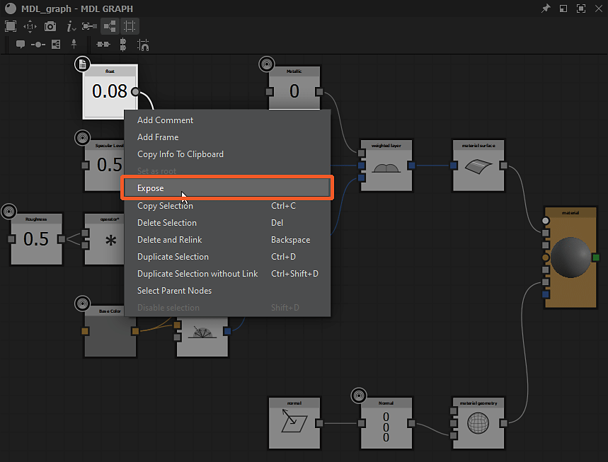

# MDL 그래프에서 매개변수 노출

이 페이지에서는 그래프의 *다른 노드* 또는 *외부 소스*&#x200B;에서 제공된 값과 텍스처에 연결할 수 있도록 MDL 그래프에 매개변수를 표시하는 프로세스를 설명합니다.

*노드 입력의 노출 상태*

## 노드 입력을 노출하는 중

대부분의 경우 노드 속성의 *입력 커넥터*&#x200B;가 표시되어 해당 *값이 그래프에서 다른 노드*&#x200B;에 의해 설정됩니다. 이는 MDL 그래프의 모든 워크플로우에서 *중요* 부분이므로 잘 알고 있어야 합니다.

<b>그래프 보기</b>에서 노드를 선택하면 해당 속성이 <b>속성</b> 패널에 표시됩니다. 대부분의 속성은 해당 레이블의 오른쪽에 일련의 버튼과 함께 나열됩니다.

* **새 노드에 값을 복사하고 이 매개 변수에 연결합니다.**: 이 속성에 대한 *입력 커넥터*&#x200B;를 만들고 이 속성의 현재 값을 출력하는 *새 노드*&#x200B;에 연결합니다.
* **이 매개 변수에 대한 입력 핀 만들기**: 이 속성에 대한 *입력 커넥터*&#x200B;를 만듭니다.
* **이 매개 변수를 기본값으로 다시 설정**: 이 속성의 입력 커넥터에 연결된 값이 없으면 값을 기본값으로 다시 설정합니다.

*노드 입력 조작*

처음 두 개의 단추 중 하나를 클릭하면 *형식화된 입력 커넥터*&#x200B;가 노드에 추가됩니다. 노드의 속성은 이 커넥터의 *연결 상태*&#x200B;에 반응합니다.

* **연결되지 않음**: 매개 변수는 **속성** 패널에서 계속 변경할 수 있으며 이 패널의 값 입력은 *적용됨*&#x200B;입니다.
* **연결됨**: **속성** 패널에서 매개 변수를 더 이상 변경할 수 없습니다. 이 패널에서 입력한 값은 *입력 커넥터*&#x200B;에서 받은 값으로 *대체*&#x200B;되며 속성을 기본값으로 다시 설정할 수 없습니다.

**이 매개 변수에 대한 입력 핀 만들기** 단추를 다시 클릭하여 입력 커넥터를 *제거*&#x200B;할 수 있습니다. 이때 속성 값은 **속성** 패널에 설정된 값으로 돌아갑니다.

*노출된 노드 매개 변수*

## 그래프 입력 노출

MDL 그래프에서 매개변수를 그래프 레벨에 노출하는 것, 즉 MDL 재료 입력 매개변수로 표시하는 것은 값을 출력하는 노드를 노출하는 방식으로 수행됩니다.

노출할 수 있는 노드의 컨텍스트 메뉴에는 <b>노출</b> 옵션이 있습니다. 대부분의 경우 부동 소수점, 색상 또는 텍스처 좌표와 같은 값이나 데이터를 생성하는 노드입니다.

노드의 컨텍스트 메뉴에서 

노드의 컨텍스트 메뉴에서 *&quot;노출&quot; 옵션*

노출 매개 변수는 그래프의 속성이 아닌 *노출 노드*&#x200B;에서 직접 구성됩니다. 표시되는 매개 변수의 속성은 다음과 같습니다.

* <b>식별자</b>: 현재 그래프에서 이 입력 매개 변수의 고유 이름
* <b>기본값</b>: 이 매개 변수의 기본값입니다. Designer에서 입력 매개 변수가 표시될 *미리 보기*&#x200B;로도 사용할 수 있습니다. 가장 정확한 미리 보기를 위해 <b>표시 이름</b>, <b>그룹 내</b> 및 <b>범위</b> 속성이 사용됩니다.
* <b>범위</b>:
  * *소프트 범위*: 이 매개 변수를 표시하는 데 사용되는 위젯의 기본 범위를 설정합니다(예: 슬라이더). 이 속성은 인터페이스 용도로만 사용되며 소프트 범위를 벗어나는 값은 수동으로 입력할 수 있습니다
  * *하드 범위*: 이 매개 변수에 대해 허용되는 값의 범위를 설정합니다. 상기 범위 미만의 값들은 최소값으로 클램핑되는 반면, 상기 범위 초과의 값들은 최대값으로 클램핑된다. 매개 변수의 기본값과 소프트 범위 값은 이 범위에 맞게 *자동으로 조정*&#x200B;됩니다.
* <b>설명</b>: 매개 변수에 대한 설명입니다.
* <b>그룹</b>: 매개 변수는 이 입력 매개 변수가 속한 그룹을 구성합니다. 비어 있지 않은 경우 매개 변수는 그룹 이름을 따서 축소 가능한 섹션의 일부로 Designer에 표시됩니다
* <b>표시 이름</b>: 인터페이스에 표시되는 매개 변수 이름
* <b>숨김</b>: True로 설정하면 매개 변수가 그래프 입력 및 MDL 질감 속성에 표시되지 않습니다.
* <b>감마 유형</b>: 이 매개 변수에 연결된 텍스처의 값을 샘플링할 때 사용해야 하는 감마
* <b>기본적으로 표시</b>: 일부 매개 변수가 숨겨져 있을 수 있는 경우 MDL 통합에서 이 매개 변수의 표시 여부를 설정합니다.
* <b>형식 한정자</b>: 값이 균일한지 또는 가변인지 설정합니다. Auto로 설정된 경우 매개 변수는 해당 입력에서 이 속성을 상속합니다(예: Float 값의 경우: Float에 연결하면 균일, 텍스처에 연결하면 다름).
* <b>Sampler 사용</b>: 여러 출력이 MDL 재질에 한 번에 연결될 때 *적절한 텍스처를 연결*&#x200B;하는 데 사용되는 매개 변수 사용량의 식별자. 예를 들어, 3D 보기에서 MDL 재질에 [Substance 그래프](../../compositing-graphs/substance-compositing-graphs.md)를 연결할 때, 텍스처는 해당 사용 식별자를 일치시켜 올바른 입력에 연결됩니다.

>[!WARNING]
>
> 그래프 입력이 *노드* 수준에서 구성된 상태로 설정되어 있는 동안 해당 순서는 [그래프 속성](../../mdl-graphs/creating-an-mdl-graph/creating-an-mdl-graph.md)의 **그래프 입력** 섹션에서 *그래프* 수준에서 관리됩니다.

*그래프 입력에 노드를 표시하는 중*
