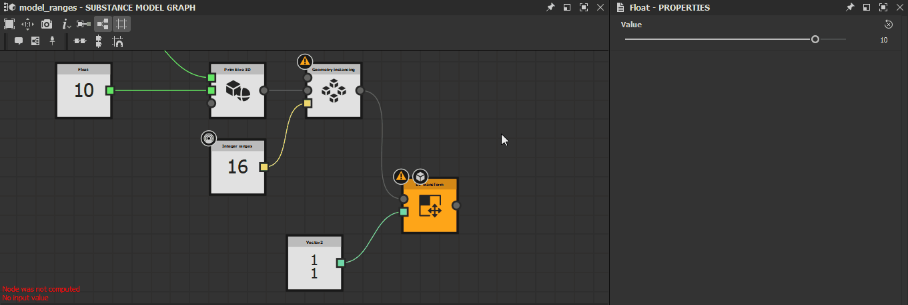

# MDL 그래프의 경고

이 페이지에서는 [Substance 3D Designer](https://www.adobe.com/kr/products/substance3d-designer.html)의 MDL 그래프로 트리거될 수 있는 경고 및 오류 메시지를 나열하고 각각에 대한 일반적인 문제 해결 단계를 제공합니다.

[탐색기](https://helpx.adobe.com/substance-3d/unlisted/documentation/sddoc/the-explorer-129368147.html) 패널의 그래프 리소스에 대한 경고 아이콘의 도구 설명뿐만 아니라 그래프가 로드된 경우 [그래프 보기](../../interface/the-graph-view/the-graph-view.md)의 왼쪽 아래 모서리에 경고가 표시됩니다.

>[!NOTE]
>
> 이 섹션의 일러스트레이션은 Substance 3D Designer 버전 <b>13.0.0</b>의 *중단*&#x200B;인 <b>Substance 모델 그래프</b>에 기록되었습니다. 단, MDL 그래프에도 적용됩니다.

##  출력 노드가 정의되지 않았습니다.

그래프에 정의된 출력 노드가 없습니다.

<b> 솔루션</b>

그래프에서 이 함수의 예상 유형과 일치하는 유형의 값을 출력하는 노드를 선택한 다음 RMB를 클릭하고 상황에 맞는 메뉴에서 <b>루트로 설정</b> 옵션을 선택하거나 노드에서 LMB를 두 번 클릭합니다.\
Substance 모델 그래프의 출력 노드에 *주황색* 색상이 지정됩니다.

###  하나 이상의 입력 값이 거부되었습니다.

매개 변수에 대해 제공된 값으로 인해 노드가 제대로 계산되지 않습니다.

<b> 솔루션</b>

대상 매개 변수에 적합하도록 값을 조정합니다.

###  입력 값 없음

노드에서 계산을 수행할 때 필요한 입력 값이 제공되지 않습니다.

<b> 솔루션</b>

일부 노드 매개 변수는 해당 입력 커넥터에 데이터가 제공되지 않을 때 기본값으로 다시 설정할 수 없습니다. 장면 입력에 해당하는 경우가 많습니다.

노드 입력을 일치하는 유형의 다른 노드 출력 커넥터에 연결합니다.

###  노드가 계산되지 않았습니다.

노드에 제공된 정보가 불완전하거나 유효하지 않아 노드가 계산을 수행할 수 없습니다.

<b> 솔루션</b>

그래프에서 업스트림으로 이동하여 노드가 유효한 출력을 제공하지 못하는 문제로 트리거된 경고를 확인합니다.

###  참조된 데이터에 몇 가지 경고가 있습니다

노드에서 참조하는 리소스에 하나 이상의 경고가 있습니다. 다음은 리소스를 참조하는 몇 가지 노드입니다.

* 그래프 인스턴스 노드가 그래프를 참조합니다.
* 장면 리소스 노드가 비트맵 3D 장면 리소스를 참조합니다.

<b> 솔루션</b>

[탐색기] 패널에서 참조된 리소스를 찾고 리소스가 발생시키는 모든 경고를 해결합니다.

* 그래프의 경우 이 페이지의 다른 항목을 참조하십시오
* 다른 유형의 리소스는 종속성 경고 페이지를 참조하십시오

###  참조된 리소스를 찾을 수 없습니다.

노드에서 참조하는 리소스를 Substance 3D 파일(SBS)에 저장된 경로에서 찾을 수 없습니다. 다음은 리소스를 참조하는 몇 가지 노드입니다.

* 그래프 인스턴스 노드가 그래프를 참조합니다.
* 장면 리소스 노드가 비트맵 3D 장면 리소스를 참조합니다.

<b> 솔루션</b>

그래프 인스턴스 노드의 경우

원본 그래프가 <b>Package</b> 특성에 저장된 경로에 있는 패키지에 있는지 확인하십시오.\
그렇지 않으면 인스턴스 노드를 삭제하고 유효한 패키지를 참조하는 인스턴스 노드로 대체합니다. 또는 인스턴스 노드에서 참조하는 패키지와 그래프를 다시 만든 다음 [탐색기](https://substance3d.adobe.com/documentation/display/DRAFTDESIGNER/.The+Explorer+window+vDraftVersion) 패널에서 *RMB*&#x200B;을 클릭하고 컨텍스트 메뉴에서 <b>다시 로드</b> 옵션을 선택하여 호스트 패키지를 다시 로드할 수 있습니다.

장면 리소스 노드의 경우

참조된 리소스는 [탐색기](https://substance3d.adobe.com/documentation/display/DRAFTDESIGNER/.The+Explorer+window+vDraftVersion) 패널에서 찾은 다음 해당 <b>파일 경로</b> 특성에 저장된 위치에 있는지 확인하세요.\
그렇지 않으면 탐색기의 리소스 항목에서 *RMB*&#x200B;을 클릭하고 <b>재배치...를 선택합니다.컨텍스트 메뉴의 </b> 옵션을 사용하여 해당 리소스에 대해 유효한 새 대상 파일을 설정합니다.

###  소프트 범위에 값이 없습니다.

노출된 매개 변수의 기본값은 해당 매개 변수에 대해 정의된 소프트 범위에 포함되지 않습니다.

<b> 솔루션</b>

기본값 또는 소프트 범위를 조정하여 후자에 전자를 포함시킵니다.

>[!NOTE]
>
> 이 경고는 기본값을 포함하도록 소프트 범위를 *자동으로 조정*&#x200B;하므로 사용자 인터페이스를 통해 트리거할 수 없습니다. Substance 3D 파일(SBS) *직접*&#x200B;의 데이터만 수정하면 이 경고가 트리거될 수 있습니다.

###  소프트 범위가 하드 범위를 벗어났습니다.

소프트 범위 및 노출된 매개변수는 해당 매개변수에 대해 정의된 하드 범위에 완전히 포함되지 않습니다.

<b> 솔루션</b>

소프트 범위 또는 하드 범위를 조정하여 후자에 전자를 완전히 포함시킵니다.

>[!NOTE]
>
> 이 경고는 하드 범위에 완전히 포함되도록 소프트 범위를 *자동으로 조정*&#x200B;하므로 사용자 인터페이스를 통해 트리거할 수 없습니다. Substance 3D 파일(SBS) *직접*&#x200B;의 데이터만 수정하면 이 경고가 트리거될 수 있습니다.

###  값이 하드 범위를 벗어났습니다.

노출된 매개 변수의 기본값은 해당 매개 변수에 대해 정의된 하드 범위에 포함되지 않습니다.

<b> 솔루션</b>

기본값이나 하드 범위를 조정하여 전자를 후자에 포함시킵니다.

>[!NOTE]
>
> 이 경고는 하드 범위에 포함될 기본값을 *자동으로 조정*&#x200B;하므로 사용자 인터페이스를 통해 트리거할 수 없습니다. Substance 3D 파일(SBS) *직접*&#x200B;의 데이터만 수정하면 이 경고가 트리거될 수 있습니다.

