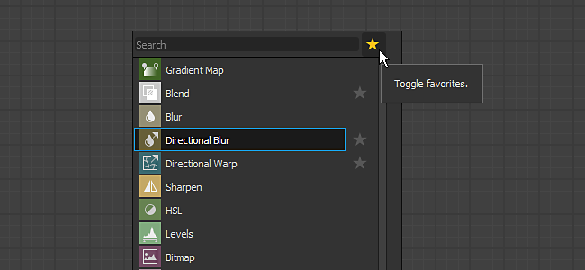
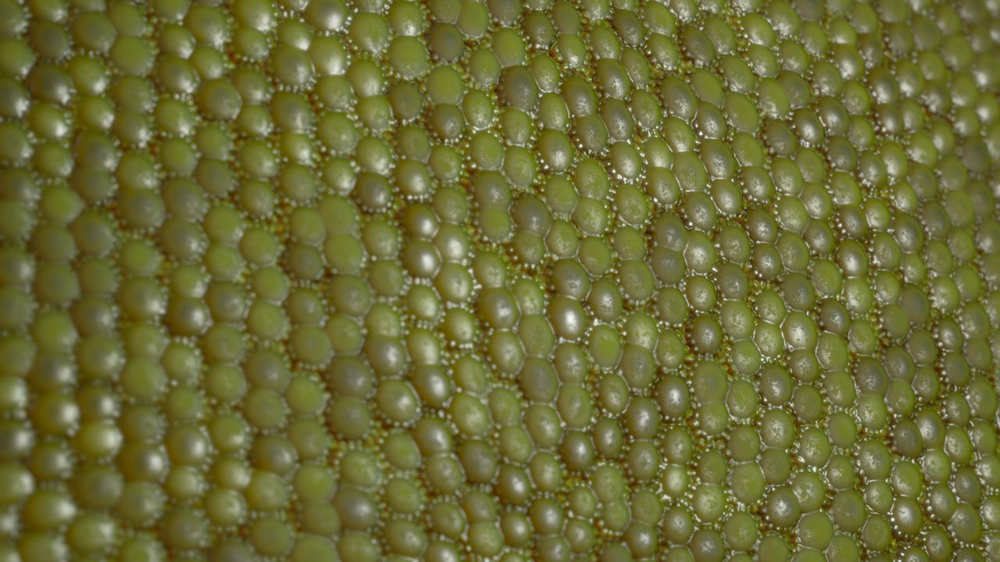

# 버전 2019.2 (9.2)

**Substance Designer 2019.2**&#x200B;은(는) 새로운 점 노드, HDR 필터 및 강력한 최적화를 제공합니다.

## 주요 기능

### 새 점 노드

점 노드는 오래 기다린 요청입니다. 이것은 노드 사이의 연결을 리디렉션하여 그래프를 재구성하는 것입니다. 이전의 리디렉션 점과 반대로 이 점은 링크를 누적할 수 있으며 연결이 끊어졌을 때 사라지지 않습니다.

점 노드에 대한 자세한 내용은 [그래프 항목](../../../interface/the-graph-view/graph-items/graph-items.md) 페이지를 참조하십시오.

### 개선된 노드 생성 메뉴

이제 &quot;스페이스바&quot;를 누를 때 나타나는 노드 만들기 메뉴에서 즐겨 찾기를 우선 순위로 정의하고 나열할 수 있습니다. 메뉴 주변에 새로운 비헤이비어가 추가되어 보다 손쉽게 사용할 수 있습니다.

* **즐겨찾기를 먼저 표시**\
  텍스트 필드 옆에 있는 아이콘을 클릭할 때 먼저 즐겨찾기 목록을 활성화하거나 비활성화할 수 있습니다.

  
* **즐겨찾기 추가 또는 제거**\
  즐겨찾기가 표시되면 노드 이름 옆에 있는 아이콘을 클릭하여 목록에서 노드를 추가하거나 제거할 수 있습니다.\
  [라이브러리] 창에서 즐겨찾기를 직접 관리할 수도 있습니다.

  
* **노드에서 링크를 클릭하고 드래그할 때 메뉴 열기**\
  노드의 연결을 클릭하고 드래그한 다음 마우스를 놓으면 노드 생성 메뉴가 열립니다. 생성된 노드는 링크에 연결됩니다. 목록에서 사용 가능한 노드는 들어오는 연결에 종속됩니다. 

### 실시간 렌더러를 위한 새로운 기술

새 렌더링 기능을 지원하도록 실시간 Substance Designer 뷰포트가 개선되었습니다. **비등방성**, **코팅** 및 **표면 아래 분산**. 이러한 기능에 의해 도입된 모든 새로운 채널과 사용법은 Iray와도 호환됩니다.

* **비등방성**\
  비등방성은 반사가 주어진 방향으로 어떻게 동작해야 하는지를 정의하는 속성입니다. 머리카락이나 브러시칠한 금속과 같은 특정 재료 유형에 자주 사용됩니다.\
  이방성 재질을 만들려면 그래프에 다음 용도의 두 출력이 필요합니다.

  * **AnisotropyAngle**: 비등방성 방향을 정의합니다. 검정색에서 흰색으로 반복 재생됩니다.
  * **AnisotropyLevel**: 비등방성 강도를 정의합니다. 권장 값은 0.9~0.98(회색 음영)입니다.

  참고: 비등방성은 모든 기본 PBR 셰이더에서 지원됩니다.

  {width="400px"}
* **코팅**\
  코팅은 기본 재질 위에 재료의 제2 층을 규정할 수 있게 한다. 금속 표면에 자동차 페인트 또는 필름을 시뮬레이션하는 데 사용할 수 있습니다.\
  코팅된 재질을 만들려면 새 Substance 템플릿 &quot;PBR Coated (Metallic/Roughness)&quot;를 사용하거나 그래프에 다음 출력을 추가할 수 있습니다.

  * **coatWeight**: 코팅 레이어의 불투명도.
  * **coatSpecularLevel**: 코팅 레이어에 대한 Specular level.
  * **coatColor**: 코팅 레이어의 색상입니다.
  * **coatNormal**: 코팅 레이어에 대해 Normal입니다.
  * **coatRoughness**: 코팅층에 대한 거칠음.

  참고: 코팅하려면 새 셰이더 &quot;physically\_metallic\_roughness\_coated&quot;가 필요합니다.

  {width="400px"}
* **하위 표면 분산**\
  서브표면 산란은 물질 내부의 빛의 흡수 및 확산을 시뮬레이션합니다. 피부 및 기타 유기적인 표면을 시뮬레이션하는 데 매우 유용합니다.\
  서브서피스 재질을 만들려면 새 Substance 템플릿 &quot;PBR 서브서피스 스캐터링(금속/거칠기)&quot;을 사용하거나 그래프에 다음 출력을 추가할 수 있습니다.

  * **분산**: 재질 내부의 빛 확산 강도를 제어합니다.

  참고: 하위 표면에는 새 셰이더 &quot;physically\_metallic\_roughness\_sss&quot; 이 필요합니다. 스캐터링 컬러는 셰이더 파라미터에서 제어될 수 있다.

  {width="400px"}

>[!NOTE]
>
> 이러한 모든 새로운 렌더링 기능은 Substance Designer 셰이더 시스템의 재작업 덕분에 가능합니다. **GLSLFX** 형식은 이제 여러 번의 렌더링을 허용하는 &quot;**기법**&quot;의 정의를 지원합니다. 예를 들어 **Substance Designer/리소스/view3d/셰이더에서 사용할 수 있는 기본 셰이더를 살펴봅니다.**

### 향상된 성능

여러 상황에서 유용한 Substance 엔진(버전 7.2.0으로 이동)이 여러 가지 개선되었습니다.

* **더 빠른 편집을 위한 그래프 계산 캐싱**\
  새로운 캐싱 시스템을 추가하여 그래프 렌더링이 개선되었습니다. 이렇게 하면 변경되지 않은 노드를 건너뛰므로 이전보다 훨씬 더 빠르게 그래프를 수정할 수 있습니다.
* **라이브러리 로드 시간 개선**\
  새로운 요리 최적화 및 디코딩 속도 개선 덕분에 라이브러리의 로딩이 크게 개선되었습니다. 이제 라이브러리가 생성하는 속도가 2~8배 빨라졌습니다.

### HDR 필터를 사용한 새 콘텐츠

이 새로운 릴리스를 통해 HDR 환경 맵의 조작에 전용 하는 새로운 필터를 많이 소개합니다.

* 여러 LDR(Low Dynamic Range) 사진을 **HDR로 병합**:Bring&#x200B;하여 하나의 HDR 이미지를 만듭니다.
* **Nadir Patch**:This 노드를 사용하면 구형 변형을 고려하면서 HDRI의 그라운드 부분을 복제/패치할 수 있습니다.
* **Nadir Extract**: 이 노드는 HDRI에서 텍스처를 추출할 수 있습니다. 3D 장면에서 지표 텍스처를 매핑하는 데 사용할 수 있습니다.
* **Color Temperature Adjustment**: HDR 값 지원을 포함하여 입력 이미지의 색상 온도를 조정합니다.
* **수평선 똑바르게 하기**: 환경 지도의 위도/경도를 회전합니다. 촬영 조건에 따라 결과 360° 파노라마가 직선이 아닐 수 있습니다.
* **실제 Sun&amp;Sky**: 이 노드는 Hosek-Wilkie Skylight 모델의 구현입니다. 태양 위치를 지정하면 물리적으로 정확한 하늘 파노라마가 생성됩니다.
* **평면 조명**: 3D 모양처럼 직사각형 조명을 생성합니다. 2D 보기에서 해당 위치를 변경하고 텍스처를 적용하며 온도 또는 RGB 값을 사용하여 색상을 설정할 수 있습니다.
* **선 조명**: 선 모양의 조명을 생성하고 2D 보기에서 위치를 변경합니다. 이는 네온 조명과 같이 얇은 긴 모양으로 디자인되었다는 점을 제외하면 평면 조명과 유사한 옵션을 가지고 있습니다.
* **구 빛**: 구 모양의 빛을 생성하고 2D 보기 기즈모를 사용하여 위치를 변경합니다. 또한 구형 텍스처를 적용하여 멀리 있는 행성을 만들 수 있습니다.

모든 새 [HDRI 도구](../../../compositing-graphs/nodes-reference-for-com/node-library/3d-view-library/hdri-tools/hdri-tools.md)은 [노드 라이브러리 섹션](../../../compositing-graphs/nodes-reference-for-com/node-library/node-library.md)에 문서화되어 있습니다.

## 릴리스 정보

### 2019.2.3

*(2019년 11월 26일 릴리스)*

**고정:**

* [Bakers] 잘못된 링크가 있는 기울이기 맵 리소스를 사용하여 굽는 동안 충돌이 발생합니다
* [베이커] Embre에서는 0이 아닌 UV 세트를 고려하지 않습니다.
* [Bakers] &#39;Bending Normals from Mesh&#39;는 DXR에서 0이 아닌 UV 세트에서 잘못된 결과를 출력합니다.
* [베이커] 베이킹 창을 다시 열 때 &#39;UV 설정&#39; 매개 변수가 &#39;0&#39; 값으로 재설정됩니다.
* [베이커] &#39;위치&#39;에서 UV 세트가 0이 아닌 검정 이미지를 출력함
* [콘텐츠] 스마트 자동 타일: 8k의 샘플링 문제
* [내용] Atlas Splitter: 모양 감지가 실패하는 경우가 있으며, 정밀도 매개 변수를 노출해야 합니다.
* [내용] 경우에 따라 Pow에서 올바른 값이 반환되지 않습니다.
* [내용] 색인에 대한 Flood Fill: sbsar에 게시할 때 잘못된 결과
* [라이브러리] 세션의 첫 번째 SBS 패키지를 로드하는 동안 충돌이 발생합니다
* [라이브러리] [탐색기] 패널로 직접 가져온 리소스에는 &#39;기본적으로 라이브러리에 리소스 표시&#39; 설정이 무시됩니다
* [콘솔] 노드 메뉴를 사용할 때 콘솔에 예기치 않은 메시지가 표시됩니다.
* [매개 변수] 출력 사용 목록에서 단일 항목을 제거할 수 없습니다.
* [3DView] 장면 파일이 디스크에서 수정되면 장면이 올바르게 다시 로드되지 않습니다.[Graph] 값 출력을 사용할 때 노드 메뉴 필터링이 올바르지 않습니다.

**추가됨:**

* [MacOS] 새 MacOS Catalina 배포 요구 사항을 따르도록 소프트웨어를 Notarize

### 2019.2.2

*(2019년 10월 23일 릴리스)*

**고정:**

* [그래프] 값 출력을 사용할 때 노드 메뉴 필터링이 올바르지 않습니다.
* [그래프] 노드 메뉴를 표시할 때 충돌이 발생합니다
* [그래프] Shift 단축키를 사용할 때 검색 도구가 표시됨
* [그래프] 값 입력 커넥터에서 노드 메뉴를 연속으로 생성하면 충돌이 발생합니다
* [Graph] 긴 문자열이 포함된 주석이 잘림
* [그래프] 커넥터에서 드래그 메뉴를 사용하여 노드를 만들 때 플로우 강조 표시가 올바르지 않습니다.
* [Graph] 다른 그래프를 로드하는 동안 장면에서 모든 그래프 항목을 제거할 때 충돌이 발생합니다
* [Graph] 커넥터를 클릭하고 드래그하는 동안 노드를 만드는 데 사용할 때 충돌이 발생합니다
* [그래프] &#39;노드 찾기&#39; 도구를 사용하는 동안 충돌이 발생합니다
* [Graph] &#39;Material Compact&#39; 모드에서 출력 핀 색상이 올바르지 않습니다.
* [Cooker] 다중 출력 노드의 다운스트림 노드가 올바르게 업데이트되지 않음
* [밥솥] 값 출력 및 패스스루 노드 문제
* [조리기] &#39;Get&#39; 노드만 사용하는 경우 값 프로세서에서 잘못된 결과가 출력됨
* [Content] &#39;Contrast/Luminosity&#39; 노드에서 Alpha 값 1.0이 출력됨
* [Content] &#39;Studio Panorama&#39; 템플릿에 설명이 없음
* 색인에 대한 [내용] Flood Fill: 입력에 감싸기 모양이 포함되어 있으면 잘못된 결과가 표시됩니다
* [콘텐츠] &#39;HDR 병합&#39;: 내부 노출 계산이 올바르지 않습니다.
* [점 노드] 레벨 및 점 노드를 사용할 때 충돌이 발생합니다
* [종속성 관리자] &#39;이동&#39; 작업이 더 이상 작동하지 않습니다.
* [PSD] PSD 내보내기에 포함된 여러 노드의 삭제를 실행 취소하면 충돌이 발생합니다
* [UI] &quot;창&quot; 메뉴를 사용하여 그래프를 닫고 하나가 고정된 상태에서 하나를 다시 열 때 충돌이 발생합니다
* [그레이디언트 편집기] &#39;키 제거&#39; 버튼이 너무 큼
* [엔진] sqrt() acos() 및 asin()의 정밀도 문제
* [베이커] 메시에서 AO: 조정할 때 &#39;스프레드 각도&#39; 슬라이더에 잘못된 값 범위가 있음

### 2019.2.1

*(2019년 9월 20일 릴리스)*

**추가됨:**

* [템플릿] Specular/광택 및 다른 템플릿에 기본 입력 노드를 추가합니다.
* [템플릿] PBR 비등방성 템플릿 추가
* [3D 보기] 자동 클립 평면 원거리 늘리기
* [3D 보기] PBR 코팅: 일반 상속을 코팅하기 위한 기본값 변경
* [내용] Atlas Splitter: &quot;자동 자르기&quot; 기능에 대한 옵션 추가
* [노드 메뉴] 입력 없이 노드를 필터링하지 않습니다.

**고정:**

* [내용] Atlas Splitter: &quot;자동 자르기&quot; 옵션을 사용할 때 일부 출력이 제대로 잘리지 않습니다
* [Content] 재질 Height 혼합: 존재하지 않는 매개 변수와 관련된 조리 오류
* [Content] &quot;Plane Light&quot;: 패턴 UV 모드가 올바르게 작동하지 않습니다.
* [Content] &quot;Normal World Unit으로 Height&quot;: 입력이 16비트로 강제됨
* [내용] 작은 모양에 타일링 없이 angular &#39;경사&#39; 노드를 사용할 때 예기치 않은 모양이 발생합니다
* [라이브러리] sbsar 아이콘이 라이브러리에 표시되지 않습니다.
* [라이브러리] Url 필터링에 &quot;\&quot; 사용이 더 이상 작동하지 않음
* [라이브러리] 필터 값은 대/소문자를 구분합니다.
* [라이브러리] &quot;합성&quot;을 선택하면 검색 필터가 작동하지 않습니다.
* [베이커] 특정 셀을 두 번 클릭하고 변경 사항을 취소하면 잘못된 값으로 되돌아갑니다.
* [베이커] 베이커 창의 백엔드 상태 텍스트는 항상 &#39;GPU 가속 : 활성화&#39;로 표시됩니다.
* [밥솥] 그래프에서 &#39;임포스터&#39; 종속성을 처리할 때 충돌이 발생합니다
* [조리기] 값을 사용할 때 회색 음영 변환의 출력 크기가 잘못되었습니다.
* [Explorer] &quot;공유에서 Publish&quot;를 처리할 때 충돌 발생
* [Graph] 특정 패키지를 열 때 충돌 발생
* [MDL] 캐스트 연산자를 사용할 때 충돌이 발생함
* [템플릿] PBR 코팅 템플릿에서 출력 식별자가 올바르지 않습니다.

### 2019.2

*(2019년 8월 29일 릴리스)*

**추가됨:**

* [콘텐츠] 새로운 &#39;파노라마 라이트&#39; 모양
* [콘텐츠] 새로운 &#39;파노라마 Nadir Patch&#39; 필터
* [콘텐츠] 새로운 &#39;파노라마 Nadir Extract&#39; 필터
* [내용] 새로운 &#39;수평선 파노라마&#39; 필터
* [콘텐츠] 새로운 &#39;파노라마 회전&#39; 필터
* [Content] 새로운 &#39;파노라마 위치&#39; 노드
* [콘텐츠] 새로운 &#39;파노라마 물리적 태양과 하늘&#39; 노드
* [콘텐츠] 새로운 &#39;파노라마 그레이디언트&#39; 노드
* [콘텐츠] 새로운 &#39;HDR 병합&#39; 필터
* [Content] 새로운 &#39;HDR 미리보기&#39; 필터
* [Content] 새로운 &#39;Color Temperature Adjustment&#39; 필터
* [Content] 새로운 &#39;Blackbody&#39; 노드
* [콘텐츠] 새로운 &#39;노출&#39; 필터
* [UI] 노드 생성 메뉴: 메뉴에 즐겨찾기 표시 및 관리
* [UI] 노드 생성 메뉴의 즐겨찾기에서 노드 추가/제거
* [UI] 노드 생성 메뉴: 출력에서 링크를 클릭/드래그할 때 메뉴 생성
* [UI] 노드 만들기 메뉴: 현재 선택 유형에 따라 콘텐츠를 필터링합니다.
* [3D 보기] 지원 비등방성
* [3D 보기] 지원 코팅 효과
* [3D 뷰] 서브서피스 스캐터링 지원
* [그래프] 점 노드
* [그래프] 요리 결과를 캐싱하여 그래프 렌더링 최적화
* [환경 설정] &#39;조리 크기 제한&#39; 기본값을 8192로 변경합니다.
* [환경 설정] 토글을 추가하여 새로운 &#39;Tab&#39; 키 기능을 켜거나 끕니다
* [API] SDResource.getPackage() 메서드 추가
* [Iray] NVIDIA Iray RTX 2019.1.3 SDK(317500.3714)로 업데이트
* [Explorer] 모든 유형의 파일을 패키지의 리소스로 연결할 수 있습니다.
* [GradientNode] 그레이디언트 선택을 취소하려면 Esc 키를 누릅니다
* [Parameters] 식별자의 자동 대문자 제거
* [프로젝트] 그래프 및 리소스가 기본적으로 &#39;라이브러리에 표시됨&#39; 여부를 지정하는 옵션을 추가합니다.
* [사전 설정] 수정된 매개 변수를 자동으로 고정

**고정:**

* [MDL] 매개 변수 유형 문제로 인해 모듈을 내보낼 수 없습니다.
* [MDL] 로드 시 노출된 int가 표시되지 않음
* [MDL] MDL 내보내기 중 충돌 발생
* [MDL] 재료 서피스 노드의 색상을 수정할 때 충돌이 발생합니다
* [MDL] void MDLGraphNodeControllerSelector::updateSelectorCurrentMember(const DataMessage&amp; msg)가 손상됨
* [그래프] 그래프 표시에서 링크 Thickness이 잘못되었습니다.
* [Graph] 매개 변수를 수정할 때 너무 많은 무효가 트리거됩니다.
* [Graph] 두 개의 창이 열려 있는 동안 패키지를 닫고 직접 편집을 사용할 때 충돌이 발생합니다
* [함수 그래프] 함수 뷰를 닫을 때 경고가 표시되지 않습니다.
* [3D 보기] 카메라 투영을 기본 장면 상태로 &#39;직교&#39;로 설정한 경우 3D 보기 초기화 시 충돌이 발생합니다
* [3D 보기] Iray에서 Post-FX DOF 활성화 유지
* [2D 보기] 브러시 크기를 변경하면 브러시 선택 창이 사라짐
* [2D 보기] 정보 패널: 값이 특정 레이아웃으로 잘립니다.
* [2D 보기] 주 창을 최소화하고 복원할 때 이미지가 오프셋됩니다
* [베이커] &#39;자원에서&#39; 선택 목록이 올바르게 필터링되지 않음
* [베이커] Embre에서 &#39;메시의 색상 맵&#39;과 &#39;메시의 표준 맵&#39; 베이커를 연결할 때 충돌이 발생합니다
* [베이커] 꼭지점당 곡률은 심각한 아티팩트를 생성합니다.
* [Explorer] UDIM 리소스를 가져올 수 없음 탐색기에서 드래그하여 놓기
* [Explorer] 비정상적인 파일 형식을 연결한 후 망과 글꼴을 연결할 때 탐색기 창이 올바르게 필터링되지 않음
* [탐색기] 그래프에 &#39;라이브러리에 표시&#39;가 &#39;아니요&#39;로 설정된 경우 리소스가 표시됩니다.
* [콘텐츠] &#39;펑&#39; 및 &#39;클램프&#39; 입력 순서가 올바르지 않습니다.
* [Content] &#39;RGBA 병합&#39; 노드 입력 레이블이 지정되지 않음
* [Cooker] 숫자 값의 잘못된 연결이 평가됩니다.
* [밥솥] 이미지 입력을 입력 값에 연결할 때 어설션
* [UI] 마우스 커서가 특정 경우에 &#39;크기 조정&#39; 상태로 고정됨
* [UI] 패키지 보기에서 마우스 오른쪽 버튼을 클릭하면 Linux에서 올바른 메뉴가 표시되지 않습니다.
* [종속성] 임시 리소스의 파일 경로가 올바르지 않습니다.
* [종속성] 비트맵 리소스 누락 경고는 재배치 후에도 활성 상태로 유지됩니다.
* [라이브러리] 일부 축소판이 생성되지 않습니다
* [라이브러리] MDL 파일이 라이브러리에 표시됨
* [매개 변수] 매개 변수를 표시할 때 충돌이 발생합니다
* [매개 변수] 드롭다운 목록에서 새 요소를 다시 만든 후 충돌이 발생합니다
* [내보내기] 8K 일괄 내보내기 실패
* [사전 설정] SBS 인스턴스에서 부울을 포함하는 사전 설정을 적용할 때 충돌이 발생합니다
* [스크립팅] &#39;—quit&#39; 명령줄 인수를 사용할 때 &#39;Welcome&#39; 화면이 계속 표시됩니다.
