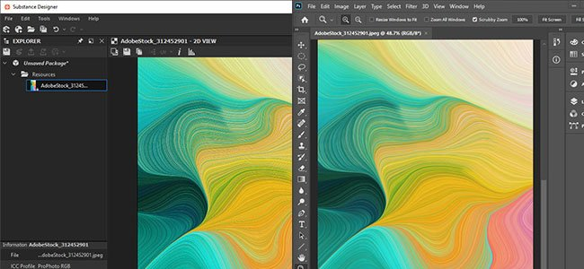
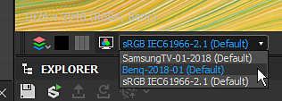
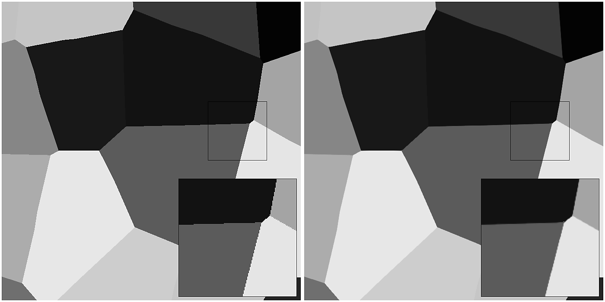

# 버전 2020.1 (10.1)

**Substance Designer 2020.1**&#x200B;에는 새로운 단축키 편집기, MaterialX 플러그인, Adobe Color Engine 및 새로운 베이커 기능을 사용한 색상 관리를 위한 많은 새로운 개선 사항이 포함되어 있습니다.

출시일: *2020년 4월 10일*

>[!NOTE]
>
> 이 릴리스부터 애플리케이션 버전 번호의 형식이 변경됩니다. **2020.1**&#x200B;이어야 하는 항목이 이제 **10.1.0**&#x200B;이(가) 됩니다.

## 주요 기능

### 노드 생성을 위한 새 단축키 편집기

이 버전에서는 다양한 그래프 모드에서 노드를 빠르게 만드는 키보드 단축키를 정의할 수 있는 새로운 단축키 편집기를 소개합니다.

새 단축키 편집기는 **편집 > 환경 설정 > 바로 가기**&#x200B;를 통해 기본 환경 설정에서 액세스할 수 있습니다. 기본적으로 모든 단축키 필드는 비어 있습니다.

* 각 그래프 유형에 대한 **바로 가기**\
  정규 합성 그래프에서 함수 및 MDL과 같은 더 발전된 그래프에 이르기까지, Substance Designer에서 사용할 수 있는 각 그래프 유형에 대한 단축키를 정의할 수 있습니다.

  
* **원자 노드 및 사용자 지정 필터에 대한 단축키 할당**\
  기본적으로 인터페이스는 각 그래프 유형에 대한 원자 노드를 표시합니다. 검색 필드를 사용하면 목록을 구체화할 수 있을 뿐만 아니라 다음과 같은 사용자 정의 라이브러리 필터 및 노드에 액세스할 수 있습니다.

  
* **새 단축키 만들기**\
  특정 노드에 대한 새 단축키를 만들려면 해당 노드의 이름 옆에 있는 텍스트 필드를 클릭하고 키보드에서 요청된 키를 입력하면 됩니다. 단축키를 지우려면 십자 버튼을 사용합니다.

  
* **단축키 충돌 관리**\
  충돌에 대해 자세히 알아보려면 경고 아이콘의 도구 설명을 사용하십시오. 키가 기존 키와 충돌하거나 응용 프로그램에서 다른 목적으로 이미 사용하고 있는 경우 언급합니다.

  

  
* **바로 가기 검색**\
  추적할 단축키가 너무 많거나 노드가 기본적으로 표시되지 않는 경우 검색 시스템을 사용하여 격리합니다.

  

### 새 MaterialX 플러그인(Beta)

SIGGRAPH 2019 동안 우리는 Substance Designer MaterialX 플러그인을 시연했다. [MaterialX](http://www.materialx.org/)은(는) [ILM(산업 조명 및 매직)](https://www.ilm.com/)에서 개발한 형식으로 아티스트는 다양한 플랫폼과 다양한 용도(예: 영화, TV 쇼, 게임, VR 경험 및 제조)에서 사용할 수 있는 재질을 만들 수 있습니다. 이제 베타에서 사용할 수있는 이 새로운 플러그인은 다른 호환 DCC 응용 프로그램에서 사용할 MaterialX 재질을 만들 수 있습니다. 이 새로운 플러그인의 프로세스 및 목표에 대해 자세히 알아보려면 MaterialX에 대한 [기사](https://magazine.substance3d.com/research-a-portable-shader-graph/)를 살펴보십시오.

이 새 플러그인은 다음을 수행할 수 있습니다.

* 절차적 셰이더와 텍스처를 동시에 개발합니다.
* 런타임에 변경 가능한 세부 정보 맵 및 절차 마스크와 같은 기능을 사용하여 Substance Painter을 위한 고급 셰이더를 만듭니다.
* Substance Designer 및 Substance Painter 뷰포트의 게임 엔진 또는 VFX 파이프라인에서 셰이더 기능을 일치시킵니다.

플러그인을 가져오려면 [Substance share](https://share.substance3d.com/libraries/6111)&#x200B;(으)로 이동하여 다운로드하십시오.

### 새로운 Adobe Color Engine 통합(ACE)

이제 OpenColorIO 외에 Adobe Color Engine(ACE)를 사용하여 색상 관리를 위한 ICC 프로필을 지원할 수 있습니다. 즉, 이제 Photoshop 및 Illustrator과 같은 다른 소프트웨어와 일치하도록 보정 이미지를 가져오고 내보낼 수 있습니다.

* **Adobe Color Engine 사용**\
  프로젝트 설정을 사용하여 사용할 색상 관리 시스템을 정의합니다.

  
* **화면 프로필 변경**\
  2D 또는 3D 보기를 통해 이미지를 미리 볼 때는 드롭다운을 사용하여 사용할 프로필을 지정합니다.

  
* **레거시 색상 관리용 ACES**\
  이제 ACES 톤 매핑 출력 변환을 레거시 색상 관리 모드에서 사용할 수 있습니다.

### 개량된 제빵사

우리는 두 가지 주요 변화로 일부 제빵사를 다듬었습니다.

* **향상된 샘플링**\
  앰비언트 오클루전, Thickness 및 곡률 베이커는 이제 베이킹 결과의 품질을 크게 향상시키는 새로운 샘플링 방법을 사용합니다. 이는 샘플 카운트를 증가시킬 필요 없이 보다 매력적인 노이즈 및 보다 안정적인 결과를 생성한다. 아래 이미지는 왼쪽에서 오른쪽으로 4, 8 및 16개의 샘플을 사용하여 위쪽에 있는 이전 샘플링 방법과 아래쪽에 있는 새 방법을 보여 줍니다(모든 렌더링은 4x4 서브샘플링으로 설정된 앤티 앨리어싱을 사용하여 수행됨).

  {width="600px"}
* **새 정규화 설정**\
  Thickness 및 Heightmap 베이커에는 0~1 범위의 고정된 값 대신 텍스처에 원시 값을 베이킹할 수 있는 새로운 정규화 매개 변수가 있습니다. 예를 들어, 낮은 폴리 및 높은 폴리 메시 사이의 원시 거리를 알기 위해 높이 맵에 유용합니다. 제수 값은 높은-폴리 메쉬 실루엣과 일치하도록 낮은-폴리 메쉬 상에 셋업하기 위한 변위 강도에 정확히 대응한다. 높이 맵을 올바르게 해석하기 위해 0에 해당하는 픽셀 값을 정의하기 위해 새로운 &quot;스칼라 제로 값&quot; 매개변수를 노출했습니다. 또한 수동 요소는 UV 타일 당 정규화로 인해 UDIM 메시에 발생할 수 있는 잠재적인 심 문제를 해결할 수 있습니다.

  

### 개선된 3D 보기

3D 뷰는 일상 업무를 보다 쾌적하게 만드는 삶의 질을 다양하게 개선했습니다.

* **렌더러 간 매개 변수 동기화**\
  이제 셰이더 매개 변수가 OpenGl과 Iray 간에 동기화되어 이들 매개 변수 사이를 훨씬 쉽게 이동할 수 있습니다.
* **텍스처 입력 미리 보기 표시 및 사용 안 함 매개 변수 추가**\
  셰이더 입력 매개 변수는 이제 해당 입력의 미리 보기를 표시합니다. 균일 색상 매개 변수, 그래프 노드 또는 비트맵일 수 있습니다. 매개변수를 선택 해제하여 일시적으로 비활성화할 수도 있습니다.

  

  
* **설정의 환경 맵 미리 보기**\
  **3D 보기 > 환경 > 편집**(으)로 이동하면 장면을 비추는 데 사용되는 환경 맵의 미리 보기가 있습니다.

  
* **조명되지 않은 새 셰이더**\
  &quot;unlit&quot;이라는 새 셰이더가 기본적으로 포함되었습니다. 이 효과는 어떠한 조명에도 반응하지 않으며, 대신 메시를 통해 뷰포트에 단일 텍스처를 표시하는 데 사용할 수 있습니다. 예를 들어, 이 기능은 구운 텍스처를 확인하는 데 유용합니다.

  {width="500px"}
* **뷰포트 다운스케일링을 사용하여 높은 DPI 화면에서 향상된 성능**\
  Substance Painter과 마찬가지로 이제 기본 환경 설정에 **뷰포트 비율**&#x200B;이라는 새 매개 변수가 있습니다. 이 매개 변수는 스크린에서 HDPI 비율(예: MacOS의 Retina 스크린)을 사용하고 뷰포트 해상도를 2로 자동으로 나눕니다. 이 비헤이비어를 사용하면 뷰포트를 너무 높은 해상도로 그릴 필요가 없으며 일반적인 성능을 향상시킬 수 있습니다.\
  현재 설정 값은 다음과 같습니다.

  * **없음**: 뷰 포트 크기 조정이 없습니다.
  * **자동**(기본값): 응용 프로그램이 HDPI 화면에 있으면 뷰포트 해상도가 두 개로 나뉩니다.

  

### 새 콘텐츠

이 릴리스에는 다음과 같은 몇 가지 새로운 노드 또는 개선된 노드도 포함되어 있습니다.

* **개선된 PBR 렌더링 노드**\
  이전 버전에서 이미 도입된 이 노드는 크게 개선되었습니다. 이제 카메라 컨트롤, 새로운 모양(평면 및 실린더 등), 포스트 효과(필드 깊이, 흐림/눈부심, 비네팅 등) 및 새로운 재질 유형(클리어 코트 및 비등방성 등)을 제공할 뿐만 아니라 불투명도가 적용된 재질 지원도 제공합니다.\
  자세한 내용은 전용 [문서 페이지](../../../compositing-graphs/nodes-reference-for-com/node-library/material-filters/pbr-utilities/pbr-render/pbr-render.md)를 참조하세요.

  {width="250px"}

  {width="250px"}

  {width="250px"}
* **새 PBR 렌더링 매핑 노드**\
  이 새 노드를 PBR 렌더링 확장으로 사용하여 합성 맵-채널 미리 보기를 작성할 수 있습니다.\
  자세한 내용은 전용 [문서 페이지](../../../compositing-graphs/nodes-reference-for-com/node-library/material-filters/pbr-utilities/pbr-render-mapping/pbr-render-mapping.md)를 참조하세요.

  {width="250px"}

  {width="250px"}
* **새 FXAA 필터**\
  새 필터에는 앤티 앨리어스 방법인 FXAA(Fast Approximate Anti-aliasing) 알고리즘이 구현됩니다. 불규칙한 선이나 가장자리를 매끄럽게 하는 데 일반 텍스처에 사용할 수 있습니다.\
  자세한 내용은 전용 [문서 페이지](../../../compositing-graphs/nodes-reference-for-com/node-library/filters/effects/fxaa/fxaa.md)를 참조하세요.

  {width="600px"}
* **새 Hald CLUT 필터**\
  이 필터를 사용하면 입력 LUT(Look Up Table)로 이미지의 톤과 색상을 조정할 수 있습니다. Hald CLUT 형식을 사용하여 ID LUT [여기서 사용 가능](http://www.quelsolaar.com/technology/clut.html)에서 간단히 시작하는 LUT를 만듭니다.\
  자세한 내용은 전용 [문서 페이지](../../../compositing-graphs/nodes-reference-for-com/node-library/filters/adjustments/hald-clut/hald-clut.md)를 참조하세요.

  {width="600px"}

## 릴리스 정보

### 2020.1.3

*(2020년 6월 11일 릴리스)*

**추가됨:**

* [Content] 안전한 변환 회색 음영 노드에서 &#39;매트 색상&#39; 매개 변수를 표시합니다.
* [Content] PBR 렌더링: 사용자 정의 배경 입력 옵션 추가
* [콘텐츠] 파노라마 조명 노드: 배경 이미지에서 색상을 샘플링하는 새로운 옵션
* [매개 변수] [노출 매개 변수] 창 목록에서 &#39;지원되지 않음&#39; 플래그를 사용하여 매개 변수를 숨깁니다.

**고정:**

* [3D 보기] 특정 경우에 사용자 정의 메쉬를 전환할 때 충돌이 발생함
* [3D 보기] 시작할 때 표준 형식이 항상 DirectX 상태입니다
* [내용] 3D Worley 노이즈: 높은 격자 크기 값을 사용할 때 아티팩트를 렌더링합니다.
* [Content] 디졸브 노드 혼합이 올바르지 않습니다.
* [내용] PBR 렌더링: 조리기 경고 제거
* [내용] PBR 렌더링: 경우에 따라 결과에 음수 색상이 포함되어 있습니다
* [Cooker] 다중 출력 인스턴스 노드에 대한 캐시 삽입 문제
* [Explorer] 표시된 MDL 그래프가 포함된 패키지를 닫을 때 충돌함
* [그래프] 2 패스 요리: 노드 유형 변경으로 인해 재코드가 트리거되지 않음
* [그래프] 연결을 사용하는 동안 입력을 삭제할 때 충돌이 발생합니다
* [그래프] 링크 끝점을 빈 공간으로 이동할 수 있습니다.
* [MDL] MaterialX 그래프에서 MDL 내보내기를 취소할 때 충돌이 발생함
* [MDL] MDLE로 내보내기를 취소하는 동안 오류가 발생했습니다.
* [사전 설정] 사전 설정에 포함된 매개 변수 유형을 변경한 후 [사전 설정] 탭에서 충돌이 발생합니다
* [리소스] 비UDIM으로 연결된 메시의 그래프 컨텍스트 메뉴에서 재료 목록이 비어 있습니다.

### 2020.1.2

*(2020년 4월 27일 릴리스)*

**추가됨:**

* [Content] Alchemist 필터 템플릿 추가
* [콘텐츠] PBR 렌더링: 확산/Specular 그림자 강도를 제어하기 위한 매개 변수를 추가합니다
* [Content] 모양 조명 노드: 카메라 위치 매개 변수 추가
* [뉴스] 창을 처음 표시할 때 그룹 &#39;화살표&#39; 스타일이 깨집니다.
* [베이커] 2D 보기에 Z 단축키를 추가하여 1:1로 이미지를 표시합니다.
* [Project] 목록에서 $(PROJECT\_DIR) 별칭 숨기기
* [Explorer] 디스크에 파일이 아닌 리소스에 대해 사용자 지정 리소스를 만들지 않습니다.

**고정:**

* [Player] SBS 패키지를 로드할 때 누락된 별칭을 보고합니다.
* [Player] 임의 시드 값을 10진수 단위로 표시합니다.
* [Player] Substance Designer에 포함된 모든 환경 맵 번들
* [Player] macOS High Sierra 종료 시 충돌
* [Player] sbs://을 사용하는 패키지를 로드할 수 없음
* [내용] 3D Worley 노이즈: 높은 격자 크기 값을 사용할 때 아티팩트를 렌더링합니다.
* [Content] &#39;Wave&#39; 노드에서 &#39;greaterThanZero&#39; 입력이 사용되지 않습니다.
* [Content] 평면 광원: 월드 공간 위치 모드가 작동하지 않음
* [내용] 구 빛: 내부 조명 위치가 올바르게 작동하지 않습니다.
* [베이커] &#39;모든 베이킹된 맵 새로 고침&#39;이 실행되는 동안 베이킹 창에서 베이킹할 때 충돌이 발생합니다
* [베이커] 일반 지도와 함께 낮음을 높음으로 사용하여 메시에서 AO용 Optix에서 베이킹 실패
* [베이커] UVTiles 미리 보기의 해상도가 화면 크기와 일치하지 않습니다.
* [3D 보기] 기본값이 texture2d가 아닌 경우 MDL을 로드할 때 할당된 비트맵이 재정의됩니다.
* [3D 보기] 속성이 재설정된 후 재질 속성 위젯이 변경됨
* [3D 보기] 표준 형식 전역 환경 설정이 더 이상 작동하지 않음
* [MatX] 라이브러리: MaterialX 그래프 범주에 사용 가능한 노드가 모두 표시되지 않습니다.
* [MatX] 사용자 정의 그래프의 컨텍스트 메뉴에는 &#39;노드 추가&#39; 폴더의 빈 하위 폴더가 포함될 수 있습니다.
* [SBSAR] 기본 입력이 목록의 첫 번째 입력으로 되돌아갑니다.
* [라이브러리] 여러 그래프가 있는 SBSAR의 첫 번째 그래프만 포함됩니다.
* [사용자 정의 그래프] 현재 그래프 유형에 속하지 않는 노드는 경우에 따라 자동으로 만들어집니다
* [Iray] 상자 투영 &#39;깊이&#39; 매개 변수가 제대로 작동하지 않습니다.
* [환경 설정] 프로젝트 설정에서 레이아웃 개선
* [Parameters] 매개 변수를 삭제한 후 위치 위젯을 이동할 때 충돌이 발생합니다
* [UI] 출력 노드에서 사용 계층 구조를 변경할 때 충돌이 발생합니다.
* [그래프] 주석 및 배지 있는 노드에서 선택 상자를 사용하는 동안 충돌이 발생합니다.

### 2020.1.1

*(2020년 4월 10일 릴리스)*

**고정:**

* [3D 보기] 그래프를 합성할 때 메모리 사용량이 너무 높음
* [Content] &#39;Polygon&#39; 노드의 정사각형이 아닌 출력에 예기치 않은 모양이 있습니다.
* [내용] PBR 렌더링: 정사각형이 아닌 해상도를 사용할 때 직교 카메라가 올바르게 작동하지 않음
* [내용] PBR 렌더링: 소용돌이치는 보크로 이미지 테두리 밝기가 증가합니다
* [색상 관리] 새 비트맵 대화 상자의 색상 피커에는 색상이 적용되지 않습니다.
* [색상 관리] 2d 보기의 페인트 및 벡터 도구의 색상 피커는 색상 관리를 사용하지 않습니다.

### 2020.1.0

*(2020년 4월 9일 릴리스)*

**추가됨:**

* [단축키] 노드 생성을 위한 단축키 관리자
* [Content] 새 PBR 렌더링 노드
* [콘텐츠] 새 FXAA 필터
* [콘텐츠] 새로운 하드 CLUT 필터
* [Content] &#39;자르기&#39; 노드에서 필터링 노출
* [3D 보기] 셰이더 매개 변수/텍스처 할당 워크플로 개선
* [3D 보기] 조명되지 않은 새 셰이더
* [3D 보기] 변위 셰이더에 &quot;스칼라 0 값&quot;을 추가합니다
* [3D 보기] 높은 DPI가 활성화된 경우 옵션을 추가하여 뷰 포트 해상도 다운스케일
* [3D 보기] GLSLFX: sampler에 gui 정보 설정 허용(기본값, 최소, 최대, guiMin, guiMax, guiStep, guiWidget, guiName, guiGroup)
* [3D 보기] 장면 메뉴에서 &#39;메시로 상태 불러오기...&#39; 옵션을 추가합니다.
* [3D 보기] 레거시 색상 관리 모드에서 ACES 톤 매핑 출력 변환을 추가합니다.
* [베이커] AO, 곡률, 굽힘 표준, Thickness 베이커의 새로운 샘플링 방법
* [베이커] Height 및 Thickness 베이커의 새로운 표준화 옵션
* [색상 관리] Adobe ACE(Adobe Color Engine) 통합
* [색상 관리] ICC 프로필이 없는 경우 기본 동작을 설정하는 옵션을 추가합니다.
* [매개 변수] 슬라이더가 Substance Painter과 일관되게 증가하도록 만들기
* [패키징] Python 스크립트에 대해 가능한 한 많은 Qt dll을 번들로 제공합니다.
* [프로젝트] 읽기 전용 프로젝트 파일에 대한 설정을 비활성화하고 해당 상태를 명확하게 전달합니다
* [환경 설정] 응답 및 계산 기간과 관련된 명확하지 않은 특정 설정 숨기기
* [UI] Pow2 -> 2Pow 이름 바꾸기
* [속성] 합성 그래프 속성 표시 최적화
* [AXF] AXF SDK 1.7.1로 업데이트합니다.

**고정:**

* [3D 보기] 주변광 매개 변수는 활성화된 경우에도 볼 수 없습니다
* [3D 보기] glslfx: 색상 위젯은 항상 알파가 없는 vec3입니다
* [3D 보기] 리소스에서 설정한 환경 맵이 장면 리소스에 저장되지 않습니다.
* [3D 보기] Iray: 주변광은 장면 원점의 점광으로 변환됩니다.
* [3D 보기] glslfx: 색상 위젯은 항상 알파가 없는 vec3입니다
* [매개 변수] 특성 그룹에서 인스턴스 패키지 URL이 올바르지 않습니다.
* [매개 변수] 매개 변수를 표시할 때 충돌이 발생합니다
* [매개변수] 커브 노드의 매개변수에서 아이콘이 올바르게 정렬되지 않습니다.
* [매개 변수] &#39;Text&#39; 노드 문자열은 표시될 때 &#39;Preview&#39; 모드에서만 표시됩니다.
* [Parameters] &#39;Visible If&#39; 문에 사용된 입력 매개 변수의 이름을 변경할 때 충돌이 발생합니다
* [Parameters] 매개 변수에 함수 세트가 있는 레벨 노드를 삭제할 때 충돌이 발생합니다
* [UI] 입력 매개 변수 목록의 경고 아이콘이 기존 단추의 맨 위에 배치됩니다.
* [UI] 특정 경우 올바른 입력 매개 변수 항목에 대한 경고가 지워지지 않습니다.
* [UI] &quot;메시 UDIM ?&quot; 방지 메시 UV가 [0,1] 타일에 엄격하게 있을 때 표시되는 팝업
* [UI] 간단한 마우스 커서를 사용하여 마우스 휠을 사용하여 사전 설정 드롭다운 목록을 스크롤할 수 있습니다.
* 그래프 특성의 [UI] &#39;출력 계산&#39; 옵션의 이름이 잘못되었습니다.
* [MDL] SBS 그래프 리소스를 MDL 그래프에 배치할 때 충돌
* [MDL] 이미지 입력이 있는 SBS 노드가 제대로 작동하지 않음
* [MDL] 잘못된 텍스처 바인딩 및 사용 이름
* [Graph] &#39;Material&#39; 링크 생성 모드에서 입력 값 그룹 및 사용이 무시됩니다.
* [그래프] 입력 값은 부울 입력 데이터 대신 기본값을 사용합니다.
* [베이커] 특정 경우에 탄젠트 노멀 맵을 사용하여 월드 스페이스 표준 베이커에서 잘못된 표준입니다.
* [베이커] 미리 보기 창이 열린 상태에서 베이킹할 때 과도한 메모리 사용
* [사전 설정] 손상된 사전 설정으로 인해 렌더링 충돌 발생
* [Presets] 이전 SBS의 부울 매개 변수는 사전 설정의 영향을 받지 않습니다.
* [라이브러리] 열려 있는 첫 번째 패키지의 리소스가 노드 만들기 부동 메뉴에 나열됩니다
* [Publish] SBSAR에 게시하면 macOS의 SBSCooker에서 오류 코드 13이 반환됩니다.
* [Publish] SBSAR에 게시할 때 SBSCooker에서 사용되지 않는 인수 경고
* [API] .sbsar 파일에서 가져온 패키지에서 메타데이터를 가져올 수 없습니다
* [내보내기] 레거시 모드에서 colorspace 옵션이 특정 출력에 대한 기본값으로 다시 되돌아갑니다
* [2D 보기] 클립보드에 복사하면 색상 관리 상태가 고려되지 않습니다
* [Unix] Designer은 시스템 신호를 무시합니다.
* [라이브러리] 번역된 태그로 인해 라이브러리의 일부 필터가 제대로 작동하지 않습니다.
* [밥솥] 음수의 제곱근은 NaN 대신 0을 반환해야 합니다.
* [2D 보기] 첫 번째 페인트 획의 실행을 취소한 후 빨강 및 파랑 채널이 전환됨
* [콘솔] 콘솔에 경고 메시지가 너무 많습니다. &quot;QPixmap::scaled: Pixmap이 null pixmap입니다.&quot;
* [Content] &quot;Shape Glow&quot;: 요리 경고
* [종속성] 다른 패키지에 있는 그래프를 메시에 할당해도 종속성이 생성되지 않습니다.
* [Iray] 형상을 전환한 후 재질 속성이 비활성화됩니다.

**추가됨:**

* [단축키] 노드 생성을 위한 단축키 관리자
* [Content] 새 PBR 렌더링 노드
* [콘텐츠] 새 FXAA 필터
* [콘텐츠] 새로운 하드 CLUT 필터
* [Content] &#39;자르기&#39; 노드에서 필터링 노출
* [3D 보기] 셰이더 매개 변수/텍스처 할당 워크플로 개선
* [3D 보기] 조명되지 않은 새 셰이더
* [3D 보기] 변위 셰이더에 &quot;스칼라 0 값&quot;을 추가합니다
* [3D 보기] 높은 DPI가 활성화된 경우 옵션을 추가하여 뷰 포트 해상도 다운스케일
* [3D 보기] GLSLFX: sampler에 gui 정보 설정 허용(기본값, 최소, 최대, guiMin, guiMax, guiStep, guiWidget, guiName, guiGroup)
* [3D 보기] 장면 메뉴에서 &#39;메시로 상태 불러오기...&#39; 옵션을 추가합니다.
* [3D 보기] 레거시 색상 관리 모드에서 ACES 톤 매핑 출력 변환을 추가합니다.
* [베이커] AO, 곡률, 굽힘 표준, Thickness 베이커의 새로운 샘플링 방법
* [베이커] Height 및 Thickness 베이커의 새로운 표준화 옵션
* [색상 관리] Adobe ACE(Adobe Color Engine) 통합
* [색상 관리] ICC 프로필이 없는 경우 기본 동작을 설정하는 옵션을 추가합니다.
* [매개 변수] 슬라이더가 Substance Painter과 일관되게 증가하도록 만들기
* [패키징] Python 스크립트에 대해 가능한 한 많은 Qt dll을 번들로 제공합니다.
* [프로젝트] 읽기 전용 프로젝트 파일에 대한 설정을 비활성화하고 해당 상태를 명확하게 전달합니다
* [환경 설정] 응답 및 계산 기간과 관련된 명확하지 않은 특정 설정 숨기기
* [UI] Pow2 -> 2Pow 이름 바꾸기
* [속성] 합성 그래프 속성 표시 최적화
* [AXF] AXF SDK 1.7.1로 업데이트합니다.
