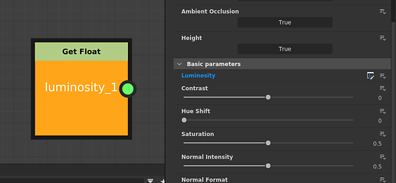
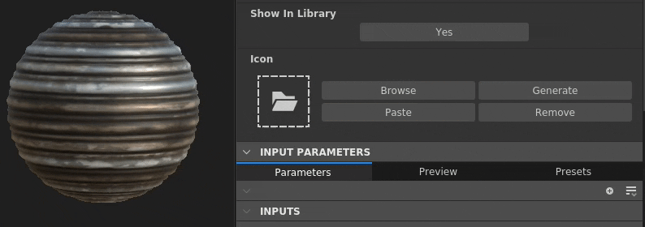
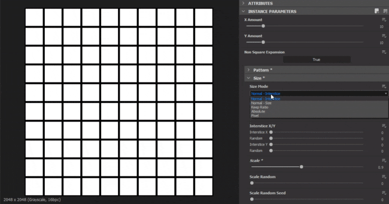

# 버전 2020.2 (10.2)

**Substance Designer 2020.2**&#x200B;은(는) 새로운 Substance 엔진 업데이트, 매개 변수 노출에 대한 향상된 워크플로, 일부 성능 개선 및 새로운 콘텐츠를 제공합니다.

출시일: *2020년 10월 12일*

## 주요 기능

### 새 엔진 업데이트(버전 8)

이 새로운 버전에서는 Substance 엔진이 버전 8에 추가되었으며 다음과 같은 새로운 기능과 몇 가지 개선 사항을 제공합니다.

* **입력 이미지에 대한 기본값**\
  이제 그래프의 이미지 입력이 기본 색상을 정의할 수 있으므로 해당 입력에 아무 것도 로드되거나 연결되지 않은 경우 적절한 값으로 되돌릴 수 있습니다.

  {width="600px"}

* **새로운 거리 모드**\
  [거리 노드](../../../compositing-graphs/nodes-reference-for-com/atomic-nodes/distance/distance.md)에는 계산 방법을 변경하는 두 가지 새로운 모드가 있습니다.

  * **유클리드**(원본 모드): 유클리드 기하학에서 점 사이의 직선 거리.
  * **맨해튼**: 지점 간의 거리이지만 도시 블록과 비슷한 그리드에서 제한됩니다.
  * **체비쇼프**: 균일한 크기의 격자에 있는 두 점의 차이에서 최대 거리.

  {width="600px"}

* **새 그레이디언트 보간**&#x200B;[&#x200B;그레이디언트 노드](../../../compositing-graphs/nodes-reference-for-com/atomic-nodes/gradient-map/gradient-map.md)에는 더욱 자연스러운 색상 전환을 생성하는 키를 보간하는 새 모드 **매끄럽게**&#x200B;가 있습니다. 그것은 이웃의 열쇠를 보면서 작동한다. 이전 모드 **보간**&#x200B;의 이름이 **플랫 탄젠트**(으)로 바뀌었습니다.

  {width="600px"}

  

  또한 **매끄럽게** 모드에 대한 추가 매개 변수가 있으며, 이는 색상 간에 혼합되는 곡선을 계산하는 데 사용되는 접선의 길이를 제어합니다. 값을 0으로 지정하면 접선 길이가 0이고, 값을 1로 지정하면 접선 길이가 두 키 사이의 절반이 됩니다.

  

* **개선된 곡선 노드**&#x200B;[&#x200B;곡선 노드](../../../compositing-graphs/nodes-reference-for-com/atomic-nodes/curve/curve.md)는 이제 회색 음영 이미지를 직접 출력할 수 있습니다. 이러한 변경으로 인해 그레이디언트 텍스처를 먼저 연결하지 않고도 곡선을 정의하고 직접 출력할 수 있습니다.

  

### 노출 매개 변수 개선

매개 변수를 노출하고 편집하는 작업 과정이 더 간단해졌습니다.

* **개선된 메뉴 작업**&#x200B;노출된 매개 변수를 표시하고 편집하는 작업이 더 명확하게 구분되었습니다. 노출된 매개 변수를 보다 쉽고 빠르게 편집할 수 있는 새로운 단축키 또한 도입되었습니다. 예를 들어 이제 매개 변수의 함수를 편집하는 전용 버튼과 노출된 그래프 매개 변수로 이동하는 전용 액션이 있습니다.

  

  

* **대화 상자에서 직접 새 매개 변수 구성**&#x200B;매개 변수를 표시할 때 **매개 변수 표시** 대화 상자에서 설명 및 기본값과 같은 모든 일반 컨트롤에 액세스할 수 있습니다. 이렇게 하면 새 Graph 매개 변수를 훨씬 쉽고 빠르게 구성하고 만들 수 있으므로 매개 변수를 만든 후 바로 Graph 매개 변수 보기로 이동할 필요가 없습니다.

  {width="600px"}

### Substance 그래프의 아이콘 구성이 개선되었습니다.

향상된 인터페이스를 통해 이제 Substance 그래프에서 축소판을 훨씬 쉽게 설정할 수 있습니다.

* **자동 그래프 축소판 생성**\
  이제 그래프 매개 변수에서 아이콘 옆에 있는 [생성] 버튼을 클릭하면 Substance 그래프에 대한 미리보기를 자동으로 생성할 수 있습니다. 현재는 금속/거칠기 PBR 워크플로우를 출력 노드로 사용하는 그래프만 지원합니다. 축소판을 생성할 때 정의된 경우 변위 값에서 물리적 크기 강도가 계산됩니다. 계산하지 않는 경우 기본값은 0.1입니다.

  {width="600px"}

* **새 단추로 사용자 지정 축소판 추가**\
  사용자 정의 축소판 설정을 단순화하기 위해 몇 가지 새로운 버튼이 추가되었습니다.

  * **찾아보기**: 파일 대화 상자를 열어 이미지를 로드합니다. 또한 버튼 옆에 있는 폴더 아이콘을 클릭하여 수행할 수도 있습니다.
  * **생성**: 바로 위의 데모를 확인하십시오.
  * **붙여넣기**: 클립보드에서 이미지를 로드합니다.
  * **제거**: 아이콘에 현재 할당된 이미지를 제거합니다.

  

### 향상된 성능

이 새로운 릴리스에서는 반복 간 시간을 단축하는 두 가지 새로운 최적화가 이루어졌습니다.

* **그래프 계산 성능 향상**\
  이제 출력 노드는 도중에 중간 노드를 계산하는 대신 요청 시 직접 계산됩니다(이제 두 번째 단계에 있음). 이렇게 변경하면 루트 노드를 수정하더라도 그래프 결과를 훨씬 더 빠르게 미리 볼 수 있습니다. 아래의 비교에서 이 최적화를 사용하면 동일한 기간 동안 그래프의 더 많은 반복을 볼 수 있습니다(여기서는 4K 해상도의 물질이 있음).

  

* **베이커 확장 및 확산 생성 개선**\
  베이크 텍스처의 확장 및 확산을 생성하는 것은 이제 이전 버전보다 최대 4배 더 빨라졌습니다. 이렇게 하면 베이크 사이의 대기 시간이 줄어듭니다.

  

### 새 콘텐츠

이 릴리스에서는 몇 개의 새 노드가 추가되고 기존 노드에 대한 추가 가능성이 표시됩니다.

* **[새 한계값 필터](../../../compositing-graphs/nodes-reference-for-com/node-library/filters/adjustments/threshold/threshold.md)**&#x200B;이 노드를 사용하면 회색 음영 입력을 기반으로 이미지의 일부를 흑백 마스크로 빠르게 분리할 수 있습니다. 이는 기존의 히스토그램 스캔 필터와 실제로는 유사하지만, 하루 단위로 더 편리하게 사용할 수 있습니다. [전용 문서 페이지](../../../compositing-graphs/nodes-reference-for-com/node-library/filters/adjustments/threshold/threshold.md)를 사용하여 자세한 내용을 확인하십시오.

  {width="650px"}

* **[새 횡단면 필터](../../../compositing-graphs/nodes-reference-for-com/node-library/filters/effects/cross-section/cross-section.md)**&#x200B;이 노드를 사용하면 회색 음영 입력의 모양을 프로필로 시각화하여 이 필터를 디버그 도구로 사용하면 높이 맵 및 모양을 훨씬 쉽게 만들 수 있습니다. 자세한 내용은 [전용 문서 페이지](../../../compositing-graphs/nodes-reference-for-com/node-library/filters/effects/cross-section/cross-section.md)를 참조하세요.

  {width="600px"}

  {width="600px"}

* **개선된 [Tile Generator](../../../compositing-graphs/nodes-reference-for-com/node-library/texture-generators/patterns/tile-generator/tile-generator.md) 및** [**타일 Sampler**](../../../compositing-graphs/nodes-reference-for-com/node-library/texture-generators/patterns/tile-sampler/tile-sampler.md)\
  이제 이러한 두 노드에는 추가 기능과 사용을 확장하기 위한 새 매개 변수가 있습니다.

  * **비율 유지**: 타일의 비율을 유지하므로 X축과 Y축의 개수가 균일하지 않을 경우 크기를 수동으로 보상할 필요가 없습니다.
  * **절대**: 타일을 최종 이미지 너비의 미리 정의된 백분율로 유지합니다.
  * **픽셀**: 타일 크기를 픽셀 단위로 정의합니다.

  자세한 내용은 [전용 문서 페이지](../../../compositing-graphs/nodes-reference-for-com/node-library/texture-generators/patterns/tile-generator/tile-generator.md)를 참조하세요.

  

### 기타

**Iray**&#x200B;가 Nvidia의 새로운 Ampere GPU(예: RTX 3080 및 RTX 3090)를 지원하는 버전 2020.1.0으로 업데이트되었습니다.

## 릴리스 정보

### 2020.2.0

*(2020년 10월 12일에 릴리스됨)*

**추가됨:**

* [Content] &quot;Cross Section&quot; 노드 추가
* [Content] 함수에 &quot;Cross product vec2&quot; 함수를 추가합니다.sbs
* [Content] &quot;Get Size&quot; 값 노드 추가
* [Content] 함수에 &quot;Orthogonal vec2&quot; 함수를 추가합니다.sbs
* [Content] functions.sbs에 Average 함수를 추가합니다.
* [Content] 임계값 필터 추가
* [내용] 색상 일치: 마스크 입력을 추가하여 필터를 적용할 위치를 지정합니다
* [내용] Tile Generator/Sampler: 패턴 크기를 제어하는 새 옵션 추가
* [Content] 이미지 입력에 대한 기본값으로 PBR 렌더링 노드 업데이트
* [Parameters] 인스턴스 매개 변수에서 문제를 강조 표시하는 경고 아이콘을 추가합니다.
* [Parameters] 함수가 적용된 매개 변수를 포함하는 입력/출력에 대해 표시 If 문 무시
* [Parameters] 그룹 연결을 위한 UX 개선
* [Parameters] 단일 매개 변수를 노출하는 방법 재작업
* [Parameters] 노출된 매개 변수를 강조 표시합니다.
* [Parameters] 사용하지 않는 매개 변수의 정리 개선
* [엔진] 곡선 노드: 곡선 텍스처를 출력하는 새로운 옵션
* [엔진] 입력 이미지의 기본값
* [엔진] 거리 노드: 새로운 거리 모드(맨해튼 및 체비쇼프 거리)
* [엔진] 그레이디언트 노드: 색상 간 더 자연스러운 혼합을 위한 새로운 보간 모드
* [엔진] 이제 일부 매개 변수가 다른 매개 변수에 따라 회색으로 표시됩니다.
* [UX] 색상 피커의 16진수 필드에서 6자리 RGB 색상 적용
* [UX] 주석 속성을 선택하는 즉시 표시하지 않습니다.
* [UX] 그룹 이름 쓰기를 시작할 때 관련 그룹을 표시합니다.
* [UX] 그래프 출력을 다시 내보내는 단축키
* [UX] 모든 Dropdown-textfield-combobox를 일반 combobox와 다르게 보이게 합니다.
* [GraphRender] 노드 축소판을 하나씩 표시하며 해당 축소판이 모두 계산된 경우에만 표시됩니다
* [GraphRender] 그래프 렌더링 중 취소 지연 개선
* [GraphRender] 렌더링 진행률 표시줄의 정확도를 높입니다
* [썸네일] 썸네일(아이콘) 자동 계산
* [썸네일] UX를 재작업하여 패키지에 썸네일(아이콘)을 추가합니다
* [환경 설정] 새 사용자에 대해 기본적으로 GPU 광선 추적 활성화
* [환경 설정] 3DView / OpenGL / 품질: 샘플 수에 대한 슬라이더를 보다 직관적인 선택 목록으로 바꿉니다
* [베이커] 포스트 프로세스 성능 향상
* [색상 관리] 환경 설정 대화 상자에 현재 작업 색상 공간을 표시합니다.
* [Iray] 호환되는 GPU가 없는 경우 CPU 모드로 자동으로 전환합니다.
* [성능] 원하는 노드를 계산하기 위해 응답 시간을 개선합니다(이제 먼저 계산됨).
* [Python API] 탐색기 도구 모음에 아이콘을 추가하는 새로운 메서드 addActionToExplorerToolbar
* [리소스] FBX 2020.0.1로 업그레이드
* [iRay] Iray 2020.1.0으로 업데이트
* [API] 색상 관리 설정 및 속성에 Python 액세스 권한 추가

**고정:**

* [그래프] 마스터 크기 또는 uv 타일을 변경해도 현재 렌더링이 취소되지 않습니다
* [Graph] 출력 연결을 이동한 다음 Alt+LMB를 누르면 충돌이 발생합니다
* [그래프] 재료 또는 작은 재료 모드에서 연결을 이동할 때 충돌이 발생합니다
* [Graph] 입력 노드에서 비트맵 리소스를 미리 볼 수 없습니다.
* [Graph] 인스턴스에서 노드 호환성이 중단되었습니다.
* [Graph] 그래프 매개 변수를 변경할 때 너무 많은 노드가 무효화됩니다.
* [콘텐츠] &#39;모양 돌출&#39; 출력 모양이 특정 경우에 뒤집힙니다. 새로운 버전이 필요하거나 이전 버전은 사용되지 않습니다.
* [Content] 색상 일치 노드에서 사용자 정의 색상 변형을 사용하는 경우 결과가 잘못되었습니다.
* [내용] Atlas Scatter에서 X/Y 양 비율에 의한 크기는 반대의 효과를 갖습니다.
* [내용] 모양 물방울의 X/Y 양 비율별 크기는 반대의 효과를 냅니다
* [3D 보기] 패키지에서 Scene 리소스를 로드한 후 실행 취소 작업 시 충돌이 발생합니다
* [3D 보기] 경로에 특수 문자가 있는 별칭이 있는 경우 사용자 정의 환경이 SBSSCN에 저장되지 않습니다.
* [3D 보기] 재질 설정에서 표준 형식을 전환하면 뒤집힌 상태가 됩니다
* [UI] &#39;기본으로 설정&#39; 단추 텍스트가 표시 영역에서 오버플로됩니다.
* [UI] 윈도우 모드에서 작업할 때 주 창 위치가 올바르게 복원되지 않음
* [UI] 창을 전체 스크린하거나 화면 가장자리 근처에서 드래그하면 상태 표시줄 텍스트가 오프셋됨
* [Iray] 렌더러 간 전환 시 &quot;잘못된 태그&quot; 메시지와 충돌
* [Iray] 비불투명 표면에 보이는 얼굴
* [사전 설정] 일부 Substance Source 그래프의 인스턴스에 사전 설정을 적용할 때 충돌이 발생함
* [사전 설정] sbs 인스턴스에서 실행 취소 후 잘못된 이름이 표시됨
* [렌더링] 미리 보기 모드에서 매개 변수를 수정할 때 렌더링이 잘못됨
* [베이커] 여러 베이킹된 맵을 새로 고치면 경고가 발생하여 일부 베이크가 차단됩니다
* [Cooker] SBS 인스턴스에서 SBSAR 노드를 수정하면 인스턴스에서 0이 출력됩니다.
* [Explorer] &#39;Substance Player에서 저장하고 열기&#39;를 사용할 때 사용자 지정 별칭이 전달되지 않음
* [그레이디언트 편집기] 절대 색상 선택은 선택한 모든 키에 영향을 주지 않습니다
