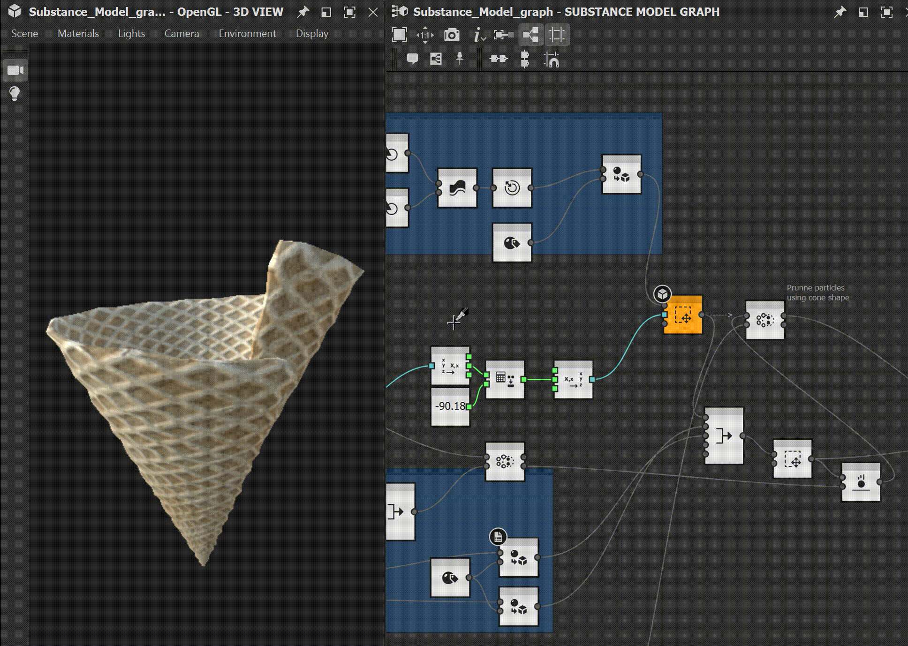

# 버전 12.2

<b>Substance 3D Designer 12.2</b>에서는 Apple Silicon 컴퓨터(M1)에 대한 기본 지원과 Substance 모델 그래프에 대한 일부 개선 사항 및 기타 간단한 업데이트를 제공합니다. 이 페이지에서는 이 새 버전에 관한 모든 세부 사항을 설명합니다.

출시일: *2022년 7월 19일*

## 주요 기능

### Apple Silicon(M1) 칩에 대한 기본 지원

Designer 12.2 버전은 M1 칩 기반의 새로운 Apple 시스템을 완벽하게 기본 지원하는 최초의 버전입니다. 이전에 Designer을 Apple Silicon 장치에서 기술적으로 실행할 수 있었지만 기본 지원을 통해 더 빠르고 효율적인 환경을 제공합니다. 아래 이미지에서 확인할 수 있듯이 이러한 컴퓨터의 새 버전에서는 계산이 *최대 2배 빨라집니다*.

{width="600px"}

### Substance 모델 그래프 개선 사항

* <b>노드의 도구 설명\
  </b>노드가 아이콘과 제목만으로 수행하는 작업을 설명할 수 없는 경우도 있습니다. 따라서 라이브러리 또는 그래프 보기에서 *노드에 대한 전체 설명*&#x200B;이 포함된 도구 설명이 제공됩니다. 원하는 노드를 찾거나 해당 기능이 무엇인지 더 잘 이해하는 데 도움이 됩니다. 

* 노드 만들기 <b>바로 가기\
  </b>가장 많이 사용되는 노드를 빠르게 만들기 위해 이제 다른 유형의 그래프와 같이 [환경 설정]에서 나만의 단축키를 정의할 수 있습니다.

* <b>노드 컨텍스트 메뉴에서 노드를 미리 봅니다.\
  </b>최신 릴리스에서는 키보드 단축키(노드에서 *SHIFT+클릭*) 덕분에 3D 보기에서 노드를 미리 볼 수 있는 가능성이 추가되었습니다. 이 기능은 이제 *노드 컨텍스트 메뉴*&#x200B;에서도 사용할 수 있어 더 쉽게 검색할 수 있습니다.

  {width="600px"}
* <b>노드 호환성을 기반으로 검색\
  </b>노드 메뉴에서 노드를 찾을 때(그래프 보기에서 *스페이스바*&#x200B;를 눌러 액세스 가능), 이제 그래프에서 *현재 선택한 노드와 호환되는*&#x200B;노드만 표시하기 위해 노드가 올바르게 필터링됩니다. 원하는 노드를 빠르게 찾는 데 도움이 됩니다.

### 기타

* <b>2D 보기 개선 사항</b>\
  이전 버전에서는 Substance 그래프의 *상황에 맞는 메뉴*&#x200B;를 통해 3D 보기에서 그래프의 출력을 볼 수 있었지만, 2D 보기에서는 그래프 출력을 볼 수 없었습니다. 이 옵션이 이제 이 메뉴에 추가되어 2D 보기에 표시할 모든 그래프 출력을 나열하는 하위 메뉴가 표시됩니다.\
  2D 보기 도구 모음의 &quot;출력 보기&quot; 버튼도 동작을 더 명확하게 하기 위해 아래쪽 화살표와 도구 설명으로 업데이트되었습니다.\
  마지막으로, [환경 설정]의 &quot;그래프를 로드할 때 그래프 출력 자동 표시&quot; 옵션은 그래프를 로드할 때 자동으로 열리고 채워야 하는 보기를 제어할 수 있도록 *2D 보기 및 3D 보기에 대해 각각 두 개의 별도 설정으로 분할*&#x200B;되었습니다.

* <b>CLO 템플릿</b>\
  CLO 소프트웨어와의 상호 운용성을 향상시키기 위해 *새 전용 템플릿*&#x200B;을 추가했습니다. CLO에서 재질을 올바르게 가져오는 데 필요한 모든 *메타데이터*&#x200B;를 그래프에 자동으로 추가합니다.

  {width="600px"}

* <b>VFX 참조 플랫폼 요구 사항</b>\
  VFX 참조 플랫폼은 소프트웨어 간의 비호환성을 최소화하기 위해 VFX 산업용 모든 소프트웨어에서 사용할 도구 및 라이브러리 버전 목록을 매년 게시합니다. 평소와 같이 이러한 모든 권장 사항을 적용하기 위해 *모든 종속성을 업데이트*&#x200B;합니다.

## 릴리스 정보

### 12.2.0

*(2022년 7월 19일 릴리스)*

<b>추가됨:</b>

* [Apple] 기본 Apple Silicon(M1) 지원(Creative Cloud 버전만 해당)
* [Substance 모델 그래프] 그래프 뷰에 노드 도구 설명 표시
* [Substance 모델 그래프] 라이브러리에 노드 도구 설명 표시
* [Substance 모델 그래프] 컨텍스트 메뉴 항목을 추가하여 노드를 미리 봅니다.
* [Substance 모델 그래프] 사용자가 노드 생성에 대한 단축키를 생성할 수 있도록 허용
* [UI] Substance 그래프의 컨텍스트 메뉴에서 &quot;2D 보기에서 출력 보기&quot; 옵션 추가
* [UI] &quot;출력 자동 표시&quot; 설정을 2D 보기/3D 보기별 설정으로 분할
* [UI] 2D 보기 도구 모음의 &quot;출력 보기&quot; 버튼에 드롭다운 화살표 및 도구 설명을 추가합니다
* [UI] 탐색기의 정보 패널에서 항목 재정의 및 재정렬
* [색상 관리] Adobe ACE에 대해 &quot;선형 Adobe RGB(1998)&quot; 및 &quot;Adobe RGB(1998)&quot; 내보내기 색상 공간 추가
* [색상 관리] Adobe ACE용 &quot;선형 Adobe RGB(1998)&quot; 작업 색상 공간 추가
* [색상 관리] OCIO ICC 디스플레이 지원 추가
* [색상 관리] ACE 환경 설정에서 Adobe RGB 작업 색상 공간 숨기기
* [색상 관리] ACE 모드에서 구운 3D LUT의 품질 개선
* [색상 관리] 3D 뷰어에서 새 GPU 백엔드 사용
* [로컬라이제이션] 한국어 전체 업데이트
* [엔진] 버전 8.6.0으로 업데이트
* [그래프] 해당 속성이 비어 있을 때 기본 그래프 식별자를 할당합니다
* [라이브러리] 인스턴스가 아닌 노드에 대한 도구 설명 하이퍼링크 비활성화
* [NewProject] 기본 해상도 업데이트
* [템플릿] CLO 템플릿 추가
* [API] SDSBSCompGraph 개체의 defaultParentSize 속성을 표시합니다.
* [종속성] Alembic을 버전 1.8.3으로 업데이트합니다.
* [종속성] AXF를 버전 1.9.0으로 업데이트합니다.
* [종속성] 버전 1.76으로 업데이트 부스트
* [종속성] FBX를 버전 2020.2.1로 업데이트합니다.
* [종속성] IRay를 버전 2021.1.0으로 업데이트
* [종속성] OpenColorIO를 버전 2.1.1로 업데이트
* [종속성] OpenEXR을 버전 3.1.5로 업데이트
* [종속성] TBB를 버전 2020.3으로 업데이트
* [종속성] USD를 버전 0.22.3으로 갱신
* [제거] 포스트 효과 기능 비활성화(Yebis)
* [Remove] 3D 보기 메뉴에서 &quot;Artstation에 렌더링 저장&quot; 명령을 제거합니다

<b>고정:</b>

* [Substance 모델] 노출을 취소하면 노출된 매개 변수에 설정된 하드 범위가 저장됩니다.
* [Substance 모델] 식별자가 상수 노드에서 사용하기 적합하지 않습니다.
* [Substance 모델] 노드 호환성을 기반으로 검색 개선
* [UI] 폴더 리소스에 대한 &#39;새&#39; 하위 메뉴 순서가 잘못되었습니다.
* [UI] 기본 창의 기본 크기가 매우 작습니다.
* [UI] 도구 모음이 &#39;레이아웃 재설정&#39; 옵션의 영향을 받지 않음
* [UI] 탐색기의 글꼴 리소스 아이콘에 보이는 투명도 격자
* [Cooker] MDL 그래프에 인스턴스화된 Substance 그래프는 항상 완전히 다시 인식됩니다.
* [그래프] 충돌이 비어 있는 그래프에서 복사한 노드를 붙여넣을 때 식별자
* [MDL] 특정 MDL 그래프를 닫을 때 충돌
* [성능] 대용량 패키지를 로드할 때 애플리케이션이 응답하지 않음
* [리소스] 특정 경우에 3D 장면 리소스를 가져올 수 있습니다.
