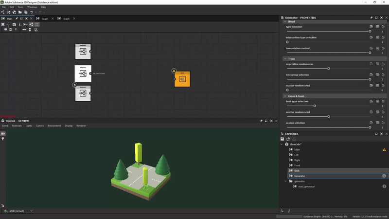
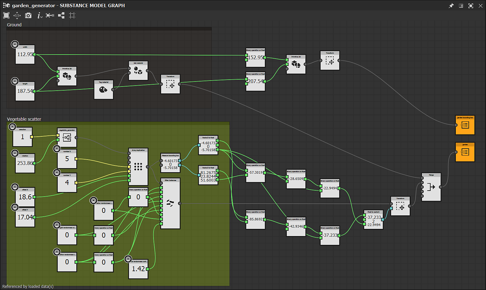
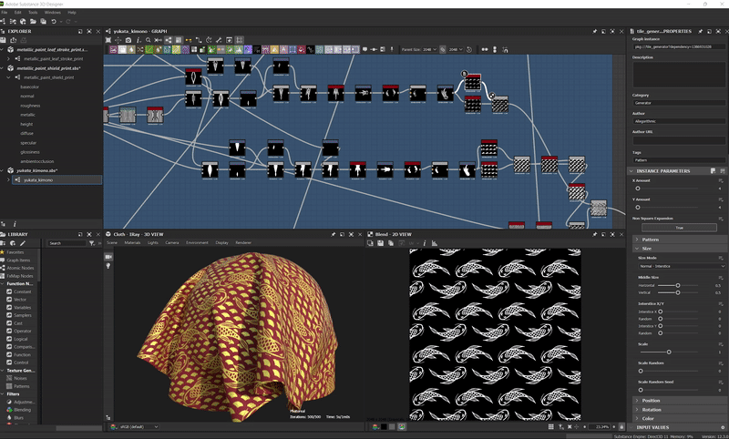

# 버전 12.3

<b>Substance 3D Designer 12.3</b>은 <b>하위 그래프(또는 그래프 인스턴스)의 지원</b>과 <b>을(를) 통해 Substance 모델 그래프를 새로운 수준으로 끌어올려 줍니다. &#39;보이는 경우&#39; </b>노출된 매개 변수 및 곡선 에디션 전용 일부<b>개의 새 노드</b>를 제어합니다. 또한 이 버전에서는 사용자 온보딩을 개선하기 위한 두 개의 새 패널(<b>시작 </b>과 <b>새로운 기능</b>)과 아래에 설명된 일부 기타 부수적인 기능 또는 버그 수정을 도입합니다.

출시일: *2022년 10월 6일*

{width="1111px"}

## 주요 기능

### Substance 모델 그래프에서 그래프 인스턴스 지원

그래프를 만드는 데 익숙한 경우 하위 그래프(또는 그래프 인스턴스)를 만들어 작업을 재사용하고, 그래프를 덜 복잡하게 만들고, 더 효율적으로 만들 수 있어야 합니다.\
이제 Substance 모델 그래프에서도 가능합니다. 하위 그래프를 탐색기에서 기본 그래프로 끌어다 놓으면 인스턴스 노드로 사용할 수 있습니다.

{width="600px"}

또한 출력 장면과 같은 Substance 모델 그래프에 대한 출력 노드의 개념을 도입했습니다. 이제 그래프에 하나 이상의 출력을 가질 수 있습니다.\
그래프가 다른 그래프에서 인스턴스화될 때 각 출력은 출력 핀에 해당합니다.

{width="600px"}

하위 그래프 노드를 마우스 오른쪽 버튼으로 클릭하면 참조된 인스턴스를 보거나 편집할 수 있습니다.

{width="600px"}

하위 그래프 및 노출된 매개 변수 덕분에 아래 그림에 나와 있는 것처럼 복잡한 에셋을 만들고 무한한 변형을 적용할 수 있습니다.

{width="600px"}

### Substance 모델 그래프의 기타 개선 사항

* <b>노출된 매개 변수에 대해 표시되는 경우</b>\
  매개 변수를 표시할 때 다른 매개 변수의 상태에 따라 매개 변수를 숨기거나 표시할 수 있습니다. 예를 들어, 슬라이더는 버튼이 켜져 있을 때만 표시됩니다.\
  <b>Visible If</b>을(를) 사용하여 매개 변수 가시성에 조건을 추가하여 깔끔하고 기능적인 UI를 유지할 수 있습니다. Substance 그래프에 이미 사용할 수 있는 이 메커니즘은 이제 동일한 구문을 사용하는 Substance 모델 그래프로 확장됩니다. <b>\
  </b>

  {width="600px"}

* <b>곡선 에디션 전용 새 노드\
  </b>이 버전에서는 곡선 편집 전용의 몇 가지 새로운 노드를 제공합니다. <b>곡선 반전</b>은 곡선의 두 극점을 교체하고, <b>곡선 세분화</b>는 두 가지 방법에 따라 선분에 더 많은 정점을 추가하며, <b>곡선 매끄럽게 하기 </b>2D 곡선의 모든 각도를 매끄럽게 하고, 마지막으로 <b>오프셋 곡선</b>은 아래와 같이 2D 곡선을 부풀리거나 변형합니다.<b>

  </b>

  {width="600px"}
* <b>새 그래프 창 </b>\
  이제 <b>새 Substance 모델 그래프</b> 창을 Substance 모델 그래프에도 사용할 수 있습니다. 직접 템플릿을 추가하거나 기본 템플릿을 선택한 다음, 그래프 이름을 직접 입력하고 그래프가 추가될 패키지를 선택할 수 있습니다.

  {width="600px"}

### 시작 및 새로운 기능 패널

Designer을 시작하는 데 도움이 되는 두 가지 새로운 패널을 도입했습니다.

먼저, <b>시작 </b>패널(Designer을 처음 *시작*&#x200B;할 때 표시됨)은 Substance 3D 에코시스템에서 소프트웨어 및 소프트웨어의 역할에 대한 전반적인 개요를 제공합니다. 그런 다음 Designer의 *새 버전*&#x200B;을 처음 실행할 때 표시되는 <b>새로운 기능 </b>패널 - 이 버전에 도입된 주요 기능을 빠르게 표시합니다.

이러한 두 패널은 도움말 메뉴에서도 액세스할 수 있습니다.

### 기타

* <b>노출된 부울 매개 변수에 대한 두 개의 단추 위젯</b>\
  이제 Substance 그래프에서 부울 매개 변수를 표시하는 새로운 방법을 사용할 수 있습니다. [전환] 단추 외에도 사용자 지정 텍스트와 함께 <b>나란히 단추</b>를 사용하여 부울 매개 변수에 의해 실행되는 두 가지 서로 다른 모드를 더 많이 볼 수 있습니다.
* <b>높은 DPI 화면에 대한 크기 조정 문제 해결 </b>\
  이전 버전에서는 Designer이 운영 체제에 설정된 비율 인수를 올바르게 처리할 수 없었습니다. 아래 그림에서 볼 수 있듯이 모든 것이 4K 디스플레이에서 완벽하게 관리되며 모든 글꼴과 버튼이 일관된 크기로 표시됩니다.\
  이제 사용 가능한 인터페이스가 필요하지 않으므로 환경 설정의 &#39;높은 DPI 사용 안 함&#39; 옵션이 이 새 버전에서 *거짓*(으)로 다시 설정되었습니다.

  {width="600px"}

* **Steam 버전에 대한 Apple Silicon 기본 지원(M1/M2)**\
  12.2 버전의 Designer은 M1 또는 M2 칩을 기반으로 하는 새로운 Apple 머신을 완전히 지원한 최초의 버전이지만 Steam 버전에는 이러한 지원이 없었습니다. 이제 모든 Designer 사용자는 이러한 컴퓨터에서 더 빠르고 효율적인 경험을 활용할 수 있습니다.

## 릴리스 정보

### 12.3.0

*(2022년 10월 6일 릴리스)*

**추가됨:**

* [일반] 온보딩 패널에서 새 사용자를 시작합니다.
* [일반] 새로운 기능 검색 기능을 개선하는 새로운 기능 패널
* [Substance 모델] 하위 그래프 및 인스턴스 지원
* [Substance 모델] 노출된 매개 변수에 대해 보이는 경우 지원
* [Substance 모델] 출력 노드 지원 추가
* [Substance 모델] 커브 오프셋 노드
* [Substance 모델] 곡선 되돌리기 노드
* [Substance 모델] 커브 스무딩 노드
* [Substance 모델] 곡선 세분화 노드
* [Substance 모델] 이식편 결절
* [Substance 모델] &quot;Filter Scene&quot; 노드 업데이트
* [Substance 모델] [노드] 메뉴에서 원자성 노드가 아닌 노드를 검색할 수 있도록 설정
* [Substance 모델] 인스턴스 노드의 컨텍스트 메뉴에서 &quot;참조 열기&quot; 동작을 추가합니다.
* [Substance 모델] 3DView로 전송할 수 있는 노드의 컨텍스트 메뉴에서 &quot;3DView에서 보기&quot; 동작을 추가합니다
* [Substance 모델] 노드의 속성을 노출한 후 자동으로 표시합니다.
* [Substance 모델] 템플릿 목록이 있는 &#39;새 Substance 모델 그래프&#39; 창 만들기
* [UI] 2D 보기 및 3D 보기에서 이미지 저장 옵션의 일관성 개선
* [UI] 탐색기의 컨텍스트 메뉴에서 &#39;링크 > 3D 메시&#39;의 이름을 &#39;링크 > 3D 장면&#39;으로 바꿉니다
* [UI] 이제 재설정 레이아웃이 모든 부동 창에 적용됩니다.
* [UI] 그래프의 컨텍스트 메뉴에서 &#39;3D 보기에서 출력 보기&#39; 레이블 사용
* [라이브러리] 비원자 Substance 모델 그래프 지원
* [SBSAR] SBSAR의 지원 그래프 출력 설명
* [Shader] 모든 셰이더에 대해 기본 Tessellation Factor 값을 1로 설정합니다
* [UI] 부울 매개 변수에 대한 2버튼 위젯 노출
* [엔진] 버전 8.6.4로 업데이트
* [Steam] Apple Silicon 칩셋(Apple M1/M2)에 최적화된 빌드

**고정:**

* [UI] 높은 DPI 화면에 대한 크기 조정 문제 해결
* [UI] 베이킹 창의 목록에서 &#39;$(udim)&#39; 템플릿이 누락됨
* [UI] 화면 오른쪽 테두리에 [노드] 메뉴를 표시할 때 충돌이 발생합니다(macOS만 해당)
* [UI] 3D 보기 메뉴의 확장 버튼이 표시되지 않음
* [UI] 그래프 도구 모음의 확장 메뉴가 완전하지 않습니다.
* [UI] 하드 범위 활성화를 실행 취소한 후 잘못된 매개 변수 위젯 값
* [3D 보기] 세션에서 다른 세션으로의 Iray에서 기본값이 아닌 셰이더 설정이 손실됩니다.
* [베이커] 메시가 없는 장면에서 베이킹 창을 로드할 때 충돌이 발생합니다
* [함수] 참조된 그래프에 인스턴스를 복사할 때 충돌이 발생합니다
* [함수] 노드를 조작할 때 발생할 수 있는 충돌 수정
* [세계화] 이탤릭체가 일본어/한국어/중국어에서 항상 올바르게 비활성화되지 않음
* [Graph] 새 MDL 및 Substance 모델 그래프에 대한 대체 식별자가 잘못되었습니다.
* [Graph] 값에 의해 제어되는 상속된 매개 변수가 가끔 잘못 계산되기도 합니다
* [GraphRender] 고해상도 그래프를 계산하는 동안 엔진을 전환할 때 충돌 발생(macOS만 해당)
