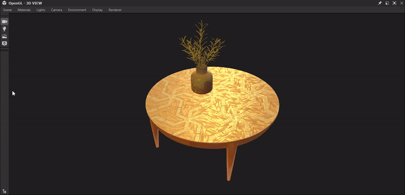

# 버전 12.4

**Substance 3D Designer 12.4**&#x200B;에서는 여러 가지 삶의 질 개선을 제공합니다(그래프를 정리하는 도구, 기본 수식을 사용하여 매개 변수 설정, 임의 시드 생성을 위한 단추, 크기에 대한 잠금 기능 등). Python API에서 Substance 모델 그래프 지원 이러한 모든 변경 사항에 대한 자세한 내용은 아래를 참조하십시오.

출시일: *2023년 1월 31일*

## 삶의 질 향상

### 그래프 정리 도구

그래프를 편집할 때는 여러 가지 가능성을 시험해 보고, 원하는 결과를 얻는 순간까지 다양한 노드를 플러그/플러그를 뽑아야 합니다. 그런 다음 그래프에 출력에 연결되지 않은 노드가 일부 있으므로 최종 결과에는 영향을 미치지 않습니다. 이 새로운 도구를 사용하면 그래프를 마무리하기 전에 이러한 노드를 자동으로 감지하고 삭제할 수 있습니다. 클리닝 툴은 매개 변수 기능도 선택적으로 검색하며, 그래프 보기 툴바의 전용 버튼을 통해 현재 그래프에서 실행하거나 탐색기 보기에서 선택한 그래프에서 실행할 수 있습니다.

{width="640px"}

### 매개 변수 필드에 수식 입력

특정 매개 변수 값을 입력하려는 경우 더 이상 계산기를 사용하거나 머릿속에서 계산할 필요가 없습니다. 이제 등록 정보 및 응용 프로그램의 다른 위치에서 매개 변수의 숫자 값을 설정할 때 추가, 구분, 복제 또는 빼기와 같은 기본 공식을 직접 입력할 수 있습니다.

{width="640px"}

### 3D 보기의 빠른 액세스 단추

[표시](../../interface/3d-view/3d-view.md) 메뉴에서 사용할 수 있는 모든 옵션(예: 와이어프레임, 격자, 테두리 상자 등)에 빠르게 액세스할 수 있도록 [3D 보기](../../interface/3d-view/3d-view.md)에 해당 추가 도구 모음을 추가했습니다 버튼을 켜거나 끌 수 있습니다. 또한 환경 맵을 표시하거나 숨기기 위한 토글을 추가했습니다.

{width="640px"}

### 임의화 생성을 위한 버튼

이제 슬라이더를 이동하는 대신 새 버튼을 사용하여 그래프에 대한 임의 시드를 생성함으로써 다양한 변형을 빠르게 만들 수 있습니다.

{width="640px"}

### 출력 크기 위젯에 대한 잠금

이제 출력 크기의 폭과 Height을 잠가 두 값을 업데이트할 때마다 정확하게 조작하지 않고 정사각형 크기를 유지할 수 있습니다.

{width="640px"}

### 이미지 입력을 색상/회색 음영으로 변환

노드 컨텍스트 메뉴를 통해 [입력 색상](../../compositing-graphs/nodes-reference-for-com/atomic-nodes/input/input.md)과 [입력 회색 음영](../../compositing-graphs/nodes-reference-for-com/atomic-nodes/input/input.md) 사이를 빠르게 전환합니다.

{width="640px"}

### 그레이디언트 편집기를 표시할 때 클릭한 핀 선택

속성 패널에서 핀을 클릭하여 그레이디언트를 편집하면 이제 표시된 [그레이디언트 편집기](../../compositing-graphs/nodes-reference-for-com/atomic-nodes/gradient-map/gradient-map.md)에서 해당 핀이 자동으로 선택됩니다.

{width="640px"}

### 다운스트림 노드 선택

[노드 컨텍스트 메뉴](../../interface/the-graph-view/the-graph-view.md)의 새 항목으로 선택한 노드의 출력에 연결된 모든 노드를 직접 또는 간접적으로 선택합니다. 따라서 노드의 영향을 받는 모든 노드를 선택합니다. 그래프의 일부를 삭제하거나 그래프 레이아웃을 다시 작업하는 데 유용합니다.

{width="640px"}

## Python API 업데이트

이 12.4 버전은 Python API를 통해 Substance 모델 그래프에 대한 완전한 지원도 제공합니다. 이제 Substance 모델 그래프를 만들거나 편집하거나 평가하는 데 필요한 모든 도구가 있음을 의미합니다. 자세한 내용은 소프트웨어 도움말 메뉴에 나와 있는 설명서를 참조하십시오.

## 릴리스 정보

### 12.4.0

*(2023년 1월 24일 릴리스)*

<b>추가됨:</b>

* [3D 보기] 빠른 액세스 버튼을 추가하여 표시 옵션(와이어프레임, 환경 맵, 장면 상태 등) 설정
* [색상 관리] ACE 모드에서 구운 3D LUT의 품질 개선
* [설명서] Substance 그래프용 샘플 프로젝트
* [설명서] 함수 그래프에 대한 샘플 프로젝트
* [탐색기] 위젯을 닫거나 무효화하지 않고 한 마스터에서 다른 마스터로 그래프 및 리소스를 이동할 수 있습니다.
* [그레이디언트 편집기] 그레이디언트 편집기를 표시할 때 클릭한 핀을 선택합니다
* [그래프] 노드의 컨텍스트 메뉴에서 옵션을 추가하여 모든 하위 노드를 선택합니다
* [그래프] 그래프 도구를 정리하여 모든 그래프 유형 및 속성 그래프에서 사용하지 않는 노드를 감지하고 제거합니다
* [그래프] 이미지 입력을 색상/회색 음영으로 변환
* [매개 변수] integer2 위젯에 잠금 추가
* [매개 변수] 매개 변수로 기본 수식을 입력할 수 있습니다.
* [Substance 모델] 값 노드의 값과 아이콘 간에 전환하려면 전환
* [UI] 임의 시드가 필요한 경우 임의 값을 생성하는 버튼
* [UI] [3D 보기]에서 현재 [장면 브라우저]에서 선택한 항목을 강조 표시합니다
* [UX] 값이 재설정될 때 슬라이더 범위 재설정
* [API] 그래프 보기 도구 모음에 동작 추가 허용
* [API] API에서 Substance 모델 그래프를 생성/편집/평가할 수 있습니다.

<b>고정:</b>

* [3D 보기] &#39;DirectX 표준&#39; 속성 값이 렌더러 간에 공유되지 않습니다.
* [3D 보기] 뷰포트가 작을 때 장면 통계 표시 확장
* [3D 보기] 와이어프레임 표시 속성이 저장되지 않음
* [Content] 방사형 흐림 효과 색상 매개 변수는 알파 채널에 영향을 주지 않습니다
* [로컬라이제이션] 환경 OpenGL 속성에 추가 슬라이더와 단추가 표시됩니다.
* [MDL]&#x200B;[Substance 모델] 노출된 노드를 삭제할 때 충돌이 발생합니다
* [환경 설정] 기본\_config 파일을 삭제해도 다시 생성되지 않습니다.
* [Substance 모델] 인스턴스 레벨에서 표시되지 않는 재정렬 매개 변수 충돌
* [API] SDProperty.getDefaultValue()가 거의 항상 None을 반환합니다.
