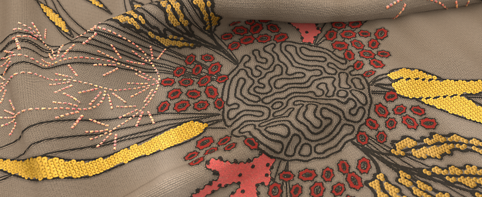
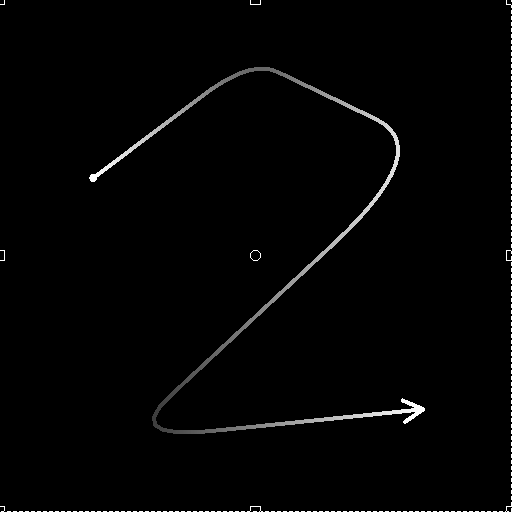
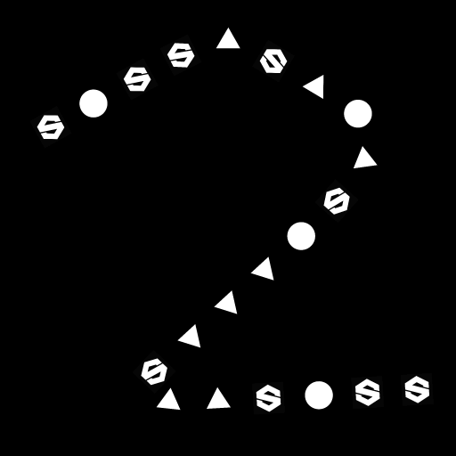

# 버전 13.0

Substance 3D Designer의 이번 13.0.0 릴리스는 엄청난 양의 새로운 노드를 가진, Substance 엔진 9.0이 처음으로 루프를 도입하고, 그래프에 매우 추가된 포털 노드를 통해, 예술가들에게 많은 사랑을 가져다 줍니다. 더 많은 사용자를 만족시키기 위해 새로운 홈 화면을 도입하고 추가 언어를 제공합니다.

이전 버전에서 언급했듯이 이 버전은 더 이상 Substance 모델 그래프를 지원하지 않습니다. Designer에서 이러한 그래프를 더 이상 열거나 편집하거나 내보낼 수 없습니다. 커뮤니티 포럼의 이 [게시물](https://community.adobe.com/t5/substance-3d-designer-discussions/substance-model-graphs-end-of-life/td-p/13693731)에서 이 결정을 내린 모든 이유를 찾을 수 있습니다.

*출시일: 2023년 6월 6일*

*Celine Dameron[&#128279;](https://www.artstation.com/cline)*&#x200B;의 아트워크

## 새 콘텐츠

이 13.0 버전은 많은 새로운 콘텐츠를 제공합니다. 주로 자유 곡선 도구 및 패스 도구의 두 가지 새로운 노드 컬렉션을 찾을 수 있습니다.

* [자유 곡선 도구](../../compositing-graphs/nodes-reference-for-com/node-library/spline-paths-tools/spline-tools/spline-tools.md)은(는) 스플라인을 생성 및 조정하고 이미지를 매핑, 분산 또는 뒤틀기 위해 사용할 수 있는 노드의 컬렉션입니다.
* [패스 도구](../../compositing-graphs/nodes-reference-for-com/node-library/spline-paths-tools/path-tools/path-tools.md)는 마스크에서 윤곽선을 세그먼트 목록 형태로 추출한 다음 편집하고 개선할 또 다른 노드 집합입니다.

이러한 모든 노드는 많은 가능성을 제공하며 많은 크리에이티브 응용 프로그램을 가질 것입니다. [패스 및 자유 곡선 도구 작업](../../compositing-graphs/nodes-reference-for-com/node-library/spline-paths-tools/working-with-path-and-spl/working-with-path-and-spline-tools.md)에 대한 섹션을 살펴보고 이 도구 집합에 익숙해지도록 이해하기 위한 중요한 개념에 대해 알아보세요.

[루이스 멜린](https://www.artstation.com/troglodette)*의*&#x200B;아트워크

### 자유 곡선 도구

스플라인 전용 새 노드는 다음 네 가지 범주로 나눌 수 있습니다.

#### 만들기

첫 번째 범주는 물론 스플라인을 생성하는 것입니다.

* [스플라인 큐빅](../../compositing-graphs/nodes-reference-for-com/node-library/spline-paths-tools/spline-tools/spline-cubic/spline-cubic.md): 두 점과 두 접선;
* [스플라인 폴리 이차(Spline Poly Quadratic)](../../compositing-graphs/nodes-reference-for-com/node-library/spline-paths-tools/spline-tools/spline-poly-quadratic/spline-poly-quadratic.md): 지점 집합에서
* [스플라인 원](../../compositing-graphs/nodes-reference-for-com/node-library/spline-paths-tools/spline-tools/spline-circle/spline-circle.md): 원 모양을 따릅니다.

[2개의 스플라인](../../compositing-graphs/nodes-reference-for-com/node-library/spline-paths-tools/spline-tools/spline-bridge-2-splines/spline-bridge-2-splines.md) 또는 [N개의 스플라인](../../compositing-graphs/nodes-reference-for-com/node-library/spline-paths-tools/spline-tools/spline-bridge-list/spline-bridge-list.md) 사이에 전체 스플라인 집합을 가지려면 스플라인 사이에 <b>브리지 </b>를 만들 수도 있습니다.

<table>
<tr style="border: 0;">
<td style="border: 0;" valign="top">

</td>
<td style="border: 0;" valign="top">

</td>
<td style="border: 0;" valign="top">

</td>
<td style="border: 0;" valign="top">

</td>
</tr>
</table>

#### 어셈블

경우에 따라 여러 스플라인을 단일 엔티티로 취급해야 하므로 스플라인 세트를 관리하는 도구가 필요합니다. [스플라인 병합 목록](../../compositing-graphs/nodes-reference-for-com/node-library/spline-paths-tools/spline-tools/spline-merge-list/spline-merge-list.md)을 사용하면 끝부분을 순서대로 연결하여 모든 스플라인을 하나의 스플라인으로 병합할 수 있습니다. [스플라인 추가](../../compositing-graphs/nodes-reference-for-com/node-library/spline-paths-tools/spline-tools/spline-append/spline-append.md) 노드를 사용하면 스플라인 목록을 다른 목록에 추가할 수 있으며, [스플라인 선택](../../compositing-graphs/nodes-reference-for-com/node-library/spline-paths-tools/spline-tools/spline-select/spline-select.md) 노드를 사용하면 지정된 목록에서 특정 스플라인을 필터링하고 선택할 수 있습니다.

#### 수정

또한 스플라인을 재작업하고 조정할 수 있는 도구도 제공합니다. [뒤틀기](../../compositing-graphs/nodes-reference-for-com/node-library/spline-paths-tools/spline-tools/spline-warp/spline-warp.md)<b>에 회전, 변환, 크기 조정 등 [2D 변형](../../compositing-graphs/nodes-reference-for-com/node-library/spline-paths-tools/spline-tools/spline-2d-transform/spline-2d-transform.md)을 적용할 노드를 찾을 수 있습니다. </b>모양과 [Thickness](../../compositing-graphs/nodes-reference-for-com/node-library/spline-paths-tools/spline-tools/spline-sample-thickness/spline-sample-thickness.md)<b>를 수정할 다른 두 노드 </b>또는 스플라인의 [Height](../../compositing-graphs/nodes-reference-for-com/node-library/spline-paths-tools/spline-tools/spline-sample-height/spline-sample-height.md).

<table>
<tr style="border: 0;">
<td style="border: 0;" valign="top">

</td>
<td style="border: 0;" valign="top">

</td>
<td style="border: 0;" valign="top">

</td>
<td style="border: 0;" valign="top">

</td>
</tr>
</table>

#### 렌더

마지막 범주는 스플라인을 기반으로 최종 모양 또는 패턴을 만드는 것입니다. 가장 먼저 떠오르는 아이디어는 스플라인을 따라 주어진 모양을 반복하는 것입니다. [스플라인 상의 산란](../../compositing-graphs/nodes-reference-for-com/node-library/spline-paths-tools/spline-tools/scatter-on-spline-color/scatter-on-spline-color.md) 노드를 사용하면 많은 매개 변수를 사용하여 분포(회전, 비율 조정, 오프셋, 색상, 마스크 등)를 완벽하게 제어할 수 있습니다.

[스플라인 채우기](../../compositing-graphs/nodes-reference-for-com/node-library/spline-paths-tools/spline-tools/spline-fill/spline-fill.md)<b> 덕분에 </b>노드, 닫힌 스플라인에서 패턴을 쉽게 만들 수 있습니다. 또한 높은 수준의 제어와 정밀도로 모든 텍스처를 스플라인에 매핑하고 싶다면 [스플라인 매퍼](../../compositing-graphs/nodes-reference-for-com/node-library/spline-paths-tools/spline-tools/spline-mapper-color/spline-mapper-color.md) 노드가 자동으로 만들어집니다.

<table>
<tr style="border: 0;">
<td style="border: 0;" valign="top">

</td>
<td style="border: 0;" valign="top">

</td>
<td style="border: 0;" valign="top">

</td>
<td style="border: 0;" valign="top">

</td>
</tr>
</table>

### 경로 도구

[패스에 마스크 적용](../../compositing-graphs/nodes-reference-for-com/node-library/spline-paths-tools/path-tools/mask-to-paths/mask-to-paths.md) 노드를 사용하면 회색 음영 패턴의 테두리를 세그먼트 목록 형태로 추출할 수 있습니다.

그런 다음 필요에 따라 조정하도록 [경로 2D 변환](../../compositing-graphs/nodes-reference-for-com/node-library/spline-paths-tools/path-tools/path-2d-transform/path-2d-transform.md) 또는 [경로 뒤틀기](../../compositing-graphs/nodes-reference-for-com/node-library/spline-paths-tools/path-tools/paths-warp/paths-warp.md) 노드를 사용하여 이러한 경로를 처리할 수 있습니다.  그리고 [스플라인으로 패스](../../compositing-graphs/nodes-reference-for-com/node-library/spline-paths-tools/path-tools/paths-to-spline/paths-to-spline.md) 노드 덕분에 패스를 스플라인으로 변환할 수 있으므로 분산과 같이 이전에 언급한 스플라인 전용의 모든 노드를 활용할 수 있습니다.

<table>
<tr style="border: 0;">
<td style="border: 0;" valign="top">

</td>
<td style="border: 0;" valign="top">

</td>
<td style="border: 0;" valign="top">

</td>
<td style="border: 0;" valign="top">

</td>
</tr>
</table>

또한 이러한 새로운 노드를 모두 학습할 수 있도록 다음 두 가지 새 튜토리얼을 게시했습니다.

* [스플라인 노드 소개](https://www.adobe.com/go/designer-tutorial-splines)
* [경로 노드 소개](https://www.adobe.com/go/designer-tutorial-paths)

## 새 Substance 엔진 v9

위에 나열된 모든 새 노드는 새 Substance 엔진 버전을 기반으로 하며 주요 새 기능 <b>루프</b>를 최대한 활용하고 있습니다.

루프는 [Substance 함수 그래프](../../function-graphs/function-graphs.md) 내에서만 사용되며 [픽셀 프로세서](../../compositing-graphs/nodes-reference-for-com/atomic-nodes/pixel-processor/pixel-processor.md), [Fx-맵](../../compositing-graphs/nodes-reference-for-com/atomic-nodes/fx-map/fx-map.md) 또는 [값 프로세서](../../compositing-graphs/nodes-reference-for-com/atomic-nodes/value-processor/value-processor.md)에서 구현할 가능성이 높습니다. 물론 루프를 사용하면 조건이 준수될 때까지 여러 번 함수를 쉽게 반복할 수 있다. 이렇게 하면 그래프를 밝게 하고 정확도를 높이는 데 도움이 됩니다.

이 전용 [자습서](https://www.youtube.com/watch?v=Ggoy8G90oDI)는 루프 작업을 시작하는 데 도움이 됩니다.

Substance 엔진 v9는 또한 다음과 같은 개선 사항을 제공합니다.

* [그레이디언트 맵](../../compositing-graphs/nodes-reference-for-com/atomic-nodes/gradient-map/gradient-map.md) 노드의 그레이디언트 편집기에서 새 단색 모드(즉, 보간이 전혀 없음)
* Substance 함수 그래프의 Atomic Pow() 노드
* Sampler 노드에 테두리 배치 옵션(클램프를 가장자리로 이동하고 반복) 추가
* [뒤틀기](../../compositing-graphs/nodes-reference-for-com/atomic-nodes/warp/warp.md) 및 [방향 뒤틀기](../../compositing-graphs/nodes-reference-for-com/atomic-nodes/directional-warp/directional-warp.md) 노드에서 가장 가까운 샘플링

## 포털 노드

[포털](../../interface/the-graph-view/graph-items/graph-items.md) 노드는 그래프에서 연결을 숨길 수 있는 [점](../../interface/the-graph-view/graph-items/graph-items.md) 노드의 새 확장입니다.

이 기능 덕분에 매우 긴 연결을 숨겨 그래프의 가독성을 향상시킬 수 있으며 그래프의 아무 곳에서나 주요 노드에 빠르게 액세스할 수 있습니다.

이 새로운 기능은 전용 [튜토리얼](https://www.adobe.com/go/designer-tutorial-portals)에서 자세히 설명합니다.

## 홈 화면

Designer을 시작하면 다른 Adobe 제품에서와 같이 완전히 새로운 [홈 화면](../../interface/home-screen/home-screen.md)에 액세스할 수 있습니다. 이 화면에서 다음 작업을 수행할 수 있습니다.

* 새 그래프를 빠르게 만듭니다.
* 크기, 마지막으로 수정한 날짜 또는 전체 파일 경로와 같은 일부 세부 정보와 함께 Designer에서 최근에 연 모든 파일 목록을 확인합니다.
* 새로운 기능을 소개하거나 빠른 팁을 발견하는 튜토리얼과 같은 학습 리소스에 대한 링크를 찾을 수 있는 학습 페이지.
* 새로운 기능 화면, 정보 화면, Substance 3D 웹 사이트, 지원 커뮤니티 포럼 등에 바로 연결됩니다.

## 새 언어

이 버전에는 세 가지 추가 언어가 포함되어 있습니다.

* 스페인어(스페인);
* 이탈리아어(이탈리아);
* 포르투갈어(브라질).

참고로 Designer에서 언어를 변경하려면 [환경 설정](../../interface/preferences-window/preferences-window.md)으로 이동하면 일반 섹션에서 사용 가능한 모든 언어 목록을 찾을 수 있습니다.

## 릴리스 정보

### 13.0.0

*(2023년 6월 6일 릴리스)*

### 추가됨

* [Graph] 포털 노드
* [온보딩] 새 홈 화면
* [Content] 스플라인(큐빅) 노드
* [Content] 스플라인(폴리 2차) 노드
* [Content] 스플라인 원 노드
* [Content] 포인트 목록 노드
* [Content] 스플라인 브리지(2 스플라인) 노드
* [Content] 스플라인 브리지(목록) 노드
* [Content] 스플라인 추가 노드
* [Content] 스플라인 선택 노드
* [Content] 스플라인 병합 목록 노드
* [Content] 스플라인 2D 변형 노드
* [Content] 스플라인 뒤틀기 노드
* [Content] 스플라인 샘플 Height 노드
* [Content] 스플라인 샘플 Thickness 노드
* [Content] 스플라인 렌더링 노드
* [Content] 스플라인 색상 노드의 산란
* [Content] 스플라인 회색 음영 노드의 산란
* [Content] 스플라인 매퍼 색상 노드
* [Content] 스플라인 매퍼 회색 음영 노드
* [Content] 스플라인 브리지 매퍼 색상 노드
* [Content] 스플라인 브리지 매퍼 회색 음영 노드
* [Content] 스플라인 플로우 매퍼 노드
* [콘텐츠] UV 매퍼 색상 노드
* [콘텐츠] UV 매퍼 회색 음영 노드
* [Content] 스플라인 노드에 대한 경로
* [Content] 경로 노드에 마스크 적용
* [Content] 패스 2D 변형 노드
* [Content] 패스 다각형 노드
* [Content] 패스 미리 보기 노드
* [Content] 경로 뒤틀기 노드
* [Content] Paths 노드 선택
* [Content] 패스 정점 프로세서 노드
* [Content] 패스 정점 프로세서 단순 노드
* [Content] 패스 노드에서 4중 변환
* [내용] 광선 추적형 주변광 오클루전 v2
* [내용] 광선 추적형 구부러짐 수직 v2
* [내용] 광선 추적형 그림자 v2
* [엔진] 버전 9로 업데이트
* [엔진] 함수 그래프의 루프 노드
* [엔진] 그래디언트에 단색 모드 추가
* [엔진] 함수 그래프의 Atomic pow() 노드
* [엔진] Sampler 노드에 테두리 배치 옵션(가장자리로 클램프/반복)을 추가합니다.
* [엔진] 뒤틀기 및 방향 뒤틀기 노드에서 가장 가까운 샘플링
* [엔진] 색상 입력을 위해 선명 효과 필터에 &quot;펀치 스루 알파&quot; 모드를 추가합니다.
* [엔진] FxMap: 반구 모르플렛
* [엔진] 함수 그래프의 Atomic Get/Set 작업
* [엔진] 기능 : log/log2/exp의 정확한 기능을 사용, 2pow - 조리기와 엔진 간의 기능을 통합
* [엔진] [방향 비틀기] 필터에 &quot;강도 오프셋&quot; 매개 변수를 추가합니다.
* [API] 합성 그래프에 대한 사전 설정 관리 지원
* [Functions] 함수 atomic node의 입력 이름을 변경합니다.
* [지역화] 포르투갈어(브라질), 이탈리아어(이탈리아) 및 스페인어(스페인) 언어 추가
* [지역화] 언어 목록에서 &quot;언어(국가)&quot;를 존중합니다.
* [사전 설정] 컨텍스트 편집을 사용할 때 그래프 속성에서 &#39;미리 보기&#39; 및 &#39;사전 설정&#39; 패널 비활성화
* [Substance 모델 그래프] Substance 모델 그래프의 지원 종료

### 수정 사항

* [3D 보기] 장면 통계에서 긴 문자열의 표시가 잘립니다(macOS만 해당).
* [API] &#39;structure::Structure&#39; 모듈이 API 참조에 계속 포함되어 있습니다.
* [API] MDL 그래프의 점 노드에 정의나 속성이 없습니다.
* [API] 함수 노드의 매개 변수를 설정할 때 잘못된 동작이 발생함
* [Content] 3D 보로노이 및 3D Voronoi Fractal 노드가 요리 경고를 생성합니다.
* [엔진] &#39;강도 맵 오프셋&#39; 매개 변수는 SSE2 엔진의 회색 음영 데이터에 영향을 주지 않습니다.
* [Explorer] 그래프 입출력을 삭제할 수 있음
* [Graph] 비트맵은 인스턴스에서 사용될 때 무시됩니다.
* [그래프] 노드에서 노드를 만들 때 점 노드 위치가 잘못되었습니다.
* [Graph] &#39;Enter&#39; 키를 사용할 때 &#39;Expose parameter&#39; 대화 상자에 포커스가 잘못 설정됩니다.
* [그래프] 컨텍스트 편집에서 비트맵을 사용한 막대 그래프 스캔에서 잘못된 결과 발생
* [로컬라이제이션] 다양한 클리핑 문제 해결
* [Parameters] 입력 매개 변수를 삭제할 때 충돌이 발생합니다
* [Publish] 폴더의 그래프가 게시된 패키지의 루트로 이동됨
* [Resources] 디스크에서 로드된 리소스를 업데이트할 때 충돌이 발생합니다
* [VisibleIf] 조건부 가시성 평가에서 회귀 수정
