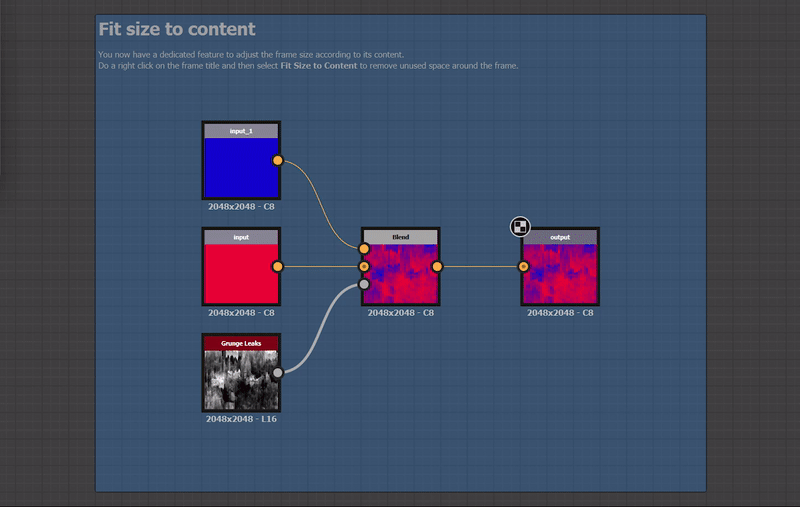

# 버전 13.1

<b>Substance 3D Designer 13.1</b>은 노드 그래프에 프레임 위주로 많은 삶의 질을 향상시켜 재질 제작 경험을 향상시킵니다. 또한 AxF 내보내기가 추가되어 AxF 형식으로 작업하는 사용자가 상호 운용성 워크플로우를 사용할 수 있습니다. 

*출시일: 2023년 12월 12일*

## 프레임 개선

프레임은 그래프를 올바르게 구성하고 읽을 수 있도록 하는 필수 도구입니다. 그것이 우리가 이 새로운 버전에서 그것들을 다듬기로 결정한 이유이다.

### 자동 확장

그래프가 커지면 프레임의 내용을 다시 정렬해야 할 수 있습니다. 노드들은 추가들을 위한 공간을 만들기 위해 시프트될 수 있거나 콘텐츠는 가독성을 증진하기 위해 더 멀리 이격될 필요가 있을 수 있다. 이러한 조정을 용이하게 하기 위해 이제 포함된 개체를 이동할 때 프레임을 자동으로 확장할 수 있습니다. <b>Shift</b>를 누른 상태로 개체를 이동하여 해당 개체를 테두리 내에 계속 자동으로 조정하도록 개체를 이동합니다.

### 콘텐츠에 크기 맞추기

그래프를 조정할 때 프레임이 더 이상 내용에 맞게 조정되지 않을 수 있습니다. 이 새 명령을 사용하면 한 개의 중간 격자 셀의 패딩과 함께 프레임의 위치와 크기를 자동으로 조정하여 내용 범위에 맞게 조정할 수 있습니다. 프레임에 설명이 있는 경우 가능하면 설명 옆에 있는 빈 공간을 사용하도록 조정됩니다.

### 향상된 설명

HTML 코드 덕분에 이제 프레임의 설명에 서식이 지정된 텍스트를 포함할 수 있습니다. 이는 주석에도 적용됩니다.

### <b>...기타 등등!</b>

보다 관대하게 만들기 위한 규칙, 프레임의 크기를 쉽게 조정할 수 있는 인터랙션 영역, 그리드의 노드 순서가 바뀌지 않도록 스냅 규칙, 약간의 신선함을 선사하기 위한 시각적 요소 등 많은 것이 재검토되었습니다. 언제든지 프레임의 [설명서](../../interface/the-graph-view/graph-items/frame/frame.md)를 방문하여 자세히 알아보십시오.

## 삶의 질 향상

* <b>노드 메뉴 개선 사항: </b>필요한 노드를 검색하는 동안 시간을 절약하기 위해 노드 메뉴를 약간 개선했습니다. 검색은 이제 더 관대하며 완벽한 일치가 없더라도 결과를 제공합니다. 또한 이제 위쪽 화살표를 사용하여 목록의 마지막 요소에 직접 액세스할 수 있습니다.
* <b>노드 배치: </b>그래프를 위한 완벽한 레이아웃을 원한다면 이 두 가지 작은 변경 내용이 마음에 들 것입니다! 한 그래프에서 다른 그래프로 노드를 복사/붙여넣을 때 붙여넣은 노드는 이제 기본 격자에 정렬됩니다. 긴 링크에 노드를 추가하면 이 노드는 이제 모든 상황에서 볼 수 있도록 링크의 보이는 부분 가운데에 배치됩니다.
* <b>2D 보기 옵션: </b>[2D 보기](../../interface/2d-view/2d-view.md)의 사용량이 많은 사용자인 경우, 이제 &#39;바둑판 표시&#39;, &#39;보기 크기 유지&#39;, &#39;물리적 크기 사용&#39; 및 &#39;타일링 표시&#39;와 같은 옵션이 저장되므로 새로운 2D 보기를 만들거나 Designer을 다시 시작할 때에도 옵션을 다시 설정할 필요가 없습니다.

## AxF 내보내기

<table>
<tr style="border: 0;">
<td width="25.00%" style="border: 0;" valign="top">

</td>
<td width="100.00%" style="border: 0;" valign="top">

AxF는 [X-Rite](https://www.xrite.com/axf)의 형식입니다. 디지털 디자인 워크플로 전반에 걸쳐 수치 데이터를 사용하여 복잡한 재질 특성을 캡처, 저장, 편집 및 전달할 수 있는 방법을 제공합니다. 이전 버전의 Designer에서는 [AxF 파일을 가져오기](../../resources/axf-appearance-exchange/axf-appearance-exchange-format.md)한 다음 타일링을 개선하거나 절차 효과를 추가할 수 있었지만 그 후에 변경 내용을 새 .sbsar 파일로 내보내도록 제한되었습니다.

이 새로운 릴리스에서는 AxF 재질을 제자리에서 편집한 다음 [변경 내용을 내보내기](../../resources/axf-appearance-exchange/axf-appearance-exchange-format.md)하여 가져온 AxF 파일에 새 레이어로 추가합니다.

</td>
</tr>
</table>

## API

마지막으로 이 13.1 버전은 두 가지 가능성을 추가하여 Python API를 계속 개선합니다.

* <b>&#39;보이는 경우&#39; 속성: </b>이제 그래프 매개 변수, 입력 및 출력에 대해 이 속성을 설정할 수 있습니다.
* <b>그래프 입력/출력 순서:</b> sdsbscompgraph::reorderGraphInput 및 sdsbscompgraph::reorderGraphOutput을 사용하여 필요에 따라 매개 변수를 구성합니다.

>[!NOTE]
>
> Designer 13.1은 Qt5를 기반으로 하는 마지막 주 버전이며 다음 주 버전은 Qt6으로 업그레이드됩니다. 사용자 정의 플러그인에 영향을 줄 수 있습니다.

## 릴리스 정보

### 13.1.0

*(2023년 12월 12일 릴리스)*

### 추가됨

* [프레임] 자동 확장
* [프레임] 오브젝트가 프레임에 속할 때 정의하는 규칙을 변경합니다.
* [프레임] 프레임 설명에 텍스트 비율 조정 사용 안 함
* [프레임] 내용에 크기 맞추기
* [프레임] 새로운 기본, 마우스 오버 및 선택 상태
* [프레임] 큰 격자에 스냅
* [프레임] 프레임 설명에 대한 HTML 코드 지원
* [프레임] 상호 작용 영역 업데이트
* [프레임] 시각적 요소 업데이트
* [그래프] 표시되는 링크의 가운데가 아닌 가운데에 노드를 만듭니다
* [그래프] 선택 항목에서 사용할 수 있는 속성이 있는 유일한 항목인 경우 해당 항목의 속성을 표시합니다.
* [그래프] 그래프의 주석에 대해 &quot;크기 조절&quot; 옵션을 제거합니다.
* [그래프] 복사/붙여넣기를 수행할 때 기본 그리드에 노드를 물립니다.
* [UX] 노드 메뉴 및 라이브러리 검색에서 유사 항목 검색 허용
* [UX] 노드 메뉴 목록 루프N 만들기
* [AxF] AxF 내보내기 지원
* [AxF] Linux에서 AxF 비활성화
* [API] Python API를 사용하여 그래프 매개 변수, 입력 및 출력의 &#39;보이는 경우&#39; 속성을 설정합니다
* [API] Python API를 사용하여 그래프 I/O 순서 설정
* [종속성] 1.80.0으로 업데이트 부스트
* [종속성] OpenSubdiv를 3.5.x로 업데이트
* [종속성] FBX SDK를 2020.3으로 업데이트
* [종속성] NGL을 1.35.0.20(으)로 업데이트
* [색상 관리] OCIO ICC 디스플레이에 대한 지원 추가
* [레벨] 막대 그래프를 재설정하는 방법 추가
* [Python] QtForPython을 가져올 수 없는 경우 사용자에게 경고
* [2D 보기] 보기 옵션의 상태를 저장합니다.
* [3D 보기] 메시 정보 셰이더에 위치 기술 추가
* [내보내기] &#39;설정 저장&#39; 버튼을 추가하여 내보내기 옵션에 대한 변경 내용을 저장합니다

### 수정 사항

* [3D 보기] MDL 재질의 텍스처\_2d 유형 입력에 텍스처를 할당할 수 없습니다.
* [AxF] 템플릿 목록의 그래프 식별자는 비워 둘 수 있습니다.
* [AxF] Substance 그래프 템플릿 필드는 기본적으로 비어 있습니다
* [콘텐츠] Atlas Scatter: 특정 사례에서 잘못된 동작
* [콘텐츠] Flood Fill 매퍼: 모든 모양의 상자 크기가 같은 경우 빈 출력입니다.
* [Content] FloodFill to Position: 일부 상황에서는 불완전한 가공물
* [Content] &#39;BaseColor/Metallic/Roughness converter&#39; 노드에서 &#39;Specular&#39; 출력이 올바르지 않습니다.
* [콘텐츠] 정사각형이 아닌 세로에서 [패스에 마스크 적용]이 작동하지 않습니다
* [Content] 입력 값, 입력 회색 음영, 입력 색상 및 출력 노드에 대한 설명이 없음
* [Content] 세트 및 시퀀스 노드에 대한 설명이 없음
* [Content] 모양 스플래터: &#39;스플래터 데이터 2&#39; 출력의 부정확한 아티팩트
* [엔진] 값 프로세서의 부울은 항상 &#39;거짓&#39;으로 평가됩니다(Apple Silicon 전용).
* [탐색기] 도구 모음 단추의 순서가 OS 간에 일치하지 않습니다.
* [프레임] CTRL 수정자를 사용하여 프레임을 이동할 때 노드를 이동하지 않습니다.
* [그레이디언트 맵] 모두 재설정 옵션을 사용하면 그레이디언트 위젯도 재설정됩니다
* [GraphRender] 미리 보기 모드에서 수정하면 일부 노드가 검은색으로 렌더링됩니다
* [그래프] 기본 부울 값을 변경할 때 &#39;입력 값&#39; 미리 보기가 &#39;False&#39;에 고정됨(Apple Silicon만 해당)
* [그래프] 프레임 가장자리에 가까운 점 노드는 프레임에서 이동하지 않습니다.
* [상호 운용성] Substance 3D Stager으로 보낸 후 재전송 아이콘이 업데이트되지 않음
* [MDL] 이 매개 변수를 사용할 수 있는 노드에서 거칠기를 변경할 수 없습니다.
* [MDL] &#39;AxF에서 금속 거칠기로&#39; 템플릿의 연결이 잘못되었습니다.
* [UI] &#39;출력 내보내기&#39; 창을 최소화할 수 있습니다(Windows만 해당)
* [UI] 디스플레이 비율을 사용할 때 이미지가 [정보] 화면에서 픽셀화되어 나타납니다.
* [UI] 그래프 도구 모음의 노드 정렬 도구에서 여러 실행 취소 단계를 만듭니다.

### 알려진 문제

* [AxF OpenGL Shader] 이방성 분배에 대한 잘못된 Ward
* [AxF OpenGL Shader] 잘못된 기본 거칠음
* [AxF OpenGL Shader] 잘못된 음영 기준 회전
* [AxF OpenGL Shader] 반구 감지 아래의 잘못된 광선
* [AxF OpenGL Shader] 잘못된 기여도 감지
* [AxF] 내보낼 때 &#39;Specular 색상&#39; 맵 값이 올바르지 않음
* [AxF] 미리 보기 및 텍스처가 &#39;AxF 가져오기&#39; 대화 상자에 올바르게 표시되지 않음
* [AxF] &quot;cc no refraction&quot; 속성이 AxF에서 AxF 템플릿으로 올바르게 삽입되지 않았습니다.
