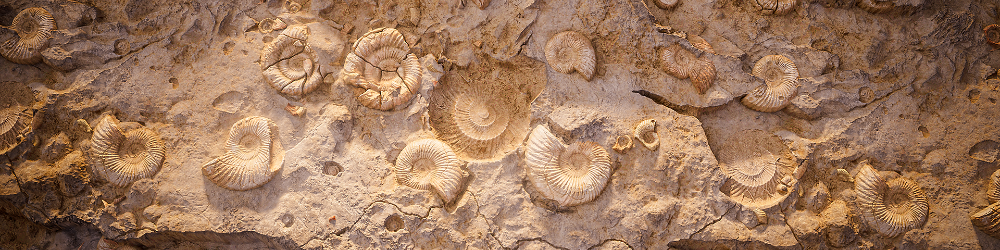
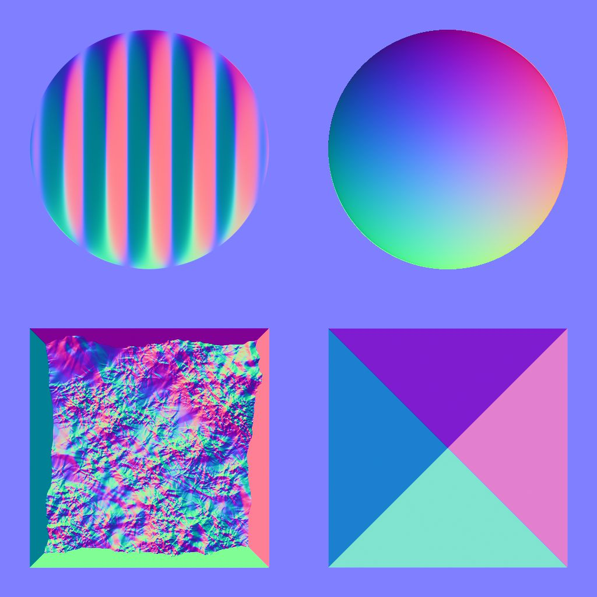

# 버전 14.0

<b>Substance 3D Designer 14.0 </b>은(는) 삶의 질 개선을 제공합니다(그래프 탐색, 성능 등). 그러나 무엇보다도 그것은 많은 새로운 노드를 포함합니다 (색상 조작, Kuwahara 필터, 히스토그램 도구, 베벨 매끄럽게, 방향 거리, ...). 이러한 모든 변경 사항에 대한 자세한 내용은 아래를 참조하십시오.

*출시일: 2024년 7월 30일*

## 새 콘텐츠

이 14.0 버전에서는 아래에 나열된 새 노드로 많은 새 컨텐츠를 제공합니다.

* <b>색상 조정 전용 노드: </b>노드 <b>(</b>[색상 정량화](../../compositing-graphs/nodes-reference-for-com/node-library/filters/adjustments/quantize-color/quantize-color.md)<b>) </b>대<b> </b>이미지의 색상 수를 줄이고 팔레트에서 팔레트를 추출해 내 색상 팔레트를 만들기 위한 도구 노드 모음([보기](../../compositing-graphs/nodes-reference-for-com/node-library/filters/adjustments/view-color-palette/view-color-palette.md) / [만들기](../../compositing-graphs/nodes-reference-for-com/node-library/filters/adjustments/create-color-palette-16/create-color-palette-16.md) / [수정](../../compositing-graphs/nodes-reference-for-com/node-library/filters/adjustments/modify-color-palette/modify-color-palette.md)<b> </b>색상 팔레트)와 ID 맵을 사용하여 다른 이미지에 적용할 색상 팔레트([색상 팔레트 적용](../../compositing-graphs/nodes-reference-for-com/node-library/filters/adjustments/apply-color-palette/apply-color-palette.md)). 또한 ID 맵을 회색 음영 마스크로 변환하기 위한 [회색 음영을 마스킹하는 ID](../../compositing-graphs/nodes-reference-for-com/node-library/filters/adjustments/id-to-mask/id-to-mask.md) 노드를 찾을 수 있습니다. 이 전체 노드 세트를 사용하면 색상을 사용하여 스타일화 효과를 만드는 데 필요한 모든 것을 얻을 수 있습니다.

{zoomable="yes"}

{zoomable="yes"}

* <b>구와하라 필터</b>: 스타일화를 통해 더 나아가고 싶다면 [비등방성 구와하라 색상](../../compositing-graphs/nodes-reference-for-com/node-library/filters/effects/anisotropic-kuwahara/anisotropic-kuwahara.md) / [회색 음영](../../compositing-graphs/nodes-reference-for-com/node-library/filters/effects/anisotropic-kuwahara-gra/anisotropic-kuwahara-grayscale.md) 필터 덕분에 약간의 회화적인 효과를 생성할 수 있습니다. 세부 사항에서는 이미지의 세부 사항에 맞는 비등방성 방향 흐림 효과를 적용합니다. 그 결과 내부 모양 방향으로 흐른 것처럼 보이는 이미지가 만들어집니다.

이러한 노드(색상 정량 및 쿠와하라 비등방성)에 대한 설명은 [이 자습서](https://www.adobe.com/go/designer-tutorial-quantize_kr)에 설명되어 있습니다. 색상과 함께 재질을 스타일화하는 데 사용하는 방법을 더 효율적이고 직관적으로 보여줍니다!

다른 유력한 노드들이 그 당에 합류한다:

* [<b>곡률 매끄럽게</b>](../../compositing-graphs/nodes-reference-for-com/node-library/filters/effects/curvature-smooth/curvature-smooth.md): 이 새로운 버전은 이제 모든 타일링 모드를 올바르게 지원하고 두 개의 새로운 출력(볼록함 및 오목함)을 추가하며 정확도와 성능을 모두 향상합니다.
* <b>[막대 그래프 균일화](../../compositing-graphs/nodes-reference-for-com/node-library/filters/adjustments/histogram-equalize/histogram-equalize.md):</b> 이 노드는 동일한 분포를 갖도록 값을 조정하여 회색 음영 이미지의 막대 그래프를 균일화합니다. 이 노드에는 이미지의 히스토그램을 출력하는 [히스토그램 렌더링](../../compositing-graphs/nodes-reference-for-com/node-library/filters/adjustments/histogram-render/histogram-render.md)과 [히스토그램 계산](../../compositing-graphs/nodes-reference-for-com/node-library/filters/adjustments/histogram-compute/histogram-compute.md)<b>이라는 두 개의 보조 노드가 있습니다. </b>히스토그램을 픽셀 행으로 인코딩합니다.
* <b>[베벨 매끄럽게](../../compositing-graphs/nodes-reference-for-com/node-library/filters/effects/bevel-smooth/bevel-smooth.md):</b> 덕분에 마스크 테두리(바깥쪽, 안쪽 또는 둘 다)에서 그레이디언트나 플랫 색상을 그릴 수 있습니다. [방향 거리](../../compositing-graphs/nodes-reference-for-com/node-library/filters/effects/directional-distance/directional-distance.md)<b> 노드 </b>그래디언트도 특정 방향으로 그립니다.
* <b>[표준 결합 해제](../../compositing-graphs/nodes-reference-for-com/node-library/filters/normal-map/normal-uncombine/normal-uncombine.md):</b> 이 노드는 [표준 결합](../../compositing-graphs/nodes-reference-for-com/node-library/filters/normal-map/normal-combine/normal-combine.md) 노드의 반대이며, Height 맵에서 설명하는 표면 세부 정보를 표준 맵에서 제거합니다.

<table>
<tr style="border: 0;">
<td style="border: 0;" valign="top">

곡률 매끄럽게

<table>
  <tr>
    <td>
      
       <i>이전</i>
    </td>
    <td>
      
       <i>이후</i>
    </td>
  </tr>
</table>

</td>
<td style="border: 0;" valign="top">

막대 그래프 균일화

<table>
  <tr>
    <td>
      
       <i>이전</i>
    </td>
    <td>
      
       <i>이후</i>
    </td>
  </tr>
</table>

</td>
</tr>
</table>

<table>
<tr style="border: 0;">
<td style="border: 0;" valign="top">

베벨 매끄럽게

<table>
  <tr>
    <td>
      
       <i>이전</i>
    </td>
    <td>
      
       <i>이후</i>
    </td>
  </tr>
</table>

</td>
<td style="border: 0;" valign="top">

표준 결합 해제

<table>
  <tr>
    <td>
      
       <i>이전</i>
    </td>
    <td>
      
       <i>이후</i>
    </td>
  </tr>
</table>

</td>
</tr>
</table>

## 삶의 질 향상

* 대형 프로젝트 작업 시 <b>성능 </b>및 <b>반응성</b>이 개선되었습니다. 예를 들어, 노드를 제거하는 것이 최대 75배까지 빨라질 수 있습니다. 동일한 비트맵의 여러 배를 참조하는 그래프의 경우 [조리](../../glossary/glossary.md) 시간도 줄어들었습니다.
* <b>상속된 매개 변수</b>: 매개 변수가 [상속됨](../../glossary/glossary.md)이면 기본값이 표시되지 않고 상속된 값이 표시되므로 현재 사용된 값을 알 수 있습니다. [이 문서 전용 페이지](../../compositing-graphs/inheritance-compositing/inheritance-in-substance-compositing-graphs.md)에서 상속에 대해 자세히 알아보세요.
* macOS에서 <b>트랙패드 지원</b>이(가) 더 자연스럽고 다른 소프트웨어와 일치하도록 완전히 다시 만들어졌습니다. 모든 운영 체제에서 더 매끄럽고 일관성을 유지하기 위해 [그래프 보기](../../interface/the-graph-view/the-graph-view.md)의 테두리를 넘어 노드를 이동하는 것도 다시 고려되었습니다.

* <b>2D 보기: </b>[2D 보기](../../interface/2d-view/2d-view.md)에서 바둑판식 표시를 사용하도록 설정하면 원래 타일에 없는 픽셀에도 값을 가져올 수 있습니다. [샘플링](../../glossary/glossary.md)과 타일 간 값 전환을 확인하는 데 많은 도움이 됩니다.

{width="320px" zoomable="yes"}

* <b>그레이디언트 맵</b>: 마우스 가운데 버튼을 클릭하여 모든 [그레이디언트 키](../../compositing-graphs/nodes-reference-for-com/atomic-nodes/gradient-map/gradient-map.md)를 왼쪽 또는 오른쪽으로 이동하여 모든 키 사이의 간격을 유지합니다.
* <b>매개 변수</b>: 이제 매개 변수를 통해 사용자 지정 함수를 삽입하기 위해 함수 편집 위젯을 사용할 수 있습니다. [Substance 함수 그래프](../../function-graphs/the-function-graph/the-function-graph.md)를 사용하여 매개 변수를 구동하려는 사용자 지정 도구를 만드는 강력한 솔루션입니다.

<table>
<tr style="border: 0;">
<td style="border: 0;" valign="top">

{zoomable="yes"}

</td>
<td style="border: 0;" valign="top">

{zoomable="yes"} 편집

</td>
</tr>
</table>

## API 개선 사항

스크립팅 API에는 네 가지 새로운 메서드가 포함되어 있습니다.

* Substance 합성 그래프의 그래프 유형을 가져오고 설정하는 메서드: myGraph.setGraphType(&quot;newType&quot;) ; myGraph.getGraphType()
* 해당 편집기에서 패키지 리소스를 여는 방법(예: 그래프 보기의 Substance 그래프): myUIManager.openResourceInEditor(myResource)
* 탐색기에서 패키지 리소스를 선택하는 방법(예: Substance 그래프): myUIManager.setExplorerSelection(myResource)
* 그래프 보기에서 특정 노드를 프레임하는 메서드: myUIManager.focusGraphNode(myGraphViewID, myNode)

## VFX 플랫폼 요구 사항

[VFX 참조 플랫폼](https://vfxplatform.com/)은 소프트웨어 간의 비호환성을 최소화하기 위해 VFX 산업용 모든 소프트웨어에서 사용할 도구 및 라이브러리 버전 목록을 매년 게시합니다. 평소와 같이 이러한 모든 권장 사항을 적용하기 위해 *모든 종속성을 업데이트*&#x200B;합니다.

이러한 업데이트는 다음과 같은 두 가지 주요 결과를 초래합니다.

* <b>Linux 요구 사항</b>이 변경되었으며 Designer에 RHEL 버전 8 또는 9가 필요합니다(CentOS는 더 이상 지원되지 않음). 모든 세부 정보는 [시스템 요구 사항](../../getting-started/system-requirements/system-requirements.md) 페이지에서 확인할 수 있습니다.
* 일부 기능은 Qt6에서 더 이상 사용되지 않으므로 Designer용 <b>플러그인은 </b>업데이트해야 합니다. [커뮤니티 포럼](https://community.adobe.com/t5/substance-3d-designer-discussions/plugins-required-updates-in-designer-14-0/td-p/14768559)에서 플러그인을 업데이트하는 데 필요한 모든 정보를 찾을 수 있습니다.

## 릴리스 정보

### 14.0.0

*(2024년 7월 30일 릴리스)*

### 추가됨

* [내용] 새로운 비등방성 구와하라 필터
* [Content] 새 베벨 매끄럽게 노드
* [내용] 새로운 곡률 부드러운 v2 노드
* [Content] 새 방향 거리 노드
* [콘텐츠] 새로운 히스토그램 도구: 계산, 균일화, 렌더링
* [Content] 마스크 노드에 대한 새 ID
* [내용] 새로운 일반 결합 해제 노드
* [Content] 새 팔레트 노드: 만들기, 적용, 수정, 보기
* [내용] 새로운 색상 노드 양자화
* [내용] 균일하지 않은 방향 뒤틀기: 기본 강도 맵 값을 1로 설정합니다.
* [내용] 이러한 버전을 가진 모든 노드 레이블에 &#39;Color&#39; 또는 &#39;Grayscale&#39; 접미어를 추가합니다
* [Content] &quot;White Noise&quot;를 사용하지 않으면 &quot;White Noise Fast&quot;만 유지합니다.
* [Content] Substance 함수 그래프에서 &#39;Negate Float1&#39; 노드 사용 안 함
* [Content] &quot;Quantize Color&quot;의 이름을 &quot;Quantize Color(Simple)&quot;로 바꿉니다
* [2D 보기] 0-1 범위를 벗어나는 픽셀에 대한 값을 [정보] 패널에 표시합니다.
* [Engine][Text] 일부 글꼴에 대한 새로운 커닝
* [그래프] 인컨텍스트 에디션을 사용하는 동안 심층 하위 그래프 편집 시 무효화 시간을 개선합니다.
* [링커] SBSASM에서 비트맵을 복제하지 않습니다.
* [Parameters] 모든 입력 매개 변수 형식에 대해 새 &quot;function&quot; 위젯을 추가합니다.
* [속성] 상속된 매개 변수의 표시 개선
* [UX] 트랙패드 지원 개선 (Mac 전용)
* [UX] 선택하는 동안 그래프 테두리에 도달하면 패닝 현대화
* [UX] &#39;높은 DPI 사용 안 함&#39; 기능 제거
* [브랜딩] 시작 화면 및 정보 창에 대한 새 브랜딩
* [그레이디언트 맵] 모든 키와 루프를 이동할 수 있는 방법을 추가합니다
* [라이브러리] 모든 기본 필터를 문장의 첫 글자만 대문자로 전환
* [API] Graph View 뷰포트에서 특정 노드의 프레임을 지정하는 메서드 추가
* [API] 편집기에서 패키지 리소스를 여는 메서드를 추가합니다(예: 그래프 보기의 Substance 그래프)
* [API] 탐색기에서 패키지 리소스를 선택하는 메서드(예: Substance 그래프)를 추가합니다
* [API] Substance 합성 그래프의 그래프 유형을 가져오고 설정하는 메서드를 추가합니다
* [서드파티] 2023 VFX 플랫폼 권장 사항 준수
* [서드파티] 2024 VFX 플랫폼 권장 사항 준수
* [서드파티] 1.82.0으로 업데이트 부스트 + 23.08로 USD
* [서드파티] NGL을 1.38로 업데이트합니다.
* [서드파티] OpenColorIO를 2.3.x로 업데이트
* [서드파티] OpenExr을 3.2.x로 업데이트
* [ThirdParty] OpenSubdiv를 3.6.x로 업데이트
* [서드파티] Python을 3.11.x로 업데이트
* [서드파티] Qt를 6.5.x로 업데이트합니다.
* [서드파티] gcc를 11.2.1로 업데이트
* [서드파티] glibc를 2.28로 업데이트
* [서드파티] libstdc++ ABI를 C++11 one으로 업데이트
* [설명서] 새 &#39;용어집&#39; 페이지

### 수정 사항

* [베이커] 파일 이름이 변경된 장면을 다시 베이킹할 때 충돌이 발생합니다
* [베이커] 베이커 사전 설정을 JSON 파일에 저장할 때 충돌이 발생합니다
* [Content] &#39;스플라인 시 산란&#39;: 입력 이미지 알파 매개 변수 노출
* [Content] &#39;Tile Sampler Color&#39;: visibleif 표현식이 없습니다.
* [내용] 비등방성 노이즈: X/Y 양에 대한 음수 값이 잘못된 결과를 초래함
* [내용] 비등방성 노이즈: 홀수 값을 X 양과 Smoothness 없음으로 사용할 때 타일링 문제
* [Content] 일반 배포 함수: 잘못 배치된 max()로 인해 NaN이 발생할 수 있습니다.
* [Content] RTAO, Bent Normal 및 RT Shadows가 일부 플랫폼에서 제대로 작동하지 않습니다.
* [콘텐츠] 모양 튄 혼합 색상: OpenGL 표준 맵이 올바르게 혼합되지 않음
* [Content] 노드 레이블에서 &#39;Multi&#39; 접두사 뒤에 공백이 있습니다.
* [종속성] 패키지 내부 또는 패키지 간에 그래프를 이동할 때 충돌함
* [엔진] 경사 흐림 효과 노드에 영향을 미치는 비틀기 노드의 정밀도 오류
* [엔진] SD의 SBSAR 레이어가 2GB보다 큰 SBSASM 콘텐츠로 SBSAR을 읽을 수 없습니다.
* [함수 그래프] 0^n에 대한 잘못된 결과
* [Graph] &#39;노드 크기 표시&#39; 옵션이 잘못 표시됨
* [Graph] 상위 주석을 다른 그래프에 복사할 때 충돌이 발생합니다
* [그래프] Alt 키를 누른 상태에서 점 노드를 드래그하면 멈춤
* [Graph] 경우에 따라 노드 검색에서 일치하는 항목이 누락될 수 있습니다
* [Graph] 수퍼그래프가 열린 상태에서 함수 그래프를 여러 번 인스턴스화할 때 성능 문제가 발생합니다
* [Graph] 출력을 만들 때 무효가 너무 많습니다.
* [Security] ICO 쓰기 범위를 벗어난 취약성 구문 분석
* [보안] 사용하지 않는 일부 이미지 형식의 사용 중단
* [매개 변수] 비트맵 PKG 리소스 경로는 편집할 수 없습니다.
* [매개 변수] 값 프로세서의 매개 변수를 노출/일괄 노출하는 것과 관련된 문제를 해결합니다.
* [매개 변수] 일괄 노출 시 문자열 매개 변수가 무시됩니다.
* [Properties] 속성을 열어 함수 그래프를 여러 번 인스턴스화할 때 성능 문제
* [SVG] 모양 편집이 래스터화된 이미지에 적용되지 않음
* [UI] 스크롤 가능 위젯과 일부 버그/불일치 문제 해결(Windows만 해당)
* [UI] 가져오기/내보내기 목록에서 3D 장면 파일 포맷의 순서가 일치하지 않습니다.
* [UI] 창의 동작이 UI에 복제됩니다.
* [버전 컨트롤] Python 3에서 &#39;perforce.py&#39; 스크립트가 작동하지 않음
