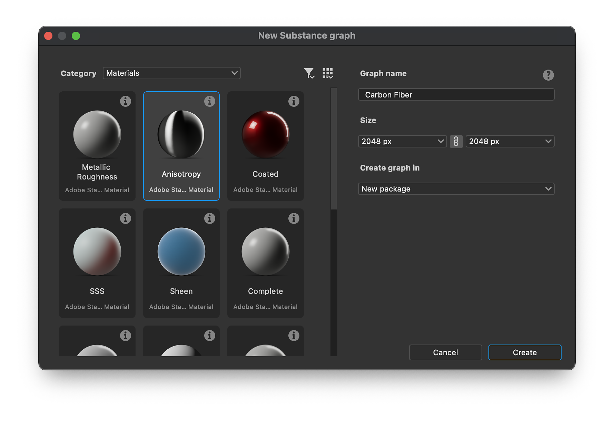
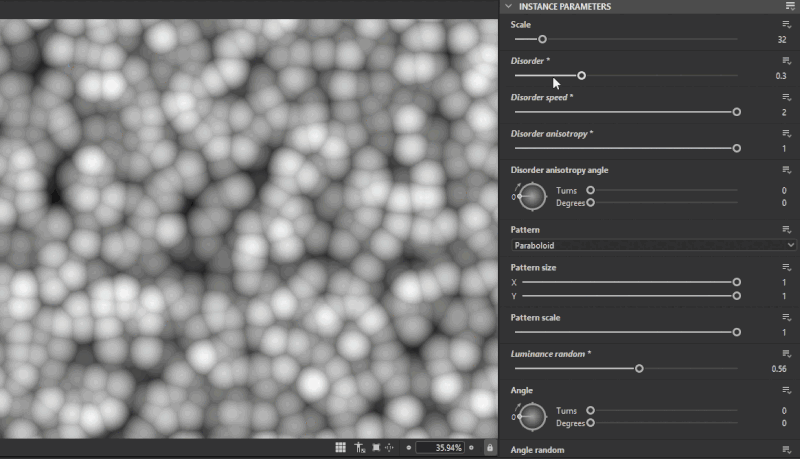

# 버전 15.1

Substance Designer 15.1은 직접 샘플 액세스, 더 큰 창의적 가능성을 위한 개선된 노이즈 노드, 노드 메뉴의 구성된 범주 등이 있는 완전히 개편된 그래프 생성 창을 제공합니다.

*출시일: 2025년 12월 11일*

## 그래프 생성 개선

이 릴리스에서는 Substance 3D Designer의 초기 사용자 경험을 향상시키기 위해 [그래프 만들기 창](../../compositing-graphs/creating-compositing-gra/creating-a-substance-compositing-graph.md)을 <b>전반적으로 다시 디자인했습니다</b>. 이번 업데이트의 기본 목표는 사용자가 요구 사항에 가장 적합한 템플릿을 효율적으로 식별할 수 있도록 템플릿 선택 프로세스를 간소화하는 것입니다.

축소판은 의도한 재질 유형에 대한 즉각적인 <b>시각적 참조</b>를 제공하는 반면, 자세한 도구 설명은 모든 관련 정보를 제공합니다. 개선된 조직의 경우 이제 템플릿은 재질, 필터 및 스캔 처리와 같은 특정 <b>범주</b>로 분류됩니다.

기본 인터페이스가 업그레이드되었지만, 사용자는 목록, 패키지 및 디렉터리 옵션을 포함한 이전 보기에 계속 액세스할 수 있습니다.

[자세히 알아보기](../../compositing-graphs/creating-compositing-gra/creating-a-substance-compositing-graph.md)

{zoomable="yes"}

## 포함된 샘플

새롭게 디자인된 그래프 만들기 창을 시작으로 다양한 [<b>샘플 재질</b>](../../compositing-graphs/creating-compositing-gra/material-samples/material-samples.md)이 소프트웨어 내에 직접 추가되었습니다. 학습 리소스에 대한 액세스 권한 개선 요청에 대한 응답입니다.

{zoomable="yes"}

이러한 요구를 충족하기 위해 직물(가죽 및 새틴 포함), 목재, 금속, 플라스틱, 세라믹 등과 같은 재료 샘플을 포함했습니다. 이러한 예는 프로젝트를 간편하게 시작하고 Substance 3D Designer에서 사용할 수 있는 기본 패밀리 노드를 익히는 데 도움이 되도록 고안되었습니다

각 그래프는 <b>주석 달기</b>되며 신중하게 구성되어 있고 가능한 한 쉽게 이해할 수 있도록 최소한의 노드가 포함되어 있습니다.

새 Substance 그래프를 만들 때 &#39;재질 샘플&#39; 범주의 샘플에 액세스하거나, 편리한 &#39;샘플로 이동&#39; 버튼을 사용하여 [홈] 화면에서 직접 샘플에 액세스할 수 있습니다.

이러한 기본 자료와 함께 <b>FX-맵 및 픽셀 프로세서</b> 기능을 보다 효과적으로 사용하는 방법을 시연하기 위해 <b>고급 샘플</b>도 제공했습니다.

[자세히 알아보기](../../compositing-graphs/creating-compositing-gra/material-samples/material-samples.md)

{zoomable="yes"}

## 새로운 노이즈

대부분의 그래프에서 노이즈가 중요한 역할을 합니다. 따라서 이번 릴리스에서는 기능 및 사용성을 개선하기 위해 몇 가지 주요 개선 사항에 초점을 맞췄습니다.

이 업데이트를 통해 <b>타일링이 아닌 시나리오에 대한 더 나은 지원</b>을 도입하여 노이즈 패턴이 필수 타일링 없이 예상대로 작동하도록 했습니다. 이전에는 타일링을 사용하지 않을 때 노이즈 노드가 강제로 타일링되거나 잘못된 결과가 생성되었습니다.

이제 대부분의 노이즈에 <b>새 매개 변수</b>가 포함되어 사용자가 더 창의적인 제어를 할 수 있습니다. 이러한 추가 옵션을 사용하면 그래프 작성자가 워크플로우 내에서 노이즈의 모양과 동작을 세부적으로 조정할 수 있습니다.

마지막으로 비트 심도는 <b>더 이상 16비트로 하드 잠기지 않음</b>입니다. 이제 개별 노드 인스턴스의 비트 심도 설정을 재정의하여 필요한 경우 더 높은 세부 사항 및 동적 범위를 달성하거나 성능을 위해 그래프를 최적화할 수 있습니다.

아래의 [릴리스 정보](#release-notes)에서 업데이트된 노이즈의 전체 목록을 확인하세요.

예: [셀 1](../../compositing-graphs/nodes-reference-for-com/node-library/texture-generators/noises/cells-1/cells-1.md) [구름 2](../../compositing-graphs/nodes-reference-for-com/node-library/texture-generators/noises/clouds-2/clouds-2.md) [방향 스크래치](../../compositing-graphs/nodes-reference-for-com/node-library/texture-generators/noises/directional-scratches/directional-scratches.md) [습기 노이즈 1](../../compositing-graphs/nodes-reference-for-com/node-library/texture-generators/noises/moisture-noise/moisture-noise.md)

{zoomable="yes"}

## 노드 메뉴의 계층

광범위한 라이브러리 내에서 특정 노드를 찾는 문제를 해결하기 위해 노드 메뉴에 범주가 도입되었습니다.

사용 가능한 노드의 수가 방대하면 원하는 노드를 빨리 찾는 것을 어렵게 할 수 있다. 이 프로세스를 간소화하기 위해 새 [<b>그룹</b> 특성](../../compositing-graphs/graph-parameters/graph-parameters.md)이 그래프 수준에서 구현되었습니다. 이 속성이 정의되면 검색 결과를 구성하고 정렬하는 데 사용됩니다.

<table>
<tr style="border: 0;">
<td style="border: 0;" valign="top">

{zoomable="yes"}을(를) 사용하여 노드 검색

</td>
<td style="border: 0;" valign="top">

{zoomable="yes"}의 노드 검색

</td>
</tr>
</table>

## 기본 출력

노드에 [출력](../../compositing-graphs/nodes-reference-for-com/atomic-nodes/output/output.md)이 여러 개 있는 경우 2D 보기에 또는 노드 축소판으로 동시에 모두 표시할 수 없습니다. 이러한 시나리오에서는 첫 번째 연결된 핀을 활용하거나, 연결되지 않은 경우 기본적으로 첫 번째 출력을 활용하는 것이 좋습니다.

그러나 이러한 접근 방식이 항상 최적의 결과를 낳는 것은 아닐 수 있다. 예를 들어, 일부 스플라인 노드에서 첫 번째 연결된 핀은 종종 스플라인 좌표 데이터를 나타내는데, 이 데이터는 미리 보기 목적으로는 적합하지 않습니다.

이를 해결하기 위해 기본 출력 속성이 도입되었습니다. 이 기능을 사용하면 그래프 작성자가 <b>기본적으로 표시할 출력을 지정할 수 있습니다</b>. 이를 통해 노드 사용의 직관성을 높이고 작성된 그래프를 더 명확하게 이해할 수 있습니다.

아래 이미지를 재생하여 기본 출력 정의 전후의 차이를 확인합니다.

[자세히 알아보기](../../compositing-graphs/nodes-reference-for-com/atomic-nodes/output/output.md)

<table>
  <tr>
    <td>
      
       <i>이전</i>
    </td>
    <td>
      
       <i>이후</i>
    </td>
  </tr>
</table>

## &#39;정의됨&#39; 노드

함수 그래프로 작업할 때 그래프 내에 [변수](../../function-graphs/nodes-reference-for-fun/atomic-function-nodes/get-nodes/get-nodes.md)가 있는지 확인해야 할 수도 있습니다.

예를 들어 변수가 없음을 감지하면 대체 값을 제공하여 모든 입력을 명시적으로 설정하지 않고도 함수가 예상대로 작동하도록 할 수 있습니다. [&#39;Defined&#39; 노드](../../function-graphs/nodes-reference-for-fun/atomic-function-nodes/get-nodes/get-nodes.md)을(를) 추가한 이유입니다.

[자세히 알아보기](../../function-graphs/nodes-reference-for-fun/atomic-function-nodes/get-nodes/get-nodes.md)

{zoomable="yes"}

## 릴리스 정보

### 15.1.0

*(2025년 12월 11일 릴리스)*

### 추가됨

* [NewGraph] 새 그래프 창의 재작업
* [NewGraph] 재질 샘플 및 고급 샘플 추가
* [NewGraph] 템플릿 데이터(범주 및 부제)에 대해 그래프의 새 특성을 추가합니다
* [NewGraph] 출력 형식 옵션 제거
* [Content] 해시 함수 추가
* [콘텐츠] functions.sbs에 tonemapper 추가
* [내용] 비등방성 노이즈 v2: 기본 출력 형식 추가, 장애 추가
* [Content] 노드 및 매개 변수 레이블에 문장 대소문자 적용
* [콘텐츠] BnW 스팟 1 v2: 기본 출력 형식 추가, 타일링 지원 없음
* [콘텐츠] BnW 스팟 2 v2: 기본 출력 형식 추가, 타일링 지원 없음
* [콘텐츠] BnW 스팟 3 v2: 기본 출력 형식 추가, 타일링 지원 없음
* [내용] 셀 1,2,3,4 v2: 기본 출력 형식 추가, 타일링 지원 없음, 장애 옵션
* [Content] Clouds 1 v2: 타일링 지원 없이 기본 출력 형식 추가
* [Content] Clouds 2 v2: 타일링 지원 없이 기본 출력 형식 추가
* [Content] Clouds 3 v2: 타일링 지원 없이 기본 출력 형식 추가
* [콘텐츠] v2를 마스킹하는 색상
* [내용] 방향 노이즈 1 v2: 타일링 지원 없이 기본 출력 형식 추가
* [내용] 방향 노이즈 2 v2: 기본 출력 형식 추가, 타일링 지원 없음
* [내용] 방향 노이즈 3 v2: 기본 출력 형식 추가, 타일링 지원 없음
* [내용] 방향 노이즈 4 v2: 기본 출력 형식 추가, 타일링 지원 없음
* [내용] 방향 스크래치 v2: 타일링 지원 없이 기본 출력 형식 추가
* [내용] Dirt 1 v2: 타일링 지원 없이 기본 출력 형식 추가
* [내용] Dirt 2 v2: 기본 출력 형식 추가, 타일링 지원 없음
* [내용] Dirt 3 v2: 기본 출력 형식 추가, 타일링 지원 없음
* [내용] Dirt 4 v2: 기본 출력 형식 추가, 타일링 지원 없음
* [내용] Dirt 5 v2: 기본 출력 형식 추가, 타일링 지원 없음
* [내용] Dirt 그라디언트 v2: 기본 출력 형식 추가, 새로운 무질서 옵션
* [내용] 프랙탈 합산 베이스 v2: 기본 출력 형식, 장애, 타일링 지원 없음 추가
* [내용] 프랙탈 합산 1,2,3,4 v2: 기본 출력 형식 추가
* [콘텐츠] 가우시안 노이즈 v2: 타일링 지원 없이 기본 출력 형식 추가
* [콘텐츠] 가우시안 스팟 1&amp;2 v2: 타일링 지원 없이 기본 출력 형식 추가
* [내용] 지저분한 섬유 1,2,3 v2: 기본 출력 형식 추가, 타일링 지원 없음, 장애 옵션
* [Content] 습기 노이즈 v2: 기본 출력 형식 추가, 타일링 지원 없음
* [Content] 새로운 &#39;Moisture noise 2&#39; 노드
* [Content] 노이즈: 기본 출력 형식을 추가하도록 업데이트합니다.
* [내용] Perlin 노이즈 v2: 기본 출력 형식 추가, 타일링 지원 없음
* [콘텐츠] 모양 매퍼: 필터링 모드 추가
* [콘텐츠] UV 매퍼: 필터링 모드 추가
* [내용] 파형 1 v2: 기본 출력 형식 + 새 옵션 사용
* [내용] 흰색 노이즈 v2: 기본 출력 형식 사용, 분포 옵션 추가
* [베이커] 선택한 메쉬의 UV만 표시합니다.
* [베이커] 옵션을 추가하여 이름으로 형상을 일치시키는 방법을 선택합니다.
* [베이커] 베이커가 삭제되면 가장 가까운 베이커를 선택합니다.
* [베이커] UDIM: 베이킹할 UV 타일 목록을 정의합니다.
* [베이커] bake sdk를 3.15.4로 업데이트합니다.
* [3D 보기/SceneBrowser] 마우스 오른쪽 버튼을 클릭할 때 UsdPrimitive를 선택하지 마세요.
* [ColorManagement] ACE 2.0 지원
* [합성 그래프] 출력 노드를 &quot;기본 출력&quot;으로 설정할 수 있습니다.
* [밥솥] 함수 인스턴스의 연결되지 않은 입력에 대한 경고를 제거합니다†
* [함수] Add isDefined 연산자
* [그래프] 노드 메뉴에서 &#39;그룹&#39; 속성별로 항목을 그룹화합니다.
* [Graph] 축소판 렌더링 향상

### 수정 사항

* [3D 보기] L16 회색 음영 텍스처가 환경 또는 baseColor에 연결되면 빨간색 색조로 표시됩니다
* [3D 보기] 재질이 없는 장면의 재질 바인딩을 변경하면 새로운 &quot;기본&quot; 재질이 만들어집니다
* [3D 보기] 계산된 표준이 특정 OBJ 메시에 대해 올바르지 않습니다.
* [3D 보기] SBSSCN의 사용자 정의 환경이 Pathtracer에 로드 시 표시되지 않습니다.
* [3D 보기] 비활성화된 환경을 회전할 때 콘솔에 오류가 발생합니다.
* [3D 보기] Specular level이 올바르게 적용되지 않음
* [3D 보기] Eclair 래스터라이저를 사용할 때 Specular edge color이 작동하지 않음
* [3D 보기] 사용자가 추가한 재질이 기본 장면에 적용되지 않음
* [3D 보기]&#x200B;[베이커] 재질 색상이 재정의되거나 &quot;색상&quot; 베이커를 사용할 때 너무 어둡습니다
* [3D 보기]&#x200B;[Bakers] FBX 파일에서 재질 색상이 없음
* [베이커] FBX 파일의 재질 색상이 올바르게 감지되지 않음
* [Bakers] JSON 사전 설정 내보내기에서 &#39;recompute\_tangents&#39; 옵션은 항상 &#39;false&#39;입니다.
* [베이커] CLI: JSON 파일을 통해 동일한 베이커를 연속으로 실행할 때 충돌이 발생합니다
* [베이커] &#39;Grayscale&#39;에 대해 &#39;color-generator&#39; 매개 변수 업데이트가 작동하지 않음
* [내용] 패스에 마스크 적용: 정사각형이 아닌 비율 실패
* [콘텐츠] PBR 렌더링/아이콘 렌더러: Specular 로브 함수가 잘못되었습니다.
* [Content] 스플라인으로 패스: 기본적으로 &#39;출력 크기&#39;를 &#39;부모 기준&#39;으로 설정합니다
* [콘텐츠] 포인트 목록: 데이터 텍스처가 정사각형이 아닌 경우 포인트가 올바른 순서가 아닙니다
* [Content] 스플라인 매퍼: 무작위 사례에서 1px 라인 결함
* [Content] 스플라인 매퍼: 경우에 따라 Thickness이 0인 경우 UV가 늘어납니다.
* [그래프] 함수 하위 그래프의 출력을 삭제할 때 충돌이 발생합니다
* [Graph] 읽기 전용 패키지에서 입력 노드 색상 유형을 변경할 수 있습니다.
* [Graph] 읽기 전용 패키지에서 기본 입력을 변경할 수 있습니다.
* [속성] 색상 미리 보기 위젯의 색상이 sRGB 버튼 상태와 일치하지 않습니다.
* [Scene] 2GB보다 큰 OBJ 파일을 로드할 수 없습니다.
* [UI] 다시 시작한 후 콘솔 및 종속성 관리자 도킹 상태가 복원되지 않습니다.

### 알려진 문제

* [베이커] 일부 특정 NVIDIA 드라이버로 굽는 동안 충돌 발생
* [3D 보기] OpenGL: 일부 가져온 장면이 렌더링되지 않을 수 있습니다
* [3D 보기] Pathtracer: 쪽맞춤/변위가 활성화된 텍스처를 업데이트할 때 성능이 느려집니다
* [3D 보기] 일부 색상 재질 속성을 재정의할 때 색상 관리가 제대로 되지 않습니다
* [3D 보기] 애니메이션이 적용된 프리미티브가 있는 장면은 제대로 지원되지 않습니다
* [3D 보기] 여러 개의 UDim이 있는 메시는 아직 지원되지 않습니다.
* [3D 보기] 여러 UV가 있는 메시는 지원되지 않으며 잘못된 재질 렌더링이 발생할 수 있습니다
* [3D 보기] Pathtracer는 AMD 그래픽 카드에서 지원되지 않음
