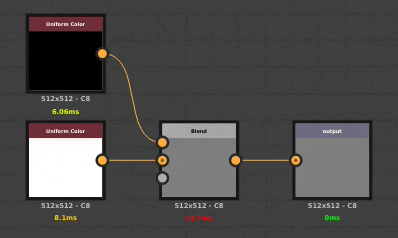

# 버전 2021.1(11.1)

**Substance Designer 2021.1**&#x200B;은 Pantone 색상 지원, 그래프의 노드를 비활성화할 수 있는 기능, 테셀화된 메시 내보내기와 함께 여러 가지 삶의 질 개선을 통해 일련의 새로운 기능을 제공합니다.

출시일: *2021년 1월 28일*

## 주요 기능

### 새로운 Pantone Colors 지원

이 릴리스에서는 Pantone 별색 지원이 추가되었습니다. Pantone은 그래픽 디자인, 패션 디자인, 제조 등과 같은 다양한 산업에서 사용되는 다양한 색상 세트로 유명합니다. 이 새로운 기능을 통해 이제 재료의 색상을 실제 가치와 훨씬 더 쉽게 일치시킬 수 있습니다. 자세한 내용은 전용 [설명서 페이지](../../color-management/spot-colors-pantone/spot-colors-pantone.md)를 확인하십시오.

>[!NOTE]
>
> 이러한 새 Pantone 색상을 사용하려면 응용 프로그램 환경 설정에서 색상 관리 설정을 **Adobe ACE**(으)로 설정해야 합니다.

* **RGB 색상과 Pantone 색상 중 선택**\
  이제 색상 피커에서 색상을 편집할 수 있는 모드를 선택할 수 있습니다. 기본적으로 RGB 로 설정되어 있지만 Pantone 책(색상 라이브러리)으로 전환할 수도 있습니다. 기본으로 여러 책이 포함되어 있습니다.

  

  색상 피커 모드가 변경되면 선택한 책에 의해 사용 가능한 색상이 정의됩니다.

  

* **현재 책에서 색상 검색**\
  목록의 맨 위에 있는 텍스트 필드를 사용하면 Pantone 책 전체에서 특정 색상을 검색할 수 있습니다. 다른 책들은 보지 않으니, 무언가를 찾을 때 책들 사이를 바꾸는 것을 잊지 마세요.

  

* **적합한 색상 선택**\
  색상 피커에서 화면의 색상을 선택하고 현재 책에서 가장 가까운 색상을 찾을 수 있습니다.

  

### 그래프에서 노드 사용 안 함

이 릴리스에서는 노드를 비활성화하여 그래프 내부를 통과하도록 설정하는 기능을 추가합니다. 예를 들어 특정 노드가 최종 결과에 어떤 효과를 추가하는지 확인하기 위해 재료를 비교하고 반복하려는 경우 유용합니다.

노드를 사용하지 않으려면 노드를 마우스 오른쪽 단추로 클릭하고 **선택 사용 안 함**&#x200B;을 선택하거나 바로 가기 키 **Shift+D**&#x200B;를 누르십시오. 모든 노드를 사용하지 않도록 설정할 수 있는 것은 아니며, 몇 가지 조건에 따라 다릅니다. 자세한 내용은 다음 [설명서 페이지](../../interface/the-graph-view/the-graph-view.md)의 전용 섹션을 참조하십시오.

### 뷰포트에서 쪽맞춤 메쉬를 새로 내보내기

이제 3D 뷰에서 쪽맞춤 메쉬를 여러 파일 형식으로 내보낼 수 있습니다.

이렇게 하려면 **3D 보기**&#x200B;에서 **파일 > 내보내기** 장면 동작을 사용하면 됩니다. 자세한 내용은 전용 [설명서 페이지](../../interface/3d-view/3d-view.md)를 참조하십시오.

{width="700px"}

### 일반적인 개선 사항

이 릴리스에는 일상적 작업에 도움이 되도록 작지만 유용한 개선 사항과 새로운 기능이 몇 가지 추가되었습니다.

* **엔진에 대한 자동 메모리 예산 할당**\
  응용 프로그램의 Ram 및 Vram 관리가 개선되었으며 이제 사용 가능한 시스템 메모리에 더 잘 조정할 수 있습니다. Vram이 많은 GPU는 이제 온보드 메모리를 추가로 활용할 수 있습니다.

* **3D 보기는 이제 새로운 &quot;physicalSize&quot; 의미 체계를 지원합니다.**\
  이제 사용자 정의 셰이더에서 재질의 물리적 크기를 고려하여 비헤이비어를 조정할 수 있습니다. 자세한 내용은 애플리케이션과 함께 제공된 셰이더를 확인하십시오.

* **라이브러리에서 콘텐츠를 제외하기 위한 새 설정**\
  이제 라이브러리는 와일드카드를 지원하여 특정 파일 확장자 또는 특정 이름 패턴을 제외할 수 있습니다. 이렇게 하면 [라이브러리](../../interface/the-library/the-library.md) 창 내에서 원하지 않는 콘텐츠를 무시할 수 있습니다.

* **비트맵을 내보낼 때 폴더 만들기**\
  그래프에서 비트맵을 내보낼 때 폴더 및 하위 폴더가 없는 경우 슬래시를 지정하여 만들 수 있습니다. 이렇게 하면 그래프당 비트맵을 **프로젝트/$(그래프)/$(식별자)**&#x200B;을(를) 사용하는 등의 방법으로 고유한 폴더에 구성할 수 있습니다.

* **SBSRender가 이제 Adobe ACE 및 ICC 프로필을 지원합니다**\
  이제 자동화 툴킷의 일부인 SBSRender 프로세스를 통해 Adobe ACE 엔진을 사용할 때 적절한 색상 관리로 Substance 출력을 렌더링할 수 있습니다.

&#x200B;>> 

이미지 크레딧: &#42;&#42;Unsplash&#42;&#42;의 [꽃이 있는 개](https://unsplash.com/photos/2s6ORaJY6gI) 및 [안경이 있는 개](https://unsplash.com/photos/siNDDi9RpVY).

## 튜토리얼

다음은 새로운 기능에 대한 비디오 튜토리얼입니다.

## 릴리스 정보

### 2021.1.0

*(2021년 1월 28일 릴리스)*

**추가됨:**

* [별색] Designer에서 Pantone 색상 지원
* [Graph] 노드 비활성화
* [3D 보기] 뷰포트에서 쪽맞춤 메쉬를 내보냅니다
* [국제화] 일본어 버전 업데이트
* [3D 보기] Iray를 사용하지 않을 때 메모리 소비 최적화
* [Python API] SDResource를 삭제할 SDResource.delete() 메서드를 추가합니다
* [Python API] Python API에 별색 지원 추가
* [Python API] 패키지가 닫힐 때 트리거하는 새 콜백
* [2D 보기] 브러시 데이터베이스를 SQLite에서 Json 형식으로 변환
* [2D 보기] 렌더링 성능과 신뢰성(CPU 계산) 향상
* [라이브러리] 프로젝트 설정에서 &#39;패턴 제외&#39; 옵션을 추가합니다.
* [라이브러리] 프로젝트 설정에서 &#39;패턴 제외&#39;의 이름을 &#39;파일 확장자 제외&#39;로 바꿉니다.
* [UX] Windows의 창 제목 표시줄에서 &#39;?&#39; 버튼 제거
* [UX] 컨텍스트 편집이 비활성화된 경우 Ctrl+E 단축키를 &#39;참조 열기&#39;로 이동합니다.
* [베이커] 베이커 목록에서 베이커를 삭제할 때 미리 보기 캐시 삭제
* [성능] 공유 메모리가 있는 GPU를 사용하여 하드웨어에서 이미지 캐시 예산 개선
* [환경 설정] &#39;GPU 캐시 제한&#39; 값을 사용 가능한 메모리 풀에 적용
* [Properties] 노드 인스턴스에 물리적 크기 속성을 표시합니다.
* [스크립팅] 외부 스크립팅 시스템을 더 이상 사용되지 않는 것으로 표시합니다
* [공유] &quot;Substance share으로 내보내기&quot; 기능 제거

**추가됨:**

* [Content] Material 노드에서 I/O 순서가 일치하지 않습니다.
* [Content] 뒤틀기 노드의 기본 입력이 일관되지 않습니다.
* [내용] 방사형 흐림 효과 노드에서 밥솥 경고 해결
* [내보내기] CPU 엔진을 사용한 일괄 내보내기는 메모리 예산 결정에 VRAM을 사용합니다.
* [내보내기] 존재하지 않는 경로로 내보내면 폴더가 생성됩니다
* [내보내기] 일괄 내보내기를 사용할 때 메모리 예산이 너무 낮음
* [2D 보기] HDR 이미지를 클립보드에 복사할 때 아티팩트/밴딩
* [2D 보기] 리소스에서 이미지를 내보내면 항상 8비트를 내보냅니다
* [3D 보기] Iray: 편집기를 사용하여 일반 값을 변경하면 이상한 결과가 나타남
* [3D 보기] Iray: 일반 채널을 비활성화해도 올바른 결과가 생성되지 않습니다.
* [라이브러리] URL로 필터링이 제대로 작동하지 않습니다.
* [Library] 라이브러리 제외 패턴과 일치하는 리소스는 수동으로 가져올 수 없습니다.
* [베이커] 베이커의 이름을 변경해도 2D 보기 미리 보기 목록의 항목에 영향을 주지 않습니다.
* [Explorer] 탐색기와 그래프 데이터 간의 동기화 손실
* [함수 그래프] 출력 유형이 일치하지 않는 함수 노드를 출력으로 설정할 때 충돌이 발생합니다.
* [MDL] SBS 인스턴스 노드에 미리 보기가 없고 0을 출력하며 그래프 계산을 트리거하지 않습니다.
* [Python API] 입력 매개 변수의 &#39;editor&#39; 속성을 수정할 수 없습니다.
* [Python] 레이아웃 재설정이 Python에서 만든 도크를 올바르게 재설정하지 않습니다
* [리소스] 32비트 PSD 문서를 연결/가져올 수 없음
