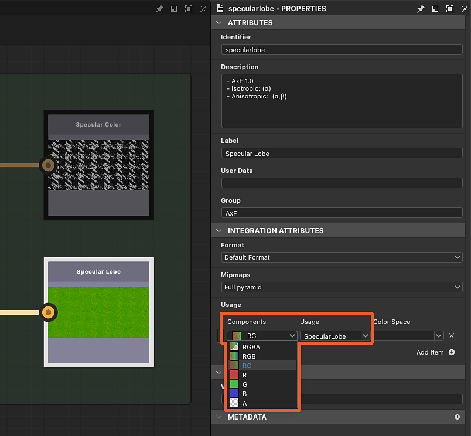

# AxF(Appearance eXchange Format)

<table>
<tr style="border: 0;">
<td width="25.00%" style="border: 0;" valign="top">

</td>
<td width="100.00%" style="border: 0;" valign="top">

Substance 3D Designer은 [X-Rite의 모양 eXchange 형식을 지원합니다.](https://www.xrite.com/axf) 이 형식을 만든 사람은 다음과 같이 설명합니다.

&#39;AxF 파일은 디지털 디자인 워크플로 전반에 걸쳐 복잡한 재질 특성을 캡처, 저장, 편집 및 전달하는 데 사용됩니다. AxF는 PLM(Product Lifecycle Management), CAD(Computer-Aided Design) 및 최첨단 렌더링 응용 프로그램에서 색상, 텍스처, 광택, 굴절, 투명도, 특수 효과(반짝거림) 및 반사 속성과 같은 모든 관련 모양 데이터를 저장하고 공유할 수 있는 표준 방법을 제공합니다.

</td>
</tr>
</table>

간단히 말해, AxF 파일은 X-Rite의 TAC7 스캐너 하드웨어에 의해 추출된 여러 텍스처를 호스팅하며, 자료의 추가 특성을 설명하는 메타데이터와 함께 호스팅합니다. 즉, AxF는 단순한 텍스처 데이터 이상의 역할을 합니다. 음영 속성도 함께 제공됩니다.

AxF 파일을 패키지 [리소스](../../resources/resources.md)(으)로 가져오지 *못했습니다*. 대신 [가져오기 프로세스](#import)에는 AxF 파일에서 텍스처와 메타데이터를 추출한 다음 이를 사용하여 [전용 템플릿](#graph-templates)에서 만든 그래프를 준비하는 작업이 포함됩니다.

사용 가능한 템플릿은 두 가지 AxF 워크플로우를 대상으로 합니다.

* <b>AxF 파일의 SVBRDF 재질을 PBR 재질로 변환</b>;
* SVBRDF 재질을 <b>편집</b>하고 기존 AxF 파일에 새 레이어로 [내보내기](#export)합니다.

>[!NOTE]
>
> 지원되는 재질 모델
> 
> <b>SVBRDF</b>(공간적으로 변화하는 BRDF) 모델을 사용하는 재질만 Designer에서 *전체*&#x200B;로 로드하고 편집할 수 있습니다.
> 
> <b>EP-SVBRDF</b>(Energy Preserving SVBRDF) 모델을 사용하는 재질은 로드할 수 있지만 SVBRDF 모델에 있는 기능만 편집하고 시각화할 수 있습니다. EP-SVBRDF 전용 기능은 지원되지 않습니다.
> 
> 다른 모델은 지원되지 않습니다.

## AxF 파일 가져오기

AxF 파일 가져오기 워크플로우는 아래 두 가지 방법 중 하나로 시작할 수 있습니다.

+++홈 화면

[홈 화면](../../interface/home-screen/home-screen.md)의 왼쪽 섹션에서 <b>AxF 가져오기...</b> 단추를 클릭합니다.

{width="600px"}

+++

+++탐색기

[탐색기](../../interface/the-explorer-window/the-explorer-window.md)에서 패키지의 RMB를 클릭하고 패키지의 상황별 메뉴에서 <b>가져오기 > AxF</b>로 이동합니다.

{width="600px"}

+++

### 가져오기 대화 상자

<b>AxF 가져오기</b> 대화 상자를 사용하면 선택한 AxF 파일에서 로드된 데이터를 검토하고, 원하는 편집 또는 변환을 수행하는 데 필요한 그래프 템플릿을 설정할 수 있습니다.

다음 네 가지 섹션이 있습니다.

<b>Header</b>에는 AxF 파일에서 검색된 재질의 이름과 해당 표현(현재 항상 SVBRDF)이 표시됩니다. 파일에 포함된 미리보기 축소판도 표시됩니다.

<b>템플릿</b> 섹션에서는 [Substance 그래프](../../compositing-graphs/substance-compositing-graphs.md) 템플릿을 설정하여 재료 작업을 시작할 수 있습니다. 이러한 템플릿 및 설정에 대한 자세한 내용은 아래의 [그래프 템플릿](#graph-templates) 섹션을 참조하십시오.

<b>텍스처</b>은 검색된 자료와 관련된 AxF 파일에서 추출한 모든 텍스처를 나열합니다. 각 텍스처에 대해 해당 이름, 기본 해상도, 데이터 형식 및 물리적 크기가 표시됩니다.

<b>메타데이터</b> 및 <b>속성</b>은 AxF 파일의 자료에서 추출한 데이터를 나열합니다. 이는 일부 Substance 그래프 템플릿 속성을 구성하는 방법에 영향을 줍니다(아래 [그래프 템플릿](#graph-templates) 섹션 참조).

### 결과

<b>확인</b> 단추를 클릭하면 [탐색기](../../interface/the-explorer-window/the-explorer-window.md)에서 패키지가 만들어집니다. 패키지에는 다음 리소스가 포함되어 있습니다.

<table>
<tr style="border: 0;">
<td style="border: 0;" valign="top">

<b>리소스</b> 폴더는 AxF 파일에서 가져온 각 재질에 대해 *하위 폴더*&#x200B;를 호스팅합니다.

각 하위 폴더에는 해당 자료의 AxF 파일에서 추출한 *텍스처*&#x200B;이 포함된 다른 하위 폴더가 포함됩니다. 이 마지막 하위 폴더의 이름은 텍스처가 사용하는 *표현* 재질(현재 <b>SVBRDF</b>만)의 이름을 따서 명명되었습니다.

가져오기 대화 상자의 <b>템플릿</b> 섹션에 설정된 각 템플릿의 그래프입니다.\
[Substance 그래프](../../compositing-graphs/substance-compositing-graphs.md)의 경우 이러한 그래프는 AxF 파일에서 추출한 텍스처와 데이터 및 선택한 템플릿 설정으로 미리 구성됩니다(아래 그래프 템플릿 섹션 참조).

</td>
<td style="border: 0;" valign="top">

</td>
</tr>
</table>

## 그래프 템플릿

<table>
<tr style="border: 0;">
<td style="border: 0;" valign="top">

[Substance 그래프](../../compositing-graphs/substance-compositing-graphs.md)에 대한 AxF 워크플로우 전용 그래프 템플릿이 있습니다.

<b>템플릿 추가</b> 단추를 클릭하고 드롭다운 메뉴에서 원하는 그래프 유형을 선택합니다.

</td>
<td style="border: 0;" valign="top">

</td>
</tr>
</table>

### Substance 그래프 템플릿

<table>
<tr style="border: 0;">
<td style="border: 0;" valign="top">

두 가지 유형의 Substance 그래프 템플릿을 사용할 수 있습니다.

<b>금속 거칠기에 대한 AxF</b> 및 Specular 광도에 대한 <b>AxF</b>은(는) AxF 재질을 표준 PBR 모델에 매핑할 수 있는 *변환* 템플릿입니다.\
그런 다음 기본 3D 보기 셰이더와 함께 사용하거나 Designer, [Sampler](https://www.adobe.com/products/substance3d-sampler.html)에서 제작되거나 [3D 에셋](https://substance3d.adobe.com/assets/) 라이브러리에서 얻은 다른 PBR 자료와 결합할 수 있습니다.

<b>AxF to AxF</b>은(는) AxF 재질을 제자리에서 편집하고 이러한 변경 내용을 기존 AxF 파일의 새 레이어로 내보낼 수 있는 *통과* 템플릿입니다. 자세한 내용은 아래의 AxF 파일 내보내기 를 참조하십시오.

</td>
<td style="border: 0;" valign="top">

</td>
</tr>
</table>

<table>
<tr style="border: 0;">
<td style="border: 0;" valign="top">

<b>템플릿</b> 목록에 추가된 모든 Substance 그래프 템플릿에 대해 다음 추가 작업이 수행됩니다.

AxF 파일에서 추출한 텍스처의 *식별자*&#x200B;와 *용도*&#x200B;가 일치하는 [<b>입력</b>](../../compositing-graphs/nodes-reference-for-com/atomic-nodes/input/input.md) 노드의 경우 해당 입력 노드는 해당 텍스처를 참조하는 [비트맵](../../compositing-graphs/nodes-reference-for-com/atomic-nodes/bitmap/bitmap.md) 노드로 대체됩니다.

그래프의 <b>해상도</b> 속성(즉, 출력 크기)은 추출된 *가장 큰* 텍스처의 해상도와 같거나 그 위의 2의 거듭제곱으로 자동으로 설정됩니다.

이전 작업이 적용된 후에 [비트맵](../../compositing-graphs/nodes-reference-for-com/atomic-nodes/bitmap/bitmap.md) 노드의 <b>해상도</b> 속성(즉, 출력 크기)이 그래프와 일치하도록 자동으로 설정됩니다.

그래프의 <b>물리적 크기</b> 속성이 추출된 *첫 번째* 텍스처의 물리적 크기로 설정되어 있습니다.

그래프 매개 변수의 *기본값*&#x200B;이(가) AxF 파일의 데이터와 일치하도록 설정되었습니다.

AxF 파일의 자료에서 추출한 *메타데이터*&#x200B;가 그래프의 <b>설명</b> 속성에 복사됩니다.

>[!IMPORTANT]
>
> 이 초기 구성 후에는 그래프 매개 변수의 기본값을 수정해서는 안 됩니다.
> 
> 이러한 속성은 텍스처의 값을 올바르게 해석하는 데 필수적인 음영 속성을 지정합니다.
> 
> 따라서 이러한 설정을 변경하면 [3D 보기](../../interface/3d-view/3d-view.md)에서 재질을 시각화할 때 렌더링이 잘못됩니다.

</td>
<td style="border: 0;" valign="top">

</td>
</tr>
</table>

## AxF 파일 내보내기

기존 AxF 파일은 Designer에서 바로 편집할 수 있으며, 해당 리소스는 [Substance 그래프](../../compositing-graphs/substance-compositing-graphs.md)의 [출력](../../compositing-graphs/nodes-reference-for-com/atomic-nodes/output/output.md)을 사용하여 업데이트됩니다.

그래프 출력을 AxF 파일로 내보내는 기능을 사용하면 Designer의 일반적인 AxF 워크플로는 다음과 같을 수 있습니다.

1. AxF 파일 가져오기
1. &#39;AxF to AxF&#39; Substance 그래프 템플릿 사용
1. Substance 그래프에서 사용할 수 있는 기능 및 노드를 사용하여 추출된 텍스처를 편집합니다
1. 그래프 출력을 동일한 AxF 파일로 내보내기

그래프의 <b>물리적 크기</b> 속성은 편집된 AxF 파일에서 업데이트된 텍스처의 <b>물리적 크기</b> 특성을 설정하는 데 사용됩니다.

>[!NOTE]
>
> 파일의 리소스에 대한 변경 내용이 *새 레이어*(으)로 추가됩니다. 즉, Designer에서 동일한 AxF 파일로 수행된 각 내보내기는 해당 파일 크기에 추가됩니다.

<table>
<tr style="border: 0;">
<td width="33.33%" style="border: 0;" valign="top">

### 내보내기 대화 상자

<b>AxF</b> 내보내기 대화 상자는 <b>출력 내보내기</b> 대화 상자에서 전용 탭으로 사용할 수 있습니다.

[그래프 보기](../../interface/the-graph-view/the-graph-view.md) 도구 모음에서  <b>도구</b> 메뉴를 열고 <b>출력 내보내기...</b> 옵션을 선택하여 대화 상자를 표시한 다음 <b>AxF</b> 탭을 선택합니다.

</td>
<td width="100.00%" style="border: 0;" valign="top">

</td>
</tr>
</table>

이 대화 상자에는 세 가지 기본 섹션이 있습니다.

<b>파일</b> 입력 필드를 사용하면 편집할 대상 AxF 파일을 선택할 수 있습니다. 해당 파일이 로드되고 확인되면 유효한 데이터가 아래의 &#39;AxF 리소스&#39; 열을 채우는 데 사용됩니다.

<b>매핑된 출력</b>은 [출력] 열의 그래프 출력을 나열하며 *사용량*&#x200B;을(를) 동일한 *식별자*&#x200B;를 공유하는 대상 파일의 AxF 리소스와 일치시킵니다. 문제가 감지되면 [메모] 열에 경고(노란색) 또는 오류(ref)로 표시됩니다.

<b>매핑되지 않은 출력</b>은 매핑할 수 없는 대상 파일의 그래프 출력 및 AxF 리소스를 나열합니다. 이러한 출력은 무시되고 AxF 리소스는 변경되지 않습니다.

>[!NOTE]
>
> 그래프 출력이 이 대화 상자에 나열되려면 해당 <b>그룹</b> 속성이 &#39;AxF&#39;로 설정되어 있어야 합니다.

매핑된 출력의 변경 사항을 포함하는 새 레이어로 대상 AxF 파일을 편집하려면 <b>내보내기 시작 </b>을(를) 클릭합니다.

결과는 대화 상자의 상태 표시줄에서 진행률 표시줄 옆에 메시지로 표시됩니다.

>[!TIP]
>
> 내보내기를 수행할 때마다 대상 파일의 새 레이어가 만들어집니다. 따라서 파일 크기와 복잡성을 관리하기 위해 의도적이고 목적에 맞는 내보내기를 해야 합니다.

### 출력을 AxF 리소스에 매핑

기존 AxF 파일로 내보내는 경우 해당 리소스는 그래프 출력을 사용하여 업데이트됩니다. Designer은 리소스 식별자를 <b>사용량</b>과 동일한 식별자를 가진 [출력](../../compositing-graphs/nodes-reference-for-com/atomic-nodes/output/output.md) 노드와 일치시킵니다.

또한 출력의 <b>그룹</b> 속성 *Must*&#x200B;이(가) &#39;AxF&#39;로 설정되어 있어야 AxF 내보내기 대화 상자에 나열됩니다(위 참조).

리소스는 특정 수의 채널을 갖는 텍스처(즉, 비트맵) 또는 유니폼(즉, 값)일 수 있다. 반드시 그래프 출력이 그 채널 개수와 정확히 일치해야 한다. 그렇지 않으면 내보내기 중에 해당 리소스에 오류가 발생하고 리소스가 변경되지 않습니다.

채널 수는 출력 노드에 제공되는 데이터 유형에 따라 다르게 지정됩니다.

* <b>비트맵(텍스처):</b> [구성 요소](../../compositing-graphs/nodes-reference-for-com/atomic-nodes/output/output.md) 속성은 채널 수를 지정하는 데 사용됩니다. 여기서 R은 하나의 채널이고, RG는 두 개의 채널입니다. 이 속성은 Designer이 색상 비트맵의 RGBA 채널 중 어떤 채널을 리소스로 인코딩해야 하는지 알려주는 데 사용됩니다.
* <b>값(균일):</b> 벡터 값의 구성 요소 수는 채널 수를 지정하는 데 사용됩니다. 여기서 [Float](../../function-graphs/nodes-reference-for-fun/atomic-function-nodes/constant-nodes/constant-nodes.md)은(는) 하나의 채널이고, [Float2](../../function-graphs/nodes-reference-for-fun/atomic-function-nodes/constant-nodes/constant-nodes.md)는(는) 두 개의 채널입니다.

>[!IMPORTANT]
>
> <b>AxF에서 AxF</b> Substance 그래프 템플릿에서는 <b>Specular 로브</b> 기여도에 대한 [출력](../../compositing-graphs/nodes-reference-for-com/atomic-nodes/output/output.md) 노드가 기본적으로 *단일 채널*&#x200B;로 구성됩니다(예: Components 속성이 &#39;R&#39;).\
> 가져온 AxF 파일이 Specular 로브 리소스에 둘 이상의 채널을 사용하는 경우 이에 따라 출력의 <b>구성 요소</b> 속성을 설정하십시오.
> 
> 예를 들어, 두 개의 비등방성(Specular 거칠기는 빨강, Specular 채널은 녹색)을 사용하는 Specular 로브 리소스의 경우 구성 요소 속성을 &#39;RG&#39;로 설정합니다.

## 3D 보기에서 AxF 파일 보기

[3D 보기](../../interface/3d-view/3d-view.md)에서 AxF SVBRDF 재질을 렌더링하는 방법은 [가져오기 설정](#import)에 따라 다릅니다.

+++PBR로 변환

AxF 파일의 SVBRDF 자료를 표준 PBR 자료로 변환하려면 가져오기 설정에 [Substance 그래프 변환 템플릿](#graph-templates)이 필요할 수 있습니다.

이 경우 3D 보기에서 **OpenGL 렌더러**&#x200B;를 사용하고 <code>AxF SVBRF를 선택해야 합니다</code> 셰이더.\
그런 다음 가져오기 대화 상자에서 설정한 Substance 그래프를 끌어서 놓아 해당 출력을 셰이더에 연결할 수 있습니다.

+++

+++제자리에서 편집

기존 AxF 파일에 대해 *편집*&#x200B;을 수행하는 것이 목적인 경우 아래 지침에 따라 선택한 렌더러에 따라 SVBRDF 자료를 시각화하십시오.

전용 GLSLFX 셰이더는 AxF 파일 <b>AxF SVBRDF</b>의 SVBRDF 표현을 사용하여 재질을 시각화하는 데 사용할 수 있습니다.

셰이더는 <b>재질</b> 메뉴에서 사용할 수 있습니다. 장면의 재질에 대한 하위 메뉴(기본적으로 &#39;기본값&#39;)를 열고 <b>AxF SVBRDF</b> 항목 아래에서 기술을 선택합니다.

동일한 하위 메뉴의 <b>편집</b> 옵션을 사용하여 [속성](../../interface/properties/properties.md) 도크에서 셰이더의 속성을 표시합니다.\
특히 <b>타일링</b> 속성을 사용하면 모델에서 텍스처의 타일링을 조정할 수 있으므로 적절한 비율로 재질을 시각화할 수 있습니다.

셰이더를 선택한 후 그래프의 빈 공간에서 RMB를 클릭하고 <b>3D 보기에서 출력 보기</b> 옵션을 선택하여 [3D 보기](../../interface/3d-view/3d-view.md)에서 출력을 시각화합니다.

{width="600px"}

이 셰이더는 현재 *진행 중인 작업*&#x200B;이며 일부 기능은 아직 지원되지 않습니다. 따라서 재료의 특성을 개괄적으로 설명할 수 있지만 세밀한 조정을 위해 사용해서는 안 됩니다 .

동일한 하위 메뉴의 <b>편집</b> 옵션을 사용하여 [속성](../../interface/properties/properties.md) 도크에서 셰이더의 속성을 표시합니다.\
특히 <b>타일링</b> 속성을 사용하면 모델에서 텍스처의 타일링을 조정할 수 있으므로 적절한 비율로 재질을 시각화할 수 있습니다.

셰이더를 선택한 후 그래프의 빈 공간에서 RMB를 클릭하고 <b>3D 보기에서 출력 보기</b> 옵션을 선택하여 [3D 보기](../../interface/3d-view/3d-view.md)에서 출력을 시각화합니다.

<i>참고:</i> Iray 렌더러 및 MDL 지원이 버전 16.0.0의 Designer에서 <i>제거</i>되었으므로 끝날 때까지 Iray 렌더러로의 전환에서 비디오 부분을 무시하십시오.

+++

### 지원되는 모델 변형

3D 보기에 사용되는 셰이더는 Specular, 프레넬 및 일반 코트 전송 모델에 대해 다음 변형을 지원합니다.

<table>
<tr style="border: 0;">
<td style="border: 0;" valign="top">
<b>Specular 변형</b>

* 워드 / 가이슬러-모로더 2010
* GGX / Walter2007
* GGX / 로스 2005

</td>
<td style="border: 0;" valign="top">
<b>프레넬 변형</b>

* 슐릭
* Schlick 1994 컬러
* 심플 프레넬

</td>
<td style="border: 0;" valign="top">
<b>전송 변형 지우기</b>

* 굴절 Dirac *(OpenGL 전용)*
* 굴절 디랙 / 입체각 압축 없음 *(OpenGL만 해당)*
* 비굴절 디랙
* 비굴절 디랙 / DSPBR 2020x
* GGX

</td>
</tr>
</table>
