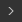

# 비트맵 페인팅 도구

이 페이지에서는 호환되는 비트맵에 대해 [2D 보기](../../../interface/2d-view/2d-view.md) 패널에서 사용할 수 있는 페인팅 도구에 대해 설명합니다.

{width="512px"}

## 개요

[2D 보기](../../../interface/2d-view/2d-view.md) 패널에서는 응용 프로그램 내에서 직접 *수동으로* 이미지를 만들거나 편집할 수 있는 기본 비트맵 페인팅 도구를 제공합니다. 이러한 도구는 *마스크*&#x200B;를 빠르게 페인트하는 데 특히 유용합니다.

이 도구는 *펜 압력*&#x200B;을 포함하여 펜 입력을 지원합니다. 펜 디스플레이를 활용하려면 [2D 보기](../../../interface/2d-view/2d-view.md) 패널을 [고정 해제](../../../interface/customizing-your-wor/customizing-your-workspace.md)한 다음 페인팅하기에 더 편리한 구성으로 배치하고 크기를 조정할 수 있습니다.

편집 작업은 *개별적으로 실행 취소*&#x200B;할 수 있으며, 이미지를 편집하는 동안 [막대 그래프](../../../interface/2d-view/2d-view.md) 패널, [바둑판 표시](../../../interface/2d-view/2d-view.md) 및 [배경 이미지](../../../interface/2d-view/2d-view.md)와 같은 2D 보기 패널의 다른 모든 기능은 여전히 *사용 가능*&#x200B;합니다.

>[!IMPORTANT]
>
> [새로 만들거나 가져온](../../../resources/importing-linking-and-new/importing-linking-and-new-resources.md)인 *8비트* [비트맵 리소스](../../../resources/bitmap-resource/bitmap-resource.md)에 *전용*&#x200B;을(를) 페인트할 수 있습니다.

>[!WARNING]
>
> **Windows 전용**
> 
> 태블릿 사용자는 가장 안정적인 환경을 위해 다음 페이지에 설명된 설정을 적용해야 합니다. [펜 및 태블릿 구성](https://docs.substance3d.com/display/SPDOC/Configuring+Pens+and+Tablets)

{width="512px"}

## 페인팅 도구 활성화

페인팅 도구는 비트맵과 관련된 다음 기준이 충족되면 [2D 보기](../../../interface/2d-view/2d-view.md) 패널에서 자동으로 활성화됩니다.

* 비트맵은 [새 리소스 또는 가져온 리소스](../../../resources/importing-linking-and-new/importing-linking-and-new-resources.md)입니다.
* 비트맵의 정밀도가 *8비트*&#x200B;입니다.
* 비트맵이 [2D 보기](../../../interface/2d-view/2d-view.md) 패널에 표시됩니다

*새* 비트맵은 다음과 같은 방법으로 만들 수 있습니다.

* [탐색기](https://helpx.adobe.com/substance-3d/unlisted/documentation/sddoc/the-explorer-129368147.html) 패널에서 *SBS 패키지*&#x200B;의 RMB 또는 패키지 내의 *폴더*&#x200B;를 클릭하여 상황별 메뉴를 연 다음 <b>새로 만들기</b> 하위 메뉴를 열고 <b>비트맵</b> 옵션을 선택합니다
* [그래프](../../../interface/the-graph-view/the-graph-view.md)에서 [비트맵 노드](../../../compositing-graphs/nodes-reference-for-com/atomic-nodes/bitmap/bitmap.md)를 만들고 상황에 맞는 메뉴에서 <b>새 리소스에서...</b> 옵션을 선택합니다.

새 비트맵 리소스의 *이름*, *해상도* 및 *배경색*&#x200B;을 설정할 수 있는 <b>새 비트맵</b> 창이 열립니다.

>[!NOTE]
>
> *새로운* 비트맵 리소스 *항상*&#x200B;에는 *RGBA* 색상과 *8비트* 정밀도가 있습니다.

>[!WARNING]
>
> 페인팅 도구로 최상의 성능을 얻으려면 해상도가 *2의 제곱*&#x200B;인 비트맵을 사용하는 것이 좋습니다(예: 128, 256, 512, 1024 등).

## 도구 모음

페인팅 도구와 옵션은 [2D 보기](../../../interface/2d-view/2d-view.md) 패널 내의 *도구 모음*&#x200B;에 정렬됩니다. 이러한 도구 모음은 패널의 *아무 면* 또는 *부동 도구 모음*&#x200B;으로 재배치할 수 있습니다. 이 도구 모음의 *핸들*&#x200B;에 있는 <b>LMB</b>를 클릭하여 누른 다음, 삼중선으로 표시한 다음 <b>LMB</b>를 원하는 위치에 놓습니다.

페인팅 도구가 활성화되면 두 가지 도구 모음, 즉 [도구 선택 도구 모음](#bitmappaintingtools-toolselectiontoolbar)과 도구 옵션 도구 모음이 표시됩니다. 이 도구 모음은 아래에 설명되어 있습니다.

## 도구 선택 도구 모음

페인팅 도구는 기본적으로 [2D 보기](../../../interface/2d-view/2d-view.md) 패널의 *왼쪽*&#x200B;에 있는 **도구 선택 도구 모음**&#x200B;에서 찾을 수 있습니다. 키보드 단축키를 사용하면 이러한 도구에 빠르게 액세스할 수 있으며, 도구/함수 이름 뒤 괄호 사이에는 아래와 같이 표시됩니다.

 <b>색상 선택</b> <b>축소판:</b> *기본* 및 *보조* 색상을 정의할 수 있습니다. 이 축소판 중 하나를 클릭하여 <b>색상 편집기</b> 창을 표시하고 색상을 정의합니다. 도구에서 *기본* 색상을 사용합니다. 기본 색상과 보조 색상은 언제든지 *교체*(<b>X</b>)할 수 있습니다.

 <b>브러시 도구(B):</b> 도구 옵션 도구 모음에 정의된 옵션을 사용하여 펜 끝이나 <b>LMB</b> 단추를 누를 때 커서 위치에 *기본* 색상을 적용합니다

 <b>도장 도구(T):</b> 사용하면 이미지의 일부를 다른 도장에 찍어낼 수 있습니다. <b>Alt</b> 키를 누른 상태에서 <b>LMB</b>를 클릭하여 도장을 찍어야 하는 *원본*&#x200B;을 정의할 수 있습니다. 그런 다음 [도구 옵션] 도구 모음에 정의된 옵션을 사용하여 펜 끝이나 <b>LMB</b> 단추를 누르면 이미지의 *대상* 영역이 커서 위치에 스탬프됩니다. 원본은 대상의 움직임을 *추적*&#x200B;하며, *원본* 영역의 크기는 *브러시*&#x200B;의 크기와 *일치*&#x200B;합니다.

 <b>맞춤 사용(스탬프 도구 옵션):</b> 새 스탬프가 시작될 때 원본이 *제자리에 있어야 하는지* 아니면 *새 스탬프 위치에 상대적으로 재배치되어야 하는지* 정의할 수 있습니다.

<b> 지우개(E):</b> [도구 옵션] 도구 모음에 정의된 옵션을 사용하여 펜 끝이나 <b>LMB</b> 단추를 누를 때 커서 위치에서 이미지의 현재 색상을 (0, 0, 0, 0) 값으로 바꿉니다. <b>Alpha</b> 채널에서 이 도구의 영향을 추적하려면 [투명도 표시](../../../interface/2d-view/2d-view.md)가 사용하도록 설정되어 있는지 확인하세요.

## 도구 옵션 도구 모음

[도구 선택 도구 모음](#bitmappaintingtools-toolselectiontoolbar)에서 사용할 수 있는 도구의 옵션은 도구 옵션 도구 모음에서 찾을 수 있습니다. 도구 옵션 도구 모음은 기본적으로 [2D 보기](../../../interface/2d-view/2d-view.md) 패널의 *위쪽*&#x200B;에 있습니다.

<table>
<tr style="border: 0;">
<td style="border: 0;" valign="top">

### 브러시 선택

 <b>브러시 선택</b>을 사용하면 사용 가능한 브러시 *사전 설정*&#x200B;에서 *사전 구성* 브러시를 선택하고, <b>크기</b> 및 <b>경도</b> *(*&#x200B;브러시 편집기의 <b>모양</b> 섹션 참조)를 설정하고, 브러시 획의 *미리 보기*를 표시할 수 있습니다.

브러시 사전 설정은 브러시 편집기에서 만들고 편집하며 *라이브러리*&#x200B;에 정렬할 수 있습니다. 이 패널에 나타나는 브러시 사전 설정은 불러온 모든 브러시 사전 설정 라이브러리 중 *합계*&#x200B;입니다. 이러한 라이브러리는  <b>브러시 라이브러리</b> 메뉴에 액세스하여 관리할 수 있습니다(브러시 편집기의 <b>사전 설정</b> 섹션 참조).

 <b>배경색 선택</b> 단추를 사용하면 *브러시 획 미리 보기*&#x200B;의 배경색을 변경할 수 있습니다.

</td>
<td style="border: 0;" valign="top">

</td>
</tr>
</table>

<table>
<tr style="border: 0;">
<td style="border: 0;" valign="top">

### 브러시 편집기

 <b>브러시 편집기</b>에서는 브러시의 동작을 정의할 수 있는 세분화된 옵션에 액세스할 수 있습니다.

<b>사전 설정</b>

브러시는 사용자 정의한 다음 <b>브러시 사전 설정</b>으로 저장할 수 있으며,  <b>브러시 사전 설정 목록</b> 및  <b>브러시 선택</b> 패널에서 사용할 수 있습니다.

사전 설정을 만들려면 아래의 속성을 원하는 대로 설정한 다음  <b>브러시 사전 설정 추가 </b>버튼을 클릭하고 <b>사전 설정 이름</b> 창에서 브러시 이름을 설정합니다. 이제 <b>브러시 사전 설정 목록</b>에서 새 사전 설정이 자동으로 선택되고, 언제든지 새 현재 설정으로  <b>업데이트</b>하거나  <b>삭제</b>할 수 있습니다.

사전 설정은  <b>브러시 라이브러리</b> 메뉴에서 관리할 수 있는 *라이브러리*&#x200B;에 구성되어 저장됩니다.

<b>라이브러리 내보내기:</b> *현재 사전 설정과 모든 설정을 라이브러리 파일에 저장*

<b>라이브러리 가져오기:</b> 기존 라이브러리 파일에서 사전 설정을 *불러오기*&#x200B;하고 현재 목록에 *추가* - 이름이 *같은 사전 설정이 라이브러리 파일에서 사전 설정으로 바뀌었습니다*.

<b>라이브러리 재설정:</b>은 현재 사전 설정을 기본 라이브러리로 재설정합니다.

<b>라이브러리 바꾸기:</b> 기존 라이브러리 파일에서 사전 설정을 *로드*&#x200B;하고 현재 목록을 *해제*&#x200B;합니다.

</td>
<td style="border: 0;" valign="top">

</td>
</tr>
</table>

#### 브러시 설정

브러시 설정은 다음 섹션으로 그룹화됩니다.

+++모양
<b>모양 유형</b> 매개 변수는 브러시의 기본 모양을 제어합니다. 사용 가능한 모양은 다음과 같습니다.

* *타원*: 기본적으로 *원*(으)로 설정된 원형 모양

* *사각형*: 기본적으로 *정사각형*(으)로 설정된 직선 모양

* *다각형*: *사용자 정의* 수의 가장자리와 각도가 있는 직선 모양

<b>가장자리 수 </b>(*다각형* 모양만): 다각형의 *면*&#x200B;의 수를 선택할 수 있습니다.

<b>내부 반경 </b>(*다각형* 모양 전용): 면 *중간점*&#x200B;과 모양 중심 간의 거리를 제어하여 *별* 패턴을 효과적으로 만듭니다.

<b>경도</b>: 모양의 *페이드 반경*&#x200B;을 정의합니다.

+++

+++변환
이미지에 브러시 획을 적용할 때 획은 이 섹션의 컨트롤에서 정의한 동작에 따라 브러시 패턴의 반복된 스탬프가 됩니다.

<b>크기</b>: 브러시 모양의 *직경*&#x200B;을(를) 픽셀 단위로 설정합니다.

<b>크기 지터</b>: 스탬프당 브러시 크기를 *임의화*&#x200B;할 수 있습니다. 이 값은 <b>크기</b> 값의 *백분율*&#x200B;로 표시되며 <b>0</b>에서 <b>크기</b> 값까지의 임의 값의 *범위*&#x200B;를 제어합니다

<b>크기 컨트롤</b>: *펜 압력*&#x200B;을 지원하는 펜 입력을 사용하는 경우 이 매개 변수를 사용하여 브러시 크기를 제어할 수 있습니다

<b>간격</b>: 브러시 획을 따라 각 개별 스탬프 사이의 간격 *을 제어합니다*. 이는 모양 패턴을 보다 명확하게 구분하여 정의하도록 도와준다

<b>원형률</b>: 기본적으로 <b>모양</b> 섹션에서 선택한 <b>모양 유형</b>의 너비 대 Height 비율은 *1:1*&#x200B;입니다. 이 매개 변수를 사용하면 Height의 백분율로 *너비를 낮추어* 이 비율을 변경할 수 있습니다

<b>원형률 지터</b>: 스탬프당 원형률을 *임의화*&#x200B;할 수 있습니다. 이 값은 <b>원형률</b> 값의 *백분율*&#x200B;로 표시되며 <b>0</b>에서 <b>원형률</b> 값까지의 *범위*&#x200B;를 제어합니다

<b>각도</b>: 브러시 패턴의 *회전*&#x200B;을 *도* 단위로 제어합니다

<b>각도 지터</b>: 스탬프당 회전을 *무작위 설정*&#x200B;할 수 있습니다. 이 값은 <b>각도</b> 값의 *백분율*&#x200B;로 표시되며 <b>0</b>에서 <b>360 </b>도까지 임의의 값의 *범위*&#x200B;를 제어합니다

+++

+++분산
기본적으로 모양 패턴은 선을 따라 엄격하게 스탬프됩니다. 보다 유기적이거나 혼란스러운 효과를 위해 모양 패턴을 획 주위에 분산할 수 있도록 하는 오프셋을 적용하여 이러한 현상을 방해할 수 있습니다.

<b>산란</b>: 각 개별 스탬프가 획에서 오프셋되어야 하는 최대 *거리*&#x200B;이며, *브러시 크기*&#x200B;의 백분율로 표시됩니다. 이 거리는 브러시 크기의 <b>0</b>에서 *설정된 백분율*&#x200B;까지의 *기본적으로 무작위*&#x200B;이며 오프셋의 *방향*&#x200B;도 임의입니다

<b>카운트</b>: 개별 스탬프의 흩어진 복사본 수

+++

+++색상
브러시가 적용하는 색상은 *선택한 기본 색상* 및 <b>브러시 텍스처</b>(현재 적용된 경우)로 정의됩니다. 이 색상은 이 섹션의 컨트롤을 사용하여 동적으로 변경할 수 있습니다.

<b>플로우 지터</b>: 스탬프당 플로우를 *무작위 설정*&#x200B;할 수 있습니다. 이 값은 최대 플로우의 *백분율*&#x200B;로 표시됩니다

<b>흐름 제어</b>: *펜 압력*&#x200B;을 지원하는 펜 입력을 사용하는 경우 이 매개 변수를 사용하여 흐름을 제어할 수 있습니다

<b>색조 지터</b>: 스탬프당 색상 색조 *오프셋*&#x200B;을 *임의 설정*&#x200B;할 수 있습니다. 색조 범위는 전체 색조 범위의 *백분율*&#x200B;로 표시됩니다.

<b>채도 지터</b>: 스탬프당 색상 채도 *오프셋*&#x200B;을 *임의화*&#x200B;할 수 있습니다. 이 색채도는 전체 채도 범위의 *백분율*&#x200B;로 표시됩니다

<b>명도 지터</b>: 스탬프당 색상 명도 *오프셋*&#x200B;을 *임의 설정*&#x200B;할 수 있습니다. 이 값은 전체 명도 범위의 *백분율*&#x200B;로 표시됩니다

+++

+++텍스처
브러시에 *비트맵 파일*&#x200B;을 적용하고 플랫 색상 대신 해당 비트맵을 *도장*&#x200B;하는 데 사용할 수 있습니다. 브러시 텍스처는 다음과 같이 작동합니다.

<b>텍스처 파일: </b>브러시 텍스처로 사용해야 하는 비트맵의 *경로*&#x200B;를 정의합니다. 입력 필드 옆에 있는  단추를 사용하여 시스템 파일 브라우저를 통해 비트맵을 선택할 수 있습니다

*전용* 텍스처가 브러시의 기본 플랫 색상을 대체합니다. 즉, 위에 나열된 모든 브러시 속성을 *계속 사용할 수 있습니다*. 이렇게 하면 설명한 대로 작동합니다

텍스처의 색상은 *색조 이동*&#x200B;에서 *기본 색상 설정* 쪽으로 이동합니다. 즉, 설정된 기본 색상이 흰색이면 텍스처 색상을 그대로 사용할 수 있습니다. 설정된 기본 색상의 채도가 높을수록 텍스처 색상이 기본 색상 쪽으로 색조 이동합니다

+++

### 불투명도/플로우

브러시, 스탬프 및 지우개 도구는 <b>불투명도</b> 및 <b>플로우</b>에 대한 컨트롤을 제공합니다.

<b>불투명도</b>는 스탬프의 *최대 불투명도*&#x200B;를 제어합니다. *분리된 선에 추가*&#x200B;입니다. 이는 해당 영역에서 여러 *분리된* 선을 수행하여 영역의 불투명도를 다시 최대 100%로 추가할 수 있음을 의미합니다

<b>플로우</b>는 지정된 시간에 적용되는 *도구 효과의 양*&#x200B;을 제어합니다. *같은 선에 첨가물*&#x200B;입니다. 이는 해당 영역에서 *같은 선*&#x200B;을 여러 번 통과하거나 여러 개의 개별 선을 수행하여 영역의 불투명도를 다시 최대 100%로 추가할 수 있음을 의미합니다.

<table>
<tr style="border: 0;">
<td width="100.00%" style="border: 0;" valign="top">

### 타일링 모드

브러시, 스탬프 및 지우개 도구를 사용하면  <b>타일링 모드</b>를 설정할 수도 있습니다. 이 모드는 획이 이미지의 경계 밖의 영역에 영향을 줄 때 이미지의 반대 방향으로 *뒤로 반복*&#x200B;하는 기능을 정의합니다.

<b>X 및 Y 타일링</b>: 브러시 획이 가로 및 세로 방향으로 *모두* 타일링됩니다.

<b>타일링 X</b>: 브러시 획 타일 *가로만*

<b>타일링 Y</b>: 브러시 획이 *세로로만* 타일링됨

<b>타일링 없음</b>: 브러시 선 *타일링하지 않음*

</td>
<td width="25.00%" style="border: 0;" valign="top">

</td>
</tr>
</table>
