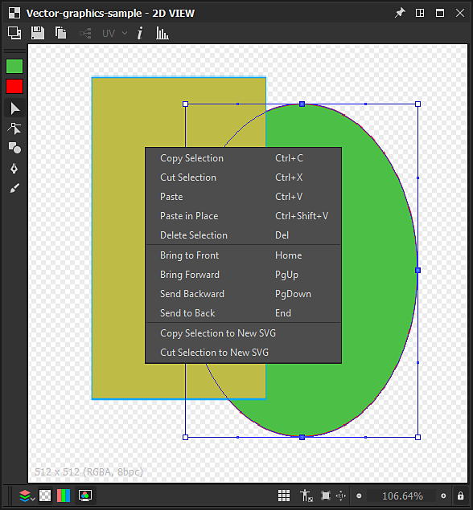

# 벡터 편집 도구

이 페이지에서는 호환되는 벡터 그래픽에 대해 [2D 보기](https://docs.substance3d.com/display/SDDOC/2D+view) 패널에서 사용할 수 있는 편집 도구에 대해 설명합니다.

## 개요

<table>
<tr style="border: 0;">
<td style="border: 0;" valign="top">

[2D 보기](https://docs.substance3d.com/display/SDDOC/2D+view) 패널은 [Substance 3D Designer](https://www.adobe.com/kr/products/substance3d-designer.html) 내에서 직접 벡터 그래픽을 *수동*&#x200B;으로 만들거나 편집할 수 있는 기본 벡터 편집 도구를 제공합니다. 이러한 도구는 *마스크* 또는 *패턴*&#x200B;을 빠르게 만드는 데 특히 유용합니다.

이 도구는 펜 입력을 지원합니다. 펜 디스플레이를 활용하려면 [2D 보기](https://docs.substance3d.com/display/SDDOC/2D+view) 패널을 [고정 해제](https://docs.substance3d.com/display/SDDOC/Customizing+your+workspace)한 다음 페인팅하기에 더 편리한 구성으로 배치하고 크기를 조정할 수 있습니다.

편집은 *개별적으로 실행 취소*&#x200B;할 수 있으며, [막대 그래프](https://docs.substance3d.com/display/SDDOC/2D+view#id-2Dview-Histogram) 패널, [타일식 표시](https://docs.substance3d.com/display/SDDOC/2D+view#id-2Dview-Viewport) 및 [배경 이미지](https://docs.substance3d.com/display/SDDOC/2D+view#id-2Dview-Backgroundimage)와 같은 벡터 이미지를 편집하는 동안 2D 보기 패널의 다른 모든 기능은 여전히 *사용 가능*&#x200B;합니다.

</td>
<td style="border: 0;" valign="top">

{width="512px"}

</td>
</tr>
</table>

>[!TIP]
>
> **Windows 전용**
> 
> 태블릿 사용자는 Designer에서 가장 안정적인 환경을 위해 다음 페이지에 설명된 설정을 적용해야 합니다. [펜 및 태블릿 구성](https://docs.substance3d.com/display/SPDOC/Configuring+Pens+and+Tablets)

>[!IMPORTANT]
>
> [새로 만들거나 가져온](https://docs.substance3d.com/display/SDDOC/Importing%2C+Linking+and+New+Resources)인 *8비트* [벡터 그래픽 리소스](../../../resources/vector-graphics-svg-res/vector-graphics-svg-resource.md)에 *만*&#x200B;을(를) 페인트할 수 있습니다.

{width="512px"}

## 벡터 편집 도구 사용

벡터 편집 도구는 벡터 그래픽 이미지와 관련된 다음 기준이 충족되면 [2D 보기](https://docs.substance3d.com/display/SDDOC/2D+view) 패널에서 자동으로 활성화됩니다.

* 벡터 그래픽 이미지가 [새 리소스 또는 가져온 리소스](https://docs.substance3d.com/display/SDDOC/Importing%2C+Linking+and+New+Resources)입니다.
* 비트맵이 [2D 보기](https://docs.substance3d.com/display/SDDOC/2D+view) 패널에 표시됩니다

*새로운* 벡터 그래픽 이미지는 다음과 같은 방법으로 만들 수 있습니다.

* [탐색기](https://docs.substance3d.com/display/SDDOC/The+Explorer+Window) 패널에서 *SBS 패키지*&#x200B;의 RMB 또는 패키지 내의 *폴더*&#x200B;를 클릭하여 상황별 메뉴를 연 다음 **새로 만들기** 하위 메뉴를 열고 **SVG** 옵션을 선택합니다
* [그래프](https://docs.substance3d.com/display/SDDOC/The+Graph+view)에서 [SVG 노드](../../../compositing-graphs/nodes-reference-for-com/atomic-nodes/svg/svg.md)를 만들고 상황에 맞는 메뉴에서 **새 리소스에서...** 옵션을 선택합니다.

새 벡터 그래픽 리소스의 *이름* 및 *해상도*&#x200B;를 설정할 수 있는 **새 벡터 데이터** 창이 열립니다.

>[!TIP]
>
> 벡터 편집 도구로 최상의 성능을 얻으려면 *2의 제곱*(예: 128, 256, 512, 1024)의 해상도로 벡터 그래픽 이미지를 사용하는 것이 좋습니다.

### 다른 소프트웨어에서 벡터 그래픽 내보내기

Designer *전용*&#x200B;은(는) **SVG** 파일 형식을 사용하는 벡터 그래픽을 지원합니다.

Designer 및 편집 도구의 최상의 호환성과 안정성을 위해 모든 개체를 *윤곽선*(으)로 변환하고 *플랫 색상*&#x200B;을 사용하여 *개별* 개체로 그룹 해제하여 *다음 중 어느 것도 유지되지 않도록*&#x200B;하십시오.

* **텍스트**
* **그레이디언트**
* **패턴**(채우기 및 획 윤곽선 모두)
* **스타일**

**Adobe Illustrator** 사용자는 *내보내기 설정* SVG에 첨부된 이미지를 참조할 수 있습니다.

+++Adobe Illustrator 내보내기 옵션

+++

>[!NOTE]
>
> Designer의 다른 소프트웨어 및 SVG 속성에서 내보내는 SVG 제한에 대한 자세한 내용은 [벡터 그래픽(SVG) 리소스](../../../resources/vector-graphics-svg-res/vector-graphics-svg-resource.md) 섹션을 참조하십시오.

## 도구

페인팅 도구와 옵션은 [2D 보기](https://docs.substance3d.com/display/SDDOC/2D+view) 패널 내의 *도구 모음*&#x200B;에 정렬됩니다. 이러한 도구 모음은 패널의 *아무 면* 또는 *부동 도구 모음*&#x200B;으로 재배치할 수 있습니다. 이 도구 모음의 *핸들*&#x200B;에 있는 **LMB**&#x200B;를 클릭하여 누른 다음, 삼중선으로 표시한 다음 **LMB**&#x200B;를 원하는 위치에 놓습니다.

벡터 편집 도구가 활성화되면 두 개의 도구 모음이 표시됩니다.

* **도구 선택** **도구 모음**: *도구 선택*&#x200B;과 *채우기/윤곽선 색상*&#x200B;을 사용할 수 있으며, 기본적으로 2D 보기 패널의 *왼쪽*&#x200B;에 있습니다.
* **도구 옵션 도구 모음**: *현재 선택한 도구*&#x200B;에 대한 *옵션*&#x200B;을 설정할 수 있으며, 기본적으로 2D 보기 패널의 *상단*&#x200B;에 배치됩니다

키보드 단축키를 사용하면 도구에 빠르게 액세스할 수 있으며 도구/함수 이름 뒤 괄호 사이에 아래와 같이 표시됩니다.

+++색상 선택 항목
 **색상 선택** *썸네일*&#x200B;을 사용하면 벡터 모양에 대한 *채우기* 및 *윤곽선* 색상을 정의할 수 있습니다. 다음 방법으로 각 색상에 대한 **색상 편집기**&#x200B;를 열 수 있습니다.

* **채우기 색상:** *채우기* 색상 축소판(맨 위)을 클릭하거나 캔버스에서 LMB를 두 번 클릭합니다

* **윤곽선 색상:** *윤곽선* 색상 축소판(아래쪽)을 클릭하거나 *Ctrl*&#x200B;을 누른 채 캔버스에서 LMB를 두 번 클릭합니다.

그러면 설정된 색상이 *현재 선택한 모양*&#x200B;에 적용됩니다.

현재 *윤곽선* 색상이 *검정*&#x200B;인 경우(예: 광도 0 또는 RGB(0, 0, 0)) *윤곽선 색상 썸네일을 클릭할 때까지*&#x200B;선택한 모양에 적용되지 않습니다&#x200B;*.*

+++

+++변환
{width="512px"}

 <b>변형</b> 도구(<b>V</b>)는 모양을 선택할 수 있으며, 모양을 선택하면 변형 기즈모에 포함됩니다. 이 gizmo를 사용하면 다음 작업을 수행할 수 있습니다.

<b>이동</b>: gizmo에서 LMB *내부*&#x200B;를 클릭하여 유지합니다.

<b>비율</b>: 기즈모를 따라 *정사각형 핸들*&#x200B;에서 LMB를 길게 클릭하여 개체를 가로, 세로 또는 둘 다 *비율*&#x200B;합니다. 기본적으로 크기 조절은 gizmo의 *반대* 쪽에 있는 핸들에 상대적으로 적용됩니다. <b>Alt</b> 키를 눌러 상대적으로 Gizmo의 *중앙*&#x200B;에 대해 크기 조정을 수행하고 <b>Shift</b> 키를 눌러 Gizmo 너비/Height *비율*&#x200B;을 *잠금*&#x200B;할 수 있습니다

<b>회전: </b>LMB를 Gizmo의 *바깥쪽*&#x200B;인 Gizmo를 따라 *정사각형 핸들* 옆에 길게 클릭합니다.

+++

+++노드
{width="512px"}

 <b>노드</b> 도구(<b>A</b>)를 사용하면 선택한 모양의 개별 정점(즉, 노드)을 선택하고 위치와 핸들을 편집하며 정점을 추가 및 제거할 수 있습니다. 모양을 선택하면 다음 작업을 수행할 수 있습니다.

<b>정점 추가:</b> 모양 윤곽선에 Ctrl+LMB

<b>정점 제거</b>: 정점의 Ctrl+LMB

<b>정점 이동</b>: 정점에서 LMB 유지

<b>정점 핸들 이동</b>: 핸들에 LMB를 고정합니다.

<b>정점 핸들을 독립적으로 이동</b>: 핸들에서 Alt+LMB를 누릅니다. 핸들은 *다시 설정*&#x200B;이 될 때까지 이 지점을 지나면 *연결 해제*&#x200B;됩니다.

<b>핸들 재설정</b>: 정점에서 Alt+LMB를 클릭합니다. 핸들이 *정점 위치*(으)로 다시 설정됩니다

<b>다시 설정된 정점 핸들 이동</b>: 정점에서 Alt+LMB를 누릅니다. *연결된* 핸들이 표시됩니다.

+++

+++모양
{width="512px"}

 <b>모양</b> 도구(<b>M</b>)는 현재 *채우기* 색상을 사용하여 다음과 같은 기본 모양 세트를 제공합니다.

* <b>사각형;</b>

* <b>타원;</b>

* <b>둥근 사각형:</b> 둥근 각도에는 잠금 반경이 있습니다.

* <b>다각형:</b>은(는) 옥토곤을 만듭니다.

프리미티브를 그리려면 캔버스의 *모퉁이*&#x200B;에서 <b>LMB</b>을(를) 유지합니다. <b>Alt+LMB</b>를 눌러 해당 *중앙*&#x200B;에서 모양을 그립니다.

+++

+++펜
{width="512px"}

 <b>펜</b> 도구(<b>P</b>)를 사용하면 현재 *채우기* 색상을 사용하여 새 사용자 지정 모양을 그릴 수 있습니다. 두 가지 모드를 사용할 수 있습니다.

<b>패스 </b> 모드에서 모양은 *한 번에 한 정점씩* 그려집니다. 다음과 같은 컨트롤을 사용할 수 있습니다.

<b>정점/정점 </b>개 추가: LMB 클릭

<b>곡선 인/곡선 아웃</b> 정점 추가(*맞춤* 접선): LMB를 누르고 드래그

<b>곡선 시작/곡선 출력 </b>정점(*정렬되지 않음* 접선) 추가\*: LMB를 누른 상태에서 드래그한 다음 Alt+LMB를 누릅니다

<b>곡선 시작/직선 종료</b> 정점 추가\*: 곡선 시작/곡선 종료 정점(정렬되지 않은 접선)과 동일하지만, 종료 라인은 새 정점*&#x200B;위에 놓아야 합니다*

<b>직선 인/곡선 아웃</b> 정점 추가\*: Alt+LMB를 누른 채 드래그

*다음* 정점에서 <b>모양 닫기</b>: Ctrl 키를 누릅니다.

*현재* 정점에서 <b>모양 닫기</b>: Enter 키를 누르거나 현재 모양의 *첫 번째 정점*&#x200B;에서 LMB를 클릭합니다

<b>자유형 </b>모드를 사용하면 LMB를 누른 상태에서 캔버스를 가로질러 펜을 드래그하여 직접 모양을 그릴 수 있습니다.

정점은 선을 따라 *자동으로 배치*&#x200B;되므로 결과 패스는 가능한 한 획과 일치합니다. 모양이 선이 끝날 때 *자동으로 닫힘*&#x200B;되어 첫 번째 정점과 선의 마지막 정점을 연결합니다.

+++

+++돌출
{width="512px"}

 **돌출** 도구(E) *선택한*&#x200B;그리기 모드&#x200B;*를 사용하여 경로를 따라 그려진*&#x200B;설정된 직경&#x200B;*의 모양을 함께 추가*&#x200B;하고, 옵션 도구 모음에 설정된 *병합 모드*&#x200B;를 따라 캔버스에 결과를 적용합니다.

다음 *그리기 모드*&#x200B;를 사용할 수 있습니다.

 **자유형**: LMB를 누른 상태에서 캔버스를 가로질러 펜을 드래그하여&#x200B;*직접 모양을 그립니다*. 선이 끝나면 모양이 함께 추가됩니다.

 **다각형**: LMB를 클릭하여 각도를 추가하여 *한 번에 한 개의 면*&#x200B;에 모양을 그립니다. Enter 키를 누르면 모양이 함께 추가됩니다.

다음과 같은 매개 변수를 사용하여 그려진 모양을 제어할 수 있습니다.

<b>크기</b>: 커서 위치에 그려진 방사형 모양의 직경을 제어합니다.

<b>Smoothness</b>: 선 끝에 함께 추가할 때 그린 모양이 *다듬어지고 단순해지는* 정도를 제어합니다.

그리기가 완료되면 모양이 함께 추가되고 사용 가능한 *병합 모드* 중 하나를 사용하여 현재 선택한 모양과 병합됩니다.

 **병합 안 함**: 선택한 모양의 *위*&#x200B;에 *별도의 개체*(으)로 그려집니다.

 **통합**: 선택한 모양에 모양이 *추가*&#x200B;되었습니다.

 **빼기**: 모양이 선택한 모양의 *잘라내기*&#x200B;입니다.

 **교차**: 새 모양과 선택한 모양의 *겹치는* 부분만 남아 있습니다.

+++

## 모양 작업

{width="512px"}

위에 나열된 도구 외에도 RMB를 클릭할 때 사용할 수 있는 컨텍스트 메뉴를 사용하여 *선택한 모양*&#x200B;에 대해 여러 작업을 수행할 수 있습니다. 이러한 작업은 거의 모두 키보드 단축키(아래 괄호 안)를 사용하며 다음 범주로 구성되어 있습니다.

+++모양 추가 및 제거
<b>선택 영역 복사</b>(Ctrl+C): *선택한 모양을 클립보드에 복사*

<b>선택 영역 잘라내기</b>(Ctrl+X): *선택한 모양을 클립보드에 복사*&#x200B;하고 모양을 *제거*

<b>붙여넣기</b>(Ctrl+V): *커서 위치*&#x200B;에서 현재 클립보드에 복사된 모양을 만듭니다.

<b>제자리에 붙여넣기</b>(Ctrl+Shift+V): *복사된 모양 위치*&#x200B;에서 현재 클립보드에 복사된 모양을 만듭니다.

<b>선택 영역 삭제</b>(Del): 선택한 모양을 *제거*

+++

+++모양 배열
모양은 캔버스에 있는 모양의 *순서*&#x200B;를 설정하는 *스택*&#x200B;에 정렬됩니다. 즉, 맨 위에 있습니다. 기본적으로 캔버스의 *상단*&#x200B;에 새 모양이 만들어지며, 다음 컨트롤을 사용하면 이러한 배열을 변경할 수 있습니다.

<b>맨 앞으로 가져오기</b>(집): 선택한 모양을 모양 스택의 *맨 위*&#x200B;로 *올리기*

<b>앞으로 가져오기</b>(PgUp): 모양 스택에서 선택한 모양을 *한 수준*&#x200B;만큼 *올리기*

<b>뒤로 보내기</b>(PgDown): 모양 스택에서 선택한 모양을 *한 수준*&#x200B;만큼 *낮추기*

<b>맨 뒤로 보내기</b>(끝): 선택한 모양을 모양 스택의 *맨 아래*(으)로 *낮추기*

+++

+++새 SVG 이미지로 보내기
현재 이미지의 모양을 사용하여 현재 [SBS 패키지](../../../getting-started/overview/overview.md)에서 *새 [SVG 리소스](../../../resources/vector-graphics-svg-res/vector-graphics-svg-resource.md)*&#x200B;를 만들 수 있습니다. 이와 관련하여 다음 작업을 수행할 수 있습니다.

<b>선택 영역을 새 SVG에 복사</b>: 새 SVG 리소스를 만들고 선택한 모양을 이 새 이미지에서 *제자리에 복사*&#x200B;합니다.

<b>선택 영역을 새 SVG으로 잘라내기</b>: 새 SVG 리소스를 만들고 이 새 이미지에서 *선택한 모양을*(으)로 복사하며 *현재 이미지*&#x200B;에서 *제거*&#x200B;합니다.

+++
