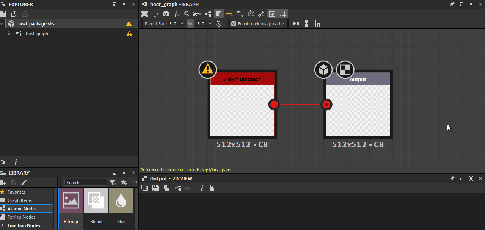
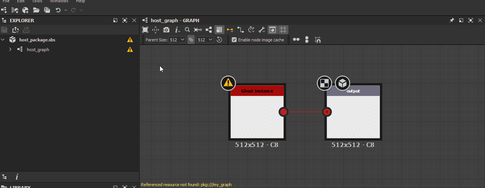

# 종속성 경고

이 페이지에는 Substance 3D Designer의 종속성에 의해 트리거될 수 있는 경고 및 오류 메시지가 나열되며 각각에 대한 일반적인 문제 해결 단계를 제공합니다.

종속성은 Substance 3D 파일(SBS)에서 참조하는 *기타 파일*&#x200B;입니다. 여기에는 [그래프 인스턴스](../../compositing-graphs/creating-compositing-gra/graph-instances-sub-gra/graph-instances-sub-graphs.md) 노드에서 참조하는 [리소스](../../resources/resources.md) 및 기타 Substance 3D 파일이 포함됩니다.

##  잘못된 종속 패키지

종속성 패키지가 누락 또는 손상되었거나 사용 중인 Designer 버전과 호환되지 않기 때문에 로드할 수 없습니다.

<b> 솔루션</b>

이 문제를 수정하는 방법에는 크게 두 가지가 있습니다.

1. <b>종속성 로드 성공</b>

   종속성 패키지가 경고 메시지에 지정된 위치에 있는지 확인하십시오. 파일이 없으면 파일을 찾아 해당 위치에 다시 배치하거나 적절하게 다시 만듭니다. 파일이 있는 경우 *Designer에서 해당 파일을 로드하고* 해당 패키지와 관련된 경고 또는 오류를 확인합니다. 해당 특정 문제에 대한 문제 해결 단계를 참조하고 그에 따라 수정하십시오.

   그런 다음 [탐색기](../../interface/the-explorer-window/the-explorer-window.md) 패널에서 RMB를 클릭하고 컨텍스트 메뉴에서 <b>다시 로드</b> 옵션을 선택하여 호스트 패키지를 다시 로드합니다.

   
1. <b>패키지에서 종속성 재배치</b>

   [종속성 관리자](../../interface/dependency-manager/dependency-manager.md) 를 사용하여 종속성을 재배치할 수 있습니다. [탐색기](../../interface/the-explorer-window/the-explorer-window.md) 패널에서 호스트 패키지의 RMB를 클릭하고 상황에 맞는 메뉴에서 <b>종속성 관리자</b> 옵션을 선택합니다.

   종속 관리자 목록에서 누락된 종속성을 찾아서 RMB를 클릭하고 <b>재배치...</b> 옵션을 선택합니다. 파일 브라우저 대화 상자를 사용하여 종속성 패키지를 찾고 <b>열기</b>를 클릭합니다.

   그런 다음 [탐색기](../../interface/the-explorer-window/the-explorer-window.md) 패널에서 RMB를 클릭하고 컨텍스트 메뉴에서 <b>다시 로드</b> 옵션을 선택하여 호스트 패키지를 다시 로드합니다.

   

##  *&#39;X&#39;* 별칭이 프로젝트에 정의되어 있는지 확인하십시오.

현재 [프로젝트 파일](../../interface/preferences-window/project-settings/project-settings.md)에 해당 별칭이 정의되어 있지 않지만 경고에 보고된 별칭 아래의 Substance 3D 파일(SBS) 데이터에 있는 [별칭](../../interface/preferences-window/project-settings/project-settings.md) 위치에서 패키지의 종속성 또는 리소스 중 하나를 로드하고 있습니다.

<b> 솔루션</b>

[프로젝트 파일](../../interface/preferences-window/project-settings/project-settings.md) 중 하나 이상은 경고에 보고되는 별칭을 정의해야 합니다.

##  이 리소스와 일치하는 파일을 찾을 수 없습니다

[비트맵 리소스](../../resources/bitmap-resource/bitmap-resource.md)에 대한 *UDIM 템플릿*&#x200B;과(와) 일치하는 파일을 찾을 수 없습니다.

<b> 솔루션</b>

[비트맵 리소스](../../resources/bitmap-resource/bitmap-resource.md)가 연결되어 있고 Designer이 해당 파일 이름의 *UDIM 명명 분류법*(예: `my_texture_0x1.png`의 `0x1`)을(를) 감지하면, Designer에서 UDIM 워크플로를 사용할 때 [비트맵](../../compositing-graphs/nodes-reference-for-com/atomic-nodes/bitmap/bitmap.md) 노드가 해당 분류법을 사용하여 UDIM 집합의 다른 비트맵으로 *자동으로 전환*&#x200B;할 수 있도록 *UDIM 템플릿*&#x200B;으로 연결할 수 있습니다. 이 경우 Designer은 UDIM 번호 매기기 템플릿을 고려하여 Bitmap 리소스를 *다른 방법*&#x200B;으로 연결합니다.

이 문제를 수정하는 방법에는 크게 두 가지가 있습니다.

1. <b>파일 복원</b>

   리소스의 <b>파일 경로</b> 특성으로 지정된 위치로 이동하여 템플릿 뒤의 파일이 있는지 확인하십시오. 복구되지 않으면 복구하거나 다시 만듭니다.

   과 일치하는 파일 없음
1. <b>파일 재배치</b>

   파일이 이동되었거나 이름이 바뀐 경우 [탐색기](../../interface/the-explorer-window/the-explorer-window.md) 패널의 리소스 항목에서 RMB를 클릭하여 파일을 재배치하고 <b>재배치</b> 옵션을 선택하여 해당 리소스를 동일한 유형의 UDIM 이미지 집합&#x200B;*의 첫 번째 파일에 연결합니다.*

   

##  연결된 파일을 찾을 수 없습니다.

연결된 리소스에서 참조하는 파일이 <b>파일 경로</b> 특성에서 지정한 위치에 없습니다.

<b> 솔루션</b>

이 문제를 수정하는 방법에는 크게 두 가지가 있습니다.

1. <b>파일 복원</b>

   리소스의 <b>파일 경로</b> 특성으로 지정된 위치로 이동하여 파일이 있는지 확인하십시오. 복원되지 않으면 복원하거나 다시 만듭니다.

   
1. <b>파일 재배치</b>

   파일이 이동되었거나 이름이 바뀐 경우 [탐색기](../../interface/the-explorer-window/the-explorer-window.md) 패널의 리소스 항목에서 RMB를 클릭하여 파일을 재배치하고 <b>재배치</b> 옵션을 선택하여 해당 리소스를 동일한 유형의 다른 파일에 연결합니다.

   

##  색상 공간을 찾을 수 없음

[비트맵 리소스](../../resources/bitmap-resource/bitmap-resource.md)가 현재 [색상 관리](../../color-management/color-management.md) 환경에서 찾을 수 없는 색상 공간을 참조합니다. 이는 ICC 프로파일 또는 OCIO 구성에서의 색상 공간일 수 있다.

<b> 솔루션</b>

색상 공간 속성에 대한 옵션 목록이 사용 가능한 유효한 색상 공간으로 자동으로 채워집니다. 해당 리소스의 색상 공간 값을 목록의 다른 항목으로 변경합니다.

또는 해당 색상 공간을 현재 [색상 관리](../../color-management/color-management.md) 환경에 추가한 다음 Designer을 다시 시작합니다. 이는 ICC 프로파일 또는 OCIO 구성에서의 색상 공간일 수 있다.

>[!NOTE]
>
> 이 경고는 **레거시** 이외의 색상 관리 모드(색상 관리를 사용하지 않도록 설정하는 것과 유사)를 사용하는 경우에만 트리거됩니다. [프로젝트 설정](../../interface/preferences-window/project-settings/project-settings.md)의 **색상 관리** 섹션에서 색상 관리를 사용하도록 설정할 수 있습니다.

##  참조 리소스를 찾을 수 없습니다.

[3D 장면 리소스](../3d-scene-resource/3d-scene-resource.md)의 UV 타일에 할당된 그래프를 경고에 보고된 위치에서 찾을 수 없습니다.

<b> 솔루션</b>

이 문제를 수정하는 방법에는 크게 두 가지가 있습니다.

1. <b>그래프 복원</b>

   [탐색기](../../interface/the-explorer-window/the-explorer-window.md) 패널에서 패키지의 내용에 <b>UV 타일</b> 목록에 지정된 그래프가 있는지 확인합니다. 존재하지 않는 경우 복원하거나 다시 만듭니다.

   
1. <b>다른 그래프 선택</b>

   패키지의 다른 그래프를 UV 타일에 할당합니다.

   

##  UV 타일이 여러 번 할당됨

[3D 장면 리소스](../3d-scene-resource/3d-scene-resource.md)에 대한 UV 타일이 [Substance 그래프](../../compositing-graphs/substance-compositing-graphs.md)에 두 번 이상 할당되었습니다.

<b> 솔루션</b>

3D 메시 리소스의 각 UV 집합에 대해 <b>UV 타일</b> 목록에 *두 번 이상* UDIM 인덱스가 없는지 확인하십시오.

##  잘못된 UV 타일

[3D 장면 리소스](../3d-scene-resource/3d-scene-resource.md)에 대해 나열된 UV 타일이 메시에 정의되어 있지 않거나 손상되었습니다.

<b> 솔루션</b>

3D 메시 리소스의 각 UV 집합에 대해 <b>UV 타일</b> 목록의 모든 항목이 연결된 리소스에 *존재*&#x200B;된 UDIM을 참조하는지 확인하십시오.

>[!NOTE]
>
> 이 경고는 연결된 리소스에서 검색된 UDIM을 *전용*&#x200B;에 나열하므로 사용자 인터페이스를 통해 트리거할 수 없습니다. Substance 3D 파일(SBS) *직접*&#x200B;의 데이터만 수정하면 이 경고가 트리거될 수 있습니다.

