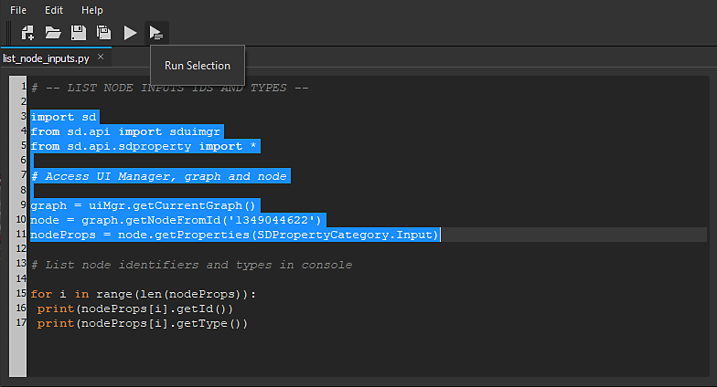

# Python 편집기

Substance 3D Designer에는 **스크립트 편집기**&#x200B;가 포함되어 있어 사용자가 Designer 내에서 직접 **Python 코드를 테스트**&#x200B;하고 **콘솔 출력**&#x200B;을 가져올 수 있습니다.

편집기에는 &#39;**찾기와 바꾸기**&#39; 기능이 있으며, 편집기 메뉴 모음의 &#39;*편집 > 찾기...*&#39; 항목에서 또는 *Ctrl+F*&#x200B;를 눌러 액세스할 수 있습니다.

Python 편집기의 **테스트** **목적** 속성에서 사용자는 편집기 도구 모음에서 &#39;*실행*&#39; 단추를 누르거나(*F5*), &#39;*선택 실행*&#39; 단추를 누르거나(&#39;*Ctrl+Enter*&#39;) **현재 선택 항목만**) 모든 코드를 테스트할 수 있습니다.

