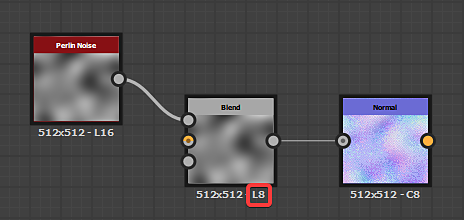

# 이미지 출력이 잘못됨

이 페이지에는 예기치 않은 이미지가 잘못 출력되어 Substance 3D Designer의 기술적 문제 가 나열되며, 각각에 대한 문제 해결 단계를 제공합니다.

## 보이는 스테핑/밴딩

<table>
<tr style="border: 0;">
<td width="58.30%" style="border: 0;" valign="top">

** 문제**

이미지 출력의 그레이디언트는 매끄럽지 않고 계단식입니다. 스테핑은 이미지에 사용된 *값 범위가 너무 좁아서* 발생합니다.\
즉, 그레이디언트의 한 단계에서 다음 단계로 원활하게 전환할 수 있는 값이 충분하지 않습니다.

광도/RGBA 값은 정수 또는 부동 소수점 값을 사용하여 인코딩할 수 있으며 *정밀도*&#x200B;에 영향을 줍니다.

* **정수**&#x200B;는 0-1 범위의 값을 저장하기 위해 8비트 정밀도(0-255, 따라서 256개의 가능한 값)와 16비트 정밀도(0-65535, 따라서 65536 가능한 값)를 제공합니다.
* **부동 소수점**&#x200B;은 16비트(HDR 16F) 및 32비트(HDR 32F) 정밀도를 제공하며 음수 값을 포함하여 0-1 범위를 벗어난 값을 저장하는 기능을 제공합니다. 이를 통해 광도 값이 1.0을 훨씬 초과하는 High Dynamic Range(HDR) 이미지로 작업할 수 있습니다.

HDR 이미지로 특별히 작업할 필요가 없다면 대부분의 노드에서 정수를 사용하여 인코딩된 0-1 범위의 값을 출력할 가능성이 높습니다. 이미지의 출력 포맷이 8비트이면 이미지에 256개의 값만 사용할 수 있으므로 그레이디언트가 표시되는 경우가 많습니다. 이는 특히 일반 노드의 출력에 영향을 줄 수 있습니다.

</td>
<td width="41.60%" style="border: 0;" valign="top">

{width="256px"}{width="256px"}{width="256px"}

</td>
</tr>
</table>

** 권장 단계**

노드 및 모든 노드가 업스트림 상태인 **출력 형식**(즉, 비트 심도)을 확인하고 해당 노드에서 *최소 16비트 정수 정밀도*&#x200B;를 사용하는지 확인하십시오.

Output 형식 매개 변수가 *입력에 상대적인* [상속 메서드](../../compositing-graphs/inheritance-compositing/inheritance-in-substance-compositing-graphs.md)(으)로 설정되는 경우가 많으며, 이로 인해 그래프 전체에 낮은 정밀도가 전파될 수 있습니다. 이상적으로는 그래프에서 업스트림으로 이동하면 문제의 근본 원인을 찾을 수 있습니다.

노드 아래에 표시되는 텍스트 정보를 확인하여 노드 출력의 정밀도를 빠르게 확인할 수 있습니다.

* **L/C**&#x200B;은(는) 회색 음영(예: 광도) 또는 색상인 이미지를 나타냅니다.
* **8/16**&#x200B;은 정수 인코딩을 의미합니다
* **16F/32F**&#x200B;은 부동 소수점 인코딩을 의미합니다

예를 들면 다음과 같습니다.

* L8: 회색 음영 8비트 정수
* C16: 색상 16비트 정수
* C32F: 색상 32비트 부동 소수점(HDR)

## 게시된 SBSAR의 품질 손실

<table>
<tr style="border: 0;">
<td width="58.30%" style="border: 0;" valign="top">

<b> 문제</b>

SBSAR(Substance 3D 아카이브)에서 출력되는 이미지의 품질은 오른쪽 이미지에 표시된 것처럼 Substance 3D 파일의 그래프보다 현저하게 낮습니다.\
낮은 해상도로 출력됩니다.

</td>
<td width="41.60%" style="border: 0;" valign="top">

{width="256px"}

</td>
</tr>
</table>

<b> 권장 단계</b>

모든 [비트맵](../../compositing-graphs/nodes-reference-for-com/atomic-nodes/bitmap/bitmap.md) 노드의 [출력 크기](../../compositing-graphs/output-size/output-size.md) 속성이 *절대* [상속 메서드](../../compositing-graphs/inheritance-compositing/inheritance-in-substance-compositing-graphs.md)(으)로 설정되어 있는지 확인하십시오.

그렇지 않은 경우 참조된 [비트맵 리소스](../../resources/bitmap-resource/bitmap-resource.md)가 게시된 Substance 3D 보관 파일에 기본 256\*256 해상도로 저장되며 이는 하나 이상의 출력의*&#x200B;품질에 영향을 줍니다*.

## 이미지가 흐려짐

<table>
<tr style="border: 0;">
<td width="58.30%" style="border: 0;" valign="top">

** 문제**

[변형 2D](../../compositing-graphs/nodes-reference-for-com/atomic-nodes/transformation-2d/transformation-2d.md) 또는 [혼합](../../compositing-graphs/nodes-reference-for-com/atomic-nodes/blend/blend.md)과 같은 일부 노드를 사용한 후 모양이 약간 흐려집니다.

</td>
<td width="41.60%" style="border: 0;" valign="top">

{width="256px"}

</td>
</tr>
</table>

** 권장 단계**

모양 크기를 조정하거나 이미지의 해상도를 변경하는 등 이미지의 픽셀을 다시 정렬할 때 소스의 픽셀이 대상에 *매핑*&#x200B;되는 방식을 결정하는 두 가지 방법이 있습니다.

* **가장 가까운**: 픽셀이 일치하는 좌표에서 대상 *있는 그대로*&#x200B;에 매핑됩니다. 타겟이 더 낮은 해상도이면 픽셀은 완전히 무시될 수 있다. 대상의 해상도가 더 높은 경우 해당 범위를 포함하는 모든 픽셀에 매핑됩니다. 출력은 *더 선명하게*&#x200B;이며 약간 *앨리어스*&#x200B;로 표시됩니다.
* **쌍선형 필터링**: 필터링 프로세스가 원본 이미지에 적용되어 해당 픽셀이 대상 해상도에 매핑되어 픽셀 간의 전환을 *매끄럽게* 합니다. 출력은 *더 매끄럽게*&#x200B;이며 약간 *흐리게* 표시됩니다.

[변환 2D](../../compositing-graphs/nodes-reference-for-com/atomic-nodes/transformation-2d/transformation-2d.md) 노드는 이 두 매핑 방법 중 어떤 방법을 사용해야 하는지 선택할 수 있는 **필터링 방법** 옵션을 제공합니다.

대부분의 노드(예: [혼합](../../compositing-graphs/nodes-reference-for-com/atomic-nodes/blend/blend.md)) - 다른 해상도의 입력 텍스처를 샘플링할 때 기본적으로 *쌍선형 필터링*&#x200B;으로 설정되며, 이로 인해 원하지 않는 흐림 효과가 발생할 수 있습니다.\
변환 2D 노드는 *원자*&#x200B;이므로 매우 가볍습니다. *변환이 필요하지 않더라도*&#x200B;다른 노드에 텍스처를 보내기 전에 [출력 크기](../../compositing-graphs/output-size/output-size.md) 속성을 사용하여 텍스처 해상도를 변경하는 데 사용할 수 있으므로 *크기 조정의 영향을 제어*&#x200B;할 수 있습니다.

[픽셀 프로세서](../../compositing-graphs/nodes-reference-for-com/atomic-nodes/pixel-processor/pixel-processor.md) 노드의 [함수 그래프](../../function-graphs/function-graphs.md)에서 **샘플** 노드에는 샘플링된 텍스처를 노드의 해상도에 매핑하는 방법을 제어하는 *동일한 옵션*&#x200B;이 포함되어 있습니다.
