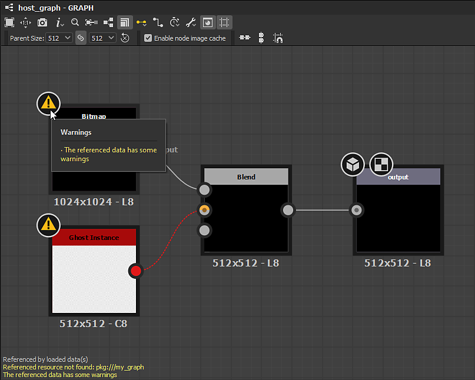

# 경고 및 오류

이 페이지에서는 [Substance 3D Designer](https://www.adobe.com/kr/products/substance3d-designer.html)에 나타날 수 있는 경고 및 오류 메시지의 보고와 해당 소스를 기반으로 하는 경고 문제 해결에 대한 링크를 설명합니다.

## 개요

Designer에서 프로젝트 작업을 하는 동안 프로젝트에 문제가 있다는 경고 및 오류 메시지가 표시될 수 있습니다.

* **경고**&#x200B;가 *노란색* 텍스트에 표시되며 입력 부족 또는 잘못된 구성으로 인해 바람직하지 않은 결과가 발생할 수 있는 문제에 주의를 기울입니다. 일반적으로 작업을 *차단*&#x200B;하지 않습니다.
* **오류**&#x200B;이(가) *빨강* 텍스트에 표시되며 계산 실패, 예기치 않은 결과 또는 작업을 수행할 수 없음을 나타냅니다. 일반적으로 작업을 *차단*&#x200B;합니다.

일반적으로 경고 및 오류는 트리거한 항목에 표시되며 해당 항목의 *각 상위 항목*&#x200B;에 걸쳐 표시됩니다. 다음은 경고 및 오류가 보고되는 일반적인 장소의 목록입니다.

<table>
<tr style="border: 0;">
<td width="58.30%" style="border: 0;" valign="top">

### 탐색기

경고가 있는 [탐색기](https://helpx.adobe.com/kr/substance-3d/unlisted/documentation/sddoc/the-explorer-129368147.html) 패널의 항목에 대해서는 해당 경고가 목록의 항목 맨 오른쪽 가장자리에  아이콘과 함께 표시됩니다. 모든 경고를 자세히 나열하는 *도구 설명*&#x200B;을 표시하려면 해당 아이콘에 커서를 몇 초 동안 둡니다.

다음과 같은 규칙을 따릅니다.

* 항목이 다른 항목(예: 폴더) 아래에 중첩되어 있으면 해당 항목이 축소되면 경고가 표시됩니다.
* 경고 목록은 항목의 경고 *과(와) 해당 하위 항목의 표면화된 모든 경고*&#x200B;의 합이라는 점에서 *누적*&#x200B;입니다.
* 패키지의 콘텐츠에서 보고한 모든 경고가 *패키지* 항목에 표시되고 패키지의 *소유* 경고에 추가됩니다.

</td>
<td width="41.60%" style="border: 0;" valign="top">

{width="256px"}

</td>
</tr>
</table>

<table>
<tr style="border: 0;">
<td width="58.30%" style="border: 0;" valign="top">

### 그래프 보기

경고가 있는 [그래프 보기](../../interface/the-graph-view/the-graph-view.md) 패널의 항목에 대해 해당 경고는 뷰포트의 *왼쪽 아래 모서리*&#x200B;에 색상이 있는 텍스트와 함께 표시됩니다. 특정 노드에서 경고가 트리거되면 해당 노드에는  경고 배지가 있습니다. 모든 경고를 자세히 나열하는 *도구 설명*&#x200B;을 표시하려면 해당 배지에 커서를 몇 초 동안 둡니다.

다음과 같은 규칙을 따릅니다.

* 다른 호스트 그래프로 *인스턴스화*&#x200B;된 원본 그래프에 하나 이상의 경고가 있으면 해당 원본 그래프의 [인스턴스 노드](../../compositing-graphs/creating-compositing-gra/graph-instances-sub-gra/graph-instances-sub-graphs.md)에 *단일* `The referenced data has some warnings` 경고가 표시됩니다.
* 경고 목록은 그래프의 경고 *과(와) 해당 자식 노드의 모든 경고의 합이라는 점에서*&#x200B;누적&#x200B;*입니다.*
* 그래프의 모든 경고는 [탐색기] 패널에서 해당 그래프를 나타내는 항목에 보고됩니다.

</td>
<td width="41.60%" style="border: 0;" valign="top">

{width="256px"}

</td>
</tr>
</table>

<table>
<tr style="border: 0;">
<td width="58.30%" style="border: 0;" valign="top">

### 속성

경고가 있는 [속성](https://helpx.adobe.com/kr/substance-3d/unlisted/documentation/sddoc/parameters-ui-129368153.html) 패널의 항목에 대해서는 해당 경고가 목록의 항목 맨 오른쪽 가장자리에  아이콘과 함께 표시됩니다. 모든 경고를 자세히 나열하는 *도구 설명*&#x200B;을 표시하려면 해당 아이콘에 커서를 몇 초 동안 둡니다.

다음과 같은 규칙을 따릅니다.

* 항목이 다른 항목(예: 섹션 헤더) 아래에 중첩되면 해당 항목이 축소되면 경고가 표시됩니다.
* 경고 목록은 항목의 경고 *과(와) 해당 하위 항목의 표면화된 모든 경고*&#x200B;의 합이라는 점에서 *누적*&#x200B;입니다.
* [입력 매개 변수](../../compositing-graphs/manage-parameters/exposing-a-parameter/exposing-a-parameter.md)에 적용된 [함수 그래프](../../function-graphs/function-graphs.md)에 하나 이상의 경고가 있으면 매개 변수 항목에 *단일* `The [x] parameter's function has some warnings` 경고가 표시됩니다.

</td>
<td width="41.60%" style="border: 0;" valign="top">

{width="256px"}

</td>
</tr>
</table>

<table>
<tr style="border: 0;">
<td width="58.30%" style="border: 0;" valign="top">

### 콘솔

경고 및 오류는 모두 [기본 메뉴](https://helpx.adobe.com/kr/substance-3d/unlisted/documentation/sddoc/the-main-menu-143720673.html)의 **Windows** 메뉴를 통해 액세스할 수 있는 **콘솔** 패널에 보고됩니다. **채널** 설정을 `ErrorMgr`(으)로 설정하여 나머지 콘솔 항목에서 경고 및 오류를 격리할 수 있습니다.

>[!NOTE]
>
> 콘솔의 모든 텍스트는 *선택 가능*&#x200B;이므로 이 패널을 사용하여 *경고 및 오류 메시지를 쉽게 복사*&#x200B;하고 이 문서의 **로컬 검색** 도구 또는 인터넷 검색 엔진에 붙여넣을 수 있습니다. 따라서 문제 해결에 대한 지침 수집이 빨라집니다.

</td>
<td width="41.60%" style="border: 0;" valign="top">

{width="256px"}

</td>
</tr>
</table>

### &quot;(#회)&quot;가 포함된 메시지

항목 *및*&#x200B;에 대해 *정확히 같은* 경고 또는 오류가 *두 번 이상* 트리거되면 이러한 경고가 *하나*&#x200B;에 병합되고 `(# times)` 접미사가 나타나므로 이 경고 또는 오류가 보고된 횟수를 알 수 있습니다.

## 카테고리

Designer에서 발생할 수 있는 경고 및 오류 목록은 소스에 따라 정렬됩니다. 범주 제목은 각각의 문제를 해결하기 위한 설명과 문제 해결 안내서를 제공하는 전용 페이지로 연결됩니다.

<table>
<tr style="border: 0;">
<td style="border: 0;" valign="top">

### Substance 그래프의 경고

* 정의된 출력 노드가 없음
* [x] 매개 변수의 함수에 몇 가지 경고가 있습니다
* 참조된 데이터에 몇 가지 경고가 있음
* 참조 리소스를 찾을 수 없음
* 텍스트 노드에서 잘못된 글꼴을 사용함

</td>
<td style="border: 0;" valign="top">

### 함수 그래프의 경고

* 정의된 출력 노드가 없음
* 현재 출력 노드는 x 유형의 값을 반환합니다
* 일부 Get 노드에 변수 이름이 없습니다.
* 일부 집합 노드에 변수 이름이 없습니다.

</td>
</tr>
</table>

### 종속성 경고

* 잘못된 종속 패키지
* &#39;x&#39; 별칭이 프로젝트에 정의되어 있는지 확인합니다.
* 이 리소스와 일치하는 파일을 찾을 수 없음
* 연결된 파일을 찾을 수 없음
* 색상 공간을 찾을 수 없음
* 참조 리소스를 찾을 수 없음
* UV 타일이 여러 번 할당됨
* 잘못된 UV 타일
