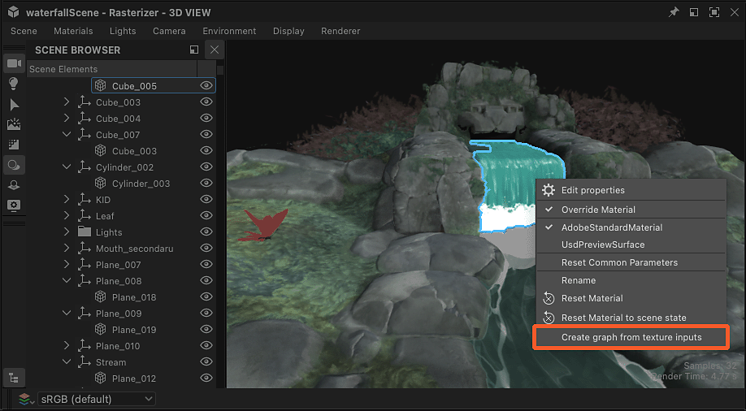

# 재질 값 및 텍스처 추출

재료의 특성을 추출하여 Substance 그래프에 사용할 수 있습니다.

<table>
<tr style="border: 0;">
<td style="border: 0;" valign="top">

## 텍스처의 새 그래프

</td>
<td style="border: 0;" valign="top">

### 텍스처 추출

</td>
<td style="border: 0;" valign="top">

### 값 추출

</td>
</tr>
</table>

## 텍스처의 새 그래프

&#39;텍스처 입력 시 그래프 만들기 작업&#39;을 수행하면 재료가 사용하는 모든 텍스처가 포함된 새 Substance 그래프가 만들어집니다

이 작업을 사용할 때 몇 가지 사항이 발생합니다.

* 선택한 위치에 재료 이름을 딴 Substance 그래프가 생성됩니다.
* [비트맵 리소스](../../resources/bitmap-resource/bitmap-resource.md)는 재질이 사용하는 모든 텍스처에 대해 만들어지며 &#39;Resources&#39; 폴더 아래의 재질 이름을 딴 폴더에 저장됩니다.
* 그래프에서 이러한 각 비트맵 리소스에 대해 [비트맵](../../compositing-graphs/nodes-reference-for-com/atomic-nodes/bitmap/bitmap.md) 노드가 만들어지고 텍스처를 사용하여 재질 속성 이후에 구성된 [출력](../../compositing-graphs/nodes-reference-for-com/atomic-nodes/output/output.md) 노드에 자동으로 연결됩니다.
* 동일한 텍스처의 각 채널을 사용하여 서로 다른 재질 패킹을 제어하는 경우(이 기법을 [채널 속성](../../glossary/glossary.md)이라고 함), [회색 음영 변환](../../compositing-graphs/nodes-reference-for-com/atomic-nodes/grayscale-conversion/grayscale-conversion.md) 노드가 자동으로 추가되어 적절한 채널을 선택합니다.
* 그래프는 자동으로 재질에 연결되며 그래프에서 편집할 때까지 모양이 변경되어서는 안 됩니다.

<table>
<tr style="border: 0;">
<td style="border: 0;" valign="top">

{zoomable="yes"}

*3D 보기 뷰포트에서 동작*

</td>
<td style="border: 0;" valign="top">

{zoomable="yes"}

*재질 메뉴의 동작*

</td>
<td style="border: 0;" valign="top">

{zoomable="yes"}

*속성 도크의 동작*

</td>
</tr>
</table>

{zoomable="yes"}

*재질 텍스처에서 그래프를 만든 결과*

+++데모
{zoomable="yes"}

+++

>[!TIP]
>
> 개체에 커서를 놓고 <b>Shift+LMB</b>를 눌러 선택하면 3D 뷰 뷰포트에서 빠르고 직접 동작에 액세스할 수 있습니다. 그런 다음 RMB를 클릭하여 동작을 호스팅하는 컨텍스트 메뉴에 액세스합니다.

>[!NOTE]
>
> *포함된 텍스처*&#x200B;를 사용하는 형식(예: USDZ)의 경우 텍스처를 추출하여 디스크에 복사해야 합니다. 이로 인해 텍스처를 추출해야 하는 위치를 선택하는 추가 단계가 발생합니다.

## 추출 텍스처

&#39;그래프로 텍스처 추출&#39; 작업은 재질이 사용하는 텍스처에 대해 기존 그래프에 새 비트맵 노드를 만듭니다.

이 작업을 사용할 때 몇 가지 사항이 발생합니다.

* 재질이 사용하는 텍스처에 대해 [비트맵 리소스](../../resources/bitmap-resource/bitmap-resource.md)가 만들어져 &#39;Resources&#39; 폴더 아래의 재질 이름을 딴 폴더에 배치됩니다.
* 선택한 그래프에서 해당 비트맵 리소스에 대해 [비트맵](../../compositing-graphs/nodes-reference-for-com/atomic-nodes/bitmap/bitmap.md) 텍스처가 만들어지고 해당 노드를 사용하여 material 속성 이후에 구성된 [출력](../../compositing-graphs/nodes-reference-for-com/atomic-nodes/output/output.md) 노드에 자동으로 연결됩니다.

재질 속성 *에 대해 구성된 출력이 그래프에 이미 있는 경우* *노드가 만들어지지 않고* 비트맵 리소스 만들기만 수행됩니다.

예: &#39;기본 색상&#39;에 대해 구성된 출력 노드를 이미 호스팅하는 그래프로 &#39;기본 색상&#39; 속성에 대한 텍스처를 추출하면 그래프에 노드가 생성되지 않습니다.

<table>
<tr style="border: 0;">
<td style="border: 0;" valign="top">

{zoomable="yes"}

속성 도크의 재질 속성에 대한 작업

</td>
<td style="border: 0;" valign="top">

{zoomable="yes"}

&#39;대상 그래프 선택&#39; 대화 상자

</td>
<td style="border: 0;" valign="top">

</td>
</tr>
</table>

{zoomable="yes"}

텍스처 추출 결과

+++데모
{zoomable="yes"}

+++

&#39;텍스처를 리소스로 추출&#39; 작업은 재질이 사용하는 텍스처에 대한 비트맵 리소스만 만들어 &#39;리소스&#39; 폴더 아래의 재질 이름이 지정된 폴더에 배치합니다.

>[!NOTE]
>
> *포함된 텍스처*&#x200B;를 사용하는 형식(예: USDZ)의 경우, 텍스처를 추출하여 디스크에 복사해야 합니다. 이로 인해 텍스처를 추출해야 하는 위치를 선택하는 추가 단계가 발생합니다.

## 값 추출

&#39;그래프로 값 추출&#39; 작업을 수행하면 재료 속성 값에 대한 기존 그래프에 새 [값 프로세서](../../compositing-graphs/nodes-reference-for-com/atomic-nodes/value-processor/value-processor.md) 노드가 만들어집니다.

이 작업을 사용할 때 몇 가지 사항이 발생합니다.

* 선택한 그래프에서 해당 속성 값에 대해 [값 프로세서](../../compositing-graphs/nodes-reference-for-com/atomic-nodes/value-processor/value-processor.md) 노드가 만들어지고 해당 재질 속성 이후에 구성된 [출력](../../compositing-graphs/nodes-reference-for-com/atomic-nodes/output/output.md) 노드에 자동으로 연결됩니다.
* 값 프로세서 노드의 [Substance 함수 그래프](../../function-graphs/function-graphs.md)에서 값 형식과 일치하는 [상수 노드](../../function-graphs/nodes-reference-for-fun/atomic-function-nodes/constant-nodes/constant-nodes.md)가 만들어지고, 그래프의 출력으로 설정된 대로 추출된 값으로 설정됩니다.

재질 속성 *에 대해 구성된 출력이 그래프에 이미 있는 경우* *노드가 만들어지지 않습니다*.

예: &#39;비등방성 수준&#39;에 대해 구성된 출력 노드를 이미 호스팅하는 그래프로 &#39;비등방성 수준&#39; 속성의 값을 추출하면 그래프에 노드가 생성되지 않습니다.

<table>
<tr style="border: 0;">
<td style="border: 0;" valign="top">

{zoomable="yes"}

속성 도크의 재질 속성에 대한 작업

</td>
<td style="border: 0;" valign="top">

{zoomable="yes"}

&#39;대상 그래프 선택&#39; 대화 상자

</td>
<td style="border: 0;" valign="top">

{zoomable="yes"}

값 프로세서 노드 함수의 상수 노드

</td>
</tr>
</table>

{zoomable="yes"}

값 추출 결과

+++데모
{zoomable="yes"}

+++
