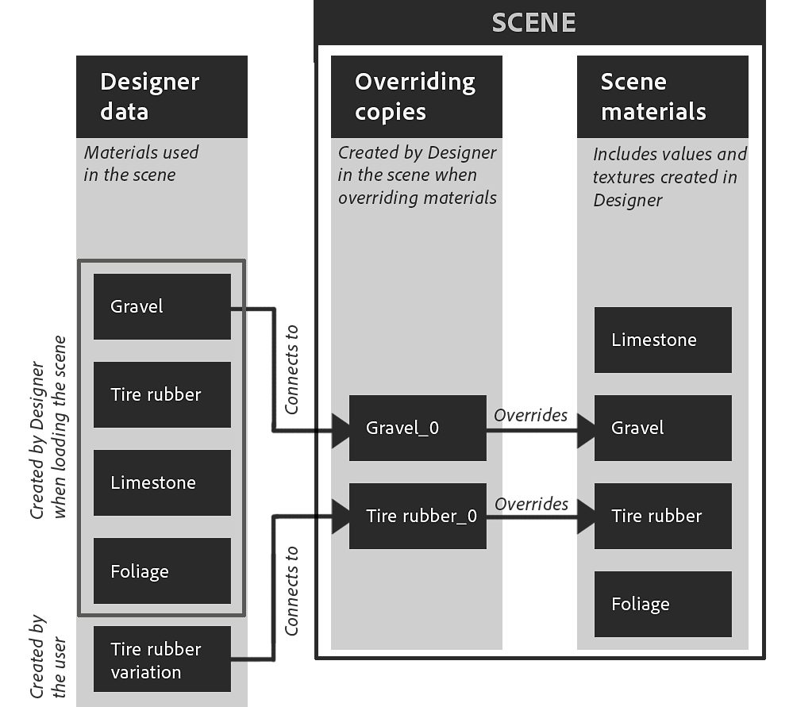

# 장면 재질 재정의

기존 재질을 사용하여 3D 장면을 작업할 때는 이러한 재질을 재정의하여 자체 재질로 대체해야 합니다.

재질은 처음부터 만들거나 [Substance 그래프로 추출](../../working-with-3d-scenes/extracting-materials-val/extracting-materials-values-and-textures.md)된 조정된 버전의 장면 재질을 만들 수 있습니다.

{zoomable="yes"}

<table>
<tr style="border: 0;">
<td style="border: 0;" valign="top">

## 장면 재질 재정의

</td>
<td style="border: 0;" valign="top">

### 장면 상태로 재설정

</td>
<td style="border: 0;" valign="top">

### 연결된 재질

</td>
</tr>
</table>

## 장면 재질 재정의

장면에 사용된 모든 재질은 자신의 버전으로 재정의할 수 있습니다. 자신의 버전은 새 재질이 되거나 기존 재질을 편집한 버전입니다.

&#39;재질 재정의&#39; 작업은 다음 두 위치에서 찾을 수 있습니다.

* &#39;재질&#39; 메뉴를 열고 원하는 재질의 하위 메뉴로 이동합니다
* 장면 개체에서 Shift+LMB를 눌러 선택한 다음 RMB를 클릭하여 상황별 메뉴를 엽니다

<table>
<tr style="border: 0;">
<td style="border: 0;" valign="top">

{zoomable="yes"}

*3D 보기 뷰포트에서 동작*

</td>
<td style="border: 0;" valign="top">

{zoomable="yes"}

*재질 메뉴의 동작*

</td>
</tr>
</table>

내부 장면 설명에 USD를 사용하는 Designer의 컨텍스트에서 오버라이드는 가능한 한 원본과 일치하는 재질의 *복사본을 만들고* 장면 메시의 *재질 바인딩*&#x200B;을 원본에서 복사본으로 변경하는 것을 의미합니다.

>[!NOTE]
>
> 사본은 루트 아래의 &#39;<b>material</b>&#39; 폴더(USD의 &#39;Scope&#39;)에 장면에 만들어지고 원본과 동일한 식별자 및 숫자 접미사(예: &#39;rustedMetal\_0&#39;)를 사용합니다.

이는 두 가지 중요한 의미를 갖습니다.

1. 원래의 재료는 어떤 방식으로도 바뀌지 않는다.
1. Designer에서 수행한 모든 작업이 사본에 적용됩니다.

원본 장면의 재질을 복원하거나 이동하는 동안 빠르게 보정 전후 확인을 수행하려는 경우 동일한 &#39;재질 재정의&#39; 작업을 통해 언제든지 재정의 켜기 및 끄기를 전환할 수 있습니다

사본이 원본과 일치하도록 생성된 점을 고려하면, 재질을 재정의할 때는 Substance 그래프를 연결하거나 특성을 편집할 때까지 대부분의 경우 모양이 변경되지 않아야 합니다(아래 참고 참조).

>[!NOTE]
>
> 오버라이드가 적용되면 Designer은 영향을 받는 메시의 접선 및 이항식을 계산합니다. 이 작업은 시간이 다소 걸릴 수 있으며, 특히 메시에 정의된 보통 비율 및 편향이 없거나 다른 접선 및 편향을 사용하는 경우 이러한 메시의 종횡비가 변경될 수 있습니다.

>[!IMPORTANT]
>
> <b>AdobeStandardMaterial</b> 음영 모델은 Substance 3D 에코시스템에서 지원되지만 업계 표준이 아니므로 Blender와 같은 타사 응용 프로그램에서 *을(를) 지원하지 않을 수 있습니다*.
> 
> Substance 3D 응용 프로그램 외부에서 최상의 상호 운용성을 얻으려면 현재 <b>UsdPreviewSurface</b> 음영 모델을 사용하는 것이 좋습니다. 이 모델은 훨씬 적은 재질 속성과 효과를 지원합니다.

## 장면 상태로 재설정

재질을 오버라이드된 상태로 계속 편집할 수 있도록 하면서 재질의 초기 상태로 돌아가야 하는 경우 모든 재질 사본을 초기 값으로 재설정할 수 있습니다.

재질 속성 값이 수정되었거나 그래프의 텍스처가 적용된 경우 속성은 초기 값 또는 텍스처로 되돌아갑니다.

재질은 완전히 재설정하거나 속성별로 재설정할 수 있습니다.

재질의 하위 메뉴 또는 메시의 상황에 맞는 메뉴에서 &#39;재질을 장면 상태로 재설정&#39; 동작을 사용하여 재질을 완전히 재설정합니다.

이 액션은 다음 세 위치에서 찾을 수 있습니다.

* &#39;재질&#39; 메뉴를 열고 원하는 재질의 하위 메뉴로 이동합니다
* 장면 개체에서 Shift+LMB를 눌러 선택한 다음 RMB를 클릭하여 상황별 메뉴를 엽니다
* 그 재료의 속성 상단에 있는 햄버거 메뉴

<table>
<tr style="border: 0;">
<td style="border: 0;" valign="top">

{zoomable="yes"}

*3D 보기 뷰포트에서 동작*

</td>
<td style="border: 0;" valign="top">

{zoomable="yes"}

*재질 메뉴의 동작*

</td>
<td style="border: 0;" valign="top">

{zoomable="yes"}

*재질 속성에서 동작*

</td>
</tr>
</table>

<table>
<tr style="border: 0;">
<td style="border: 0;" valign="top">

이 작업은 재질의 일부 요소만 재설정하려는 경우 재질 속성에서 *속성별*&#x200B;로도 사용할 수 있습니다.

재질 속성의 햄버거 메뉴를 열어 &#39;기본 장면 상태로 재설정&#39; 작업을 찾습니다.

</td>
<td style="border: 0;" valign="top">

{zoomable="yes"}

</td>
</tr>
</table>

## 연결된 재질

다시: Designer은 장면의 재질을 직접 변경하지 않고 장면에 사본을 만들고 원본 대신 해당 사본에 메시를 바인딩합니다.

반면에 Designer의 &#39;재질&#39; 메뉴에는 기본적으로 장면의 재질 목록과 일치하는 *자체*&#x200B;의 개별 재질 목록이 있습니다. 언제든지 해당 목록에 새 재질을 추가할 수 있습니다.

Designer에서만 작성 및 관리되는 *다른* 데이터 집합입니다. 그러면 이 재질이 장면의 원본 재질을 재정의하는 *복사본에 연결됨*&#x200B;됩니다.

{zoomable="yes"}

&#39;재질&#39; 메뉴에 나열된 재질을 장면에서 Designer이 생성한 사본에 연결할 수 있습니다. 장면 브라우저 사본에서 RMB를 클릭한 다음 &#39;재질 연결&#39; 하위 메뉴로 이동합니다.

하위 메뉴에는 장면의 모든 재질이 나열되고 &#39;재질&#39; 메뉴에서 수동으로 만든 재질이 나열됩니다.

{zoomable="yes"}
